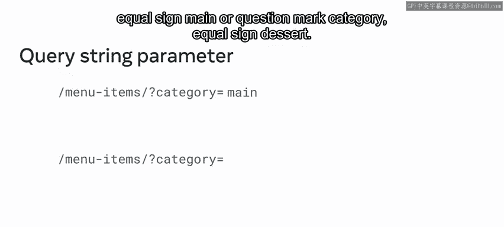
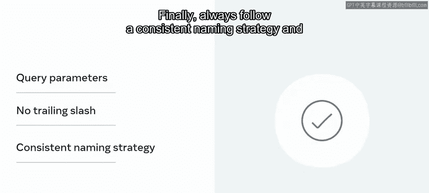

# 60：API命名约定 🏷️

在本节课中，我们将要学习如何为API端点（Endpoint）设计清晰、有效的命名。良好的命名约定不仅能帮助开发者快速理解API的用途，还能提升项目的长期可维护性。

## 概述

API端点是服务器与应用程序交互的桥梁，它决定了服务器将发送哪些数据。一个精心设计的端点不仅能准确传递数据，还能通过其名称清晰地传达其目的，这对开发者和项目本身都至关重要。

## 命名格式规范

上一节我们介绍了API端点的重要性，本节中我们来看看命名的具体格式规范。

你的REST API的统一资源标识符（URI），也称为端点或URL路径，是用户加载页面时首先注意到的事物之一。第一印象至关重要，因此API的命名约定非常重要。

以下是关于命名格式的核心要点：

*   **使用小写字母和连字符**：API端点应始终使用小写字母，并使用连字符（`-`）分隔多个单词。
    *   **示例**：`/orders`（正确），而非 `/Orders`（错误）。
*   **避免不当的命名风格**：使用下划线（蛇形命名法）、首字母大写或驼峰命名法来分隔单词并非最佳实践，因为这会使名称难以阅读和理解。
*   **变量的表示方法**：有一个例外情况。如果你的API接受一个变量，例如用户ID或订单ID，应使用驼峰命名法表示，并用花括号 `{}` 包裹。
    *   **示例**：`/orders/{orderId}`

此外，应始终尝试在API名称中使用清晰、简洁且有意义的词语，使其易于立即理解。

## 使用斜杠表示层级关系

接下来，我们探讨如何使用斜杠来组织API结构。

如果你的项目包含相关的对象，应在API URI中使用正斜杠（`/`）来指示它们之间的层级关系。

以下是指示层级关系的示例：

*   在餐厅API项目中，一个客户可以拥有包含订单项的订单。
*   在图书馆API中，图书馆可以拥有由作者撰写的书籍。

为了获取特定书籍的作者，你可以使用API端点：`/library/books/{bookId}/author`。
为了获取特定作者撰写的所有书籍，你可以使用作者ID并添加 `/books`：`/library/authors/{authorId}/books`。

请注意，在这些API URI中，客户与订单、书籍与作者之间的关系都是通过正斜杠来指示的。

## 使用名词表示资源

另一个重要的命名约定是，你的API应始终使用名词来表示它正在处理的资源。

一个返回书籍集合或单本书籍的API应使用名词，例如 `books` 或 `books/{bookId}`。
同样，要获取一本书的价格，应使用名词：`books/{bookId}/price`。

使用动词的API端点（如 `getAllBooks` 或 `getUser/{userId}`）是不良API命名的例子。这是因为在REST API中，端点应始终用名词表示，而不是动词。

像 `users/{userId}/delete` 或 `orders/{orderId}/save` 这样的API端点也是错误的，因为它们使用HTTP请求作为动词来指示API执行的操作。

请记住，你应该发送一个HTTP DELETE请求到 `users/{userId}` 来删除用户。
你应该发送一个HTTP PUT或PATCH请求到 `orders/{orderId}` 来更新订单。

应避免使用标准的CRUD操作名称（如 `create`、`read`、`update` 或 `delete`）作为端点，原因有二：
1.  这些端点所代表的资源应该是名词。
2.  应使用适当的HTTP请求（如 `GET`、`POST`、`PUT` 或 `DELETE`）与这些端点结合，以执行必要的操作。

## 避免使用文件扩展名

接下来需要考虑的是，是否应在API中使用文件名。

餐厅API项目可以将API结果返回为XML和JSON数据。那么问题来了，能否将端点设计为 `/orders/{orderId}.json` 来获取JSON数据，或者 `/orders/{orderId}.xml` 来获取XML数据？

答案是否定的，你绝不应该在API中使用文件扩展名。

为了解决这个问题，你应该将预期的数据格式作为查询字符串参数来接受。

因此，如果你希望输出为JSON格式，可以在API端点后添加 `?format=json`。
对于XML，你可以在末尾使用 `?format=xml`。

类似地，要提供JavaScript文件的压缩版本或源代码版本，你可以使用像 `/assets/js/jquery/3.6.0/min` 或 `/assets/js/moment/2.29.4/original` 这样的API端点。

## 使用查询参数进行过滤

但是，如果你需要过滤集合或执行搜索呢？例如，Little Lemon餐厅的菜单上有很多项目，但你只对开胃菜感兴趣。

为了过滤结果，你应始终将数据作为查询字符串参数接受。在URL中，问号 `?` 之后发送的所有内容都是查询字符串。

请记住，API端点 `/menu-items` 返回所有菜单项，但要只获取开胃菜，你应该将类别名称作为 `?category=appetizer` 传递给端点。

因此，如果你设计可以这种方式过滤的API，你团队中的其他开发者就会知道，要获取主菜或甜点的列表，他们可以将端点更改为 `?category=main` 或 `?category=dessert`。

这就是良好且一致的API命名策略的魅力所在。

## 避免使用尾部斜杠

另一个最佳实践是，当你与团队或公众共享API端点时，绝不应在API端点末尾添加尾部斜杠。

这意味着，以正斜杠结尾的API名称（如 `/orders/{orderId}/`）是不良实践。`/sports/basketball/teams/` 末尾有另一个正斜杠也是如此。

只需在不带尾部斜杠的情况下结束API即可。

## 总结

本节课中我们一起学习了API端点命名的最佳实践。

如果你想成为一名熟练的后端开发者，就需要关注你的端点，并确保使用设计良好且用户友好的API。

让我们回顾一下本视频中讨论的最佳实践：
1.  **使用小写URI格式**。
2.  **使用正斜杠指示层级关系**。
3.  **对资源名称使用名词**。
4.  **避免使用文件扩展名**。
5.  **使用查询参数指定数据类型**。
6.  **不要使用尾部斜杠**。
7.  **始终遵循一致的命名策略和标准API命名约定**。

精心选择的API端点名称可以通过让其他开发者更容易使用你的API，来显著改善整个项目。现在，你已经掌握了创建优秀API端点名称的方法。