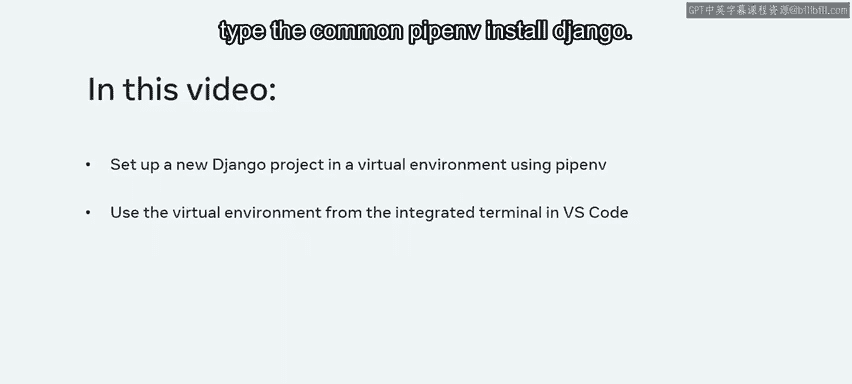
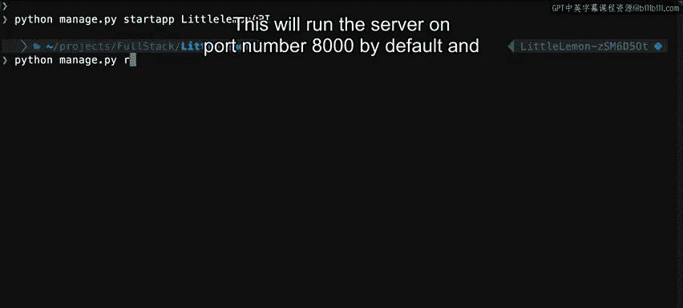
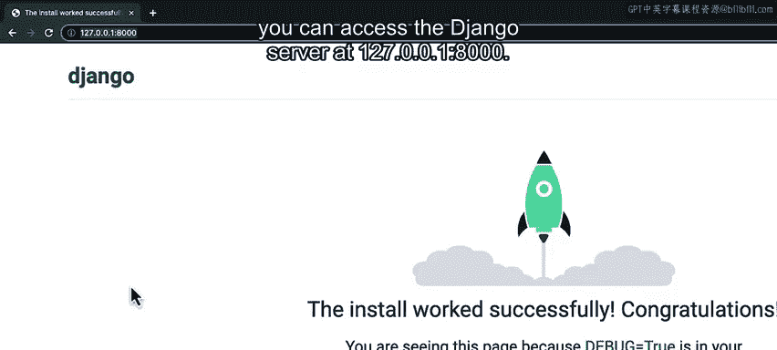
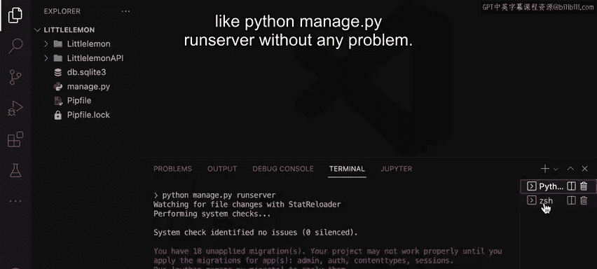
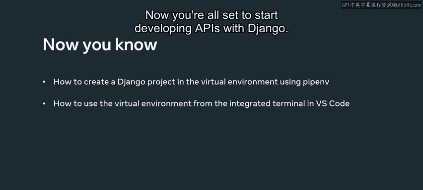

# 62：使用Pipenv创建Django项目 🐍

在本节课中，我们将学习如何使用Pipenv工具来创建一个Django项目，并配置虚拟环境。我们还将了解如何在Visual Studio Code的集成终端中使用这个虚拟环境。

## 概述

你已经安装了最新版本的Python、Visual Studio Code以及所有必要的扩展，同时也安装了Pipenv。本节将指导你完成在虚拟环境中设置新Django项目的全过程。

## 创建项目目录



首先，创建一个名为`LittleLemon`的项目目录。

```bash
mkdir LittleLemon
cd LittleLemon
```

## 使用Pipenv安装Django

进入项目目录后，在终端窗口中输入以下命令来安装Django：

```bash
pipenv install django
```

Pipenv在为你设置Django和创建虚拟环境时，会显示大量信息。

## 激活虚拟环境并创建Django项目

你可以通过以下命令激活Pipenv创建的虚拟环境：

```bash
pipenv shell
```

此命令将为你的项目在虚拟环境中开启一个新的shell会话。

接着，你可以使用Django管理工具在此目录下创建一个新的Django项目。执行以下命令：



```bash
django-admin startproject littlelemon .
```

## 创建Django应用



现在，新的Django项目已经设置完成，是时候为你的API项目创建一个新的Django应用了。使用以下命令创建应用：

```bash
python manage.py startapp LittleLemonAPI
```

很好，Django应用已经创建完成，包含了所有必要的迁移文件和配置。

## 运行Django开发服务器

接下来，要运行Django服务器，请输入：

```bash
python manage.py runserver
```

默认情况下，服务器将在**8000**端口运行。你可以在浏览器中通过访问`127.0.0.1:8000`来访问Django服务器。

在本课程的后续部分，此地址将被称为**本地主机URL**。如果你想使用不同的端口号运行，可以输入`python manage.py runserver 9000`。

## 在VS Code中集成虚拟环境

上一节我们完成了项目的创建和运行，本节中我们来看看如何在VS Code中集成虚拟环境，以便在集成终端中执行命令。

在VS Code中打开你的项目目录，然后通过“查看”菜单或按`Ctrl+Shift+P`（Windows）或`Cmd+Shift+P`（Mac）来访问命令面板。

选择“Python: Select Interpreter”，然后选择Pipenv为你创建的解释器。你可以通过项目目录的名称找到它。这是一个重要的步骤，请确保不要跳过。

现在，从“终端”菜单在VS Code中打开终端。你会注意到，VS Code已经激活了Pipenv为你的项目创建的虚拟环境。



现在，你可以在此终端中无任何问题地运行所有命令，例如`python manage.py runserver`。

你还可以通过点击加号图标打开任意多个终端会话，并在此终端选项卡之间切换。

## 总结



本节课中，我们一起学习了如何使用Pipenv在虚拟环境中创建Django项目，以及如何在VS Code的集成终端中运行不同的命令。现在，你已经准备好开始使用Django开发API了。