# 高级数据建模：模块一：数据建模与管理小结 🎯

在本模块中，我们学习了数据建模的核心概念、数据库设计原则以及如何使用MySQL Workbench工具进行实践。现在，让我们一起来回顾本模块的关键知识点。

## 数据建模基础回顾 📊

上一节我们介绍了数据建模的基本概念，本节中我们来看看数据建模的三个层次。

数据模型展示了数据库系统的结构。数据建模分为三个不同层次。

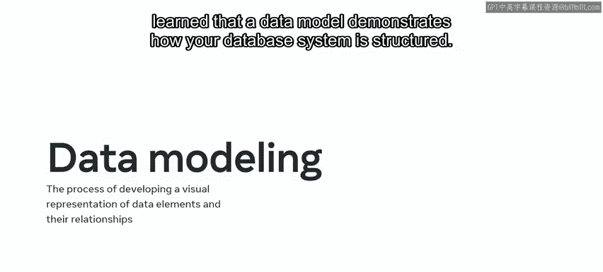

以下是数据建模的三个层次：
*   **概念数据模型**：通过实体及其相互关系的可视化表示，呈现数据系统的抽象概览。
*   **逻辑数据模型**：识别每个实体的属性，并定义每个表的主键和外键。
*   **物理数据模型**：提供在数据库管理系统（DBMS）中实现内部模式所需的详细级别。

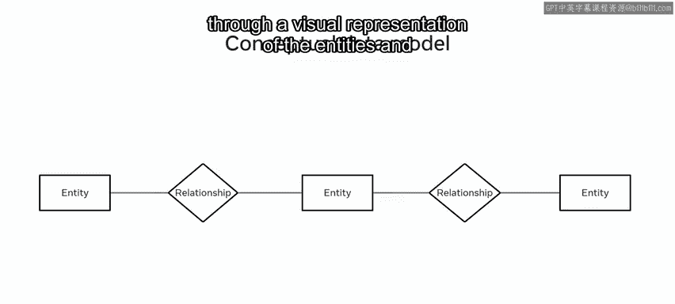

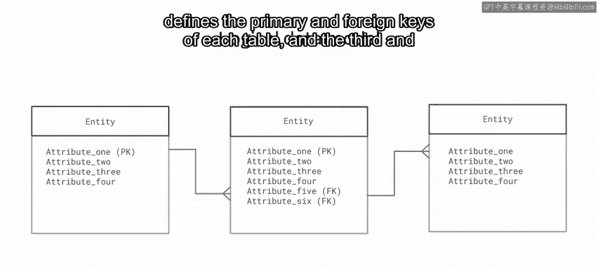

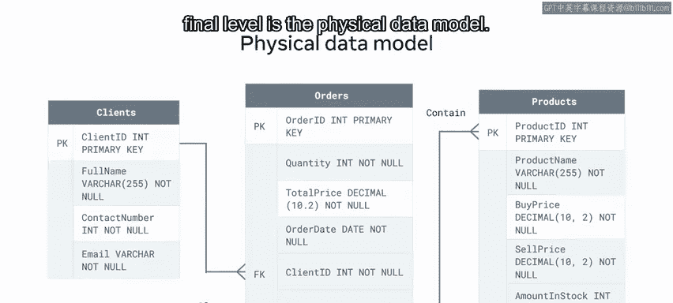

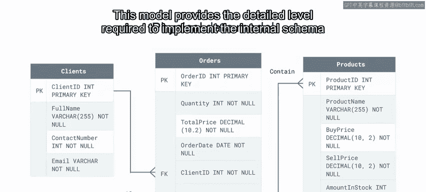

## 数据模型类型与数据库规范化 🔍

了解了数据建模的层次后，我们来看看有哪些具体的数据模型类型，以及如何通过规范化优化数据库设计。

数据库工程师可以使用多种类型的数据模型。我们回顾了它们的优缺点，以确定哪种模型最适合需求。

以下是几种常见的数据模型：
*   **关系数据模型**
*   **实体关系模型**
*   **层次数据模型**
*   **面向对象模型**
*   **维度数据模型**

我们还回顾了数据库规范化的主题。规范化是构建表结构以解决异常的过程，例如插入异常、更新异常和删除异常。

我们回顾了用于解决这些异常的三个规范化级别。

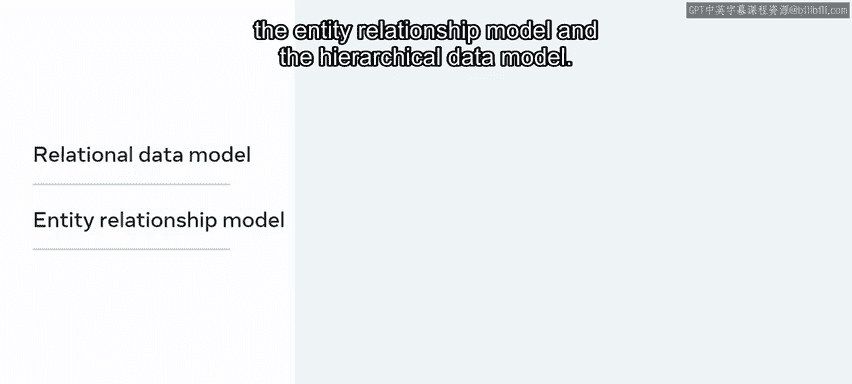

以下是数据库规范化的三个范式：
1.  **第一范式（1NF）**：专注于数据的**原子性**问题，确保每列都是不可再分的基本数据项。
2.  **第二范式（2NF）**：在满足1NF的基础上，消除非主属性对主键的**部分函数依赖**。
3.  **第三范式（3NF）**：在满足2NF的基础上，消除非主属性之间的**传递依赖**。

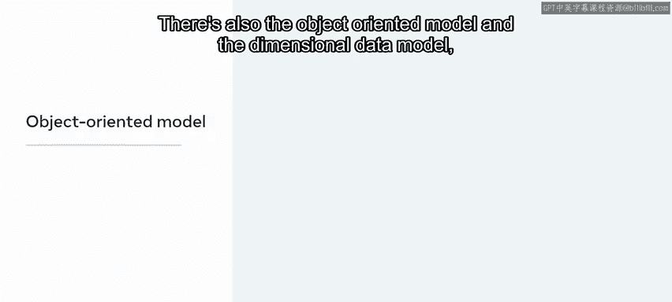

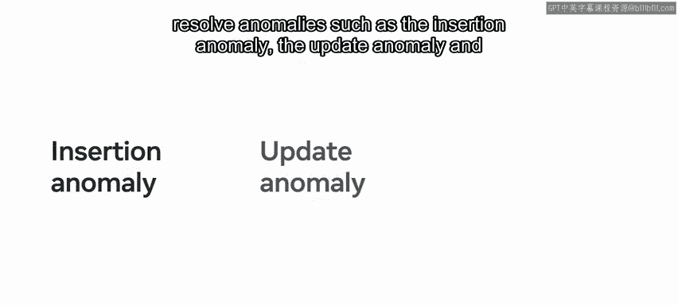

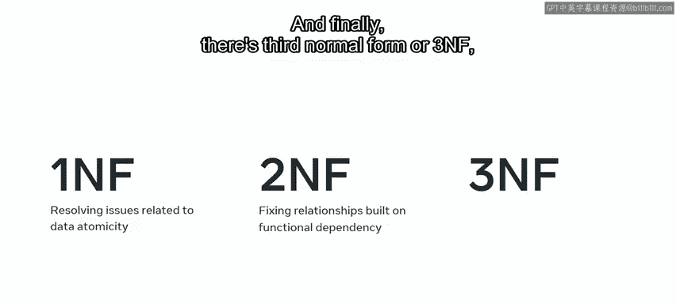

在本课中，我们还探讨了一个数据模型的示例。然后通过一个练习，展示了设计自己的数据库模型的新技能。

## MySQL Workbench 工具实践 🛠️

掌握了理论之后，我们进入实践环节，学习如何使用MySQL Workbench这一强大工具。

本模块的第二课介绍了MySQL Workbench。MySQL Workbench是一个用于数据库建模和管理的统一可视化工具。它提供了一系列用于创建、编辑和管理数据库的有用功能。

作为对该工具的入门，我们学习了如何在自己的操作系统上下载和安装它。我们还了解了如何使用该工具创建新用户并建立到MySQL数据库的连接。

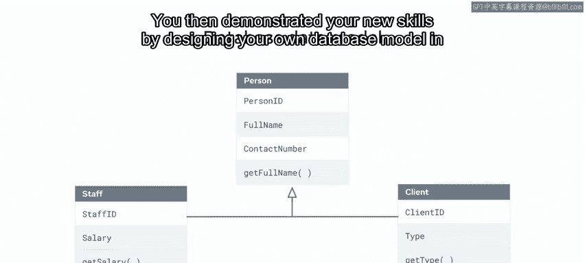

然后，我们探索了如何使用MySQL Workbench管理数据库。我们看到了如何使用该工具创建和导航数据库模式，并学习了如何用它来创建和查看表（包括虚拟表）以及查询数据。

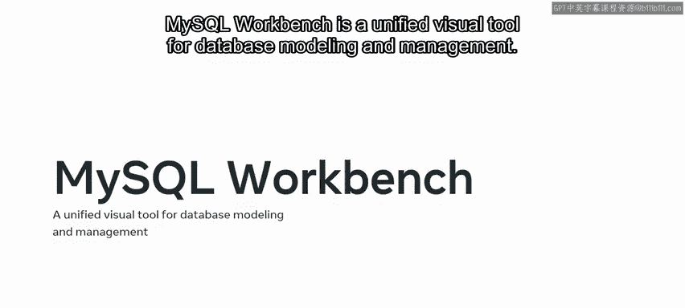

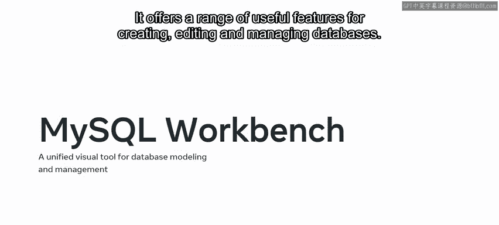

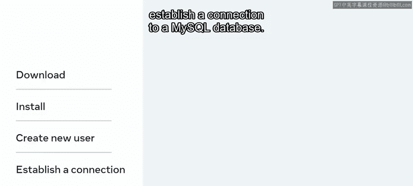

## MySQL Workbench 中的数据库建模 🧩

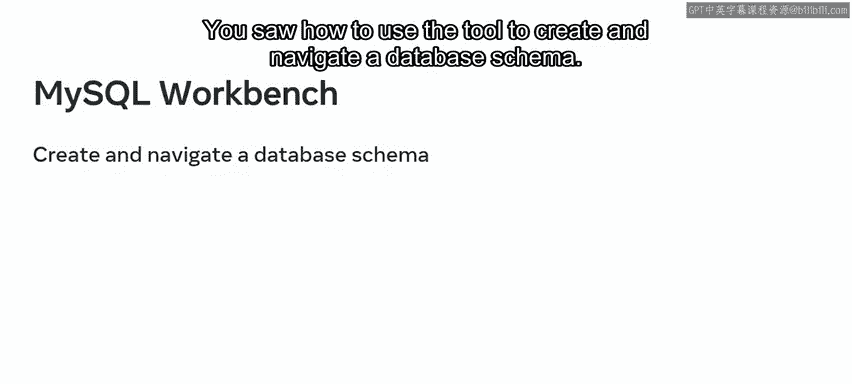

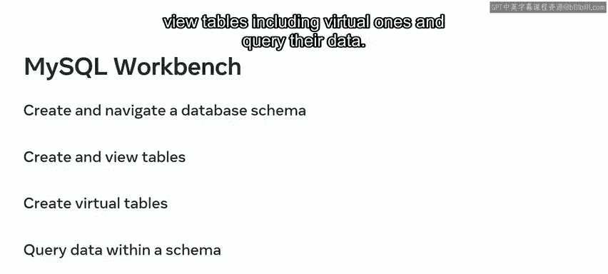

接下来，我们深入了解了MySQL Workbench中的数据库建模功能。

在MySQL Workbench中，可以创建新的数据库模式。还可以使用MySQL Workbench的正向工程功能构建数据模型图。此过程涉及在MySQL Workbench中创建数据模型，然后将其转换为可以在MySQL数据库系统中实现的SQL模式。

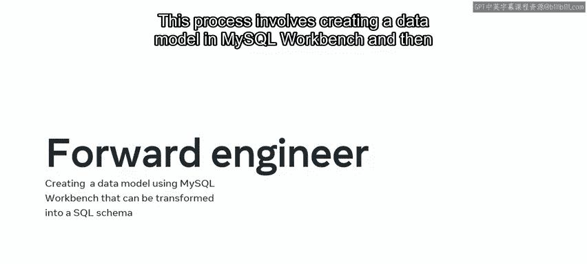

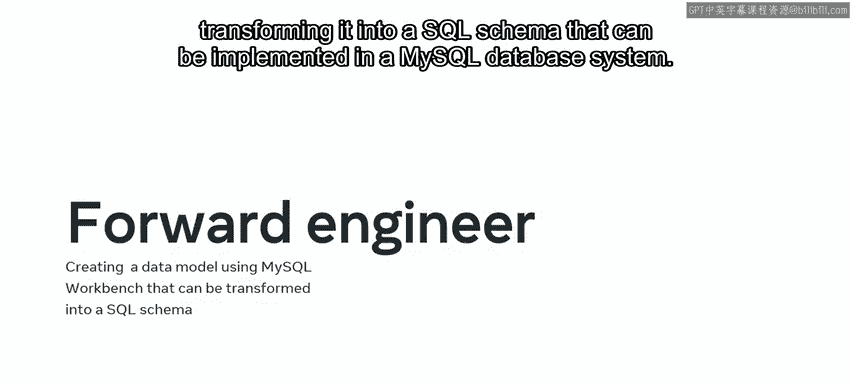

MySQL Workbench还可用于通过从现有数据库构建数据模型ER图来**反向工程**数据模型。可以打印模型、共享模型，或应用更改并使用正向工程功能将其推送到数据库。

然后，我们通过一个练习测试了新技能，在该练习中，我们被要求在MySQL Workbench中设计自己的数据库模型。

## 总结 📝

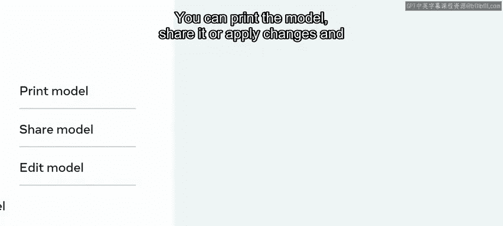

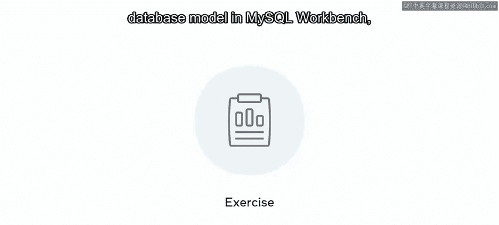

本节课中我们一起学习了数据建模和管理的基础知识。我们现在应该熟悉了数据建模的三个层次、多种数据模型类型、数据库规范化的三个范式，以及如何使用MySQL Workbench进行数据库的创建、管理和建模（包括正向与反向工程）。期待在下一个模块中继续指导大家深入学习高级数据建模。