# Meta《数据库工程师（Python／数据库客户端／高阶数据建模／毕业项目／面试）｜Meta Database Engineer》中英字幕 - P102：10_数据仓库架构.zh_en - GPT中英字幕课程资源 - BV1pZ421a749

At this stage of the course， you should be familiar with the concept of a data warehouse。

 but you might still have questions like what does a data warehouse look like and how does it work？

In this video， you'll explore the architecture of a data warehouse and understand how its components work together to facilitate data collection。

 integration and analysis。Over at Global Superstore。

 they've begun building a data warehouse that can aggregate。

 integrate and analyze data to help inform their business activities。 As a database engineer。

 it's important that you understand the architecture of a data warehouse。

 So let's explore the architecture of global superstores data warehouse and discover how it works。

 Let's begin with a quick overview of the purpose and basic composition of a typical data warehouses architecture。

 A data warehouse's architecture must be constructed so that it can control the flow of data from different sources。

 It needs to be able to process the data it encounters and integrate it in a consistent format。😊。

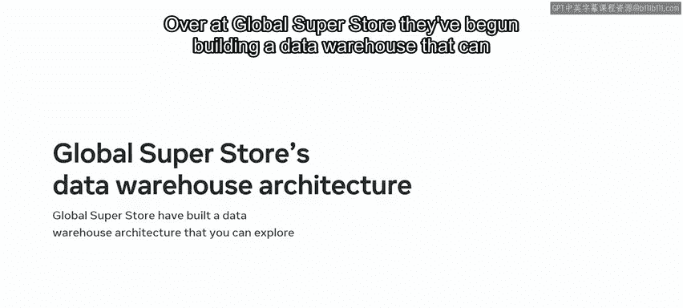

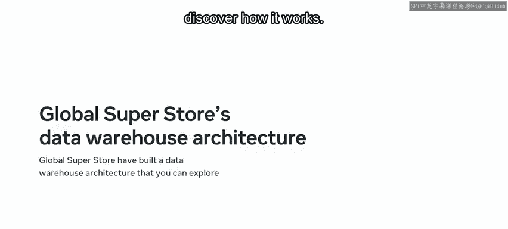

This is so that the users of the data warehouse can perform data analysis and extract useful insights。

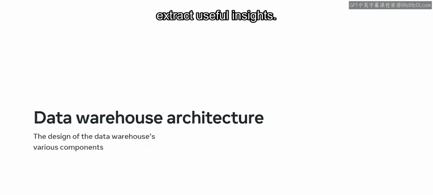

To facilitate this process， the architecture of a data warehouse is comprised of several different components。

 Each of these components plays a key role within the data warehouse to support data analytics。

 These components include data sources， data staging area， the data warehouse itself and data mars。

 Once the data has been collected and integrated within these components。

 The data warehouse users can then perform data analysis and present their findings。

 Let's explore these components and find out more about how they contribute to the data analysis process。

 The first component of a data warehouses architecture is the sources of data that it relies on for its insights。

 These include external sources like global superstores online surveys or social media data。

 Internal sources like information collected within the company data on customers and products。

 Opera data produced by data to day business activities like customer orders and。😊。

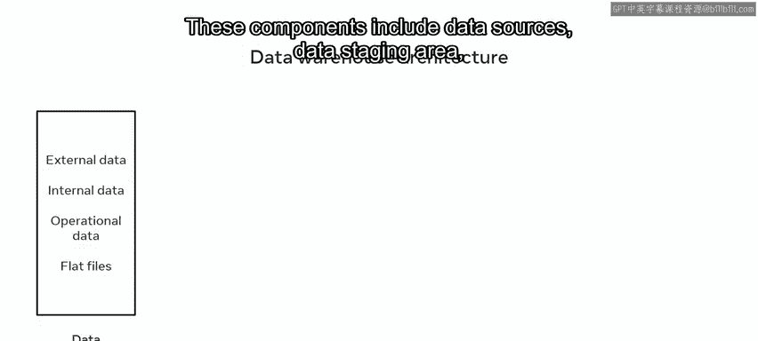

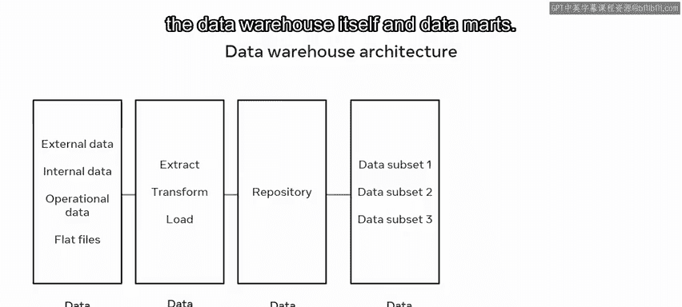

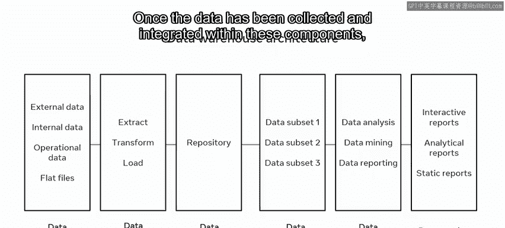

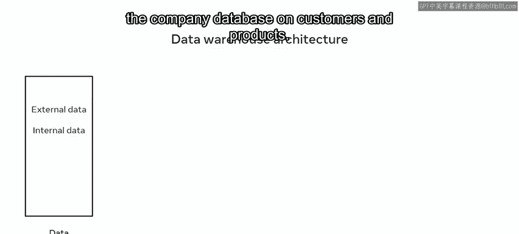

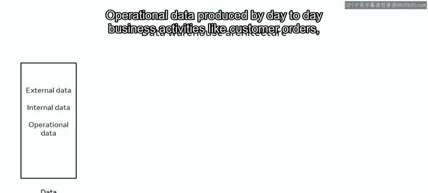

Data sources can also include flat files。 These are files without an internal structure like customers online behavior or data log entries。

 make sure that the data sources are accurate。 so that you can avoid irrelevant or poor data analytics。

 The next component is data staging。 The data staging area includes a set of processes known as the ETL or extract transform and load pipeline。

 You'll explore these terms in more detail later in this lesson。

 Now that you've sourced and staged the data。 The next stage is to store it。

 data is stored in the data storage component。 This is a central database repository that serves as the foundation of the data warehouse。

 It organizes data in relational databases。 It also includes a metadata repository that holds different kinds of information about the data like where it was sourced from the features of the data and the tables the data is stored in。

 along with their attributes。 What does。

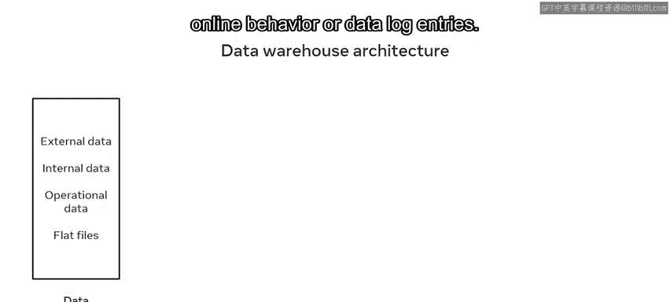

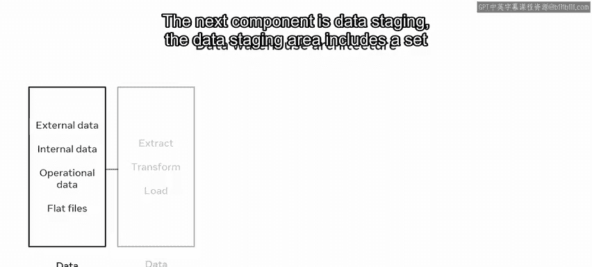

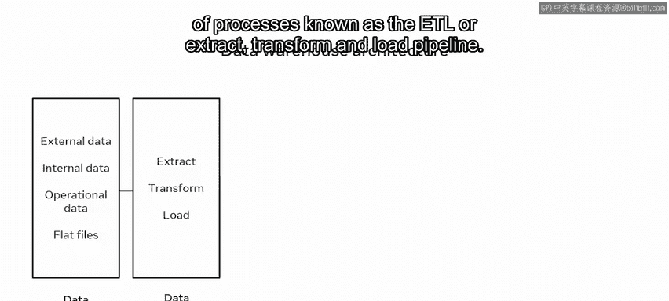

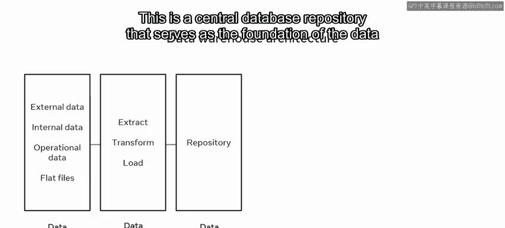

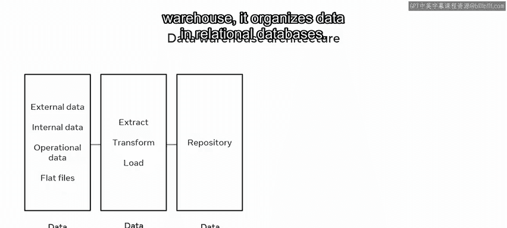

Data mean in the context of a data warehouse。Metadata is essentially a table of contents for the data in the data warehouse。

 It helps database engineers manage and keep track of the changes within their source systems。

 methods and processes。 For example， a global superstore's metadata contains information like where the data was sourced from。

 It also shows when each file was created， who created it and other important information。

 The next component in the data warehouse is data mars。

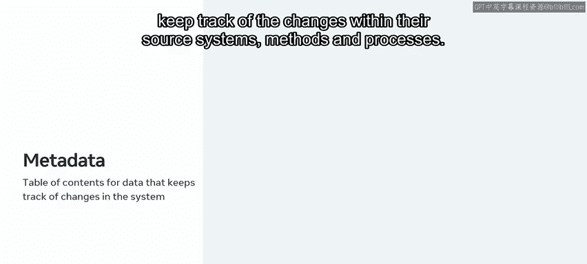

These are subject oriented databases that meet the demands of a specific group of users。

Each mart contains a subset of data that focuses on particular parts of the business or organization。

 For example， global superstores data mars relate to specific departments and business functions。

 They can use these mars to perform focused analytical processes on specific parts of the business。

 Finally， once the data is ready， you can perform data analytics。

 Data analytics is performed using different analytics， techniques like data mining。

 Once you've analyzed the data， you can then presented。

 The data can be presented in the form of reports like interactive reports。

 analytics reports or static reports。 Global superstores data analysts can analyze the data within their repository using different techniques。

 They can then produce reports that provide information on sales。

 profits and other important aspects of the business。

 Now that you're familiar with the components of a data warehouse。

 Let's take a quick look at some best practices to follow when creating and working with。😊。

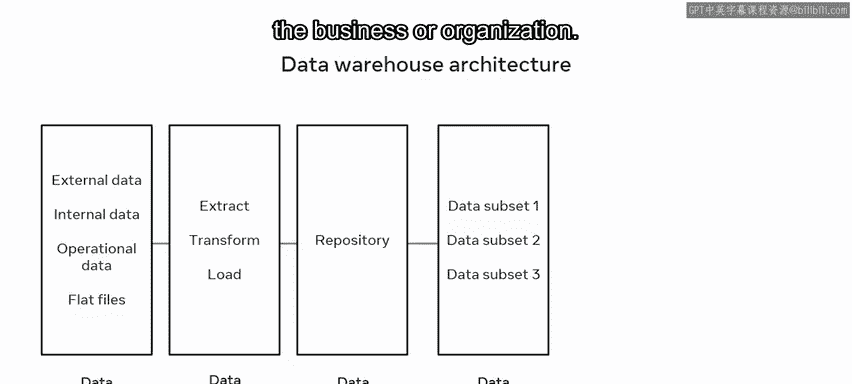

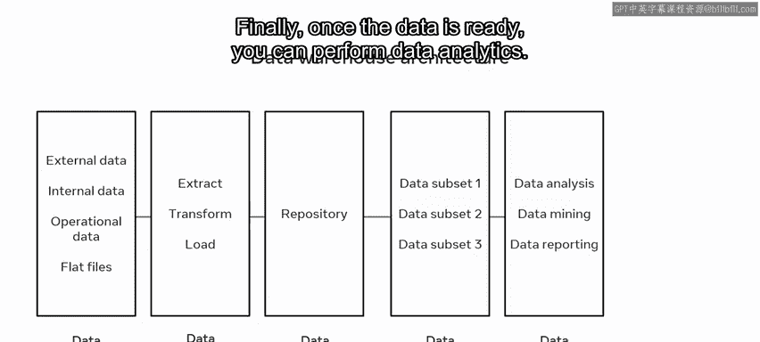

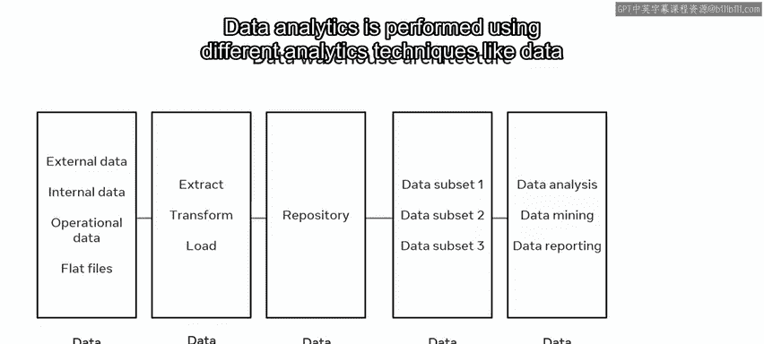

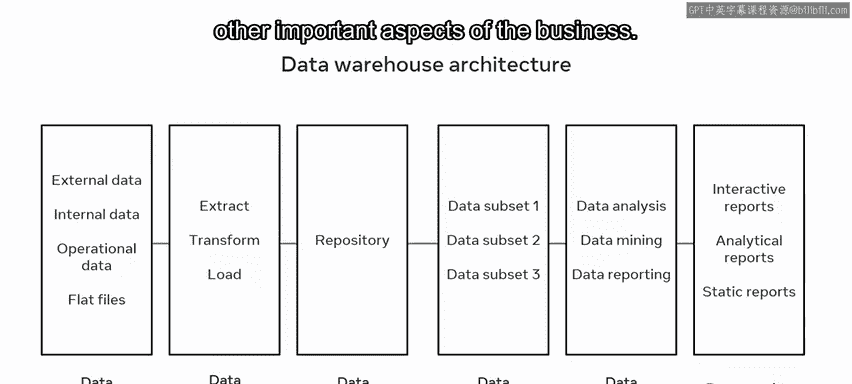

Architecture first， always separate the analytical and transactional operations。

 make use of scalable solutions so the data warehouse can process increasingly larger amounts of data and build a flexible architecture that can incorporate and implement new functionality。

 There are also several other best practices you should follow。 For example。

 make sure your architecture contains data security features。

 develop a simple and flexible architecture that can work with different forms of data。

 create a data warehouse that's easy to understand， implement。

 use and manage and document the development of the data warehouse。

 This makes it easier to incorporate new functions。

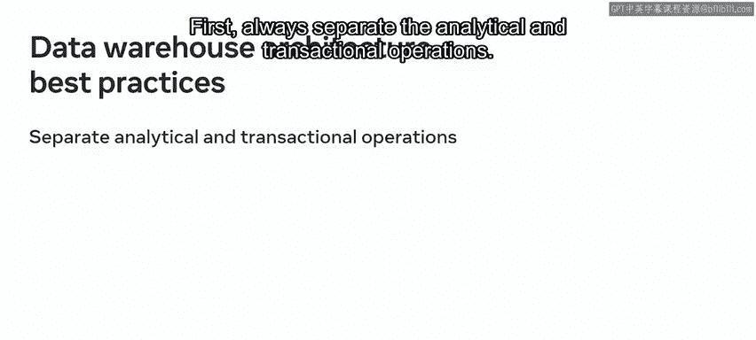

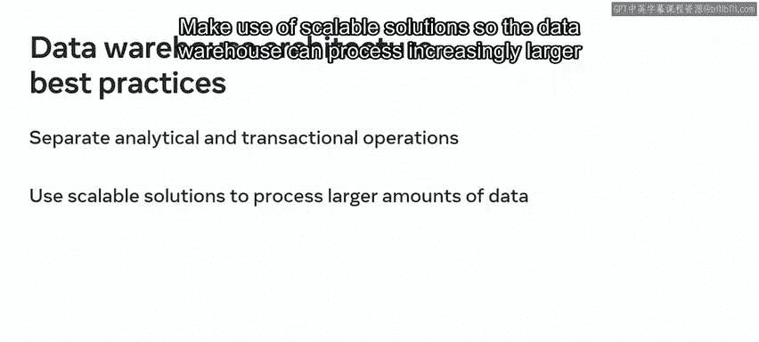

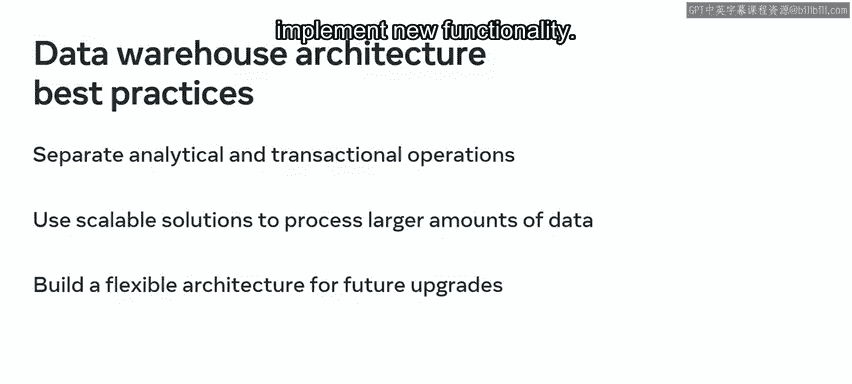

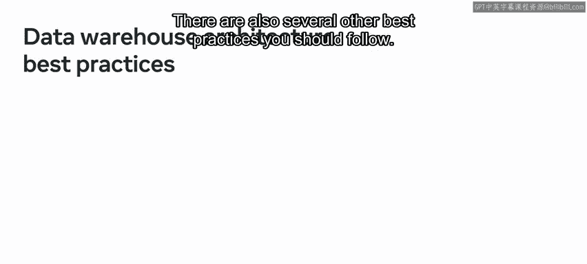

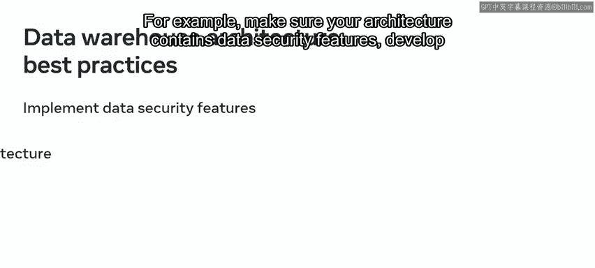

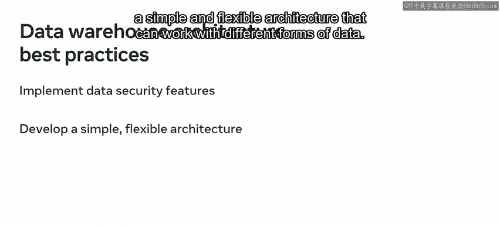

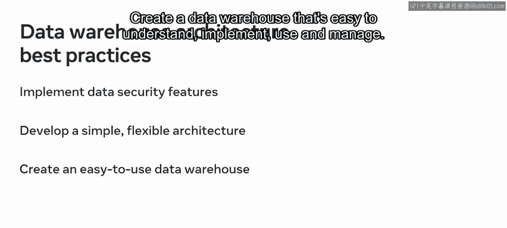

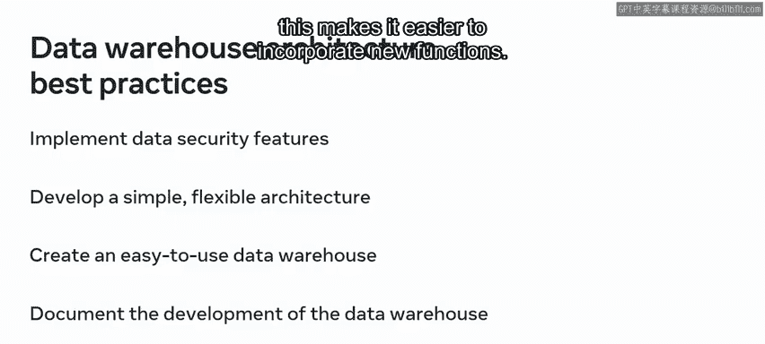

You should now be familiar with the architecture of a data warehouse。

 and you should also be able to explain how its components work together to facilitate data collection。

 integration and analysis great work。