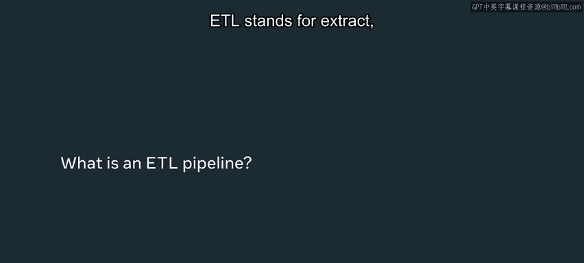
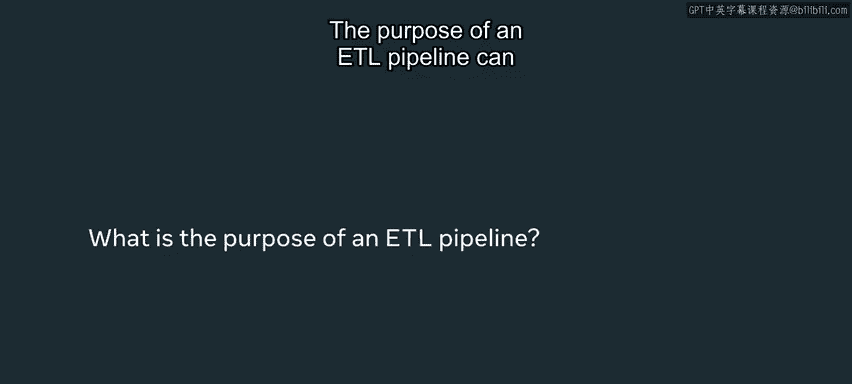
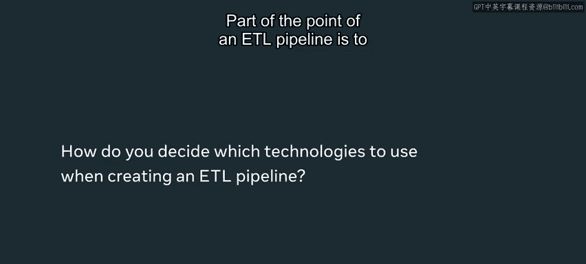
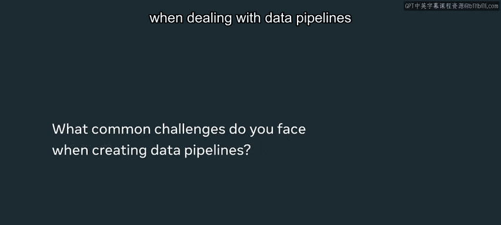
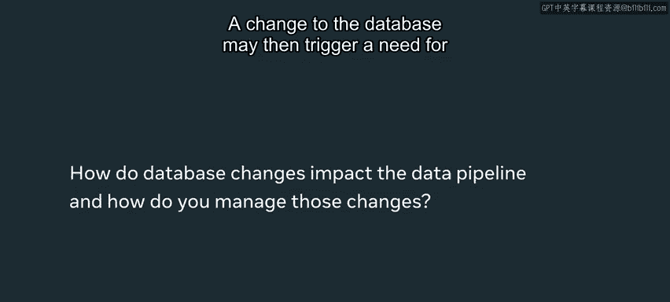

# Meta《数据库工程师（Python／数据库客户端／高阶数据建模／毕业项目／面试）｜Meta Database Engineer》中英字幕 - P103：11_案例研究 真实世界的数据项目.zh_en - GPT中英字幕课程资源 - BV1pZ421a749

Very， very large databases are very hard to get data from and so ETL pipelines are some of the critical ways in order to ensure that different products get quicker access to the data they need。

Hi， my name is Moxie Herrera， I youth A them pronouns。

 and I'm a software engineer at Meta in the Menlo Park office。E TL stands for extract。

 transformform and load。 This is one of the common ways that data will be transferred to particular areas。

 so you will have some sort of data source。

And then perhaps a staging area for the data and then a consumer of the data。

 So splitting it up into different data consumers allows you to do two things。 One。

 have the raw data stored in a backup in a warehouse。And then it's extracted。

 then transformed to the data that you need so that it can be loaded by the consumers that need that data at the time of use。

The purpose of an detail pipeline can vary depending on your uses， but fundamentally。

 the point is either to bring together a whole bunch of different data sources or have very large data sources abstracted away from the consumers of the data。

 The extract is bringing together all those data forces。 The transform is。

Doing the data validation， the scrubbing and the cleaning may be encryption。 And then finally。

 the loading is where the end consumers are actually taking the data。

 The exact usage depends on the case。 But what this means is that an ETL pipeline is a very common process that's used to solve many different data problems。

Part of the point of an ETL pipeline is to take all these different sources that may be built under different systems and bring them into one system that。

Specific consumers can use this allows for parallelization and so the decisions are often made around what do the end consumers need。

 where am I getting the data from， how am I organizing this and what would lead to the most performance。

Approach to this。

One of the most common problems when dealing with data pipelines is sometimes handling the volume of data and the very sources of data。

 this can make it very difficult to ensure that your pipeline is up to date and has the data that is needed at the time of use。

 understanding the delay and how these pipelines works are very critical to ensure that you are not expecting data consumers to be able to grab data that they're not actually it's not actually available to them。

A change to the database may then trigger a need for a change in the data pipelines that you have built。

 depending on the needs of the consumer and what the change is。

 So what this requires is a strong understanding of the need of that pipeline what its goals are and strong sets of ownership by the stakeholders of that pipeline。

 these kind of updates happen all the time and this could trigger all sorts of different changes in the product team and so this requires a lot of ownership and responsibility and understanding of ETL pipelines for when those changes occur and what changes you need to make to accommodate that。

 There's a lot of data in the world。 In fact， too much data to store in a single database So ETL pipelines are an absolutely fundamental points in this world of big data。

 cloud computing and the metaverse。