# Meta《数据库工程师（Python／数据库客户端／高阶数据建模／毕业项目／面试）｜Meta Database Engineer》中英字幕 - P104：12_维度数据建模基础.zh_en - GPT中英字幕课程资源 - BV1pZ421a749

So far in your database engineering journey， you've studied and worked with different data models like entity relationship and object oriented。

 but these models are built for real-time transactions when working with the data warehouse or data analytics。

 you need a model that can optimize data access and queries for specific analysis In this video you'll explore the fundamentals of dimensional data modeling。

 this is a model used to build datas in a data warehouse for data analytics。

Global superstore are in the process of creating their data warehouse。

 Their next step is to design a data model for their data system that can handle data analytics。

 The dimensional data model is a good fit。 Let's find out more about this model and see how global superstore can build it into their data warehouse。

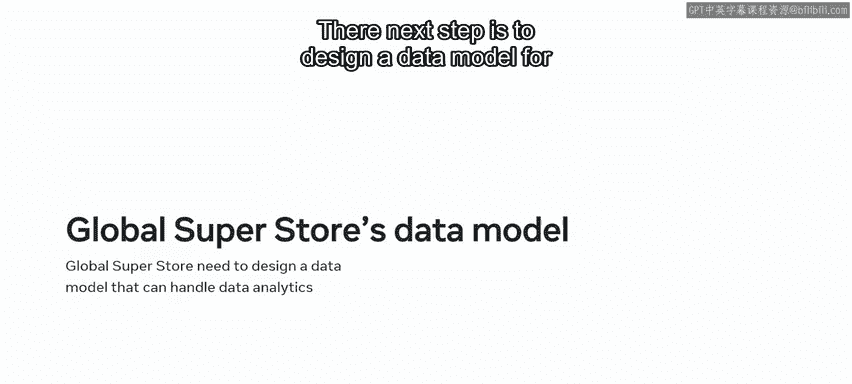

A dimensional data model is a data model based on the two key concepts of dimensions and facts。

 Let's take a closer look at these two concepts。 The dimensions represent the different elements of your data。

 The dimensions define a context or perspective for your measures。

 Good examples of dimension data elements in global superstore database is time and location。

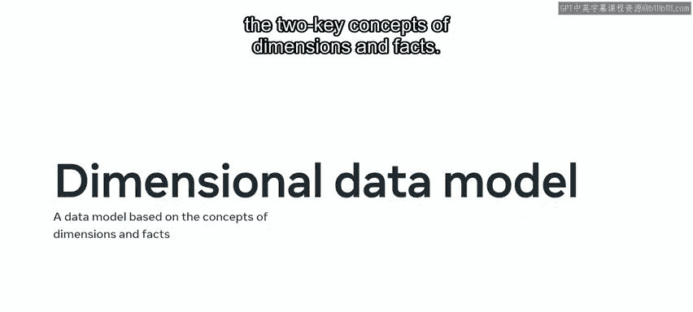

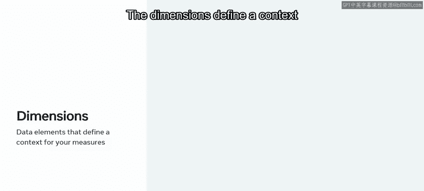

They can measure sales and other aspects of their business in the context of time and location。

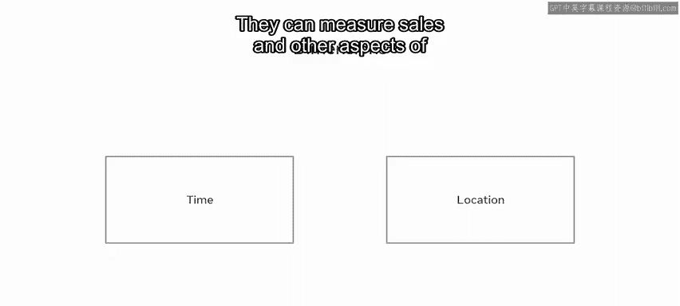

The term facts represents quantifiable data held within a database。

 Good examples of global superstores facts include the number of sold products and the profits that they have made。

 There are two kinds of measures in the fact table。 Store measures in calculated measures。

 Store measures are aggregated measures stored in the data warehouse like sales。

 data and product price。

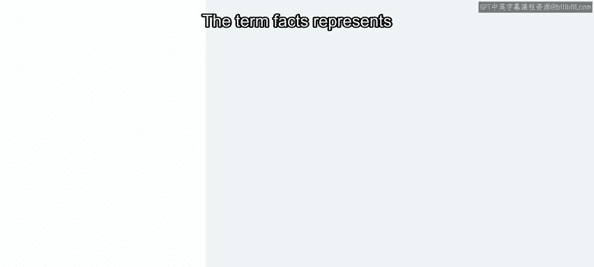

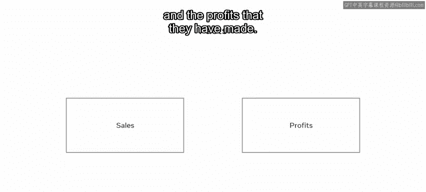

This data is loaded from the data source and stored in the database warehouse repository。

 Cal measures are calculated from other measures。 For example。

 global superstore can calculate their profit by deducting the sold products cost from the sold price。

 These measures are performed through queries that rely on calculation rules programmed in the data warehouse database。

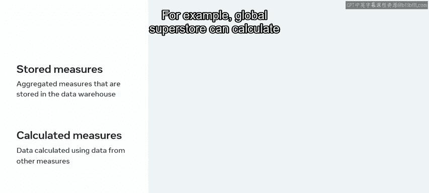

Next， let's look at the structure of a dimensional data model。

 a dimensional data model consists of facts and dimensions tables the dimension table includes the dimensions data elements and can be structured as a hierarchy of data。

This facilitates different levels of data analysis。

 You can navigate through the hierarchy to find the data you need。 For example。

 you can drill down or roll up through the data elements。

 and the fact table includes the measures data。 For example。

 global superstore can use this structure to find their average sales at specific points in time。

 They can explore data in different dimensional context and drill down through different levels。

 They can use the time and location dimensions to explore the data for average sales per year or by city。

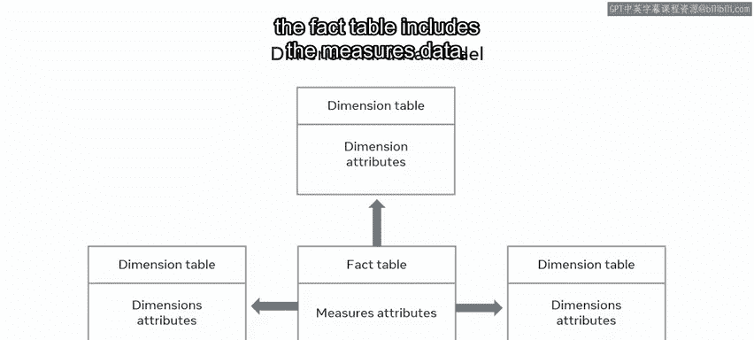

Then they can drill down through this data to find average sales per month。

 and even in average sales per week or day。 There are several best practices that you should follow in designing a data model。

 before designing a dimensional data model。 you need to be clear about which business activities you want to examine。

 and you need to know which dimensions provide you with the most meaningful and useful context。 Also。

 make sure you organize data in a way that's easy to understand access and query。

 A common method for designing a dimensional data model is with the use of schemas。

 One of the most widely used schemas in a data warehouse is the star schema。

 The star schema is a common model for designing datas in a data warehouse。

 It's a simple dimensional data model that consists of facts and dimension tables organized as a star。

 One or more fact tables sit in the middle of the schema connected to one or more dimension tables。

 Global superstore can use。😊。

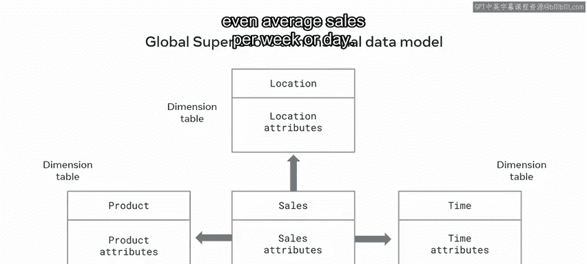

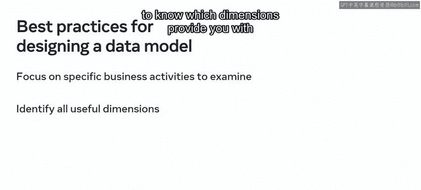

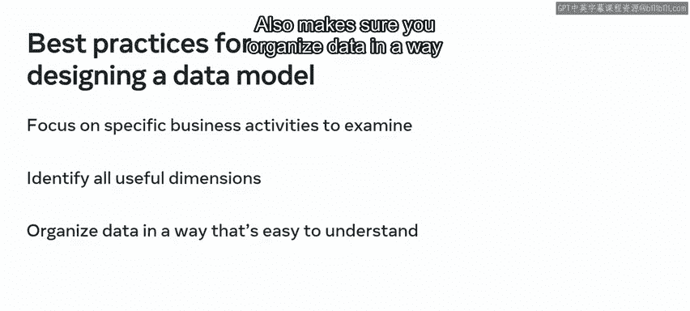

Stchema to organize their dimensional data model The sales fact table is in the center of the diagram。

 It's connected to several dimension tables， suppliers， customer， product， time and location。

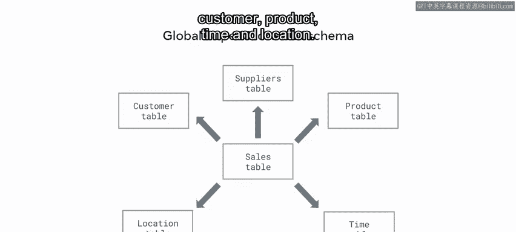

Another schema that you can use to design your dimensional data model is the snowflake schema。

 it's called a snowflake schema because the schema diagram resembles a snowflake。

When working with a snowflake schema， you should normalize your dimensions tables to eliminate data redundancy。

The best approach to normalization is to group dimensions data into multiple simple subdimens tables。

 The disadvantage of this schema is that it increases the number of dimensions tables and requires more foreign keys to connect the tables。

 So more complex queries are required to join records when performing data analytics。 For example。

 global superstore can use the schema to normalize their product dimension table into three tables。

 a products table， A subcategory table and a category table。

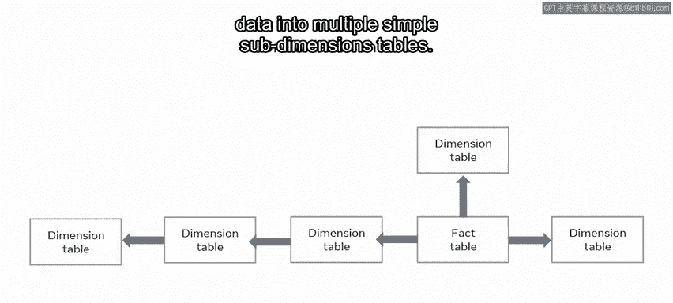

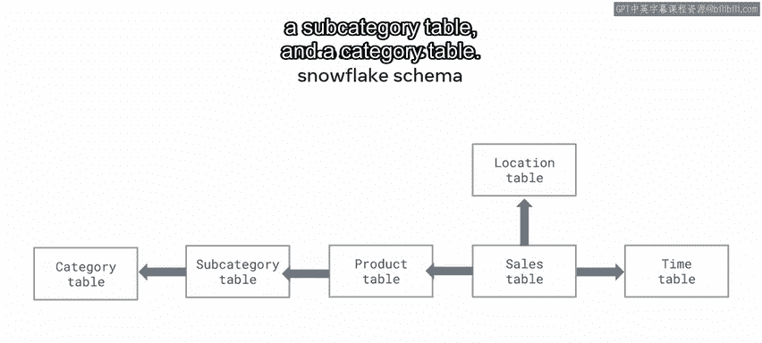

You should now understand the concept of dimensional data modeling。

 and you should be able to explain how the star and snowflake schemas work well done。

