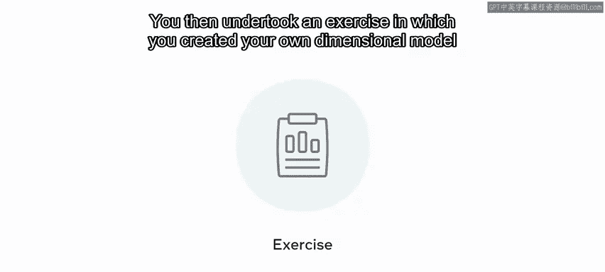

# 数据库工程师：模块二：数据仓库与维度建模小结 📊

在本模块中，我们深入探讨了数据仓库的架构，并学习了如何构建维度数据模型。现在，让我们一起来回顾本模块的核心知识与技能。

## 概述 📋

上一节我们完成了对数据仓库架构的探索，本节将对整个模块的内容进行总结。我们将回顾数据仓库的定义、关键特性、数据类型、架构组件，以及维度数据建模的基础知识、结构和实践步骤。

## 数据仓库核心概念 🏗️

数据仓库是一个集中式的数据存储库，它从多个来源**聚合、存储和处理**大量数据。用户可以查询这些数据以执行数据分析。

数据仓库由四个关键特性定义：
*   **面向主题**：它提供关于选定主题或领域的信息。
*   **集成性**：它整合来自一系列不同来源的数据。
*   **非易失性**：数据以加载到数据仓库时的状态被维护。
*   **时变性**：它聚合长时间段的数据以衡量变化。

## 数据类型 📂

数据仓库会遇到不同形式的数据，以下是主要类型：
*   **结构化数据**：以定义良好的结构化格式呈现的数据，易于访问、管理和搜索。
*   **半结构化数据**：仅部分结构化的数据。它更灵活，但分析起来也需要更多努力。
*   **非结构化数据**：可以包含没有任何预定义模型的任何类型的数据，但分析非结构化数据比结构化和半结构化数据要困难得多。

## 数据仓库架构 🧱

在回顾了数据仓库的基础知识后，我们接着探讨了其架构。数据仓库的架构侧重于设计那些在数据仓库中**聚合、集成和分析数据**的组件。它说明了数据从不同来源的流动，然后处理和集成这些数据，以便用户能够执行数据分析。

数据仓库的架构由以下组件构成：
*   **数据源**：由组织赖以获取洞察的数据组成。
*   **数据暂存区**：这是通过**ETL（提取、转换、加载）** 过程为分析准备数据的地方。
*   **数据仓库**：数据存储的地方。
*   **数据集市**：这些是面向主题的数据存储，满足特定用户的需求。

一旦数据在这些组件中被收集和集成，数据仓库用户就可以执行数据分析并呈现他们的发现。在创建和使用数据仓库架构时，遵循最佳实践并记录其开发过程非常重要，以便能够根据需要将新功能纳入架构。

## 维度数据建模 📐

在接下来的课程中，我们学习了维度数据建模。本课首先概述了维度数据建模的基础知识。

维度数据模型是一种基于**维度和事实**的模型。
*   **事实**代表度量，即可量化的数据。
*   **维度**定义了可以探索度量的上下文。

度量分为两种：
*   **存储度量**：包括可以存储在数据仓库中的聚合度量。
*   **计算度量**：侧重于使用其他度量的数据计算得出的数据。

我们还回顾了维度数据模型的结构。维度表可以使用数据的**层次结构**来构建。这种结构允许不同级别的数据分析。您可以在数据元素中**下钻**或**上卷**以找到所需的数据。

维度数据模型也使用模式来设计，例如**星型模式**。您也可以使用**雪花模式**。

## 维度建模实践步骤 🛠️

接着，我们探讨了维度数据建模的一些实践示例。我们了解到，在创建模型时必须遵循四个关键步骤：
1.  **确定要解决的业务过程**。
2.  **选择粒度**。
3.  **选择相关维度**。
4.  **确定事实表中的度量**。

然后，我们进行了一项练习，利用在本模块中获得的知识和技能创建了自己的维度模型。

## 总结 🎯

在本模块中，我们一起学习了数据仓库及其架构的基础知识，以及维度数据建模的基本原理。现在，您应该已经熟悉了这些核心概念。

出色的工作！我期待在下一模块中继续指导您，在那里您将学习数据建模背景下的高级数据分析。