# Meta《数据库工程师（Python／数据库客户端／高阶数据建模／毕业项目／面试）｜Meta Database Engineer》中英字幕 - P107：15_数据分析概述.zh_en - GPT中英字幕课程资源 - BV1pZ421a749

Your databases collect and store an endless stream of data from a variety of different sources。

 and as you should know by now， the true value of this data is what you do with it。

 Data is most valuable when it generates insights that help improve services。

 make plans and minimize risk All these insights are generated through data analysis and advanced data analytics Over the next few minutes。

 you'll recap the basics of data analytics and explore different types of data measurements。

Over at global superstore， they've been collecting large amounts of data and storing it in their databases。

 This data represents an important asset which the store can use to understand and improve their business activities and performance。

 to take advantage of this data they need to perform different types of data analysis and measure their data appropriately。

 Let's find out how global superstore can make the most of their data and start with a recap of data analytics and the types of data analytics they can use。

 As you should know from previous courses。 data analytics involves analyzing data to derive useful information in valuable insights。

 You can make the most use of data analytics using data analytics tools and data analysis。

 There are several key types of data analysis that you've encountered so far and made use of in other courses。

 Let's briefly recap these。 Descriptive data analysis presents data in a descriptive format。

 Exploratory data analysis is used to establish a relationship between different variables。

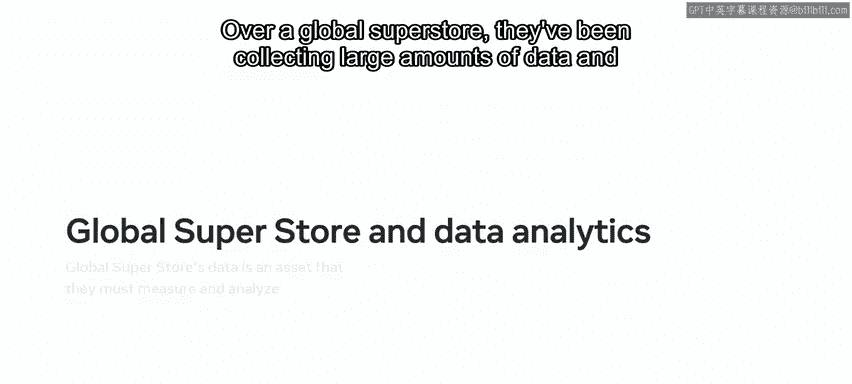

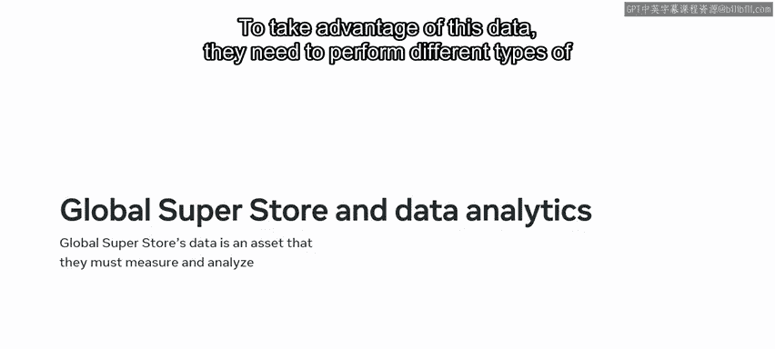

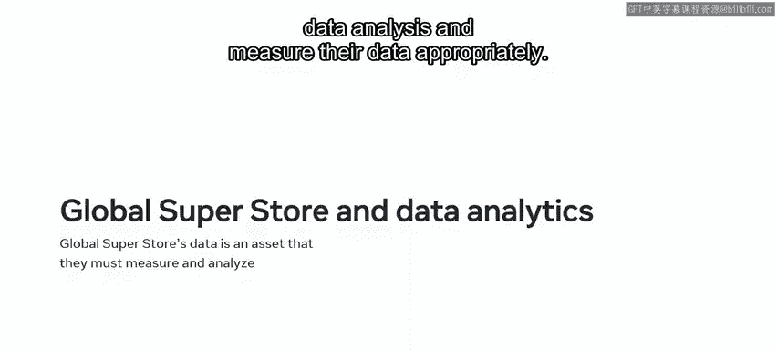

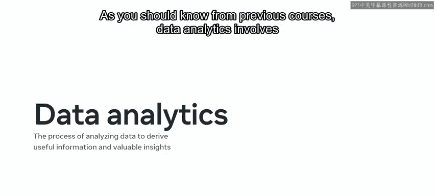

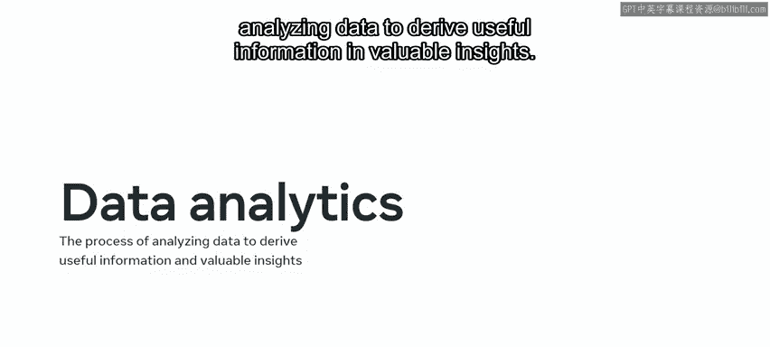

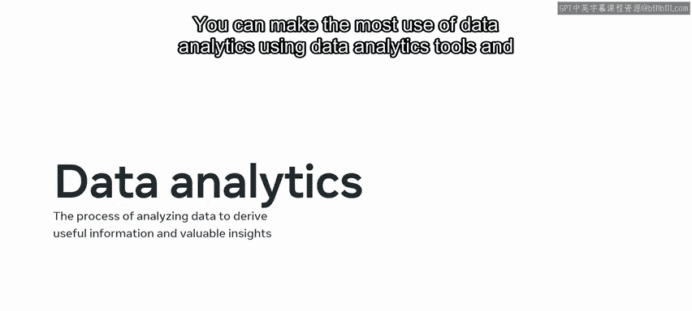

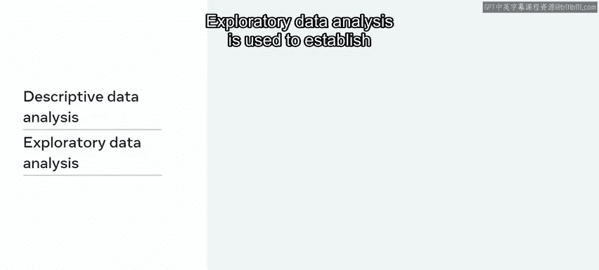

An inferential data analysis focuses on a small sample of data to make inferences。

 Predictive data analysis identifies patterns and data to make predictions about future performance。

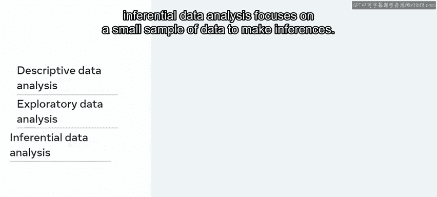

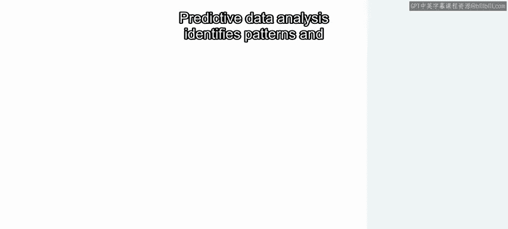

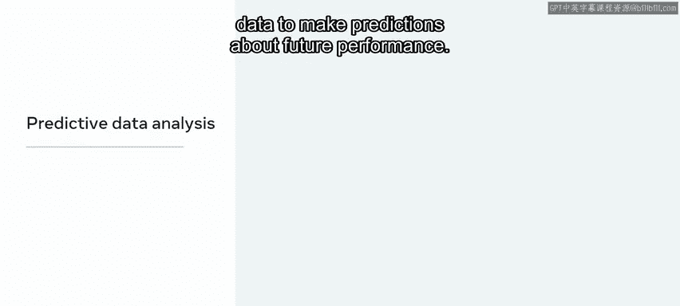

And causal data analysis explores causal and effect between variables Before you can engage in these types of data analysis。

 you first need to understand the type of data that you're dealing with and ask what kind of measurements should you apply to it。

 Another key question to ask of your data is if it's quantitative or qualitative Qua data refers to numerical data。

 This is data that can be counted or quantified。 In the case of global superstore。

 This includes the average number of customers who make purchases each day or the average cost of each purchase made。

 Qua data refers to nonnumerical data。 This is textual and descriptive data。

 like information about the quality attributes of a product。 For example。

 global superstore's qualitative data includes category names or descriptions of products like furniture or office supplies。

 Once you've determined what kind of data you're dealing with， you then need to organize。

 identify and analyze your data you can perform。

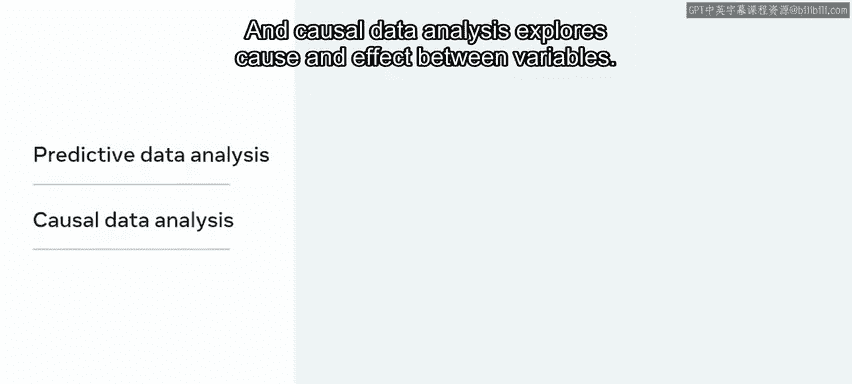

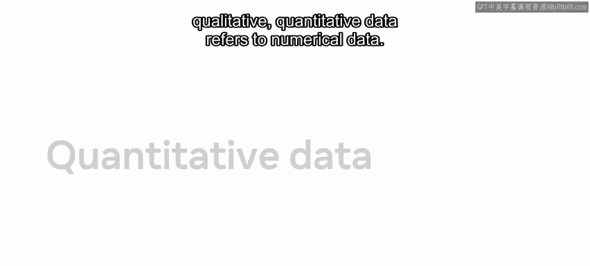

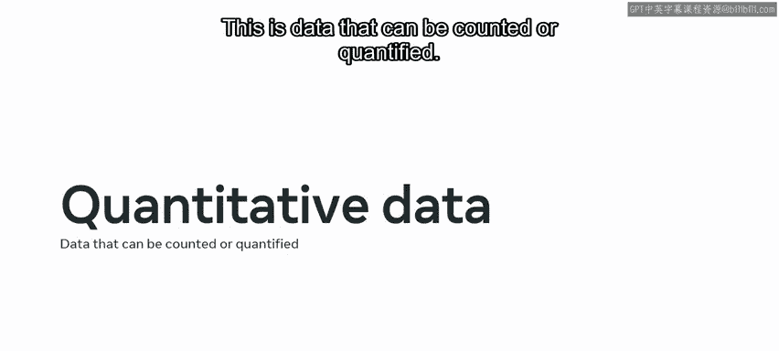

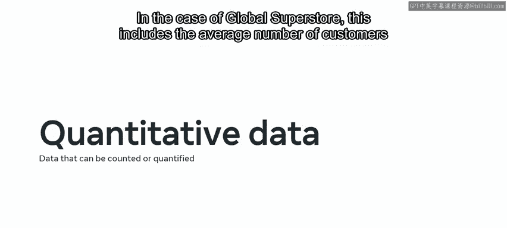

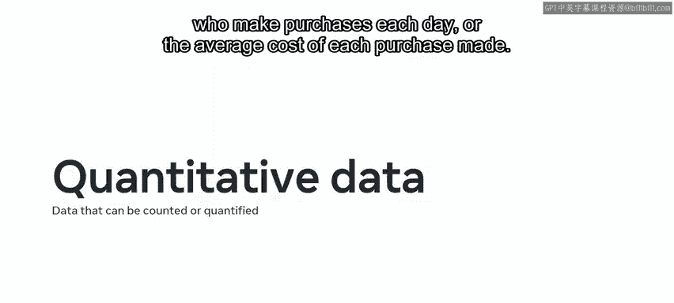

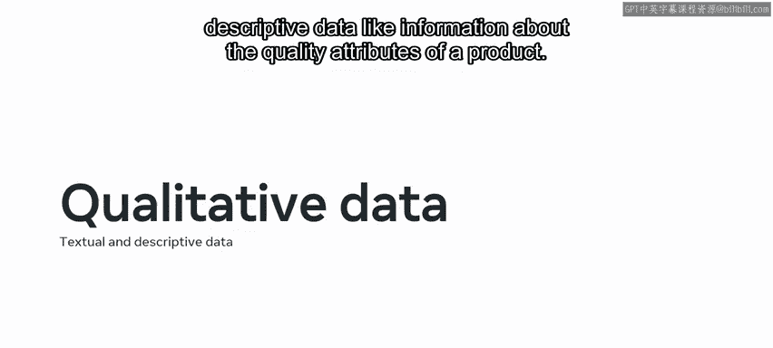

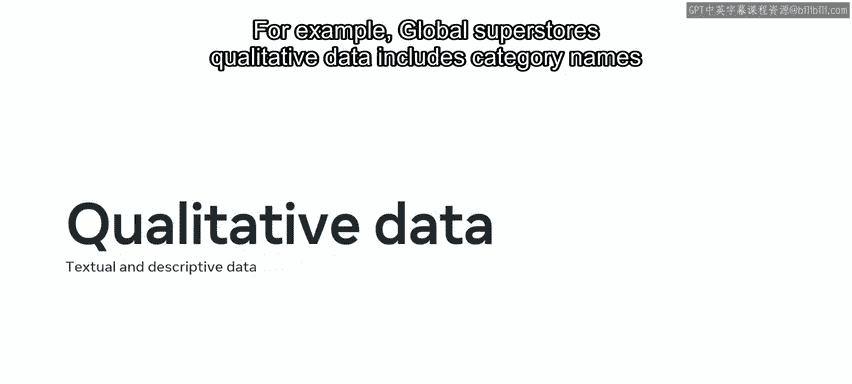

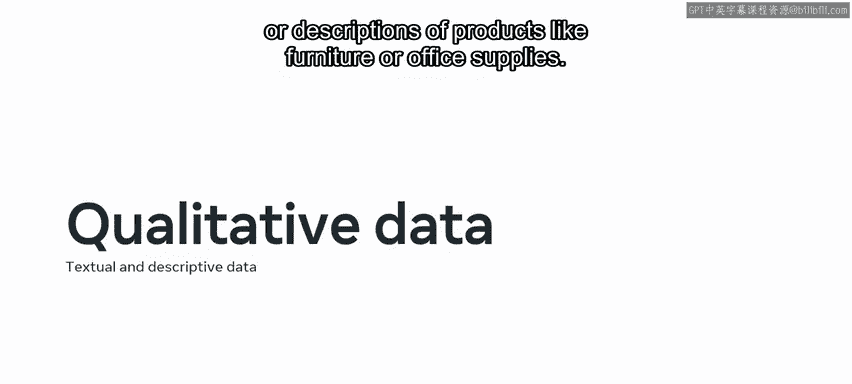

These actions using four different measurement scales。

 The first of these measurement scales is the nominal scale。

 This scale describes the identity property of nonnumerical data。 It's purely descriptive。

 which means it just identifies the data。 In the case of global superstore。

 They can use this scale to identify products in their stock like a chair or a desk。

 Each product is one nominal unit of data。 The next form of measurement is the ordinal scale。

 This is a qualitative data type scale， which places data in a specific ranked order。 However。

 it doesn't include decisive criteria to determine the difference between the data elements。

 For example， global superstore can rank chairs using ratings values。

 So they can use a value of one for top quality products。

2 for very good products and three for good products and so on。 However。

 there's no precise criteria that determines the measurement between each value。

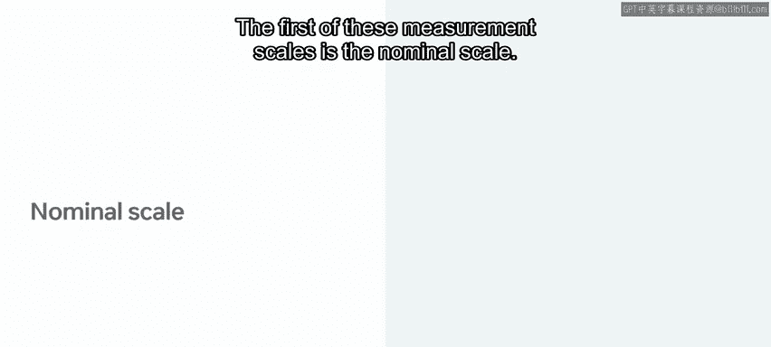

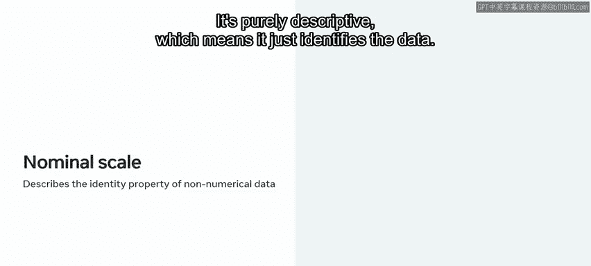

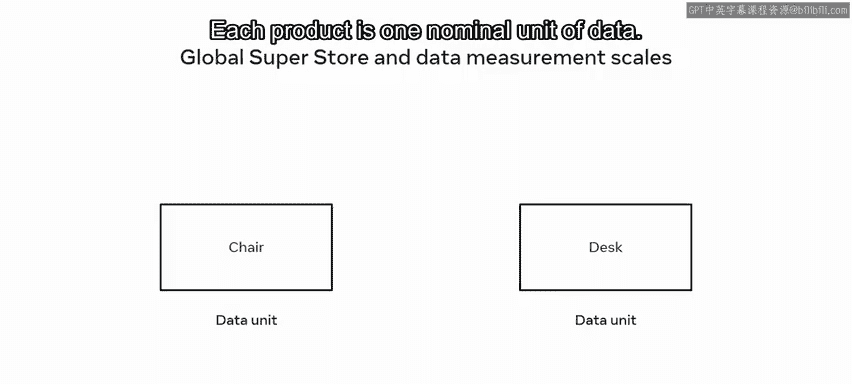

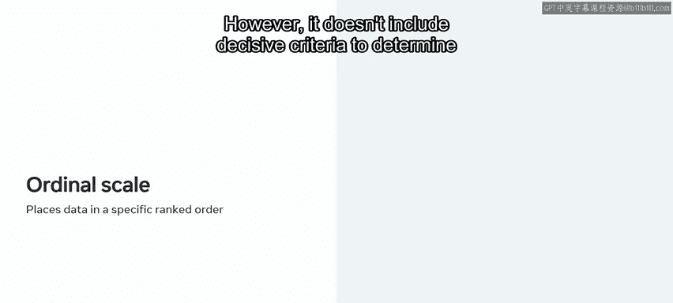

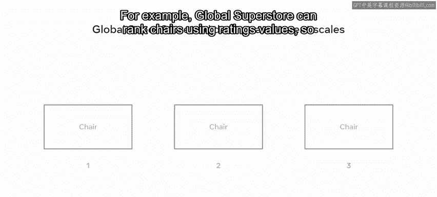

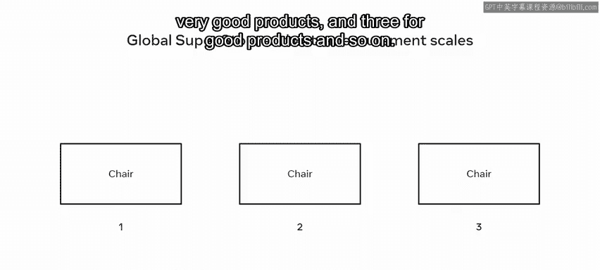

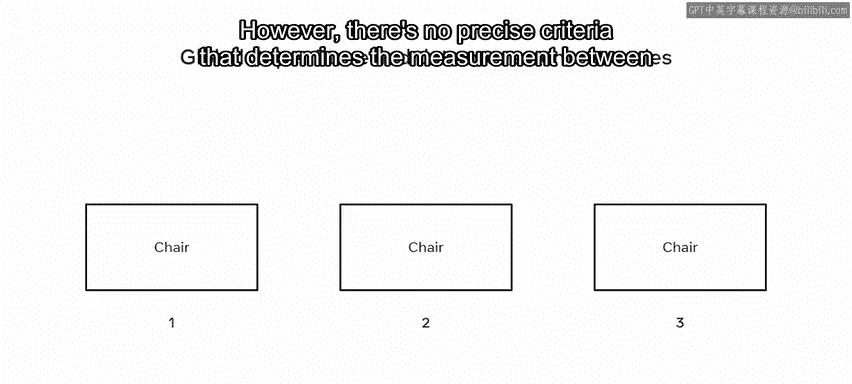

There's also the interval scale this scale includes properties of the nominal and ordered data scales。

 its key feature is that the difference between data points can be clearly identified using specific criteria。

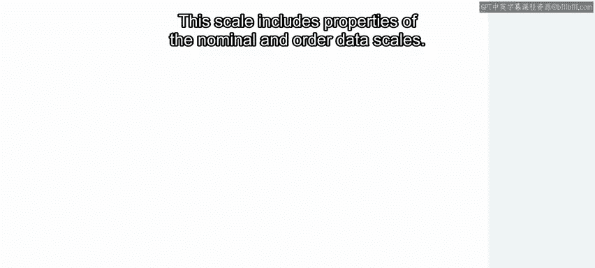

The scale can also contain both positive and negative numbers。

 and zero does not represent an absolute true value。

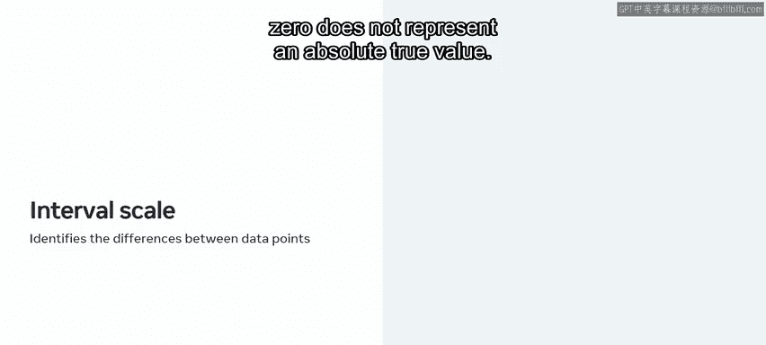

Global superstore can use the interval scale to provide feedback on products from 10 to-10。 Finally。

 there's the ratio scale。 This scale is a quantitative data type that includes properties from nominal。

 ordinal and interval scales of measurement。 It defines the identity of the data。

 classifies the data in order and marks clear intervals。 However， it holds an absolute value of zero。

😊。

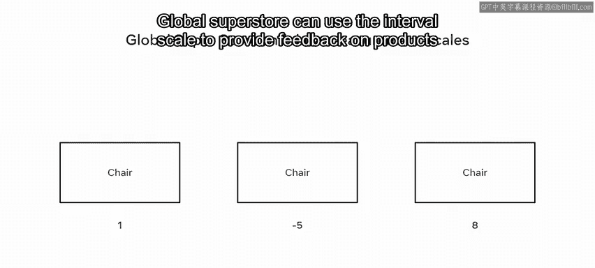

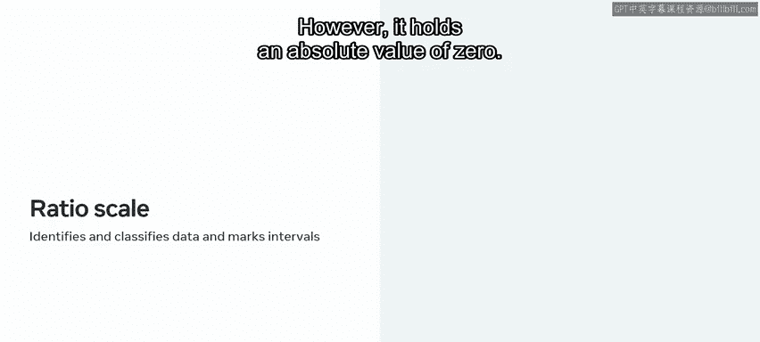

Over a global superstore， they can use the ratio scale to mark the weight of products。 For example。

 a small table is 20 kgram。 a medium sized table is 40 kgram。

 while a larger table weighs a total of 60 kgrams。 In this instance。

 theres a clear order between variables and an equal distance of 20 kilograms between each measurement。

 So all data points can be measured accurately。 you should now be familiar with the basics of data analytics be able to identify different types of data and explain different types of data measurements。

 Great work。😊。

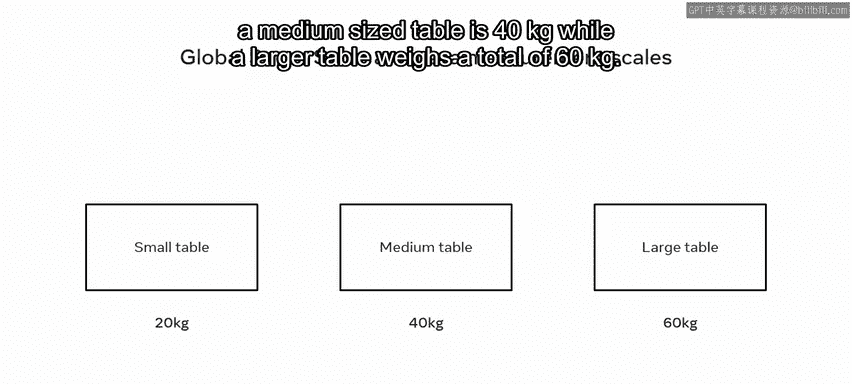

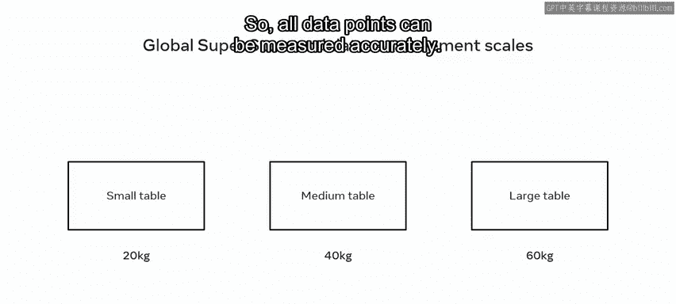