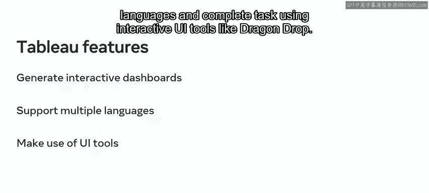
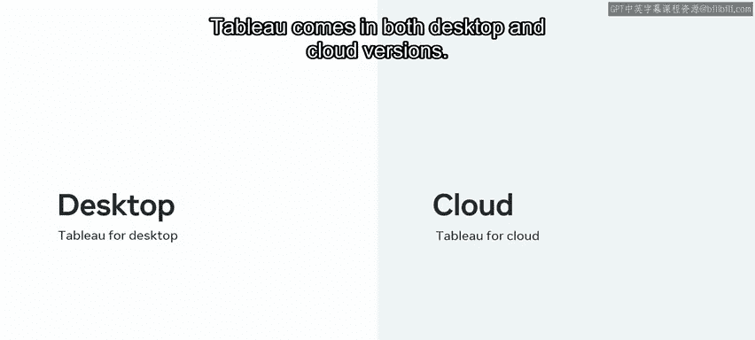
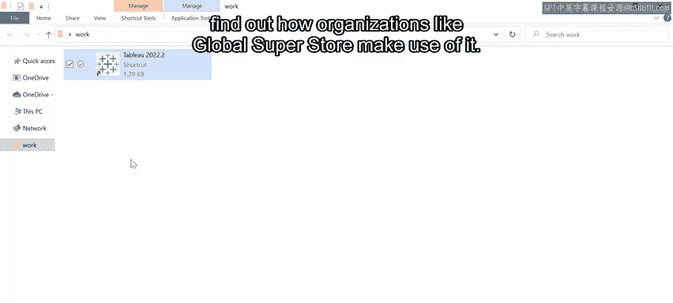
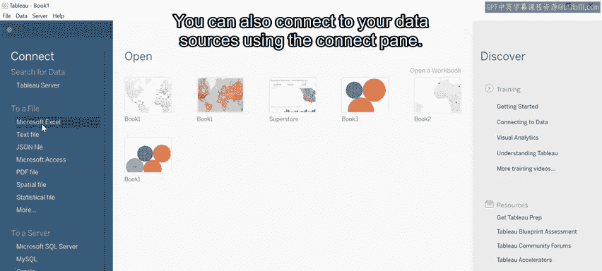
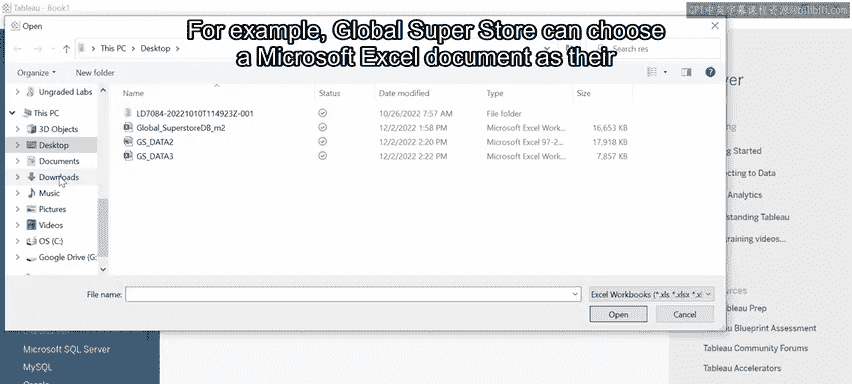
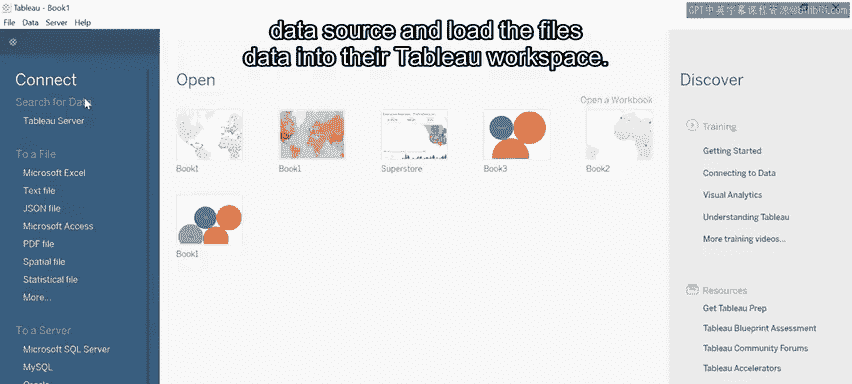
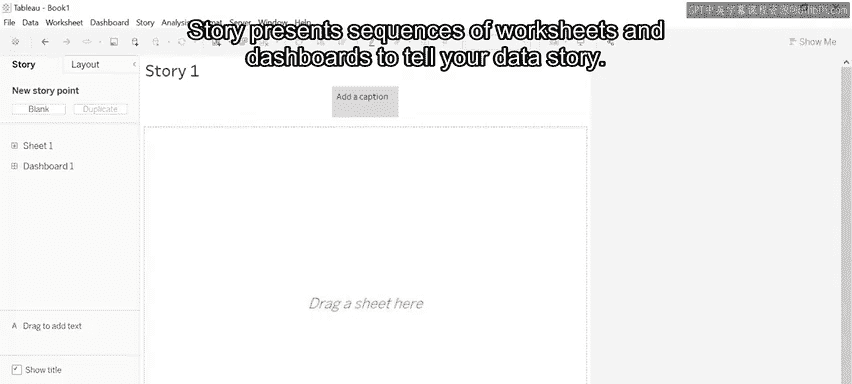

# 数据库工程师：P110：使用高级分析工具进行数据分析 📊

在本节课中，我们将学习数据分析工具的重要性，并重点介绍一款名为Tableau的流行工具。我们将了解这些工具如何帮助企业从海量数据中获取洞察，并初步探索Tableau的工作环境。

---

数据分析是一个复杂的过程，其任务超出了传统数据库管理系统的能力范围。因此，数据分析需要使用专门的数据分析工具。这些工具利用人工智能，使用户能够查看和理解大量数据。在本视频中，您将回顾一些知名分析工具的示例，了解它们的关键特性。您还将探索Tableau工具，在本课程后续的您自己的项目中将会用到它。

全球超市（Global Superstore）的数据分析师正在执行高级数据分析，以生成能够帮助指导其业务决策的数据洞察。这种方法需要使用强大的数据分析工具。借助这些工具，全球超市可以利用其数据识别新的商机、促进销售增长并改善服务，以及其他好处。让我们进一步了解这些工具的工作原理，并探索全球超市是如何使用它们的。

## 数据分析工具概述

数据分析工具帮助数据库用户执行数据分析。数据分析的结果能生成洞察，为商业和其他组织的发展提供信息。这些工具利用**人工智能**、**机器学习**和**数据挖掘**技术，并提供数据可视化工具，以帮助您理解和传达您的发现。

您可以利用多种分析工具。数据库分析师最常依赖的工具包括：
*   Tableau
*   SAS Business Intelligence
*   Microsoft Power BI

## 核心特性

这些工具提供几个关键特性，使其在处理大型数据库时非常有用。

以下是这些工具的核心优势：
*   **处理海量数据**：它们能够处理大规模的数据集。
*   **支持多种数据格式**：它们可以与许多不同格式的数据协同工作。
*   **连接多种数据源**：它们能够与许多不同的数据源和数据库系统交互。
*   **高级分析技术**：每个工具都使用高级数据分析技术来生成洞察。
*   **高级可视化工具**：它们提供高级数据可视化工具。

这些特性使用户查看和理解数据变得容易得多。

## 聚焦 Tableau 🎨

上一节我们介绍了数据分析工具的通用特性，本节中我们来看看一款具体的工具：Tableau。Tableau是一款广泛使用的数据可视化工具。它提供14天的免费试用，并为教师和学生提供一年的免费许可。

Tableau用户在进行数据可视化时可以利用以下几个关键特性：
*   **数据类型支持**：它以字符串、日期和时间等不同数据类型存储数据。
*   **广泛的数据源连接**：它可以连接到广泛的数据源，如 `MySQL`、`Microsoft SQL`、`MongoDB`、`BI` 和 `Oracle DB`。
*   **多格式文件交互**：它可以与许多不同的数据表和文件系统交互，如 `Excel`、`JSON` 和 `PDF`。

除了这些特性，Tableau还能：
*   生成实时呈现数据的**交互式仪表板**。
*   支持 `Python` 和 `R` 编程语言的**脚本编写**。
*   使用**拖放**等交互式UI工具完成任务。

Tableau有桌面版和云版本。在本课程中，您将使用Tableau桌面版。您可以直接从Tableau官网下载该软件。

## 探索 Tableau 工作环境

现在您已经熟悉了Tableau工具，让我们更详细地探索它，并了解像全球超市这样的组织是如何使用它的。

首先，点击Tableau桌面图标启动Tableau。这将打开Tableau启动页面。启动页面提供了几个不同的选项：
*   使用“打开工作簿”来**打开现有工作簿**。
*   在“加速器”部分使用**示例工作簿**进行工作。
*   在“发现”部分访问有用的**学习资源**。
*   您还可以使用“连接”窗格**连接到您的数据源**。

例如，全球超市可以选择一个Microsoft Excel文档作为其数据源，并将文件数据加载到其Tableau工作区中。选择Tableau图标可以从开始页面切换到创作工作区。

连接到数据源后，源连接和相关字段会出现在“数据”窗格中。然后，您可以使用创作工作区的用户界面元素来创建数据的可视化。

## 创建可视化与仪表板

您可以使用“标记”卡或行和列架子将数据添加到视图中。例如，全球超市可以根据需要在工作区周围拖放度量和维度。这对于比较数据和类别非常有用。

在工具栏中可以快速轻松地访问命令和导航工具。全球超市经常使用排序图标来按升序或降序排列条形图，或者使用仪表板同时查看和处理多个数据源。

您甚至可以创建一个**交互式仪表板**，将不同的工作表组合起来，向观众呈现相关信息。您还可以使用“故事”工具，它与仪表板类似。“故事”通过呈现一系列工作表和仪表板来讲述您的数据故事。

---

本节课中我们一起学习了知名数据分析工具及其共享的关键特性。您现在应该能够识别这些工具，并描述它们的许多共同特点。您还应该能够访问和使用Tableau工作环境来可视化您的数据。您在发展对高级数据分析的理解方面取得了良好的进展。