# 高级数据建模：模块三：高级数据分析模块小结 🎯

在本节课中，我们将回顾并总结高级数据建模课程的第三个模块——“高级数据分析”的核心内容。我们将系统梳理数据分析的基础概念、关键技能以及如何使用Tableau这一可视化分析工具进行实践。

恭喜你完成了高级数据建模课程的第三个模块。在本模块中，你探索了数据建模背景下的数据分析，并学习了如何使用可视化分析工具进行数据分析。

让我们花几分钟时间来回顾一下你在本模块课程中获得的一些关键技能。

## 数据分析概述 📊

你从本模块的第一课——数据分析概述开始学习。你了解到，数据分析涉及将聚合数据转换和处理成有用且有意义的信息。

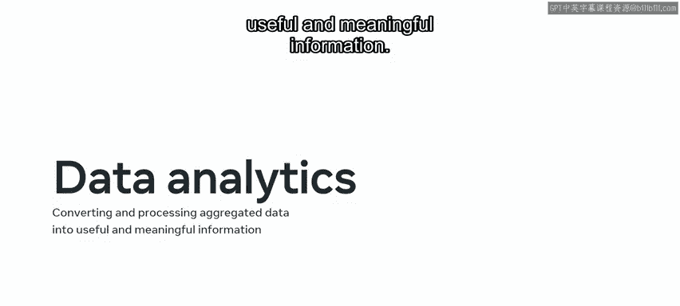

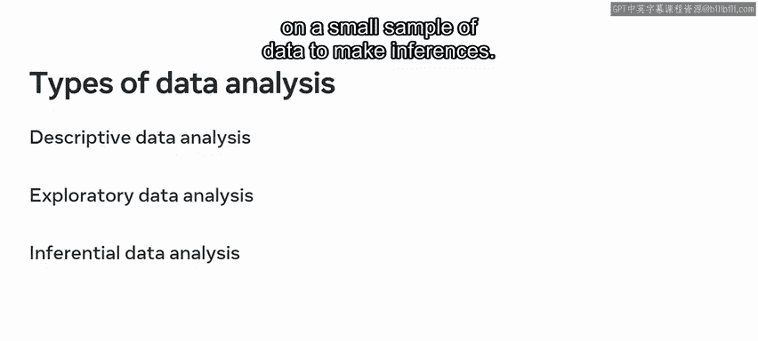

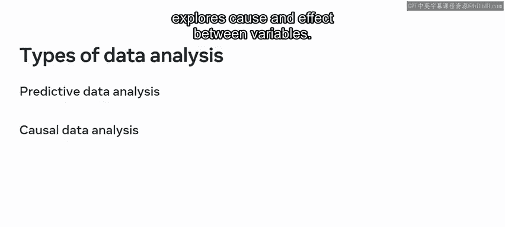

你还探讨了数据分析的主题。在你的数据库工程学习过程中，会遇到几种关键的数据分析类型。

以下是主要的数据分析类型：

*   **描述性数据分析**：以描述性格式呈现数据。
*   **探索性数据分析**：用于建立不同变量之间的关系。
*   **推断性数据分析**：专注于小样本数据以进行推断。
*   **预测性数据分析**：识别数据模式以预测未来表现。
*   **因果性数据分析**：探索变量之间的因果关系。

此外，你还了解到需要处理两种类型的数据：**定量数据**（指数值型数据）和**定性数据**（指非数值型数据）。

## 数据测量与组织 📏

一旦确定了要处理的数据类型，接下来就需要组织、识别和分析它。你可以使用四种测量尺度来执行这些操作。

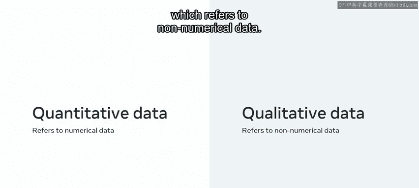

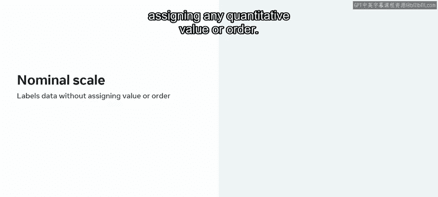

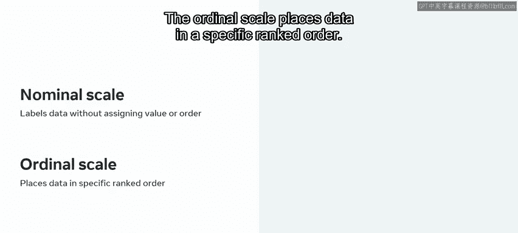

以下是四种主要的测量尺度：

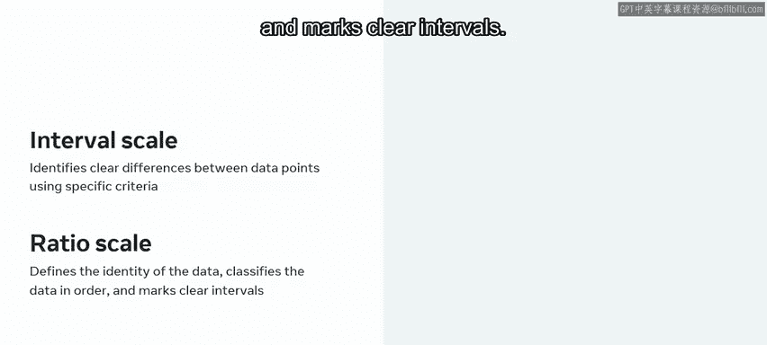

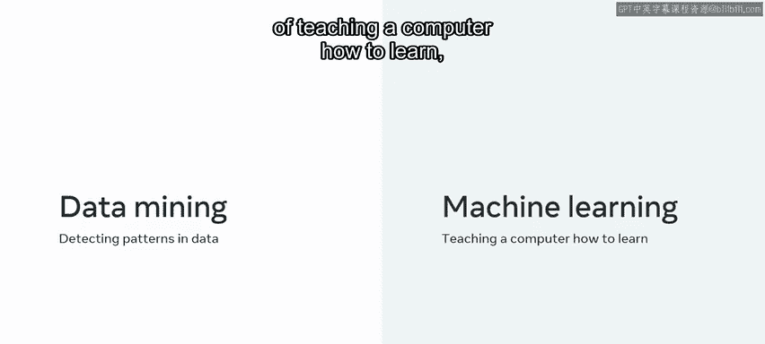

*   **定类尺度**：用于标记数据，不分配任何定量值或顺序。
*   **定序尺度**：将数据按特定排名顺序排列。
*   **定距尺度**：使用特定标准识别数据点之间的明确差异，也可以表示负值。
*   **定比尺度**：定义数据的同一性，对数据进行分类排序，并标记明确的间隔，但不能表示负值。

## 数据挖掘与机器学习 🤖

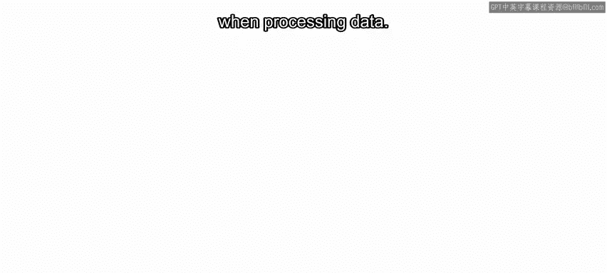

接着，你探讨了数据挖掘和机器学习的主题。你了解到，**数据挖掘**是检测数据模式的过程，而**机器学习**是教会计算机如何学习的过程。这可以通过**监督式**或**无监督式**机器学习来完成。

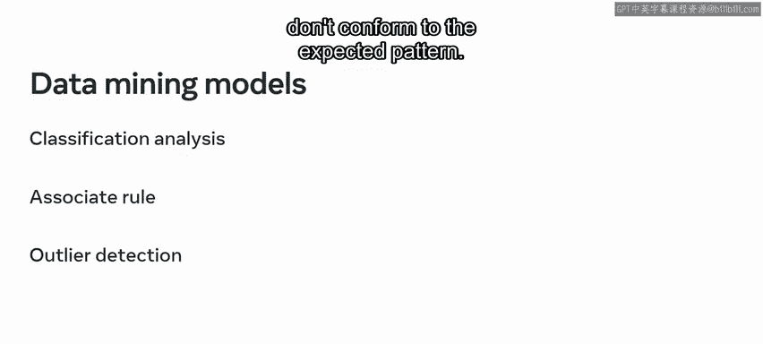

机器学习在处理数据时会利用几种不同类型的数据挖掘模型。

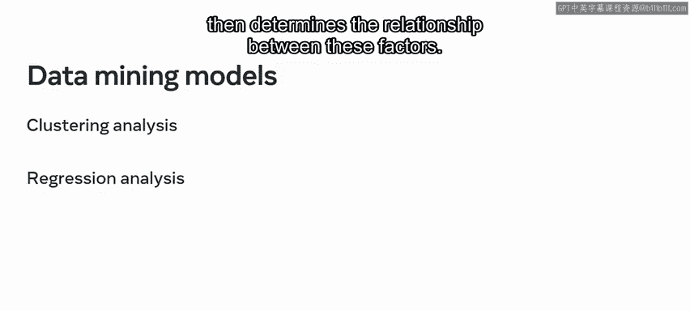

以下是几种主要的数据挖掘模型：

*   **分类分析**：将数据项分配到类别中。
*   **关联规则**：识别不同数据元素之间的关系或关联。
*   **异常检测**：检测不符合预期模式的数据异常值或异常。
*   **聚类分析**：在数据集中搜索相似性，然后将它们分离成簇。
*   **回归分析**：考虑影响数据的不同因素，然后确定这些因素之间的关系。

## 数据可视化的重要性 📈

在本课程的下一个部分，你学习了数据可视化的重要性。这意味着你必须以能让决策者快速、轻松地解读信息的方式来呈现或可视化你的数据。

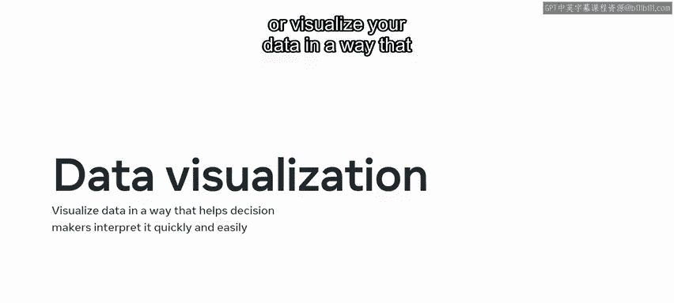

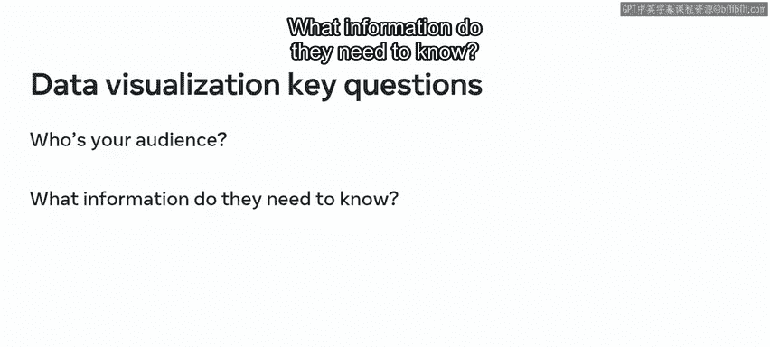

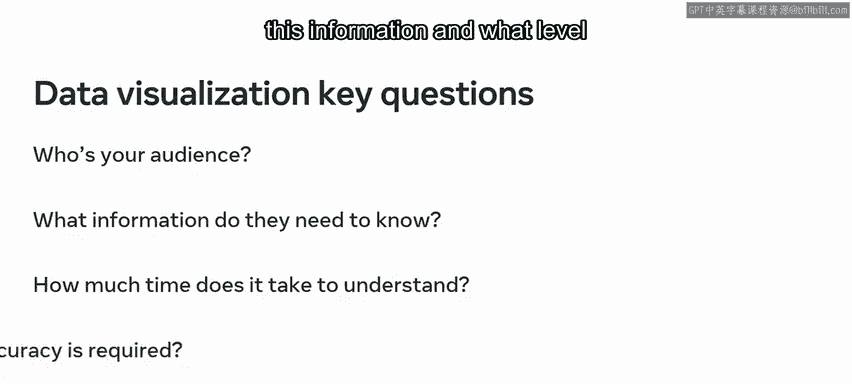

在可视化数据时，你必须考虑以下问题：你的受众是谁？他们需要知道什么信息？他们应该花多少时间来检查这些信息？他们需要什么级别的准确性？

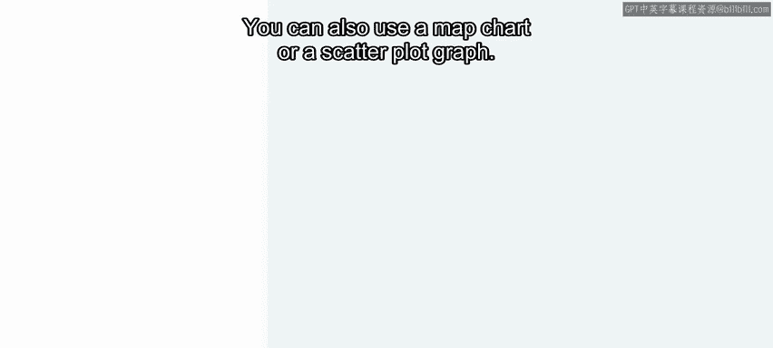

回答了这些问题后，你就可以选择合适的**数据可视化图表**。有许多不同类型的图表可供选择，包括条形图、折线图和气泡图。你也可以使用地图图表或散点图。每种图表都有不同的用途。最重要的是选择最能向你的受众传达信息的图表。

然后，你通过一个讨论结束了这节课，思考了你接触过哪些类型的数据分析报告，以及它们如何帮助你的任务。

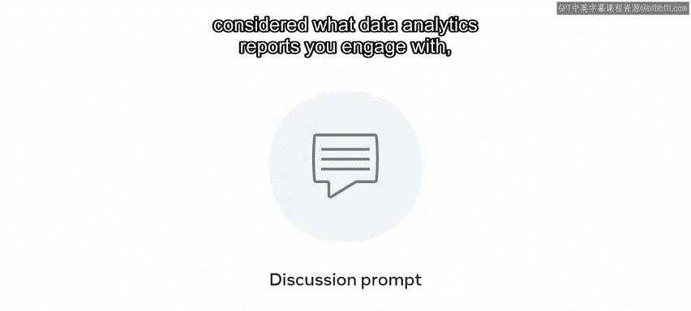

## 高级数据分析工具：Tableau 🛠️

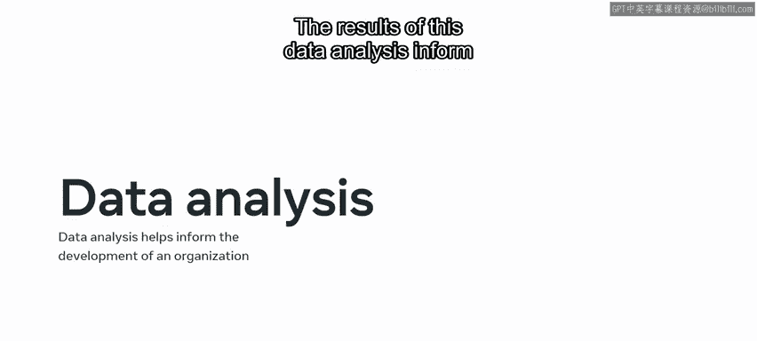

在本模块的下一课中，你回顾了高级数据分析的主题。你了解到数据分析工具可以帮助数据库用户执行数据分析，数据分析的结果为其业务或组织的发展提供信息。

本课程中使用的数据分析工具是 **Tableau**。它的主要功能如下：

*   以不同数据类型的形式存储数据。
*   可以连接到广泛的数据源。
*   可以与许多不同的数据表和文件系统交互。

除了这些功能，Tableau还可以生成交互式仪表板，支持多种语言的脚本编写，并且还提供拖放等交互式UI工具。

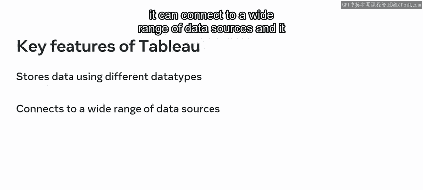

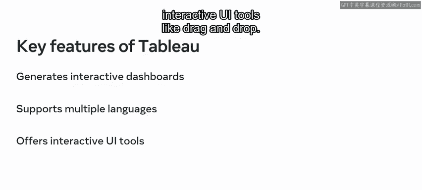

你首先学习了如何下载、启动和导航Tableau。然后你学习了如何在Tableau中导入和准备数据。这涉及到设置到数据源的实时连接或将数据导入工具，以及清理和准备数据以供分析。

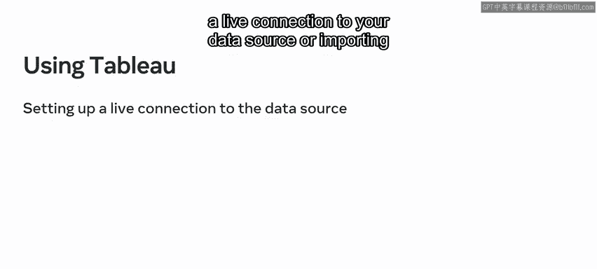

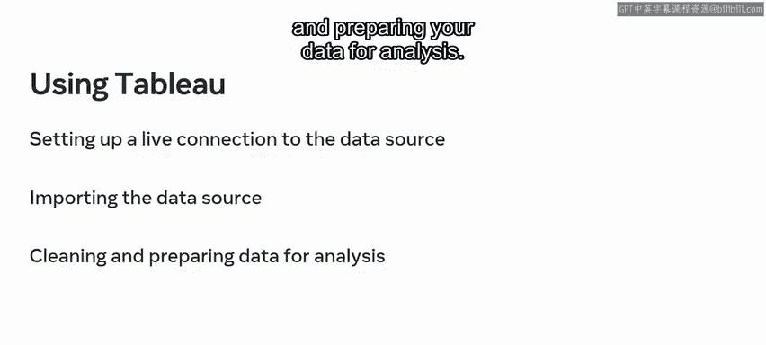

这第二步通常涉及以下操作：

*   过滤不相关的数据。
*   拆分数据以提高可访问性。
*   根据需要创建新的数据字段。
*   修复数据类型。

连接到数据源或导入数据后，你就可以在Tableau中过滤、分析和可视化数据。你可以使用数据源页面或工作表来过滤数据。Tableau还允许你使用条件或添加子类别来过滤数据。

然后，你学习了如何使用Tableau工作表创建交互式仪表板。最后，你进行了一个练习，在Tableau中执行了数据分析。

## 总结 🏁

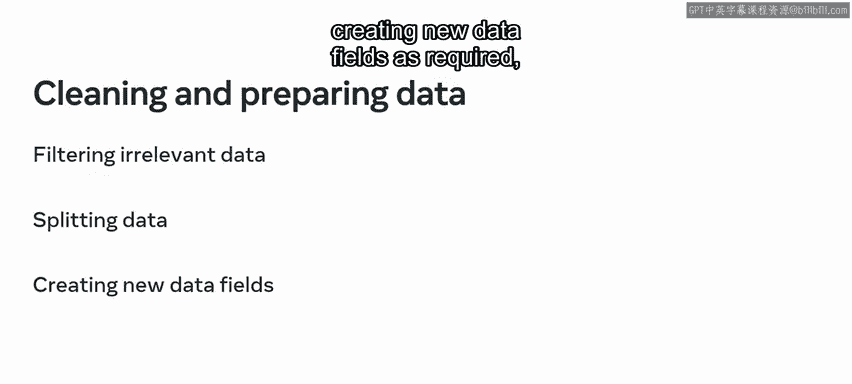

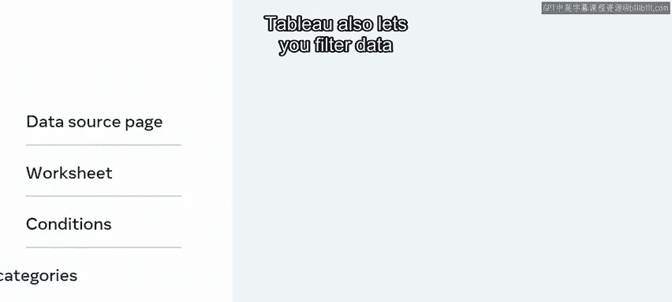

本节课中，我们一起学习了高级数据分析模块的核心内容。你现在应该熟悉了数据分析和数据分析软件，这是巨大的进步。我期待在下一个模块中指导你完成一个数据建模项目。