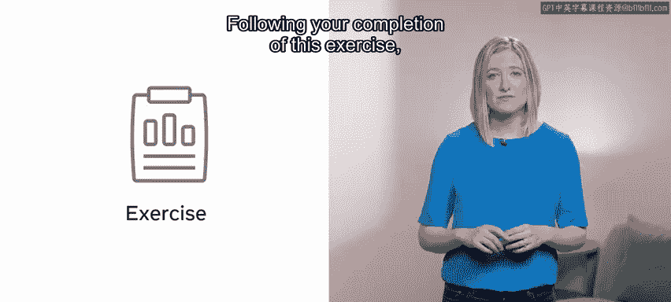
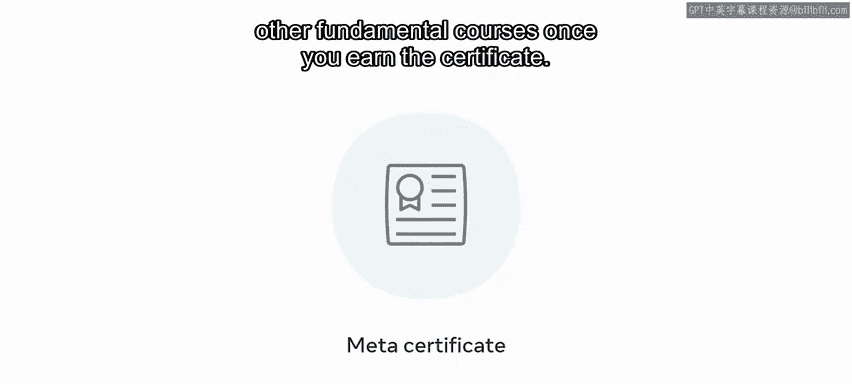

# 数据库工程师：P115：恭喜您完成了高级数据建模 🎉

在本节课中，我们将对您在整个高级数据建模课程中的学习成果进行总结，并展望后续的学习路径与职业发展机会。

---

恭喜您，您已经完成了这门课程的学习。

您付出了巨大的努力才走到这一步，并在此过程中掌握了许多新技能。

您在高级数据建模的旅程中取得了卓越的进展。

现在，您应该对数据库建模有了深入的理解。

您能够通过一项练习来展示部分学习成果。

完成这项练习后，您现在应该能够：

*   在 **MySQL Workbench** 中设计数据库模型。
*   理解数据仓库在数据分析流程中的作用。
*   使用数据仓库创建维度数据模型。
*   使用 **Tableau** 进行数据分析，并运用数据可视化技术展示您的结果。

随后的分级评估进一步检验了您对这些技能的掌握程度。

然而，您仍有更多知识需要学习。

因此，如果您觉得本课程有所帮助并希望探索更多内容，何不注册下一门课程呢？

在每一门数据库工程师课程中，您都将持续发展您的技能组合。

在最终的毕业项目中，您将运用所学的一切知识，创建您自己功能完整的数据库系统。

无论您是刚刚起步的技术专业人士、学生还是商业用户，本课程和项目都能证明您对数据库系统价值和能力的理解。

该项目通过实际应用来巩固您的技能。

但该项目还有另一个重要的益处。

这意味着您将拥有一个完全可运行的数据库，可以将其纳入您的作品集中。

这有助于向潜在雇主展示您的技能。

它不仅向雇主表明您具备自主驱动力和创新精神，也充分展现了您作为个人以及您新获得的知识。

一旦您完成了该专业认证中的所有课程，您将获得数据库工程证书。

根据您的目标，此证书也可作为进阶其他基于角色的证书的跳板。您可以选择深入学习高级角色证书，或者在获得此证书后学习其他基础课程。

感谢您。很荣幸能与您一同踏上这段探索之旅。祝您未来一切顺利。

---

本节课中，我们一起回顾了您在高级数据建模课程中取得的成就，包括掌握的核心技能和完成的实践项目。我们还探讨了如何将所学知识应用于毕业项目以构建作品集，并了解了获得专业认证后的后续学习与发展路径。