# Meta《数据库工程师（Python／数据库客户端／高阶数据建模／毕业项目／面试）｜Meta Database Engineer》中英字幕 - P116：0_课程介绍.zh_en - GPT中英字幕课程资源 - BV1pZ421a749

Welcome to the Capstone course。 You're now within reaching distance of the end of your database engineering journey。

 In this final course， you need to prove your new skills by helping little Lemon complete a series of database related tasks。

 These tasks include setting up a database in MysqL workbench using a MysQqL In server。

 creating an entity relationship or Er R diagram and implementing it in MysQL workbench。

 and you need to commit the project using Git。😊。

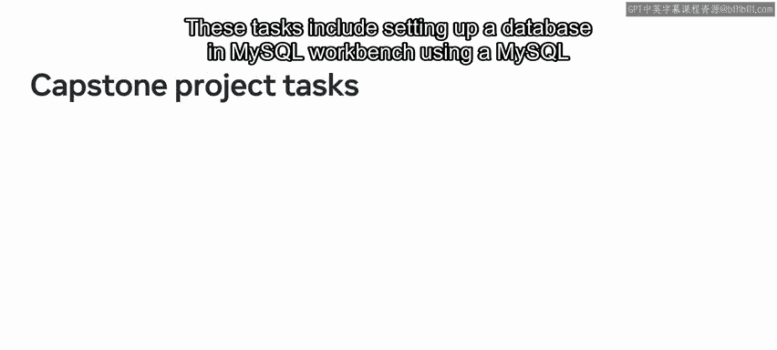

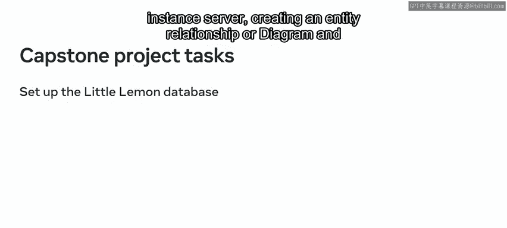

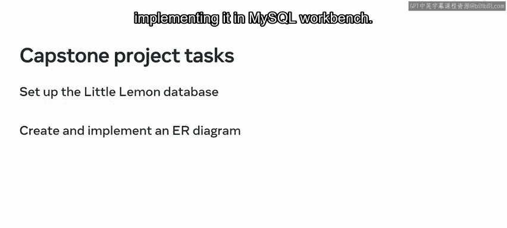

You also need to help them create sales reports from the data in their database。

 build a table booking system， generate data insights using data analytics and create a database client。

 Let's take a few minutes to review the processes and tools that you'll use to complete these exercises。

 In the first set of tasks。 you'll help little M to build a relational database system by designing a well structured entity model or Er diagram that conforms to the three fundamental normal forms。

 You'll design the Er diagram using MysqL workbench。

 A unified visual tool used for database modeling and management。

 A key feature of Mysql workbench that you'll make use of is the ability to transform your database model in a physical database schema in a Mysql server。

 Once you've created the little Lemon database， you'll then commit your project using Git the version control system。

 You'll also make use of Github to store your Git repositories。😊。

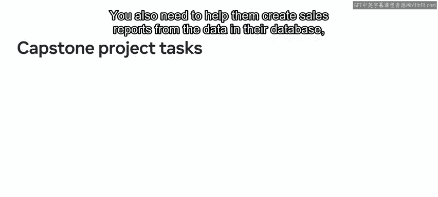

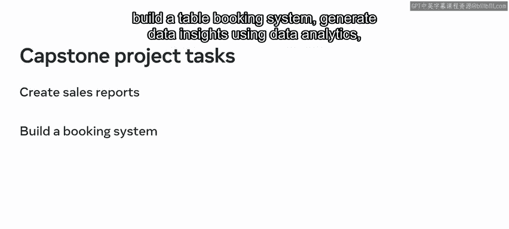

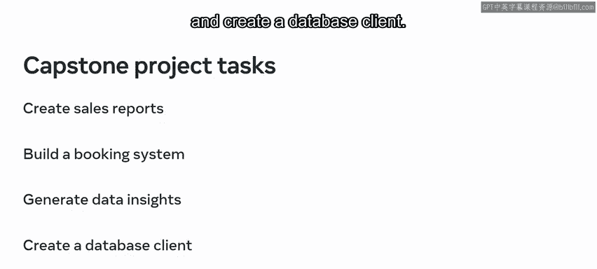

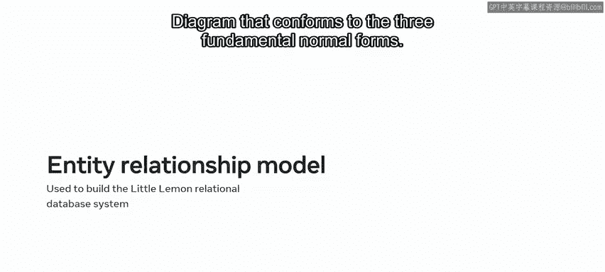

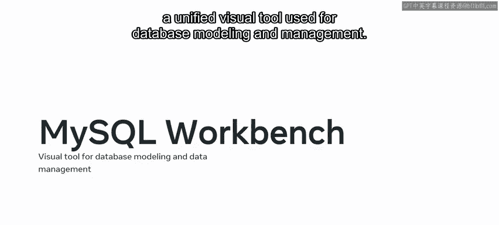

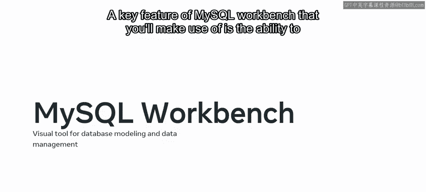

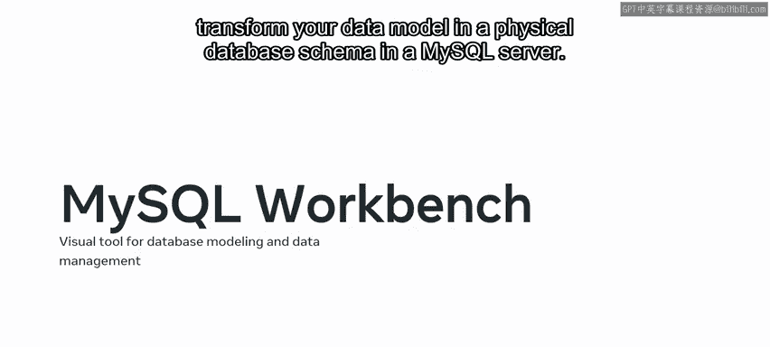

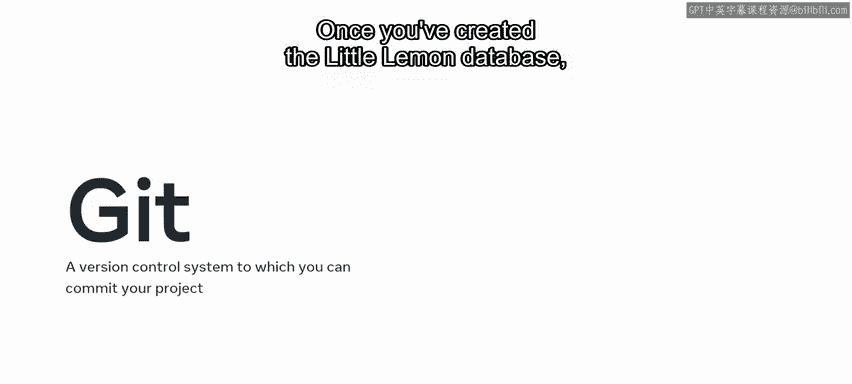

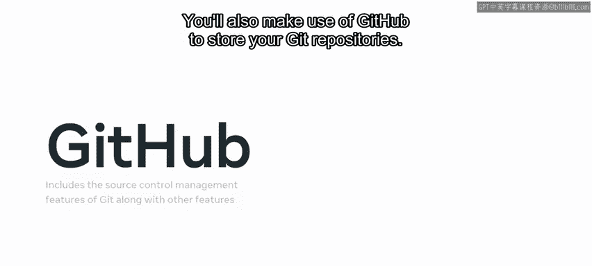

Your next task is then to create sales reports from the data in the little Lemon database。

 You'll create these sales reports using database queries， procedures and prepared statements。

 Let's look at these in more detail。😊。

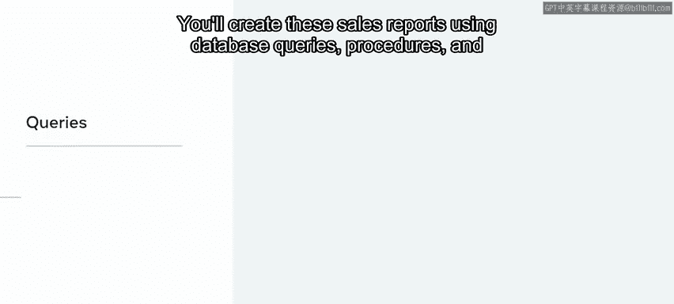

You'll use virtual tables to make use of data that exists in other tables and simplify data access and queries。

 You'll also make use of different kinds of join clauses to link records of data between one or more tables based on a common column。

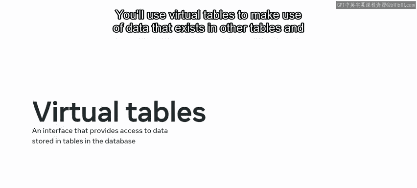

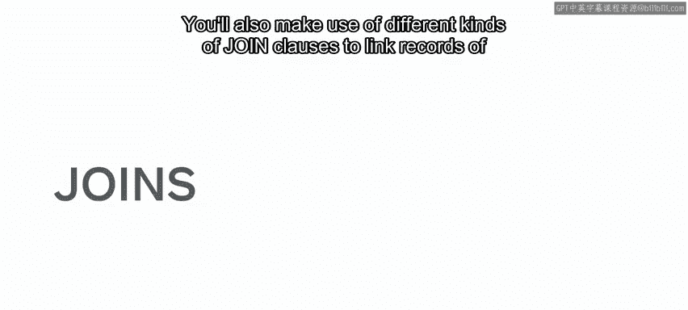

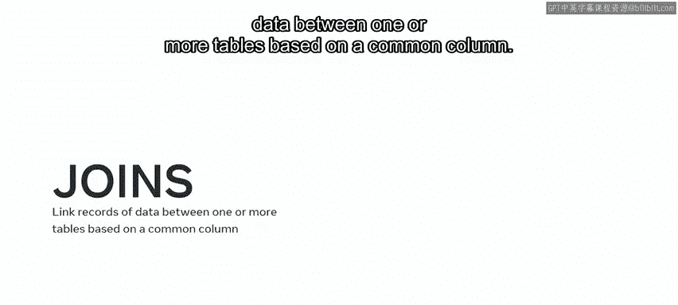

You'll help little Le to use stored procedures to create reusable code that can be invoked and executed as required。

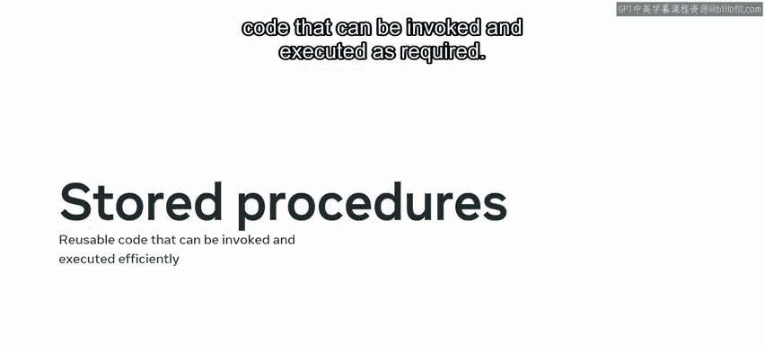

And you'll also rely on prepared statements that can be used repeatedly without the need for compiling or using valuable Mysql resources。

 Another task you'll assist at lemon with is building a table booking system in their database that they can use to keep track of guests visiting the restaurant。

 This task mainly consists of using SQL queries and transactions。

 Let's review some examples of the SQL queries and transactions that you'll use。

 You'll create data using standard insert into statements。

 You'll change data in the database using update statements。

 You'll also delete or drop data using delete statements。 And finally。

 you'll read your data using read queries like select statements。😊。

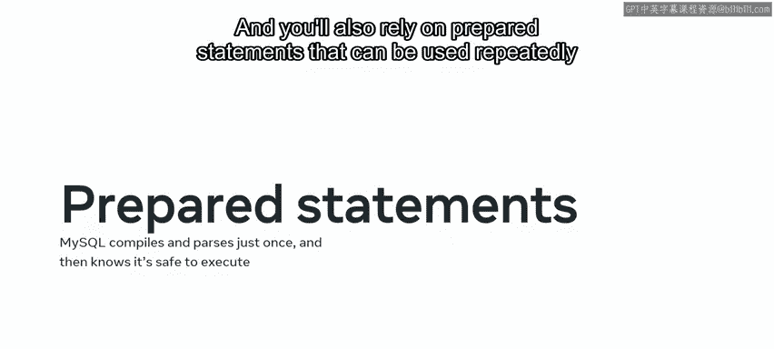

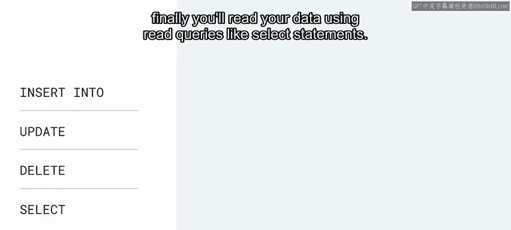

You'll also make use of triggers to store a set of actions in the form of a stored program that you can then invoke automatically when certain events occur。

 Once you're confident that your code is correct， you'll commit your progress to get In the next task。

 You'll help little Lemon use their data to generate business insights。

 You'll carry out this task using Tableau the data visualization tool。

 Let's review the process steps that you'll follow to complete this task。

 You'll first connect your data sources to tableableau。

 You'll then prepare your data for analysis and focus on the most relevant data。

 The next step is to create a visualization of your data using its UI elements。 Finally。

 you'll use Tableau to produce interactive realtime data visualizations in the form of dashboards。

 These process steps will help to provide clear and relevant answers to little Le's important business questions。

😊。

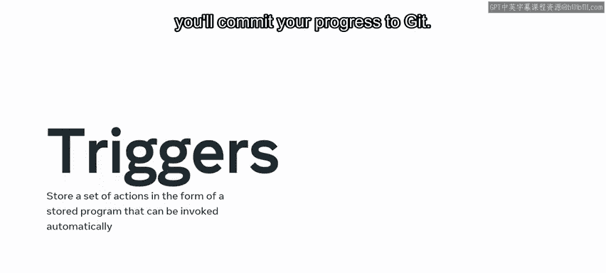

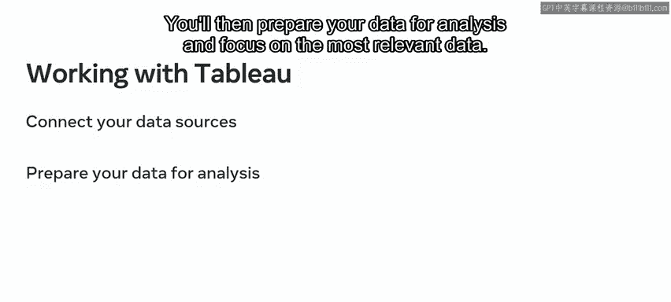

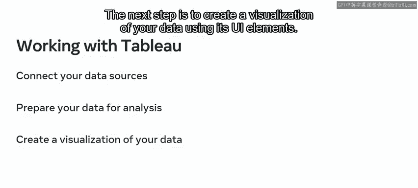

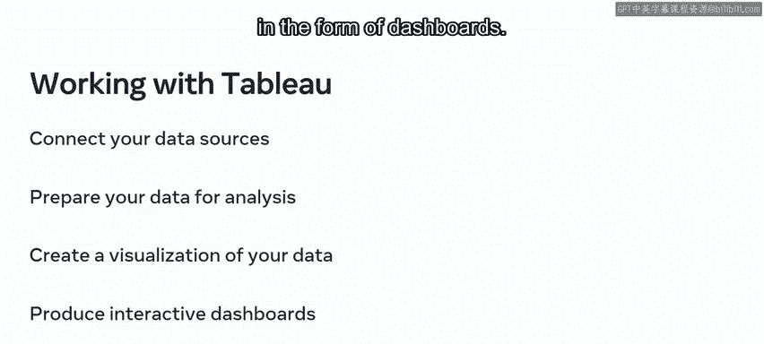

Your final task is to help little Le create a database client so that they can interact with their database using a Python based application to begin。

 you'll first need to identify which version of Python is running on your machine。

 Once you've confirmed that you're running the most recent iteration of Python。

 you'll need to install the Jupiter Ide E to run your code on。

 You can then open a new instance of the Jupiter notebook and use it to connect Python to the little Lemon MysQqL database。

 You can establish this connection using the Python library。

 MysQL connector and the Pip software package。 Once you've set up your Python environment you can begin working with your database client。

😊。

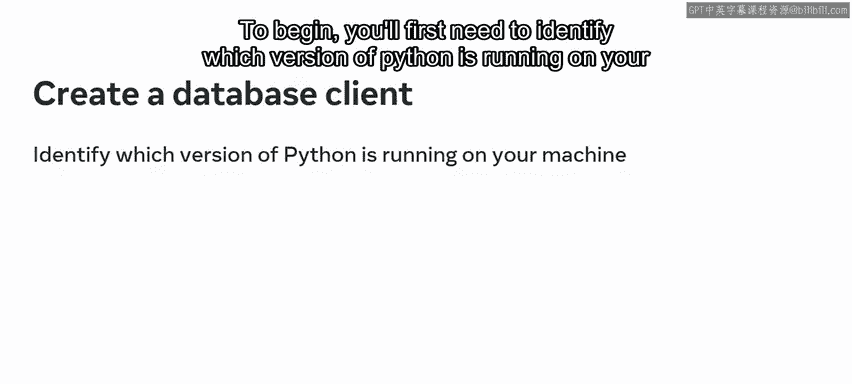

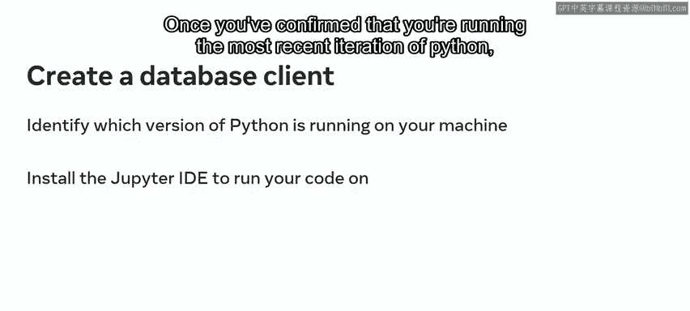

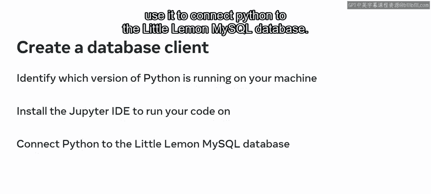

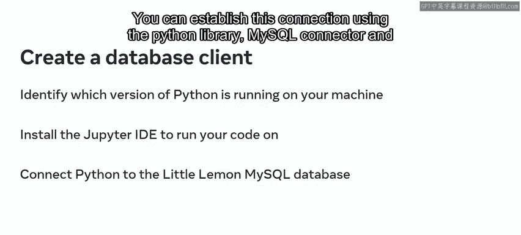

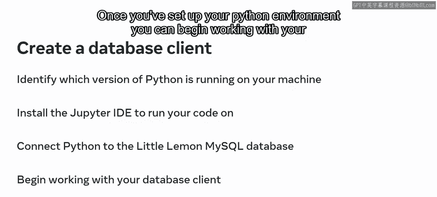

So now that you're familiar with the tasks you need to complete， it's time to get started。

 Don't worry， I'll be here to provide you with guidance along the way。

 You can also refer to the relevant learning material from previous courses if you need more help。

 Best of luck。