# 数据库工程师：P117：项目概述与设置 🚀

在本节课中，我们将学习如何为 Little Lemon 餐厅设置数据库项目。我们将回顾并应用三个关键步骤：在 MySQL Workbench 中设置数据库、创建并实现实体关系图，以及使用 Git 提交项目。

## 项目设置的关键步骤

上一节我们介绍了课程目标，本节中我们来看看设置项目的具体步骤。以下是完成项目设置所需的三个核心步骤：

1.  使用 MySQL 实例服务器在 MySQL Workbench 中设置数据库。
2.  创建实体关系图并在 MySQL Workbench 中实现它。
3.  提交项目。

在接下来的内容中，我们将逐一回顾这些主题，并学习如何在本课程中应用它们，以帮助 Little Lemon 构建其关系型数据库系统。

## 设计数据模型 📐

首先，你需要设计一个结构良好的实体关系数据模型，即 **ER 图**。

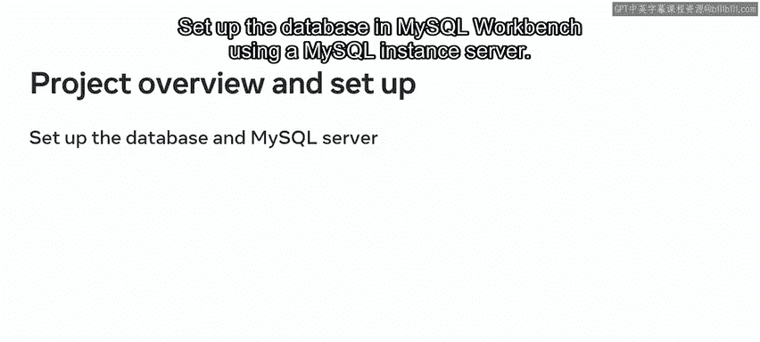

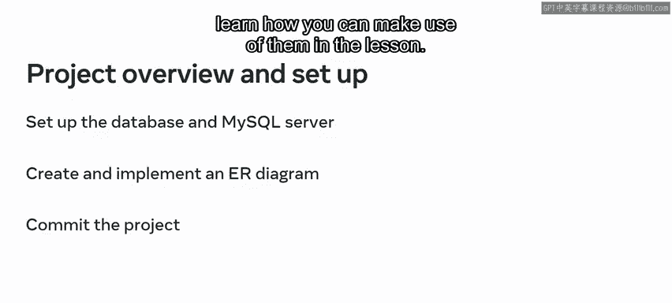

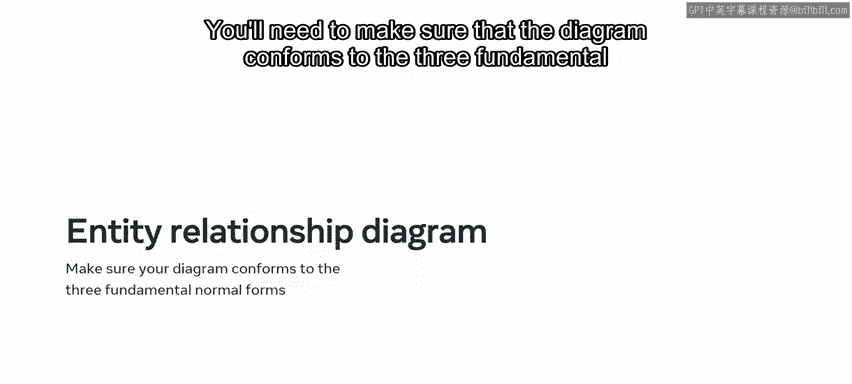

你需要确保该图符合三个基本范式。通过遵循这些范式，你将确保数据库的完整性，并避免插入、更新和删除异常。正如你在之前的课程中所了解的，有许多专业工具可用于设计 ER 图。

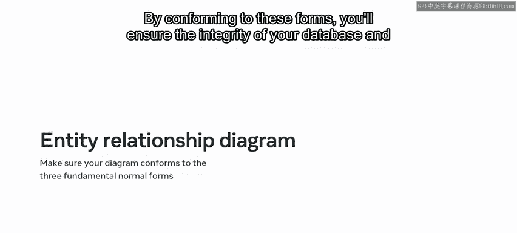

在本项目中，你将使用 **MySQL Workbench**。你应该在其他课程中已经熟悉了 MySQL Workbench，因此现在让我们快速回顾一下基础知识。

## 认识 MySQL Workbench 🛠️

MySQL Workbench 是一个统一的视觉化工具，用于数据库建模和数据管理。它的主要优势在于开源、跨平台，并提供可视化 SQL 编辑器的支持。它还可以让你将数据模型转换为 MySQL 服务器中的物理数据库模式。

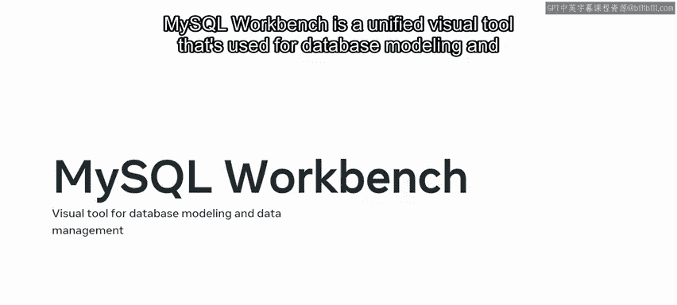

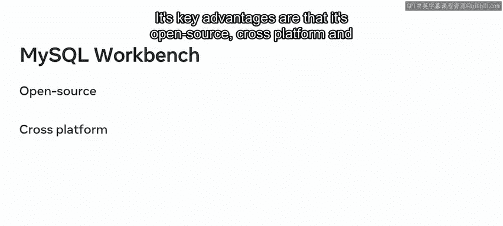

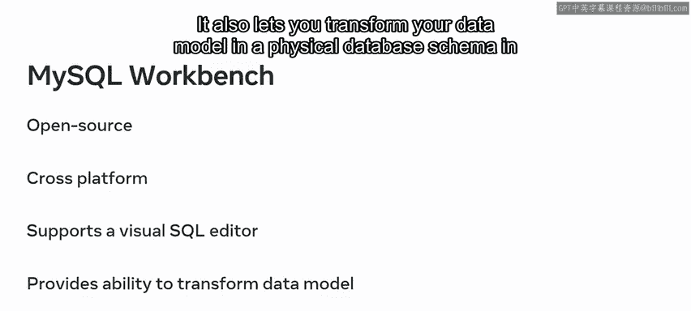

如果你尚未在操作系统中安装 MySQL Workbench，可以从 `dev.mysql.com/downloads` 下载并安装。

以下是安装时需要确保安装的组件：

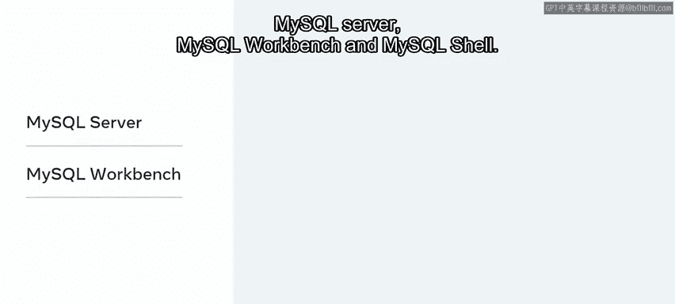

*   MySQL 服务器
*   MySQL Workbench
*   MySQL Shell

安装过程相对简单。但是，如果遇到任何挑战，可以参考之前课程中的安装材料，或访问 Oracle 网站获取详细的安装说明。

## 提交项目与版本控制 💾

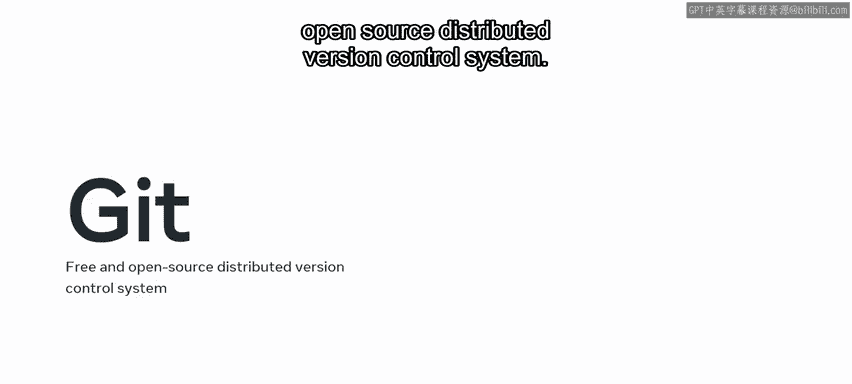

创建好 Little Lemon 数据库后，你需要提交你的项目。

你可以使用 **Git** 来提交项目。Git 是一个免费、开源的分布式版本控制系统。你可以使用它来管理所有源代码的历史记录。你可以保留提交历史、恢复到以前的版本，并共享代码以与其他开发人员协作。

你可以从 `git-scm.com/downloads` 下载并安装 Git。

你的 Git 仓库通常存储在 **GitHub** 上。GitHub 包含了 Git 的源代码管理功能以及其他有用的功能，例如项目管理、支持工单管理和错误跟踪。你也可以用它来共享访问权限和存储仓库，包括备份。

要注册 GitHub 并开始使用，请访问官方网站 `github.com`。

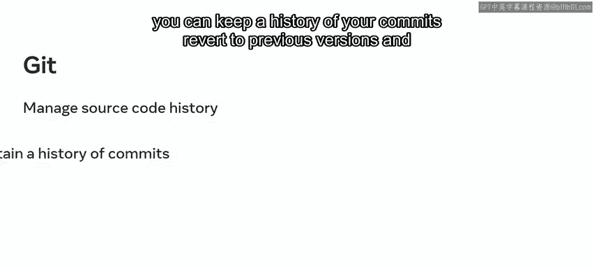

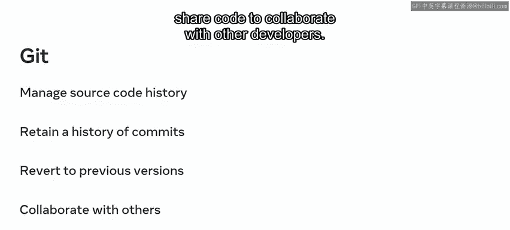

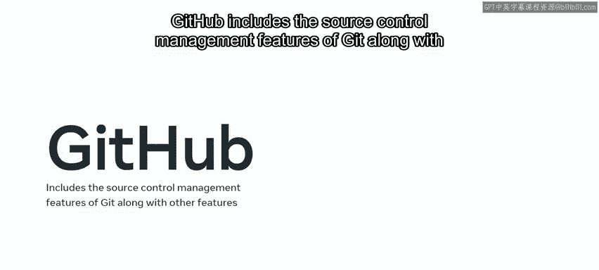

## 总结与开始 🎯

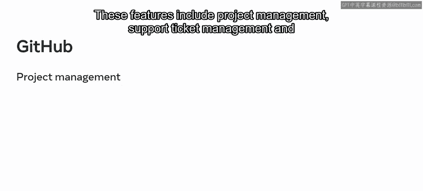

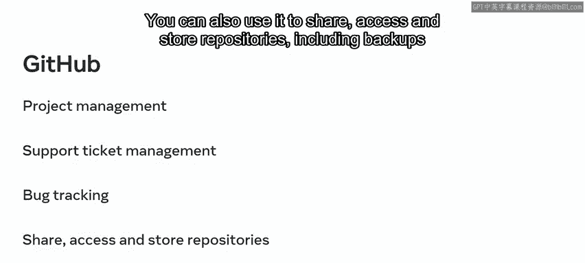

现在你已经熟悉了所需的技术，可以开始帮助 Little Lemon 开发他们的数据库系统了。

你可以按照以下流程操作：在 MySQL Workbench 中设置数据库，创建 ER 图并实现模型，最后提交你的模型。如果你需要关于这些主题的更多信息，可以复习之前课程的学习材料。

祝你好运！