# 数据库工程师：P118：模块小结 📚

在本节课中，我们将回顾为Little Lemon餐厅建立数据库项目的关键步骤。我们将总结如何使用MySQL Workbench设置数据库、设计并实现实体关系图，以及如何使用Git进行版本控制。

---

## 项目设置回顾 🛠️

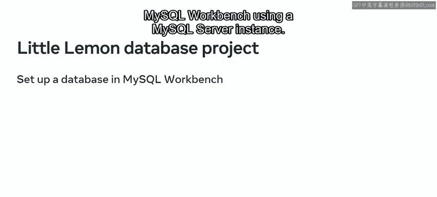

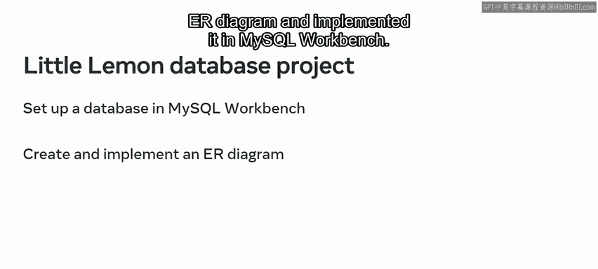

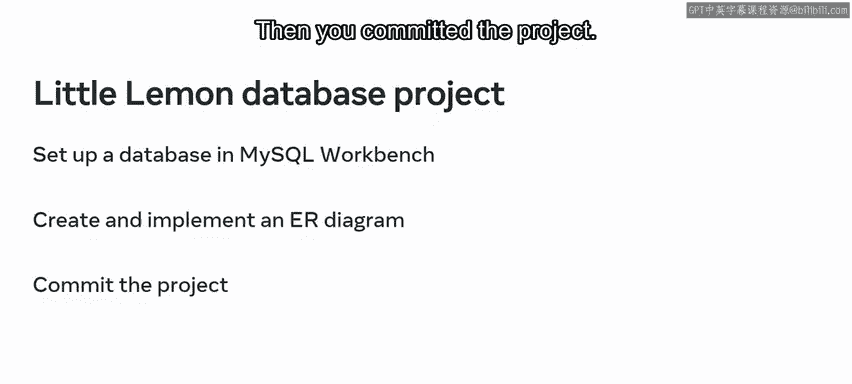

上一节我们介绍了为Little Lemon建立数据库系统的整体目标。本节中，我们来看看完成此项目的三个核心步骤。

为Little Lemon设置数据库项目包含以下三个关键步骤：

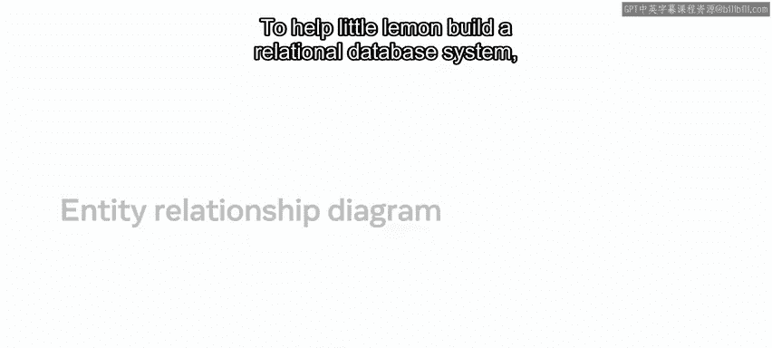

1.  使用MySQL服务器实例在MySQL Workbench中设置数据库。
2.  创建实体关系图并在MySQL Workbench中实现它。
3.  使用Git提交项目。

---

## 数据库设计与规范化 📐

为了帮助Little Lemon构建一个关系型数据库系统，我们设计了一个结构良好、符合三大基本范式的实体关系数据模型。

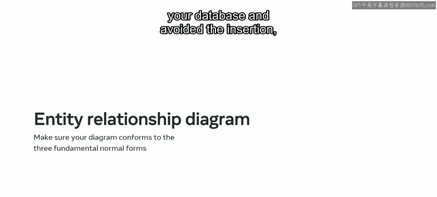

通过遵循这些范式，我们确保了数据库的完整性，并避免了插入、更新和删除异常。有许多专业工具可用于设计ER图，在本模块中，我们使用了MySQL Workbench。

---

## MySQL Workbench工具介绍 💻

MySQL Workbench是一个用于数据库建模和数据管理的统一可视化工具。在我们的项目中，我们利用了该工具的以下几个关键优势。

以下是MySQL Workbench的主要优势：

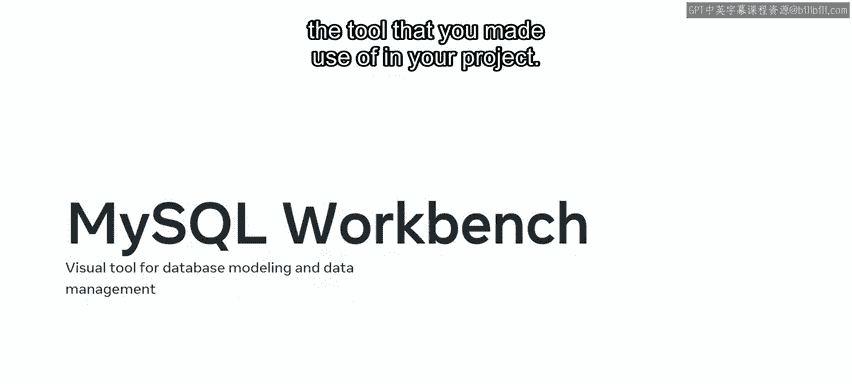

*   **开源**：可以免费使用。
*   **跨平台**：支持多种操作系统。
*   **可视化SQL编辑器**：提供图形化界面编写和管理SQL。
*   **模型转换**：允许将数据模型转换为MySQL服务器中的物理数据库模式。

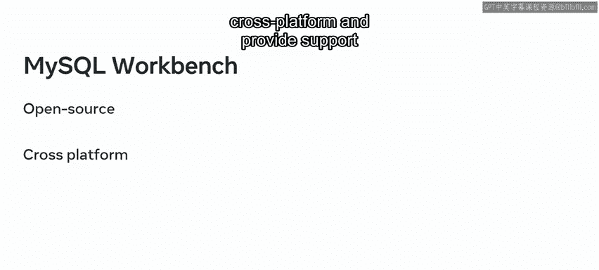

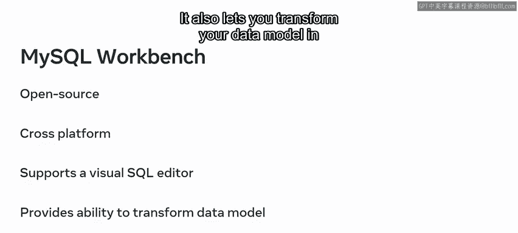

你可以从 `dev.mysql.com/downloads` 下载并安装它。安装时，请确保安装以下组件：

*   MySQL Server
*   MySQL Workbench
*   MySQL Shell

---

## 版本控制与Git 🌳

创建Little Lemon数据库后，我们使用Git提交了项目。Git是一个免费、开源的分布式版本控制系统。

我们用它来管理所有源代码的历史记录、保存提交历史、回退到先前版本，并与其他开发者共享代码以进行协作。你可以从 `git-scm.com/downloads` 下载并安装Git。

你可以将Git仓库存储在GitHub上。GitHub除了包含Git的源代码管理功能外，还提供了其他有用特性。

以下是GitHub提供的一些关键功能：

*   项目管理
*   支持工单管理
*   错误跟踪
*   共享、访问和存储仓库（包括备份）

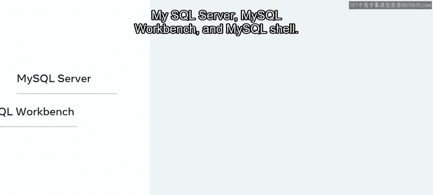

---

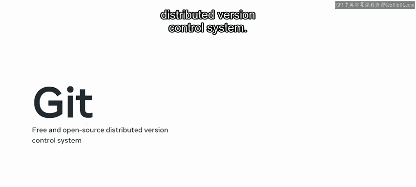

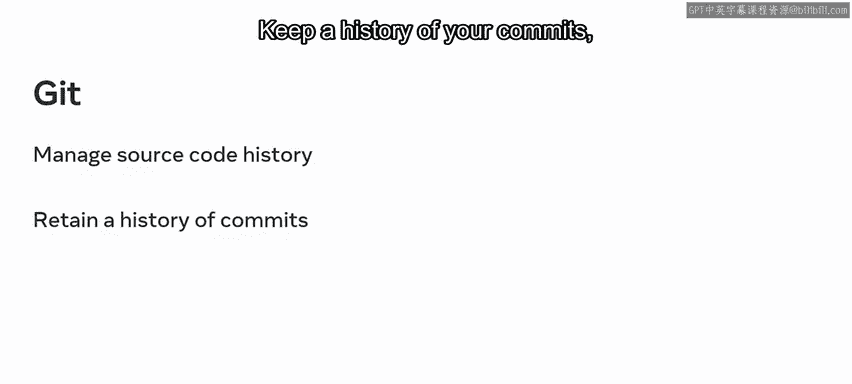

## 总结与下一步 🚀

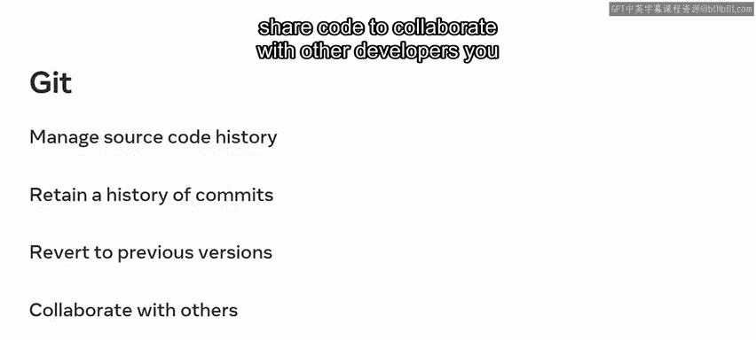

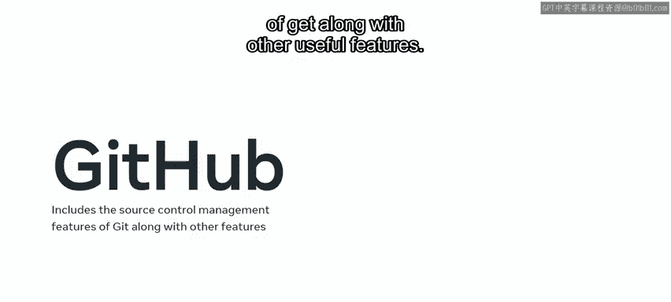

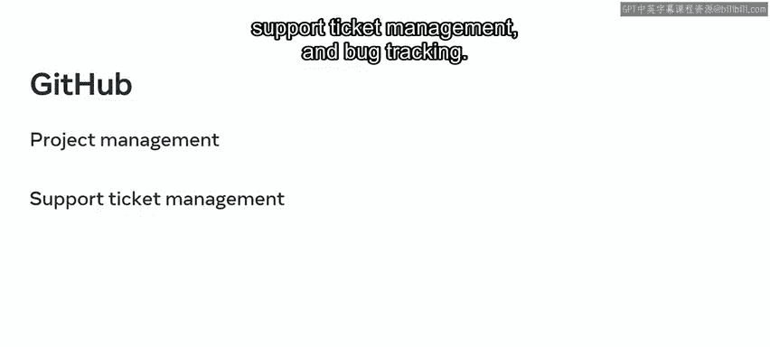

本节课中，我们一起学习了为Little Lemon建立数据库项目的完整流程：从使用MySQL Workbench进行数据库设计和实现，到利用Git进行版本控制。

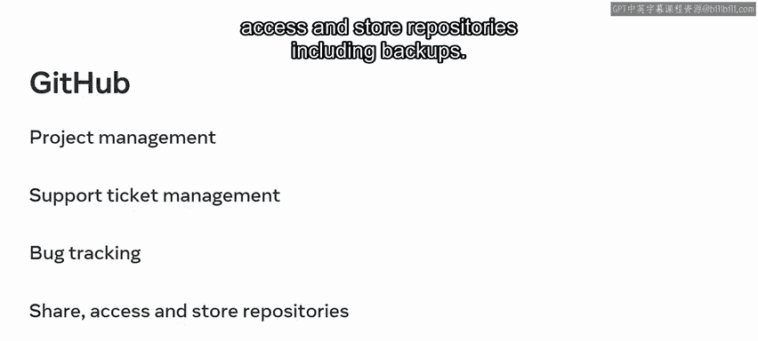

现在你已经完成了本模块的总结，下一阶段是完成模块测验并复习附加资源。完成这些任务后，你就可以进入下一个模块了。