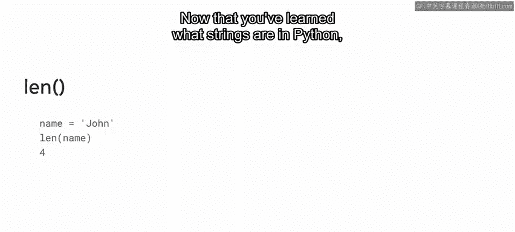
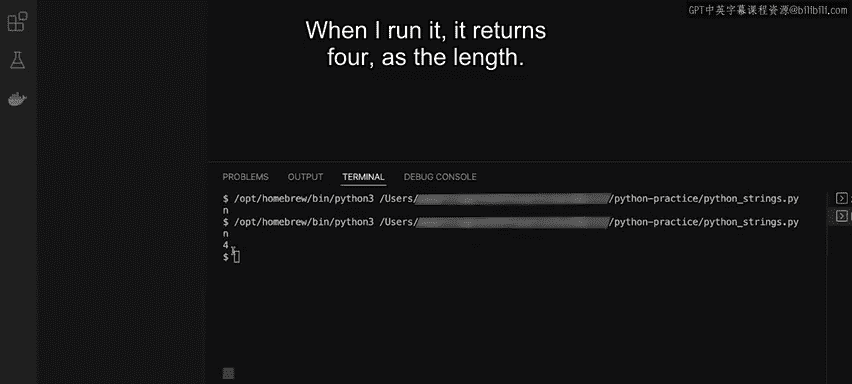

# Meta《数据库工程师（Python／数据库客户端／高阶数据建模／毕业项目／面试）｜Meta Database Engineer》中英字幕 - P11：10_字符串.zh_en - GPT中英字幕课程资源 - BV1pZ421a749

You may recall that Python can work with several types of data in this video you will learn how to declare a new strings in Python it will also gain a general understanding of sequences and how to access individual items in a sequence。

In Python， a string is a sequence of characters enclosed in either single or double quotes。

As you may know， computers only understand binary code， which consists of ones and zeros。

This means that characters need to be converted to a form that computers can interpret a process known as encoding。

Python uses a type of encode called UniIcode to communicate with computers。

Strings in Python can be declared in several ways， for example。

 for a single line you can type the variable name followed by an equal sign and then the character encased in quotes。

If your string is too long for one line， you can add a backslash at the end of each line to create a multiline declaration。

When you run print on your variable， all those strings will be combined and appear on one line。

If needed， you can reassign the value of a string。Say for example。

 the variable name has a string value of John， but you want to change the value to Paul。

This can be done simply by typing name equals Paul。Now， when you run print on name。

 this updates should be reflected。It's important to know that a string is just a sequence of characters。

 which in turn means it is essentially an array。Each character in the sequence can be accessed based on its index。

For example， Python strings use zero indexing so you can access the first character with the number zero in square brackets or the number two to access the third one。

If you need to check the length of a string， Python has functionality to assist you。

You can apply the L function to a variable with a string value。

This will then return a number that represents how many characters are in the string。

Now that you have learned what strings are in Python。

 let's explore some code examples of strings in action First。

 let me demonstrate the two ways to declare a string。

The first method is by placing the characters inside of single quotes。

So I type a equals and then hello in the quotes。On the next line。

 when I type print followed by A in parentheses and then click the run button。

 my code returns to the string hello as the output。The second method is similar。

 but uses double quotes。😡，So I would enter it as B equals hello with double quotes。

When I run the print function again， it also returns to the string hello。

Both quotation types are equally valid declaration methods。

 The choice is a matter of personal preference， but it's best to pick one option and use it consistently throughout your code in addition to the quotation types。

 you can declare single line or multi lined strings an example of a single line string can be。

A equals this is a single line。I asked to print out the value of a when I run it。

 the value was printed out as I declared it。However。

 there may be cases in which a string is very long and you want to break it up into segments to make it more readable to do that I can use the backslash key to create a multilying string。

😊，To declare a multi line string， I type B equals followed by the string。

 this is a multi Before continuing， I add a backslash at the end of this line。On the next line。

 I typed the continuation of my string， line string example。

 note that I enter a space before the word line so that it's separated from the last word of the string on the previous line。

 and now when I run print on B， the backslash has the effect of joining both segments so that the outputs appears as a single string。

Another thing you can do with strings is concatenation。

 which is the joining of separate strings to demonstrate this， I first create two new variables。

 A equals hello with a space at the end and B equals there。

When I run print this time within the parentheses， I type A+ B and get back both strings joined together the plus symbol is usually used as an arithmetic operator。

 but when applied on strings it combines them instead。

And one more thing to know about strings is that they are considered collections of characters。

What this means is that much like an array， you can access individual characters based on an index and you can also check the length of a string using the LEN or lens function to give an example I create to name variable with the string value John。

Now I want to print only the first character of this string to do so， I run print on name。

 followed by the character index number inside square brackets。Strings in Python are zero indexed。

 meaning that the sequence count begins from zero， so zero is the number that I place in the brackets。

When I click on run， I get back the letter J。If I change the number to three and run it again。

 I get back the letter n， the fourth character in the string John Next let's check how many characters are in this string by using the L function。

I start a print function and in it I type L followed by name inside of parentheses When I run it。

 it returns four as the length。

In this video you've learned about strings in Python。

 specifically you now know how to declare and use them and understand that they are sequences of characters see you in the next video。

😊。