# 数据库工程师：P122：6_数据分析和可视化 📊

在本节课中，我们将学习如何使用 Tableau 这一强大的数据可视化工具进行高级数据分析，以生成能够指导商业决策的数据洞察。我们将回顾 Tableau 的关键功能、数据处理步骤以及如何创建交互式仪表板。

---

Little Lemon 需要进行高级数据分析，以生成能够帮助指导其商业决策的数据洞察。

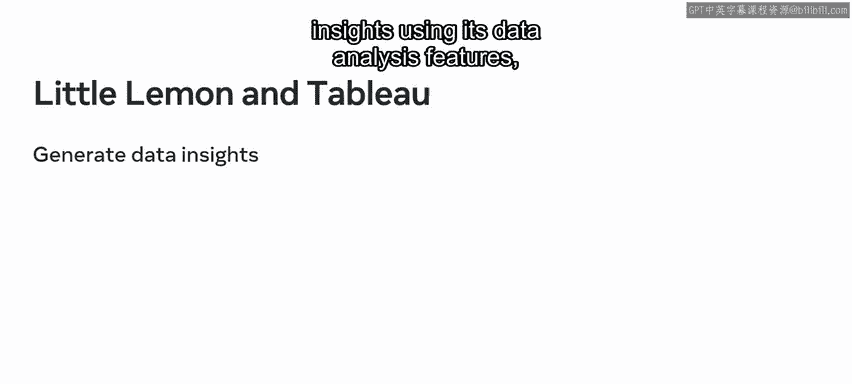

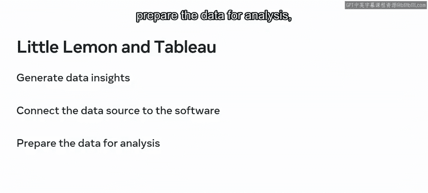

他们可以利用这些数据洞察来指导商业决策，例如识别新的增长机会或改进服务。

这项任务需要使用强大的数据分析工具，例如 Tableau。借助 Tableau，Little Lemon 可以利用其数据分析功能生成洞察。

他们还需要将数据源连接到软件，为分析准备数据，并使用工作表与交互式仪表板来呈现洞察。

在本视频中，你将回顾该工具的关键流程步骤和功能，并了解如何利用 Tableau 来帮助 Little Lemon 生成商业洞察。

Tableau 是一个广泛使用的数据可视化工具。它提供了几个关键功能，用户可以在分析数据时加以利用。

例如，使用 Tableau，你可以连接到多种数据源，处理大量不同类型的数据，并创建可视化的数据图表。

你还可以生成交互式实时仪表板，编写 Python 和 R 脚本，并使用交互式 UI 工具完成任务。

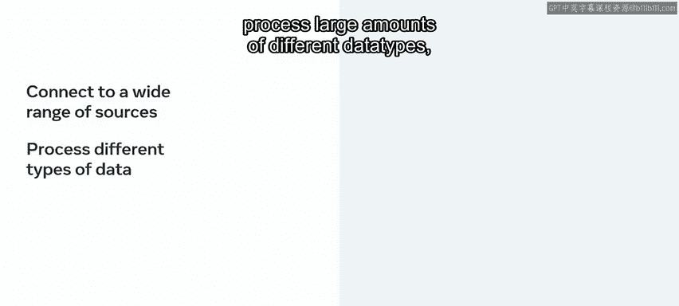

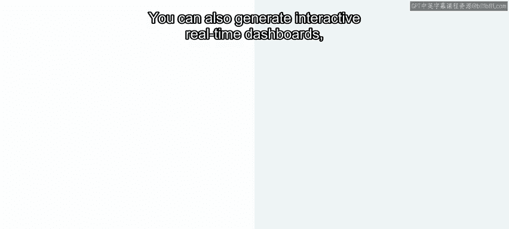

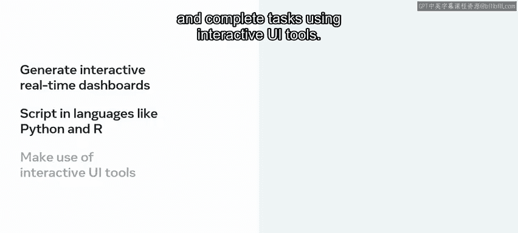

仪表板界面为数据分析提供了许多有用的功能。

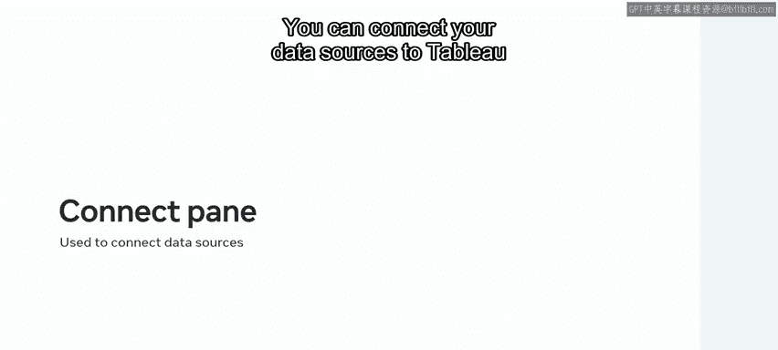

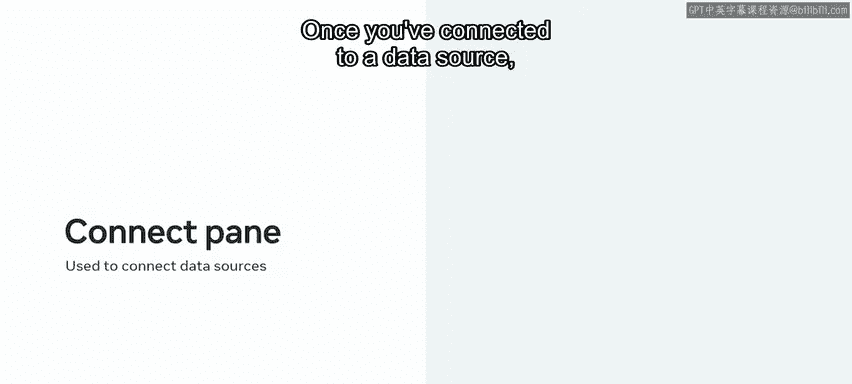

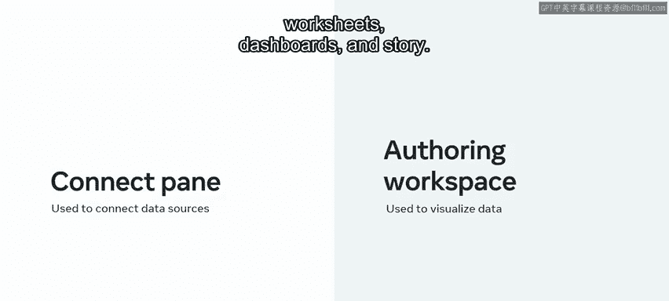

你可以使用启动页面中的“连接”窗格将数据源连接到 Tableau。

连接到数据源后，相关字段会出现在“数据”窗格中。

然后，你可以使用创作工作区的 UI 元素，通过工作表创建数据的可视化。

你也可以使用工作表，通过“标记”卡将数据添加到视图中，或者使用行和列功能区来分析和可视化数据。

你可以利用 Tableau 的其他有用功能，例如在工具栏菜单中访问命令和工具，在仪表板视图中处理多个数据源，使用排序图标按升序或降序排列数据，以及使用“故事”来呈现工作表和仪表板。

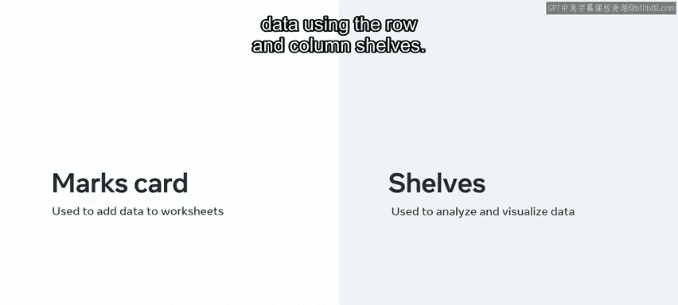

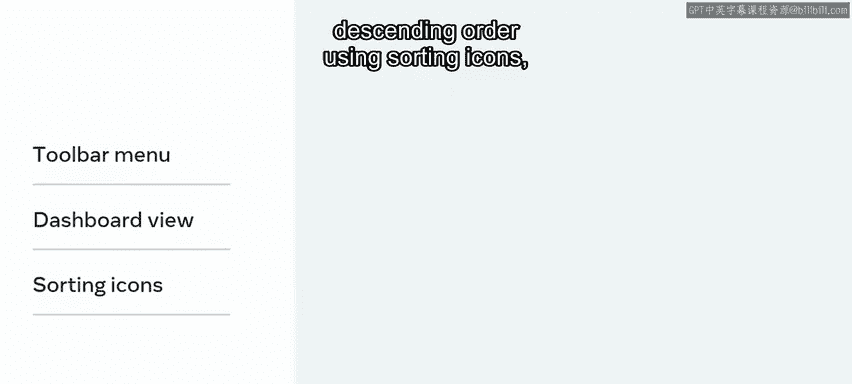

将数据加载到 Tableau 后，你需要为分析准备数据。

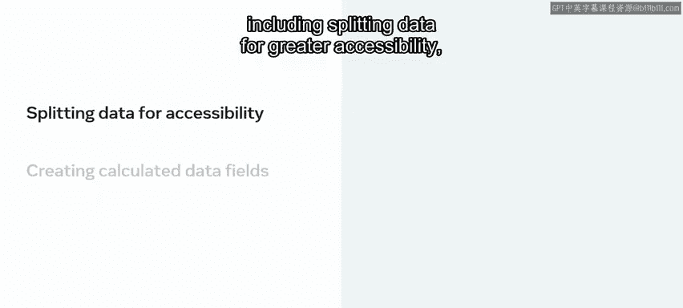

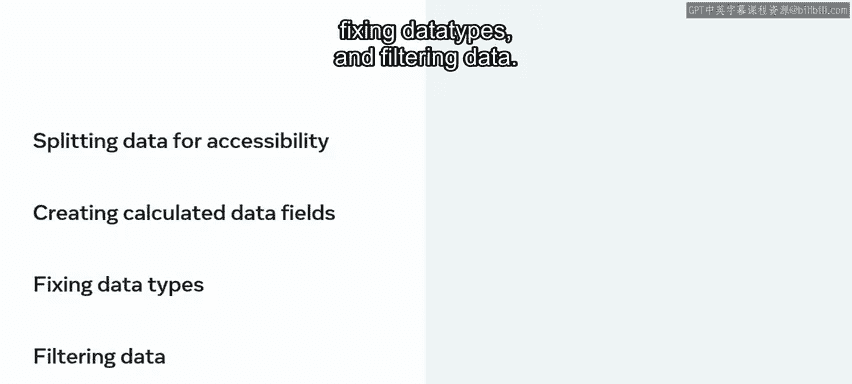

这个过程涉及几个步骤，包括拆分数据以提高可访问性、创建计算数据字段、修复数据类型以及筛选数据。

通过使用软件的筛选和可视化功能，你可以专注于相关数据。通过筛选数据，你可以只关注所需的数据。

你还可以向下钻取、向上汇总和筛选数据，以从不同角度或不同详细程度展示数据。

Tableau 也可以用于通过工作表或源数据页面筛选数据。然而，直接在数据源页面筛选数据会将所有工作表的数据分析限制在筛选后的标准内。

Tableau 的一个关键功能是能够以仪表板的形式生成交互式实时数据可视化。

一个组织良好的仪表板可以帮助清晰展示数据，并为 Little Lemon 的重要商业问题提供相关答案。

在 Tableau 的工作表中分析数据后，你可以合并来自多个来源的数据，添加筛选器，或向下钻取/向上汇总到特定信息。

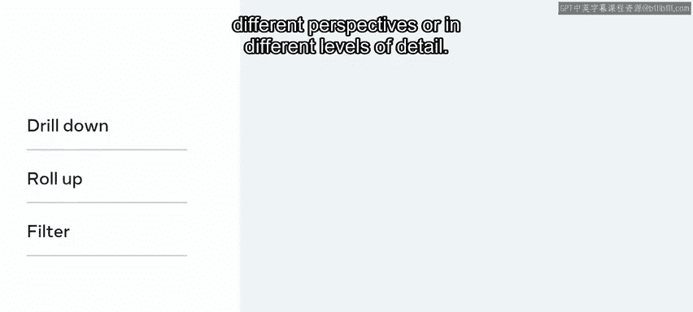

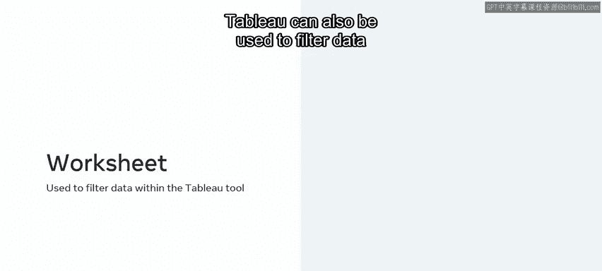

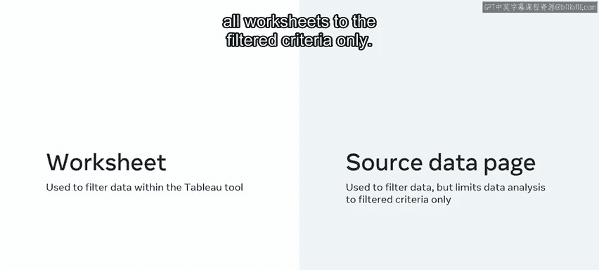

你现在已经回顾了 Tableau 工具的关键功能。你现在应该知道如何利用这个工具创建工作表和交互式仪表板，以帮助 Little Lemon 从其数据中生成商业洞察。

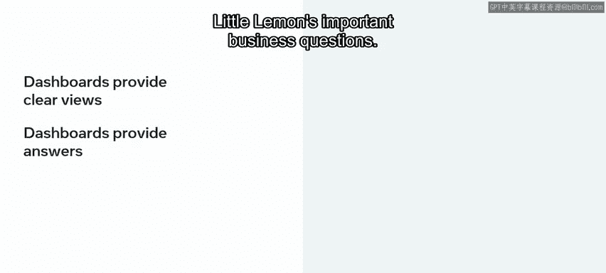

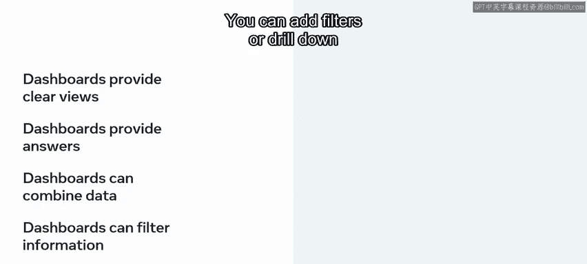

如果你需要关于这些主题的更多信息，请记住你可以回顾之前课程的学习材料。

---

本节课中，我们一起学习了 Tableau 数据分析与可视化的核心流程。我们了解了如何连接数据源、准备数据、利用工作表进行可视化分析，以及最终构建交互式仪表板来呈现商业洞察。掌握这些步骤，你将能够有效地利用数据驱动决策。