# Meta《数据库工程师（Python／数据库客户端／高阶数据建模／毕业项目／面试）｜Meta Database Engineer》中英字幕 - P123：7_创建数据库客户端.zh_en - GPT中英字幕课程资源 - BV1pZ421a749

Little Lemon need to create a database client so that they can interact with their database using a Python based application。

 You can help them by completing the following tasks。

Review the version of Python installed on your machine。

 Inst a suitable integrated development environment or Ie for Python and connect Python to the little Le Mysql database。

 Let's take a few minutes to review these tasks。 As you just saw the first task is to identify which version of Python is running on your machine。

 Open the command prompt and type Python dash dash version to check which version of Python is running on your operating machine。

 If Python is correctly installed， Then Python 3 should appear on your console screen。

 This means that your running Python version 3。 There should also be several numbers after3 to indicate which iteration of Python 3 you're running。

 Make sure that these numbers match the most recent version on the Python dot org website。

 If you search for Python and see a message that says Python is not recognized as an internal or external command。

 then review your Python installation or the relevant documentation on the Python website。😊。

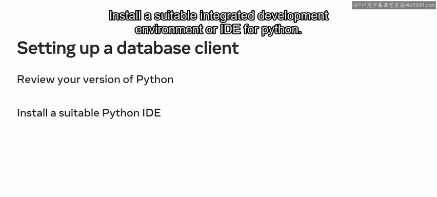

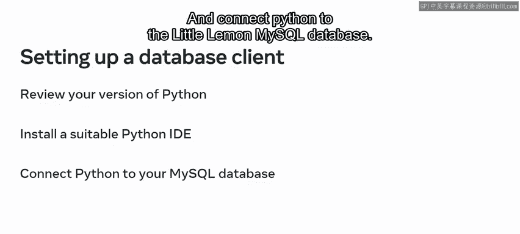

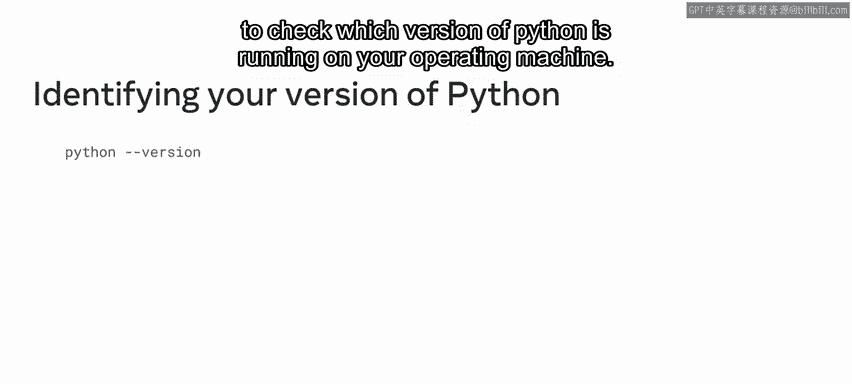

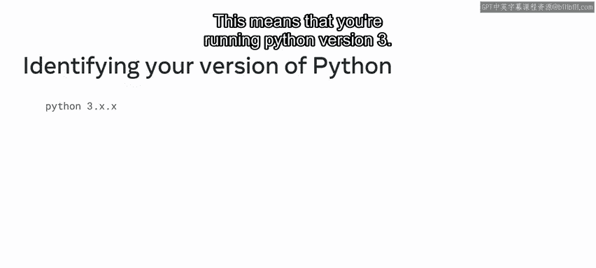

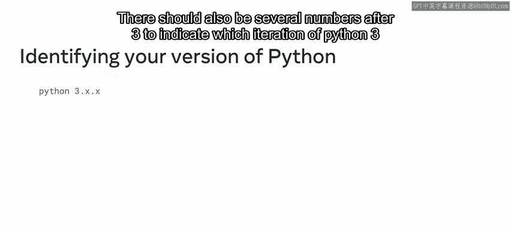

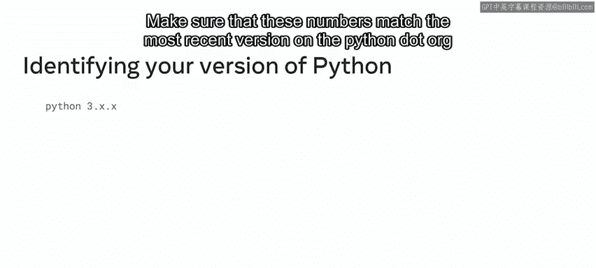

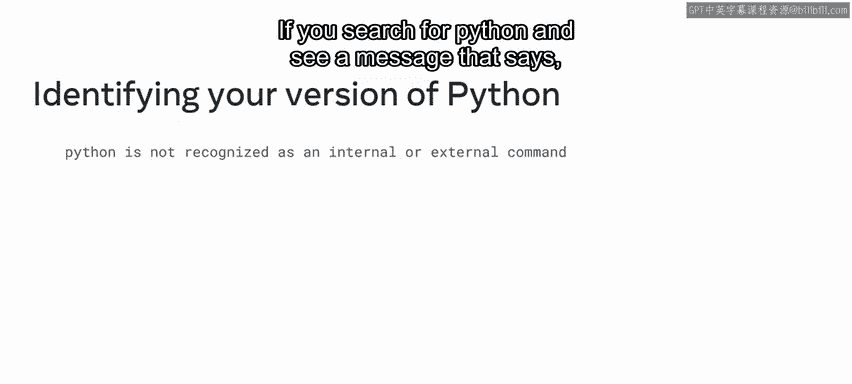

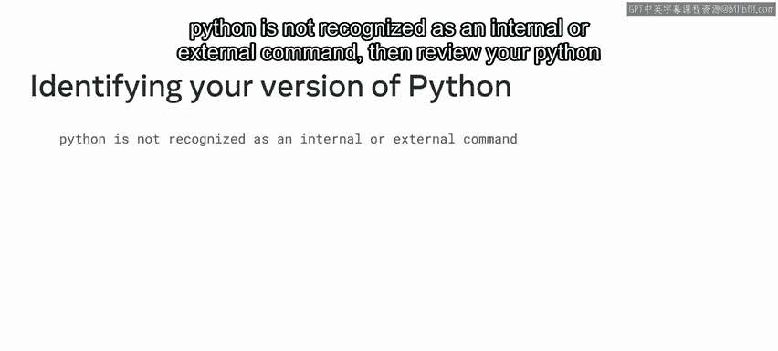

Once you've installed Python or confirm that you're running the correct version。

 you then need to choose an Ide to run your code on an Ide software that you can use to display your code。

 In this course， you'll use the Jupyter Ide to demonstrate Python。

 to install Jupiter type Python dash M Pip installedt Jupiter within your Python environment。

 Then follow the Jupiter installation process。 Once you've installed Jupiter type Jupiter notebook to open a new instance of the Jupyter notebook to use within your default browser。

 The next task is to connect Python to your Mysql database。

 You can create the installation using a purpose built Python library called Mysql connector。

 This library is an API that provides useful features for working with Mysql。

 The Mysql connector must be installed separately using a package install or called Pip。

 The Pip package is included with the Python software that you installed。

 create a new notebook instance and name it configuring Mysql connector。😊。

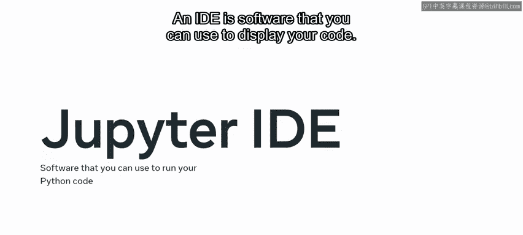

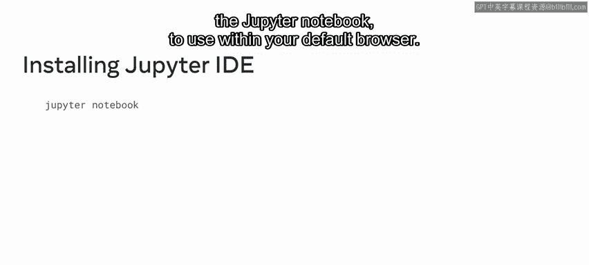

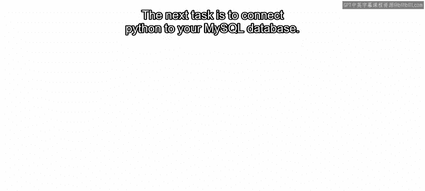

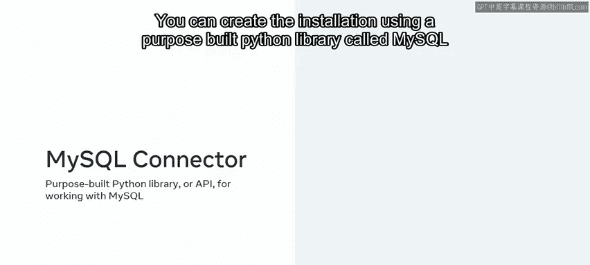

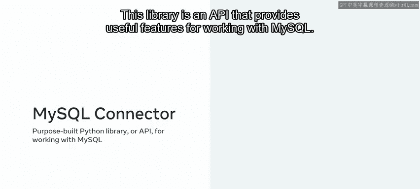

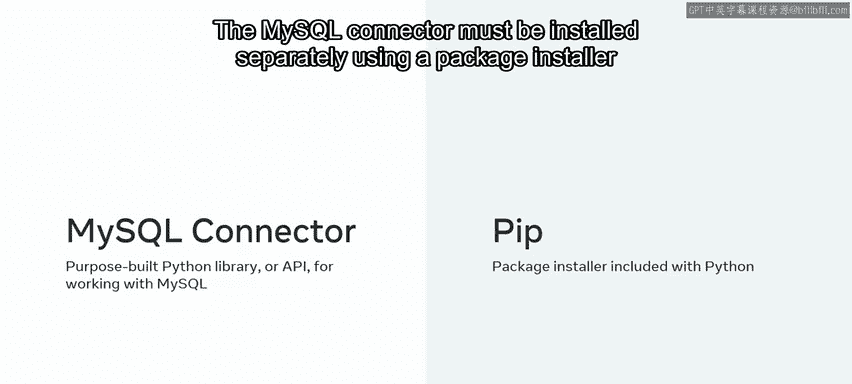

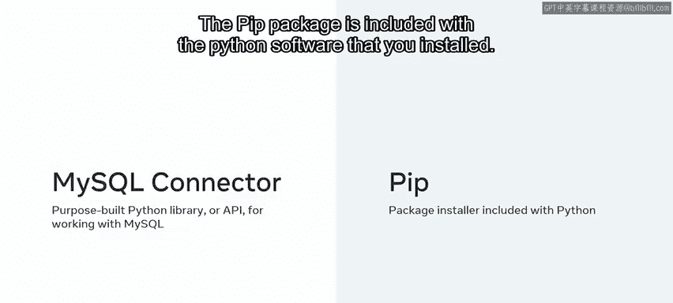

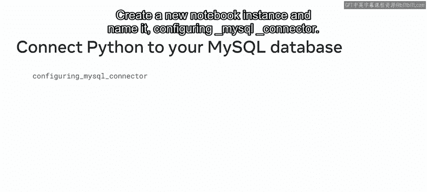

Then install the connector using Pip to install the connector。

 type an exclamation mark and Pip to call the package。 Then type the install command。 Next。

 type the name of the library， which is My SQL dash connector dash Python。

 Make sure you type Python with a lowercase P。 Then press shift and enter or select run to execute the code。

😊。

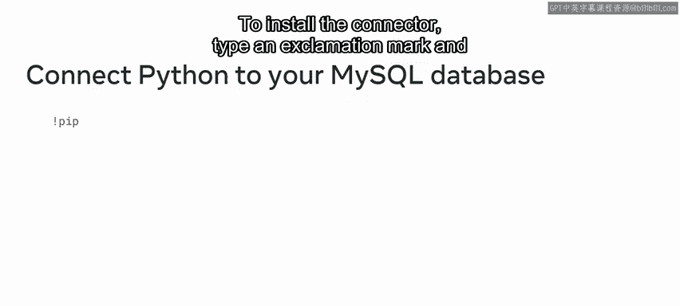

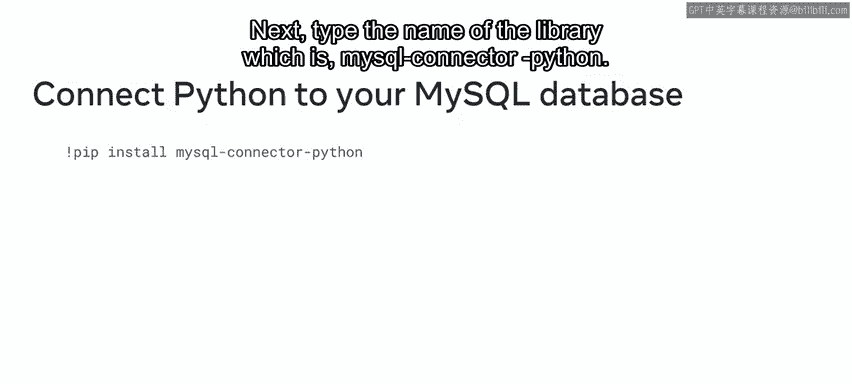

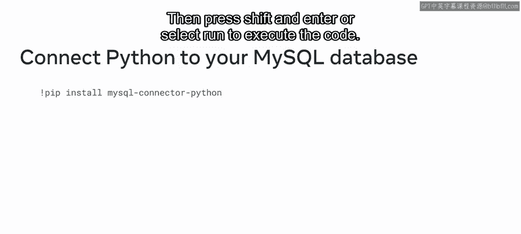

The final step is to check that your environment has been correctly configured。

 type import My SQL dot connector as connector and click run。 If there's no output in the cell。

 then the library has been imported successfully。 You should now know how to install and configure your environment to help create and connect a database client to little Les database。

 If there's any parts of this lesson that you need more guidance on。

 then you can review the specific learning material in previous courses。 Great work。😊。

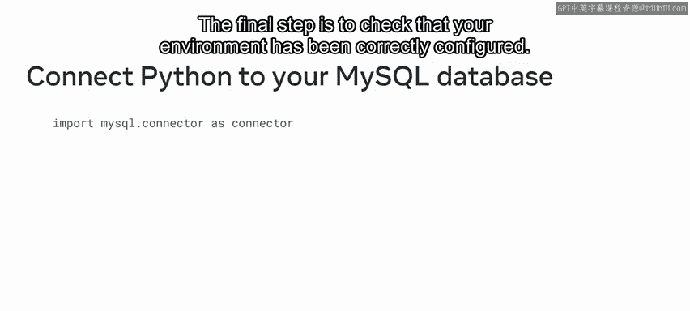

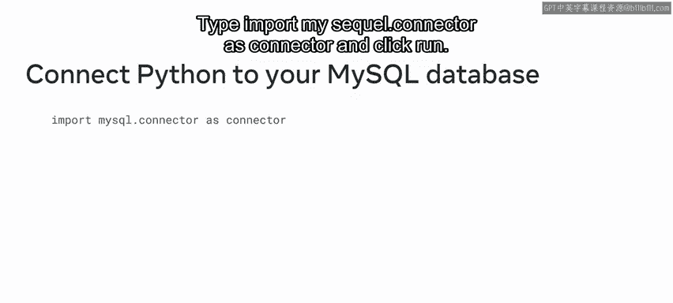

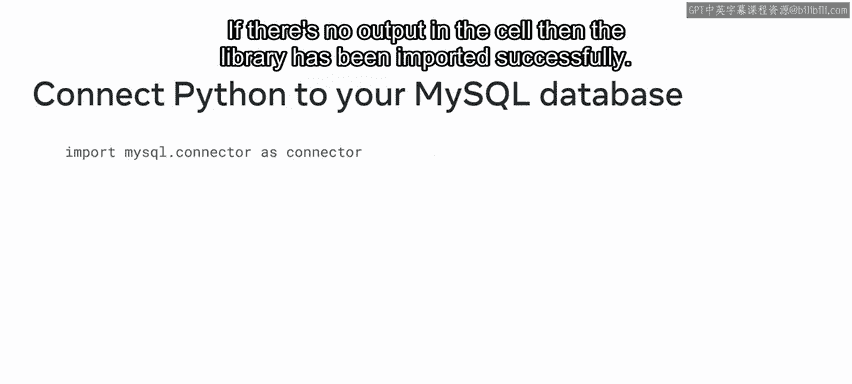