# 数据库工程师：P125：项目总结与课程回顾 📚

在本节课中，我们将回顾整个数据库工程项目中完成的主要任务、使用的工具和关键技术。通过总结，你将清晰地看到从数据库设计到应用开发的完整流程。

---

## 概述

恭喜你，你已接近这门顶点课程的尾声，也即将完成数据库工程师的学习旅程。在这个最终模块中，你需要通过同行评审练习和分级评估来展示你的知识。但在开始之前，让我们先回顾一下你在本课程中帮助小柠檬餐厅完成的任务。

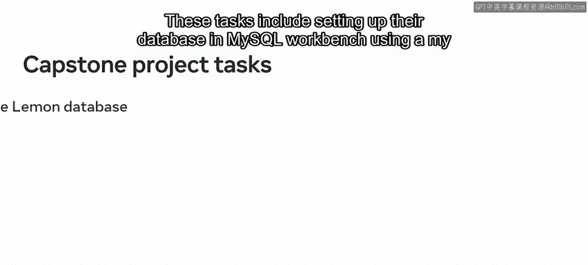

---

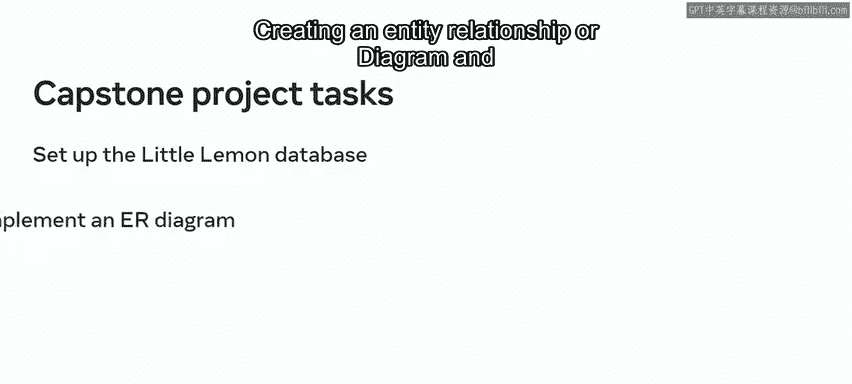

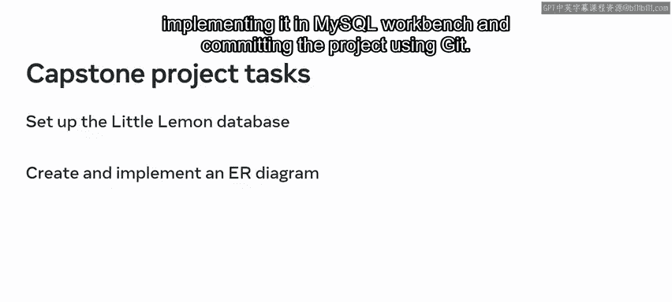

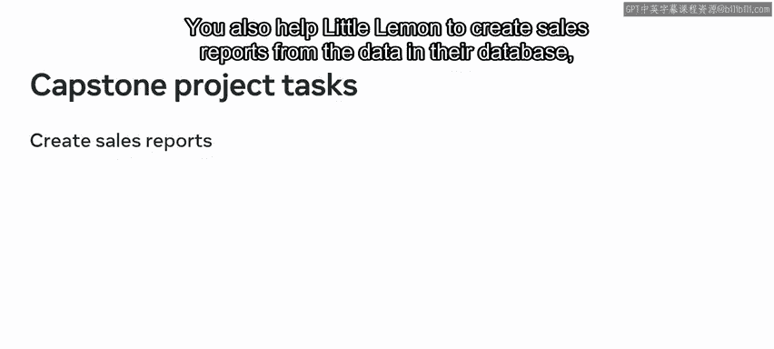

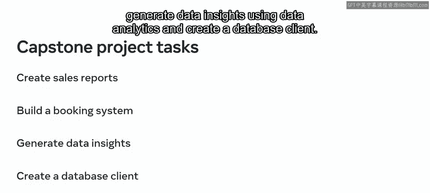

## 任务回顾

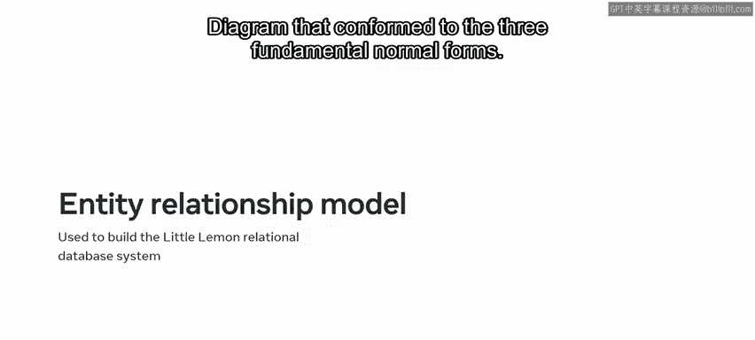

以下是你在本课程中协助小柠檬餐厅完成的一系列核心任务。

### 数据库设计与构建

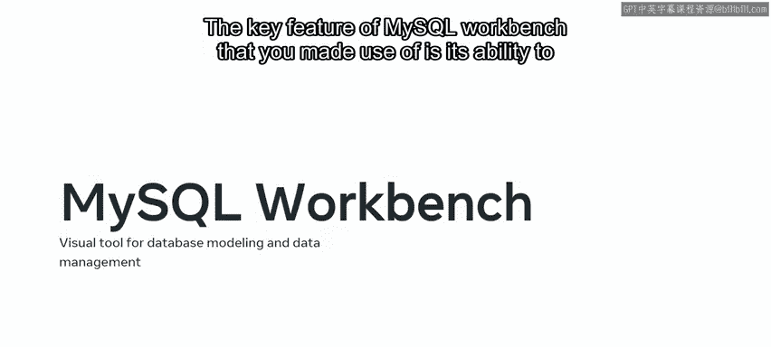

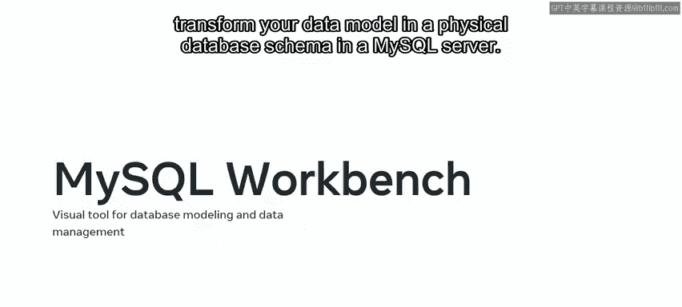

在第一个任务集中，你帮助小柠檬餐厅构建了一个关系型数据库系统。具体步骤如下：

1.  **设计实体关系图**：你设计了一个结构良好、符合三大基本范式（1NF, 2NF, 3NF）的实体模型或ER图。
2.  **使用MySQL Workbench**：你使用MySQL Workbench这一统一的数据库建模与管理可视化工具来设计ER图。其关键特性在于能够将数据模型转换为MySQL服务器中的物理数据库模式。
3.  **创建数据库**：一旦在MySQL Workbench中创建了小柠檬数据库，你便使用版本控制系统Git提交了你的项目，并利用GitHub来存储你的Git仓库。

### 创建销售报告

你的下一个任务涉及从小柠檬数据库的数据中创建销售报告。你使用了以下数据库技术来生成这些报告：

*   **视图**：你使用了虚拟表来利用其他表中存在的数据，并简化数据访问和查询。
*   **连接子句**：你使用了不同类型的JOIN子句，基于共同的列来关联一个或多个表之间的数据记录。
*   **存储过程**：你帮助小柠檬餐厅使用存储过程来创建可重用的代码，他们可以根据需要调用和执行。
*   **预处理语句**：你还依赖了预处理语句，这些语句只需编译一次，然后可以重复使用。

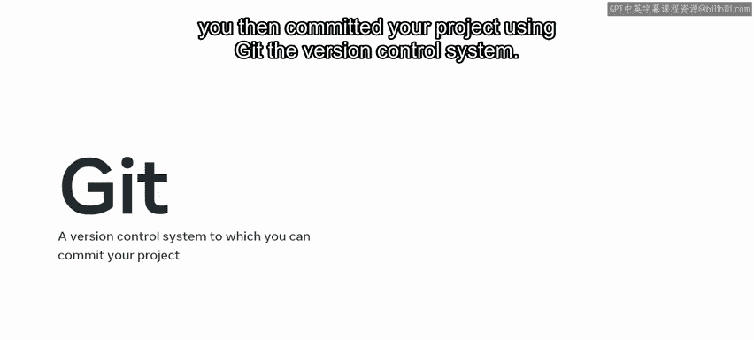

### 构建餐桌预订系统

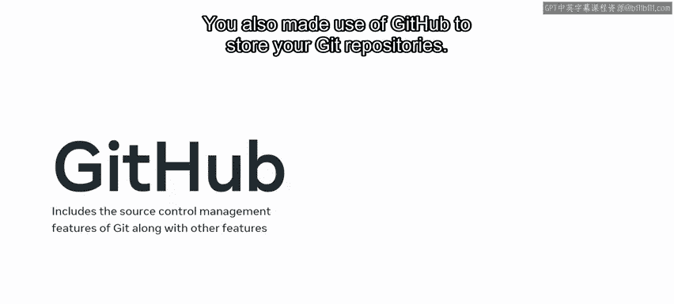

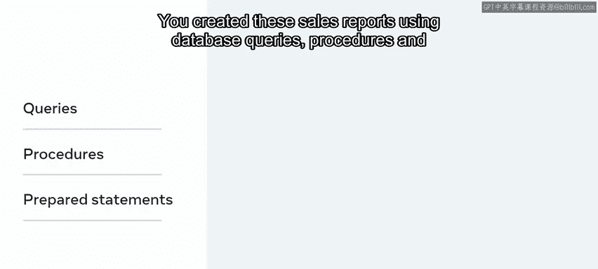

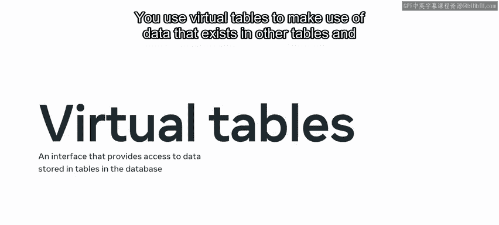

你协助小柠檬餐厅的另一个任务是构建一个餐桌预订系统，用于跟踪来访餐厅的客人。此任务主要包括使用SQL查询和事务。

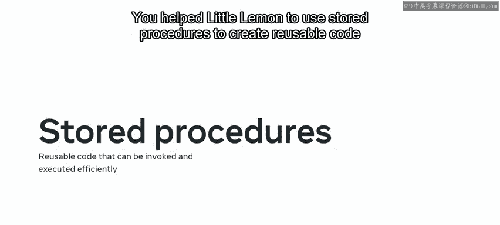

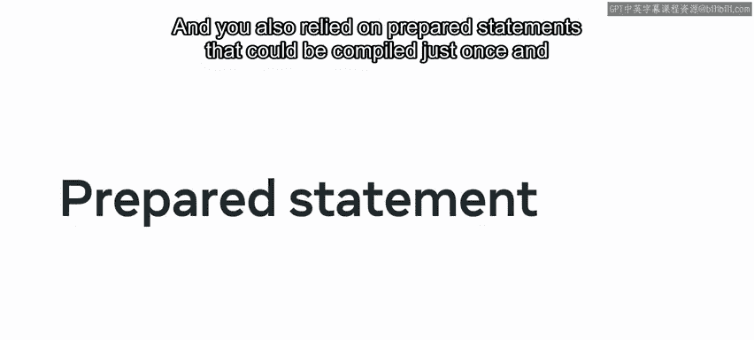

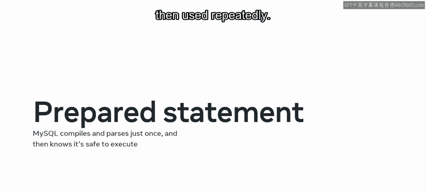

以下是使用的一些SQL查询和事务示例：

*   **插入数据**：使用 `INSERT INTO` 语句。
*   **更新数据**：使用 `UPDATE` 语句更改数据库中的数据。
*   **删除数据**：使用 `DELETE` 语句删除或移除数据。
*   **读取数据**：使用 `SELECT` 语句等读取查询来读取数据。
*   **触发器**：你还使用了触发器，将一组操作以存储程序的形式保存，当特定事件发生时可以自动调用。

在确认代码正确后，你将进度提交到Git以进行版本控制。

### 生成商业洞察

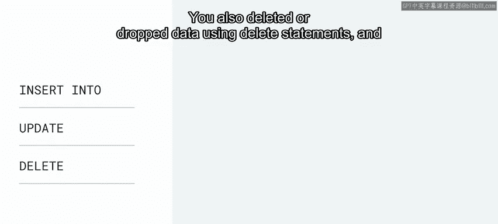

在接下来的任务中，你帮助小柠檬餐厅利用其数据生成商业洞察。你使用数据可视化工具Tableau来完成此任务。

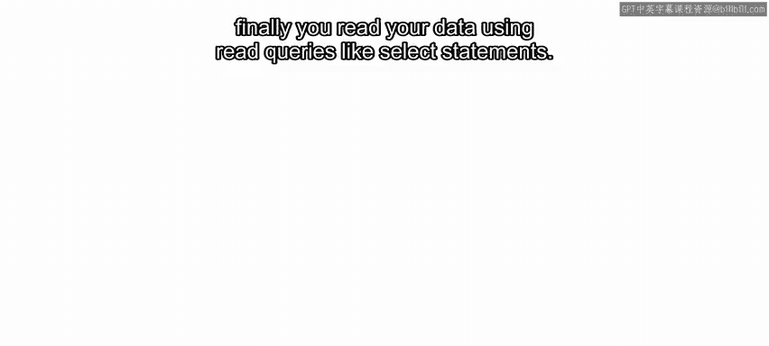

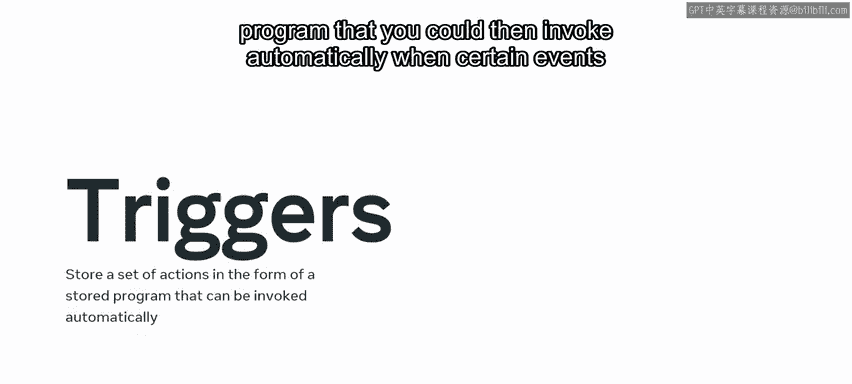

以下是完成此任务所遵循的步骤：

1.  **连接数据源**：首先将数据源连接到Tableau。
2.  **准备数据**：然后为分析准备数据，并专注于最相关的数据。
3.  **创建可视化**：下一步是使用其UI元素创建数据的可视化。
4.  **构建仪表板**：最后，使用Tableau以仪表板的形式生成交互式、实时的数据可视化。

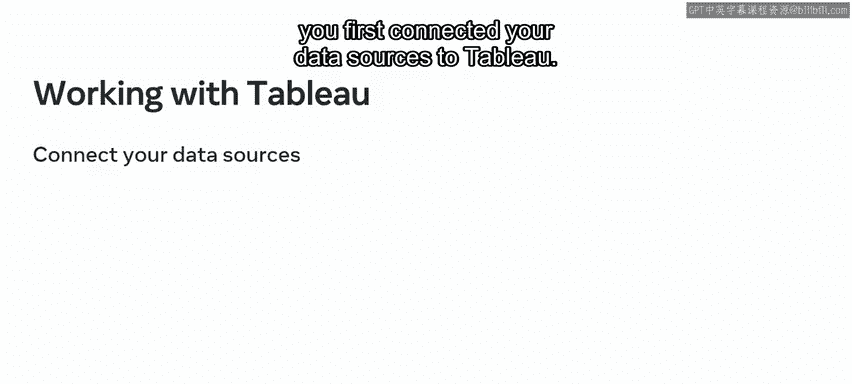

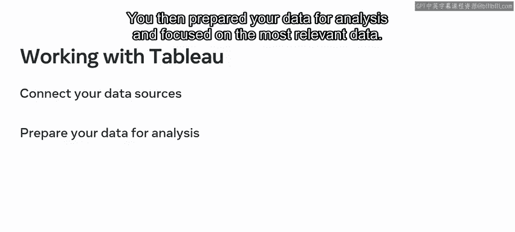

这些步骤有助于为小柠檬餐厅的重要商业问题提供清晰且相关的答案。

### 创建数据库客户端

你的最终任务是帮助小柠檬餐厅创建一个数据库客户端，以便他们可以使用基于Python的应用程序与数据库交互。

以下是具体步骤：

1.  **确认Python环境**：首先，确认你机器上运行的Python版本。在确认运行的是最新迭代版本后，安装Jupyter IDE来运行代码。
2.  **连接数据库**：然后，打开一个新的Jupyter Notebook实例，并使用它来连接Python和小柠檬MySQL数据库。你使用Python库 `mysql-connector` 和 `pandas` 软件包建立了此连接。
3.  **开发客户端**：设置好Python环境后，你便开始处理数据库客户端。

---

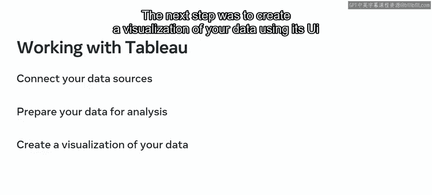

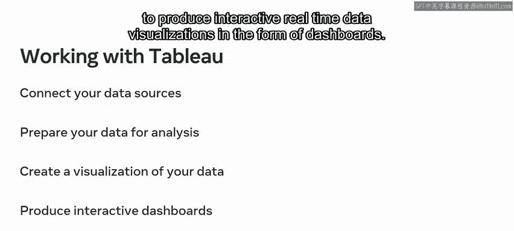

## 总结

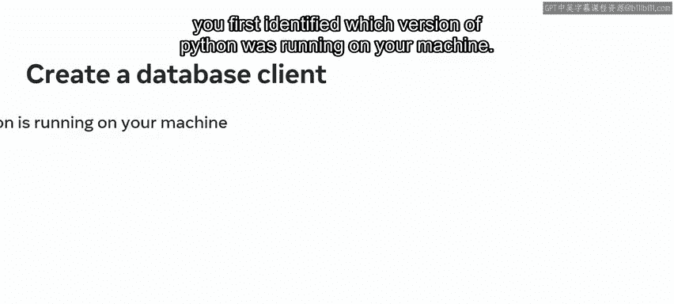

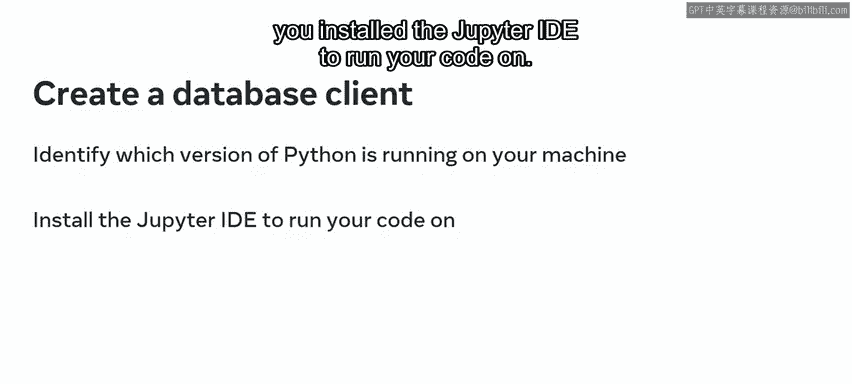

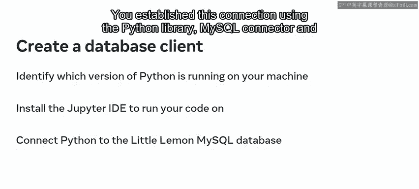

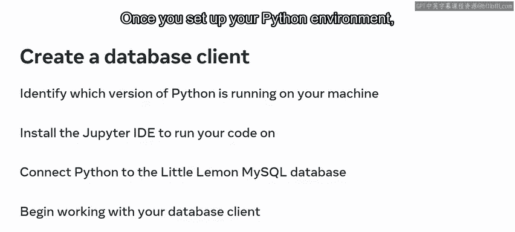

本节课中，我们一起回顾了在整个数据库工程项目中完成的核心任务，包括：
*   使用MySQL Workbench设计和实现符合范式的数据库。
*   运用SQL高级查询、存储过程和触发器来生成报告和构建业务系统。
*   利用Tableau进行数据可视化分析，生成商业洞察。
*   通过Python和 `mysql-connector` 创建数据库客户端应用程序。
*   全程使用Git进行版本控制。

现在，你已经回顾了所有任务，是时候开始同行评审项目了。请放心，你已经努力走到了这一步，相信你会在项目中发挥出最佳水平。祝你好运！