# 数据库工程师：P126：项目完成与回顾 🎉

在本节课中，我们将对您完成的毕业项目进行总结与回顾，并展望未来的学习与发展路径。

恭喜您完成了这门毕业项目课程。您付出了巨大的努力，并在此过程中掌握了许多新技能。您在MySQL的学习之旅中取得了巨大进步。这门课程以及您所取得的成就，实际上是您在本数据库工程师项目中完成的所有先前课程的结晶。

## 已掌握的核心技能回顾

上一节我们介绍了项目完成的里程碑，本节中我们来看看您在整个项目中巩固了哪些核心技能。

以下是您通过本专项课程所建立的知识体系：

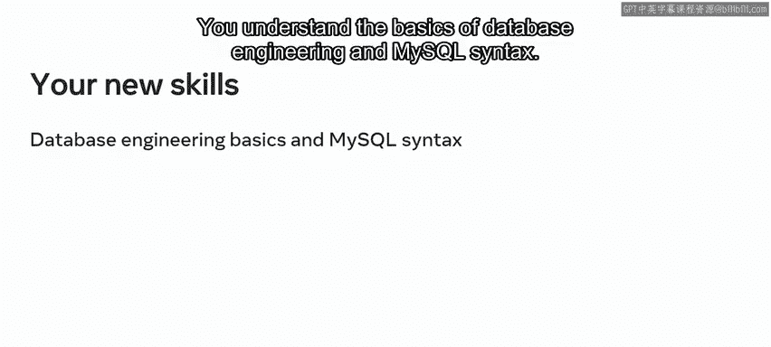

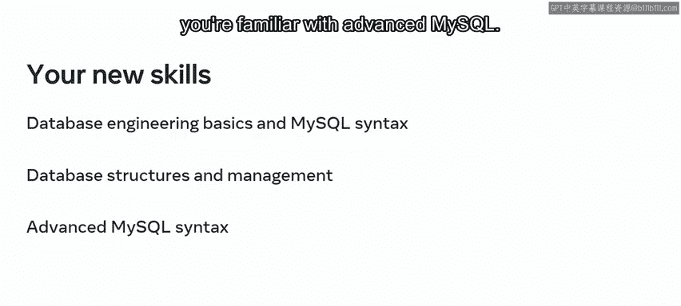

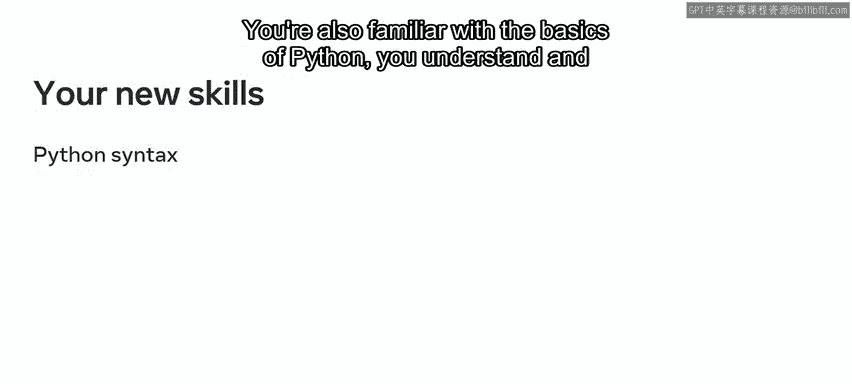

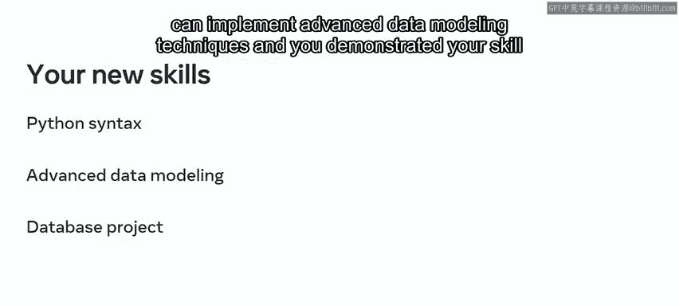

*   **数据库工程与MySQL基础**：您理解了数据库工程的基本原理和MySQL语法。
*   **数据库结构与管理的坚实基础**：您对数据库结构和管理有了扎实的理解。
*   **高级MySQL**：您熟悉了高级MySQL功能。
*   **Python基础**：您掌握了Python编程的基础知识。
*   **高级数据建模技术**：您理解并能实现高级数据建模技术。

在本毕业项目中，您通过为“小柠檬”设计一个完整的数据库系统，强化并展示了您在整个项目中学到的知识和实践开发技能集。

## 项目评估与个人反思

项目中的分级评估进一步检验了您在数据库工程方面的知识。既然您已经完成了最终项目，现在是一个停下来反思整个旅程的好时机。

您可以从多个角度来反思已完成的课程：

*   思考本课程与您已完成的其他课程之间的联系。
*   反思完成项目的过程本身。例如，项目中哪些部分最具挑战性？哪些部分相对容易？
*   从项目工作中获得了哪些经验？
*   重新回顾之前的课程是否会带来新的收获？

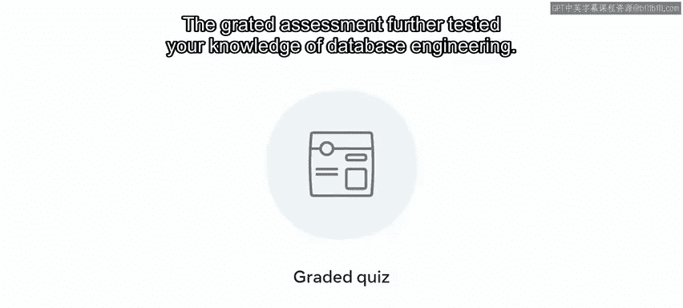

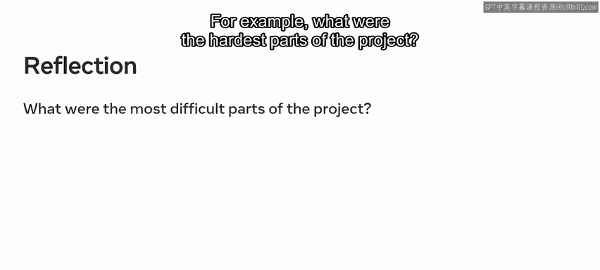

无论您是刚起步的技术专业人士、学生还是业务用户，这个毕业项目都证明了您对数据库系统价值和能力的理解。该项目不仅巩固了您在实际应用中的技能，还带来了另一个重要的好处：它意味着您拥有了一个可以放入作品集的、功能完整的数据库。

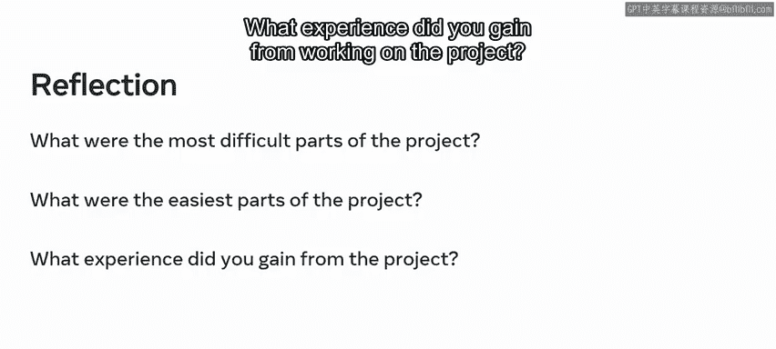

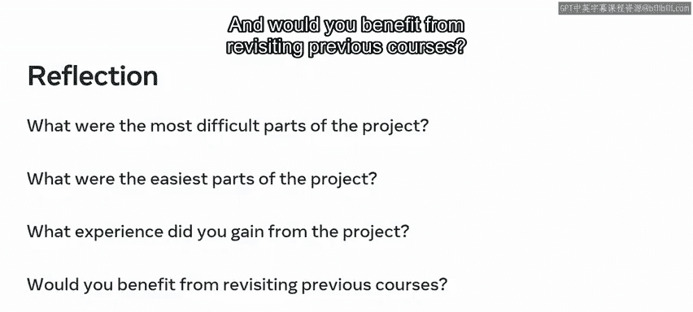

## 作品集价值与职业发展

这个作品集项目可以向潜在雇主展示您的技能。它不仅向雇主表明您具有自我驱动力和创新精神，也充分展现了您作为个人以及您新获得的知识。

您已经完成了本专项的所有课程，并获得了数据库工程师证书。根据您的目标，您可以选择深入学习高级的角色专项证书，或学习其他基础课程。

认证提供了全球认可且行业背书的、掌握技术技能的证明。您做得非常出色，应该为自己的进步感到自豪。您所获得的经验向潜在雇主表明，您积极主动、能力出众，并且不畏惧学习新事物。

## 总结与祝福

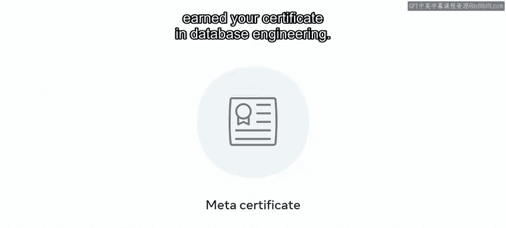

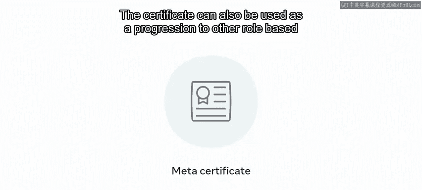

本节课中我们一起学习了项目完成的总结、核心技能的回顾以及项目对未来职业发展的价值。

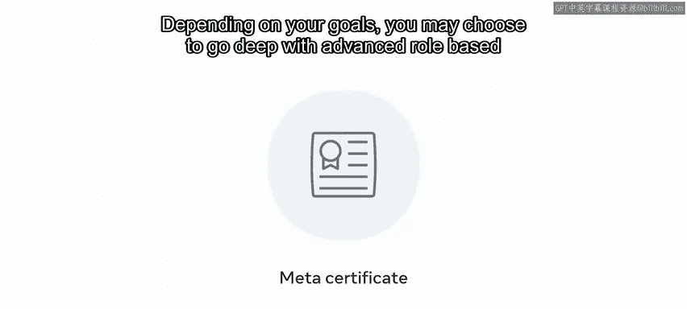

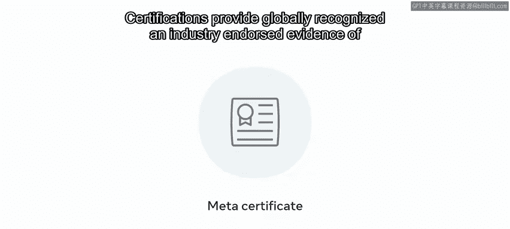

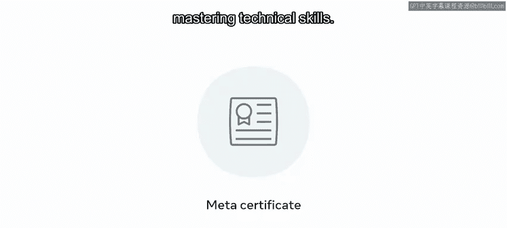

感谢您。与您一同踏上这段探索之旅是一种荣幸。祝您未来一切顺利。