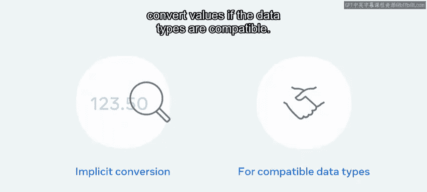
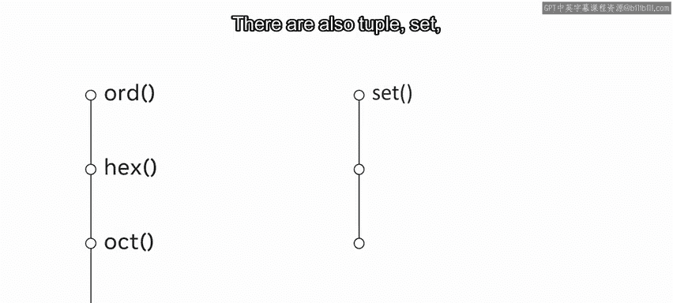

# Python数据库工程师：P12：类型转换 🎯

在本节课中，我们将要学习Python中的类型转换。类型转换是编程中一个基础且重要的概念，它允许我们在不同的数据类型之间进行转换，以满足数据处理和计算的需求。

## 概述

Python使用不同的数据类型来有效地处理和使用信息。有时，在收集了变量的值之后，你需要改变其数据类型。例如，用户在网站上提交表单，其中一个字段是整数，但数据以字符串形式传递。这是一个问题，因为要对以字符串形式保存的数字进行计算，唯一的方法是将其转换为整数数据类型。为此，你可以在Python中使用类型转换。

## 什么是类型转换？🤔

类型转换是将一种数据类型转换为另一种数据类型的过程。Python有两种不同的类型转换方式：隐式转换和显式转换。

上一节我们介绍了类型转换的基本概念，本节中我们来看看这两种转换方式的具体细节。

### 隐式类型转换

隐式数据类型转换由Python编译器自动执行，以防止数据丢失。例如，如果它检测到插入的值是小数，它会将`int`转换为`float`。

需要注意的是，Python只能在数据类型兼容的情况下转换值。`int`和`float`是兼容的，但`string`和`int`不兼容。

如果数据类型不兼容，Python将抛出类型错误。

### 显式类型转换

或者，开发者可以使用显式数据类型转换来执行类型转换。这是通过使用Python提供的函数来完成的。函数有很多，但一些最常见的是`string`、`integer`和`float`。

以下是Python中一些常用的显式类型转换函数及其用法：

*   **`str()` 函数**：此函数用于将任何数据类型转换为字符串数据类型。要使用此函数，请键入`str`，后跟要转换的值，并用括号括起来。例如：`str(123)`。
*   **`int()` 函数**：要使用此函数，请键入`int`，后跟要转换的值，并用括号括起来。例如：`int("123")`。
*   **`float()` 函数**：这是另一种常见的类型转换函数。同样，键入单词`float`，并在括号内添加要转换的值。例如：`float(123)`。

Python还有更多的类型转换函数，它们也具有类似的结构。以下是其他一些函数：

*   `ord()`：返回一个表示底层Unicode字符的整数。
*   `hex()`：将给定的整数转换为十六进制字符串。
*   `oct()`：接受一个整数并返回表示八进制数的字符串。
*   还有`tuple()`、`set()`、`list()`和`dict()`，你将在课程后面学到更多关于它们的内容。

## 总结

在本视频中，你学习了Python中的类型转换。重要的是要记住，数据类型并非不可改变。如果需要，你可以使用Python提供的函数来转换数据类型。掌握类型转换是进行有效数据处理和确保程序正确运行的关键一步。