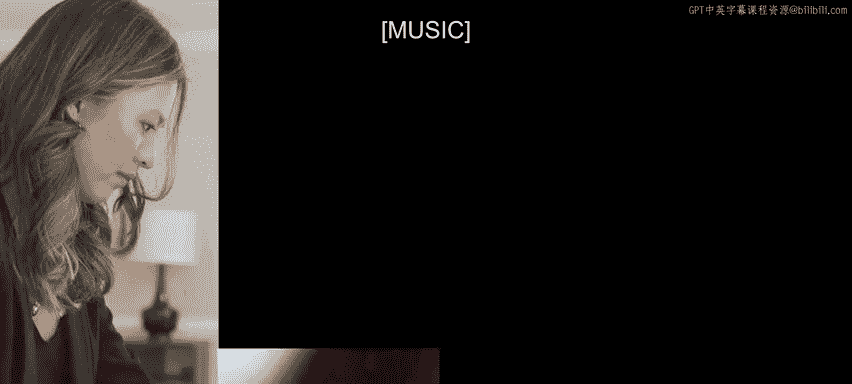
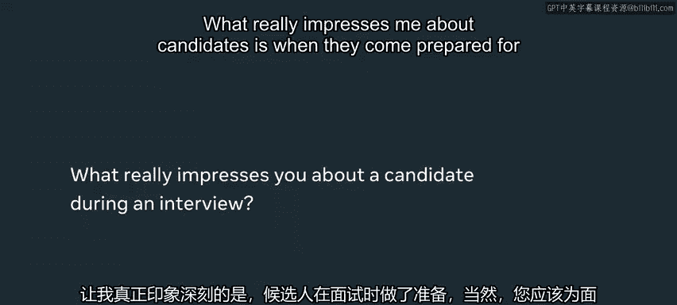

# Meta《数据库工程师（Python／数据库客户端／高阶数据建模／毕业项目／面试）｜Meta Database Engineer》中英字幕 - P131：4_技术面试期待什么.zh_en - GPT中英字幕课程资源 - BV1pZ421a749

Almost half of software developers according to data from a popular employment website find the coding interview portion。

 the most stressful portion out of all the technical interview You are going to be asked a lot of technical problems。

 a lot of architectural problems， organizational problems。

 they really want to know who you are as a person and what you value when I was interviewing one way that I practice was I had an actual stuffed animal that I would talk to and this just really forced me to practice the interview end to end as if I was actually talking out loud I think the interviewers at metata have been trained very well to make the interviewee feel welcome and comfortable in solving problems together。

🎼うんん。🎼。

My name is Marri Baallando， I am a software engineer at MEA and I work in the FB Web3 monetization team where I help creators and influencers make a living by using the Facebook product。

My name is Maxxie Herrera， I use Data and pronouns。

 I'm a software engineer in the Social Impact Award at Meta and I work at the Menlo Park Office Hi I'm Julie I'm a software engineer on the IG shopping team at Meta New York My name is Chanel Johnson I work remotely in Maryland for meta and I'm a software engineer for the Facebook Acorps architecture team where we work on infrastructure for the Facebook mobile app。

There are generally three different types of interviews technical。

 which is your regular elite code interviews， architecture interviews and then behavioral the technical interviews。

 the leak code ask questions you'll typically have two to four of these in the interview process one or two will be as a screen and then there'll be a couple more after you pass the initial screen and these are just going to be 20 or 30 minutes per question。

 just your classicly code questions The architecture interview is going to be about a 45 minutes to hourlong interview where you'll get a question of how to build kind of an endto end feature so this can either be more product oriented like build Teris or it can be more backend oriented kind of focused on how data flows and how to scale this to many users and then finally for the behavioral interviews you can expect questions like about your experience working with other people。

😊，boating challenges you' faced， exciting projects that you've worked on。

Questions I usually ask is what is an experience that you had when working on a team that things did not go well and the main reason I asked for this is because at Meow you're going to have to be working with a lot of people it's not just a solitary job so you need to learn how to communicate and how to really learn and grow with people when I was interviewing I was asked a lot of general questions that I would expect as an i engineer so for example。

 how would I build the newsfeed surface in the Facebook app you know what objects will I make how will those objects talk to each other what networking APIs do I expect and being able to at a high level describe how I would tackle these challenges and how I would structure the app as an i engineer so that's a very classic question。

What if I say a gift in order to practice for interview questions is to talk about your solution when you're whiteboarding it so one thing I would do is like with friends or colleagues when you write out your solution explain your thought process on what's going on are you considering time complexity are you considering how to make this faster how to make how to reduce space these are things that we also want to see as interviewers because when you're coding on the job。

 these are things you need to think about so this is a good practice for you to explain when you go through your code of like hey this is why I'm doing this because of X Y and Z and I'm also considering this as an interviewer I am actually rooting for you to do well because what I want as an interviewer is to not sit there and stare at the screen for 45 minutes watching you struggle I would much rather see you succeed and for us to work together on a problem so that I can gather as much signal from you as I cancel that I can make a good decision whether or not。

Would be a fit for meta。In terms of dress for the interview。

 the key is to really just be yourself where something that you're comfortable with no one expects you to show up in a suit I get a lot of interviewees that have that are wearing just a t shirt and jeans I am really looking for a candidate that is。

😊，Willing to。Explain their thinking， willing to engage very deeply and show a high level of confidence and knowledge。

So the most common mistake I see people making is they might be a really talented iOS engineer。

 but their software general skills might be lacking。

 so make sure you're preparing for those general algorithms and data structure type of questions because they will come up when you are interviewing regardless of the pipeline that you're interviewing for sometimes in the technical challenge you'll get stuck。

And the worst thing you can do is say nothing。Because I can't read your mind and I don't know what you're doing。

 so you really want to explain what you're thinking for， how you're stuck， why you're stuck。

 because even if you don't get the answer right？If you can show that you have a good understanding of the problem。

That can be enough to get you to the next round。What really impresses me about candidates is when they come prepared for the interview and you should obviously come prepared for the interview。

 but when they've done their research on the company they know the values and they know how they apply to their values and what they can bring to meta What really impresses me about a candidate during an interview is when they can take feedback from me so even if they are on the right track already sometimes if I can see that and push them a little bit more that's a really good sign that they can hear my feedback and work with me to solve the whatever problem is at hand it gives a good indication that it's someone that I would want to work with in real life interviewing is really about。

Showing who you are， it's really about， you know， showing what you know， how you grow， how you learn。

 and there is not a single trick to it。 you really have to kind of figure out a little bit about yourself and how you display these things and。

Make it work for you a candidate that's very enthusiastic excited to be there and has a really positive demeanor that just really shows if it's someone I want to work with someone that's gonna be passionate about the work they do and that was that is what I think leads to success I that passion On the other side of the interviews even though it can be a really long process it is really rewarding to start to actually work on the products that people use every day at a place like Me where things scale so large it's really cool to see one of the features you build being used by millions of users and you get to work with the smartest people I've ever met in my life and that will help you grow as an engineer and you would be shocked at how much you will learn and grow within a short time here Thanks for watching hope that you're able to learn some good tips at interviewing at meta and good luck on the rest of your journey。

😊。