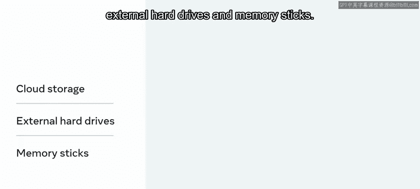

# Meta《数据库工程师（Python／数据库客户端／高阶数据建模／毕业项目／面试）｜Meta Database Engineer》中英字幕 - P133：6_内存.zh_en - GPT中英字幕课程资源 - BV1pZ421a749

In a previous video， Bs were introduced。 Each bike consists of 8 Bs。

 A bit is the simplest form of computing memory。😊，In this video。

 you will learn about the central processing unit or the CPU and the roles and functions of the different types of memory。

Typically， a computer will be made up of a series of memory blocks。

 which contain both information and instructions on how this information needs to be processed。

 Memory capacity then refers to the number of bys that a computer can hold。

There are different types of memory that need to be considered。Namely， cash memory。Main memory。

 and secondary memory。Firstly， to better understand the various layers of memory。

 it is important to pause and consider how a computer works。😊。

A computer functions around the central processing unit or CPU。

This takes both information and some instructions on how this information is to be processed。😊。

All this information exists as bytes or a series of ones and zeros that are determined by a small electrical current。

😊，The CPU can work faster than information can be transferred to it。

Often a CPU will be working on a number of different tasks near simultaneously。😊。

The switching between tasks can allow information to be transferred into the cache for processing and the results to be stored in the appropriate location。

😊，The proximity of a memory cell to the CPU can reduce the time it takes to load the information。😊。

Therefore， quicker and more expensive memory is always found near the CPU。

So an important concept to consider when discussing memory is the transfer rate。😊。

This relates to the speed at which a computer can transfer memory into the cache for processing。😊。

Now that you better understand the processing part。

 let's explore the different types of memory and start with cache memory。😊。

Cash memory is the most expensive form of memory and lives close to your CPU chip。

When the CPU receives an instruction to process some information。

 it first checks the cache to see if the information is here。

 if the information is available in the cache， it is processed。😊。

If it fails to find the required information here， the information is not processed。

The CPU then queries the larger， slower main memory。

 then loads this information into the cache for processing。😊。

Storing recently accessed information in the cache can improve the effectiveness of your system by reducing the search and transfer time of regularly used data。

😊，Much like a metro in a large metropolis， cache memory is organized in zones of importance。😊。

The most readily required information is in zone 1。

Each subsequent zone is of lesser importance and is numbered zone2，3，4 and so on。Next。

 you will learn about main memory。A computer's main memory consists of read access memory。

 Ram and read only memory， Ro。 Main memory holds only the information that a computer is currently working on。

 It can be volatile or non volatile。😊，Volaatile memory stores information actively。

 so if the computer loses power， it is lost。😊，Nonvolatile memory retains its information when the power is cut。

 Ro， as the name suggests， is read only， meaning the information cannot be overwritten。

 This memory is programmed once at the factory and cannot be altered。Typically。

 one will find instructions and data that are critical for a computer's function here。😊。

Rom is busiest when the computer starts and information on the required application is loaded。

Ram is programmable。 It can retain new information and instructions。

 RamM holds the current data and instructions that are in current use。

The amount of Ramm your computer has is directly correlated to how fast it can go。

 This is because of the transfer rate。 Lage amounts of Ram mean that the system does not need to transfer information constantly。

 Instead， it can hold and run a number of applications at once using RA。

All the memory needed to operate these applications needs to be available from your RAM。

 having too many programs open will affect the performance of your system by exhausting your RAM memory。

😊，There are a number of algorithms for reading and storing these memory addresses that fall outside the peri of this course。

Now， let's explore secondary memory in more depth。Secondary memory relates to external memory that can be plugged in externally and used to increase the storage capacity of your system。

😊，Accessing secondary memory is slower and requires transferring all required information and instructions intoran。

😊，Examples of secondary memory would include cloud storage， external hard drives and memory sticks。

In this video， the various components of memory have been discussed。

 You have learned how all memory allocation revolves around the CPU， which oversees the reading。

 processing and storing of information on the computer。😊。

You have also learned how there are different types of memory that vary in speed and importance。😊。

This informs their proximity of the CPU with quicker。

 more expensive memory cells found nearer the source。

This information should assist you in understanding how your computer works much better。

