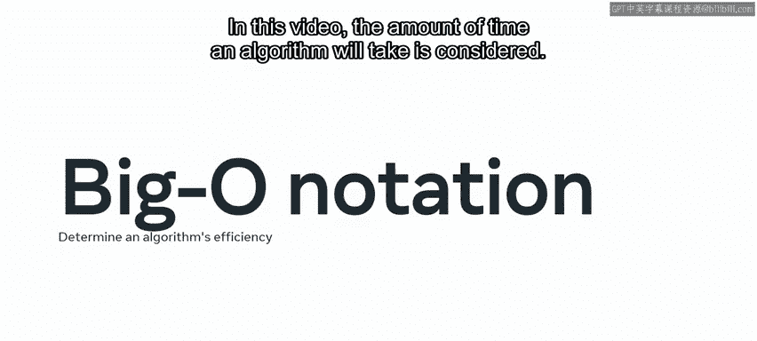
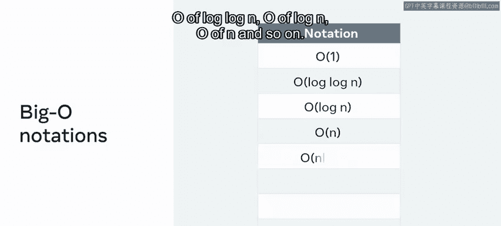
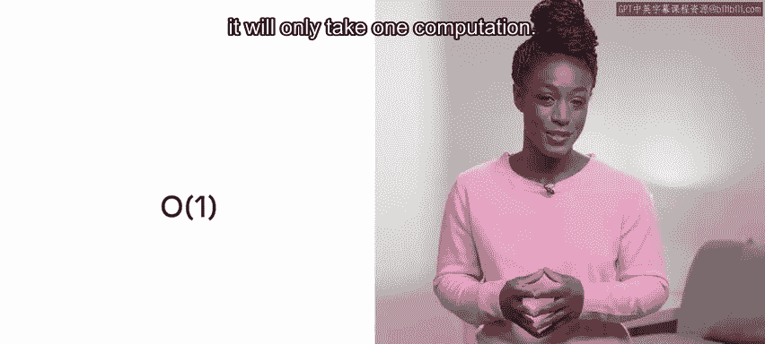
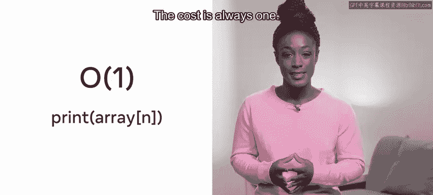
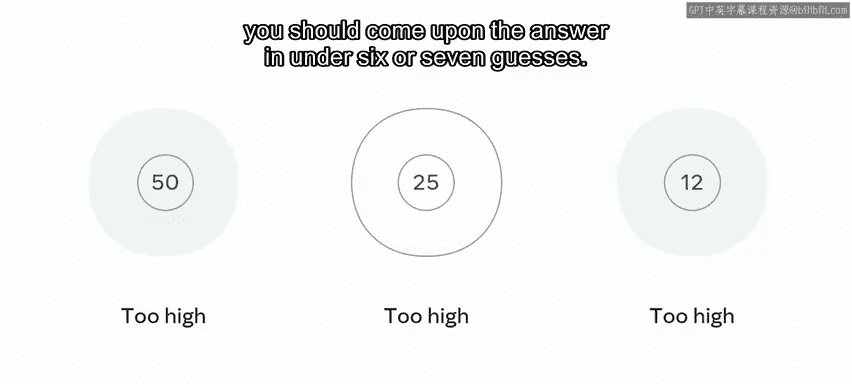
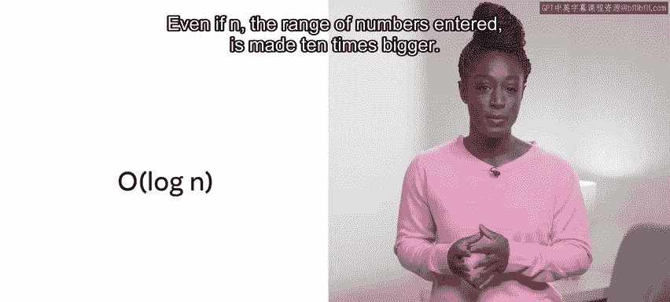
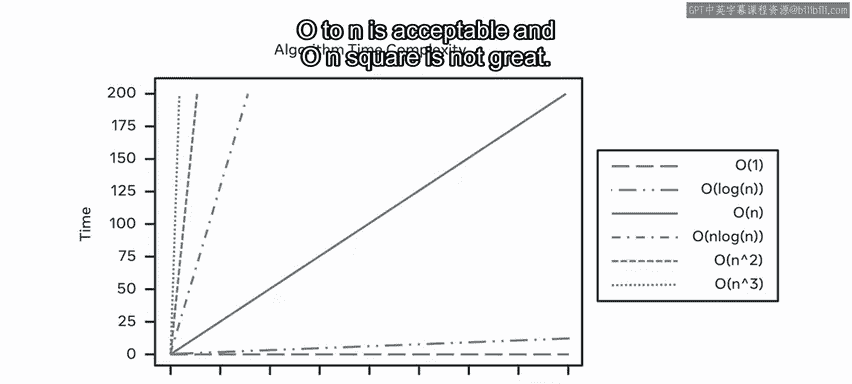
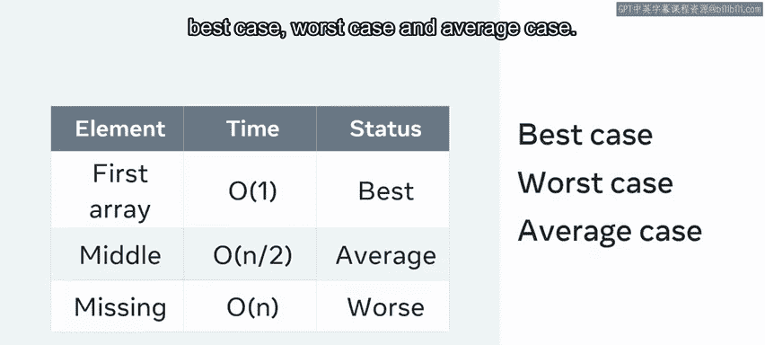

# 数据库工程师：P134：时间复杂度 ⏱️

在本节课中，我们将学习如何评估算法或任务的效率，特别是时间效率。我们将介绍时间复杂度的概念，以及如何使用大O表示法来衡量代码在不同输入规模下的运行时间。理解这些概念对于开发高性能应用程序至关重要。

## 评估效率的维度

在计算机科学中，评估效率通常考虑两个方面：**时间**和**空间**。本节我们将重点讨论时间效率，即衡量完成一项任务所需的时间。这被称为任务的**时间复杂度**。

一个应用程序必须在可接受的时间范围内返回信息。如今，用户点击网站时期望得到即时响应。不过，根据用户需求和期望，对于更复杂的查询，可能会给予一些额外的时间宽容度。

## 理解大O表示法 🧮





大O表示法是衡量算法效率的指标。简单来说，它估算了你的代码在不同输入集上运行所需的时间。在本视频中，我们关注算法将花费的时间量。

以下是一些你将遇到的大O表示法：
*   **O(1)**
*   **O(log log N)**
*   **O(log N)**
*   **O(N)**
*   ...等等



## 常见的时间复杂度分析

上一节我们介绍了大O表示法的概念，本节中我们来看看几种具体的时间复杂度及其含义。

### 常数时间：O(1)

如何衡量某件事可能被计算的最快时间？你需要使用**常数时间算法**，其计算时间为**O(1)**。简单来说，这意味着无论向系统输入什么，都只需要一次计算。

一个简单的例子是打印数组中的第一个元素。在这个例子中，无论数组中有多少个值，该方法的时间复杂度都是**O(1)**。

```python
# 示例：O(1) 操作
def print_first_item(array):
    print(array[0])  # 无论数组多大，只执行一次操作
```

### 线性时间：O(N)

如果你需要进行搜索，情况会变得更复杂。假设你有一个包含10个项目的数组，并且你想知道某个特定值是否在这个数组中。你可能会应用一个循环，并检查每个项目以查看该值是否存在。在这个例子中，复杂度被称为**O(n)**。这被称为**线性时间**。

搜索所需时间将等于数组的长度。数组越大，搜索所需的时间就越多。所以，如果数组有100个项目而不是10个，那么搜索将花费10倍的时间。




让我们探讨一个例子。每个操作在时间复杂度上都有一个“时间代价”。所以，**O(1)**意味着它花费一次计算，而**O(n)**意味着它花费n次计算。例如，你不会说它花了45秒，你会说复杂度是n。所以，对于每一个n操作，我们的最终复杂度结果就加一。

如果n等于100，那就是100次检查。复杂度仍然是**O(N)**。只是n意味着它长了10倍。这意味着你的应用程序速度取决于正在处理的数据大小。

打印数组第N个位置是**O(1)**操作的一个例子。这意味着打印第n个元素。无论n有多大，代价始终是1。

### 对数时间：O(log N)

这种搜索的强度低于**O(n)**，但比**O(1)**差。**O(log n)**是对数搜索，因此它会随着新输入的添加而增加，但这些输入只带来边际的增长。



一个很好的实例是**二分查找**。想象你正在玩一个猜数字游戏，提示是：太高、太低、正确。给定一个从1到100的范围。



你可能会决定系统地处理这个问题。首先，你猜50，太高了。然后你猜25，仍然太高。然后你决定猜12或13，仍然太高。这里发生的情况是，你每猜一次，搜索空间就减半。

所以，虽然这个函数的输入是100，但使用二分查找方法，你应该在6到7次猜测内找到答案。这个解决方案的时间复杂度可以说是**O(log N)**。即使n（输入的数字范围）变大10倍，所需的猜测次数也不会增加10倍。

### 二次时间：O(N²)

**O(N²)** 计算量很大。这是一种**二次复杂度**，意味着对于数组中的每个元素，工作量都会翻倍。

可视化这一点的一个好方法是考虑你有一个数组的数组。第一个循环将等于输入元素的数量，即N。第二个循环也会查看输入元素的数量N。因此，运行这种方法的总体复杂度可以说是n乘以N，即n²。

## 复杂度对比与最佳/最坏情况

那么如何直观地表示这个问题呢？下图展示了时间复杂度的算法。X轴与输入数量相关，Y轴与所花费的时间相关。

请注意，随着输入数量的增加，它对所有情况下的线条梯度都有不同的影响，除了**O(1)**。在这个关于N与所进行计算次数关系的图形表示中，最佳目标是**O(1)**。**O(log N)**仍然非常好。**O(n)**可以接受，而**O(n²)**则不太理想。



当然，并不总是能判断一个方法需要多长时间。让我们回到在循环中查找某物的例子。虽然你可以说搜索一个循环需要**O(n)**时间，但这可能并非总是如此。

考虑被搜索的项目是数组中的第一个元素。那么返回将在**O(1)**时间内完成，非常好。同样，元素可能缺失，因此必须搜索每个项目，即**O(N)**时间。中间情况是它在循环的中间附近被找到，即**O(N/2)**。

在评估一种方法时，会使用三个定义：**最佳情况**、**最坏情况**和**平均情况**。

## 总结

在本节课中，我们介绍了与复杂度相关的时间概念。在实施问题解决方案之前，我们获得了一些需要考虑的因素。开始之前要问自己的一个好问题是：我的解决方案采用了多少次计算，是否有更好的方法？



现在你使用了一个指标来评估你对给定问题的解决方案，你可以开始思考它在时间复杂度方面的效率了。这不是考虑解决方案的唯一方式，在下一个视频中，重点将放在**空间复杂度**上。