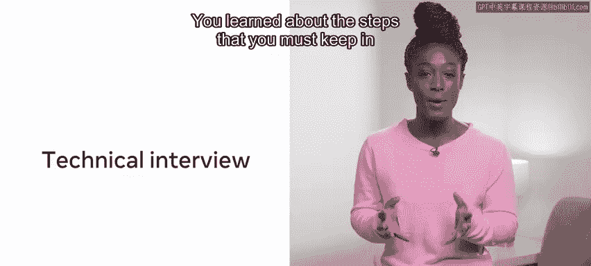
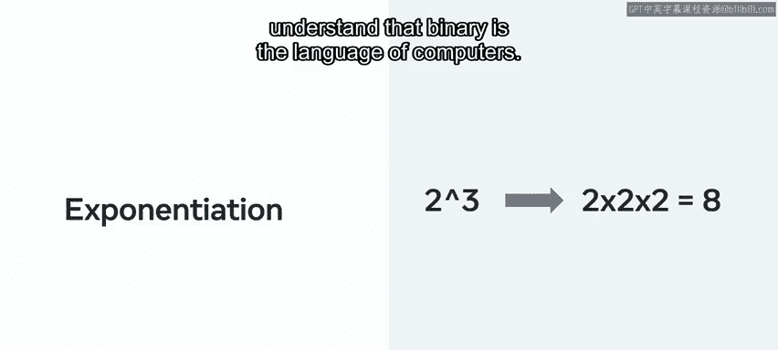
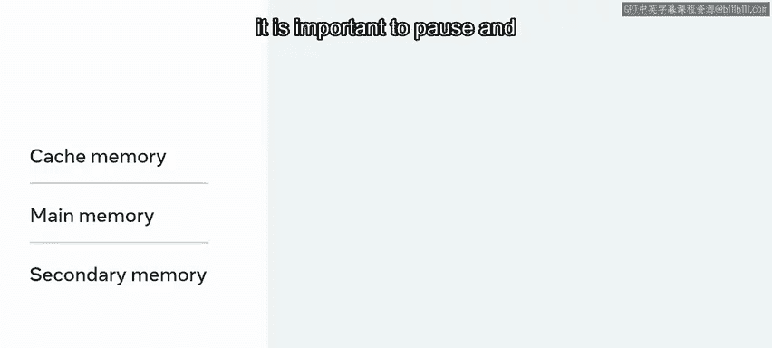
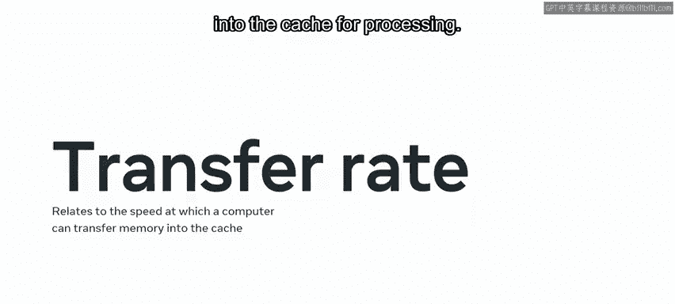
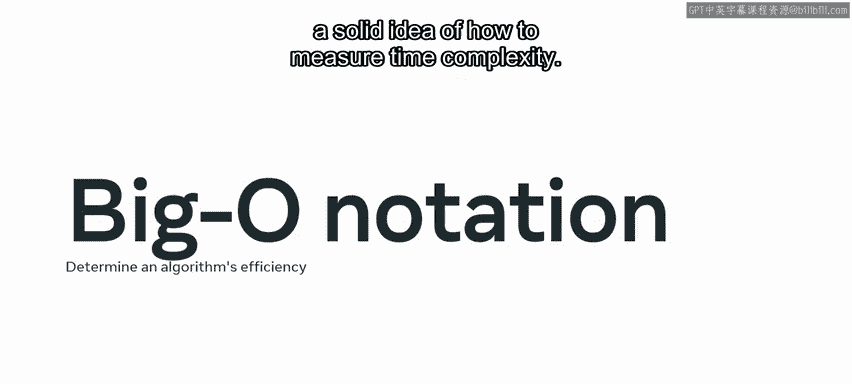
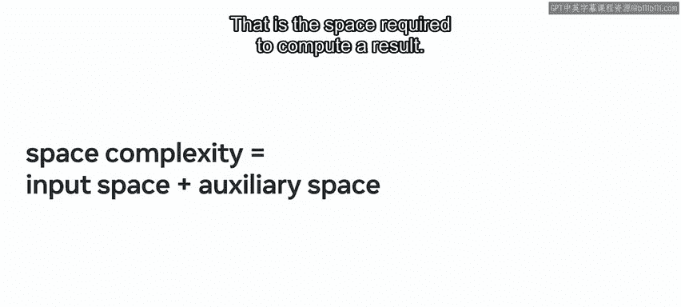

# 数据库工程师：P136：模块小结与编码面试介绍

在本节课中，我们将回顾编码面试准备模块的核心内容。我们将总结技术面试、沟通技巧、计算机科学基础（二进制与内存）以及算法复杂度（时间与空间）等关键知识点。

## 模块回顾

上一节我们完成了编码面试模块的学习，现在来回顾一下整个模块的内容。

你首先学习了课程介绍，了解了编码面试准备课程的整体结构。

随后，你进入了编码面试课程。第一课聚焦于技术编码面试，其主要目的是评估你是否具备承担职位职责的技术能力。你学习了在面试过程中必须牢记的几个步骤。

课程强调，使用合适的工具始终很重要，并且必须将时间限制考虑在内。

接着，你学习了代码优化，现在应该能够编写或重写代码，使程序使用尽可能少的内存或磁盘空间，并最小化CPU时间或网络带宽。

总而言之，你学习了一些无论面对何种挑战都可以使用的通用方法。

即使你对问题不熟悉或在规定时间内未能得出结果，也应始终努力展示你的推理过程和最佳实践方法。

通过练习在线问题的解决方案来准备技术面试，并在可能的情况下，对每个挑战采用相似的方法论。这将有助于你在未来无论面对何种挑战时，都能在一个熟悉的框架下工作。

## 沟通与第一印象

上一节我们介绍了技术面试，本节中我们来看看沟通的重要性。

你将注意力转向沟通和第一印象的重要性。课程介绍了语言和非语言沟通，以及两者的重要性。

你学习了STAR方法，以及如何在面试官沟通时利用它来获益。你现在应该能够审视情境背景、面临的挑战、相关任务的责任、解决挑战所需的行动，以及最终需要达成的结果。

总而言之，你现在应该能够在面试中清晰地传达一个概念。

以语言和非语言的方式沟通你为什么适合这个角色。

最后，在面试过程中出现技术问题时，使用STAR方法进行互动。

## 计算机科学基础

在学习了沟通技巧后，我们进入下一课，开始学习计算机科学基础知识。

你从二进制开始，学习了十进制（base 10）和二进制（base 2）的区别。

接着，你发现了位置记数法。这是利用数字的位置来表示数值的递增。

然后，课程介绍了计算机如何以字节存储数据，以及每个字节由8个比特组成，每个比特可以是1或0。课程也提供了一些例子。

你研究了幂运算的概念，即计算一个数的幂。

随后用了一个不同位数密码锁的例子来解释这个概念。

你现在应该能够应用这些知识，并理解二进制是计算机的语言。

## 内存

在理解了二进制之后，我们进一步探索计算机的内存。

你学习的第一个概念是内存容量，它指的是计算机可以容纳的字节数。

你还学习了需要考虑的不同类型的内存，即高速缓存、主内存和辅助内存。

你现在应该知道，为了更好地理解内存的各个层次，停下来思考计算机的工作原理是很重要的。

你学习了传输速率，即计算机将内存数据转移到缓存中进行处理的速度。

接着，你探索了高速缓存和辅助内存，现在应该能够描述它们之间的区别。

然后，课程介绍了计算机主内存由随机存取存储器（RAM）和只读存储器（ROM）组成的概念。你应该能够描述主内存的作用，并区分RAM和ROM。

你现在应该能更好地处理与内存相关的工作了。

## 时间复杂度

了解了内存之后，我们来看看如何衡量算法的效率，首先是时间复杂度。

你开始探索时间复杂度，学习了如何通过完成任务所需的时间来评估时间效率或衡量性能。

你发现了大O表示法，这是一种用于确定算法效率的度量标准。

因此，它可以估算你的代码在不同输入集上运行所需的时间，或者说，它考虑的是算法将花费的时间量。

课程给出了一些例子，你现在应该对如何衡量时间复杂度有了扎实的理解。

## 空间复杂度

除了速度，算法占用的内存量同样关键，接下来我们学习空间复杂度。

你接着学习了空间复杂度。重要的不仅仅是算法的速度，还有一个给定解决方案需要占用多少内存。

为了理解空间复杂度，课程引入了辅助空间的概念，这是保存解决方案所需的所有数据所需的空间。

也指计算给定解决方案所需的临时空间。

另一个概念是输入空间，它指的是向正在评估的函数、算法、应用程序或系统添加数据所需的空间。

总而言之，空间复杂度等于输入空间加上辅助空间；即计算一个结果所需的总空间。

## 学习成果

你对上述所有主题都进行了一些测验，这是你本课程学习之旅的一个良好开端。

所有这些内容应该能使你在未来的编码面试中表现出色。

---

**本节课总结**

在本节课中，我们一起回顾了编码面试准备模块的全部内容。我们总结了技术面试的步骤与优化方法，学习了有效沟通与STAR面试法，掌握了二进制、内存层次结构等计算机科学基础，并深入理解了用大O表示法衡量的时间与空间复杂度。这些核心知识为你应对未来的技术面试奠定了坚实的基础。