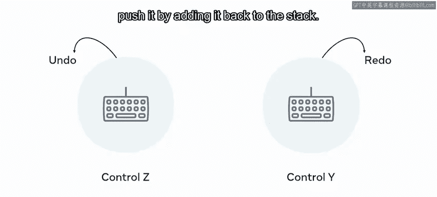
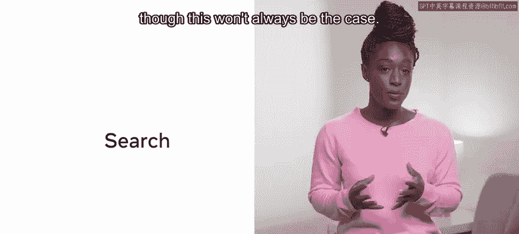
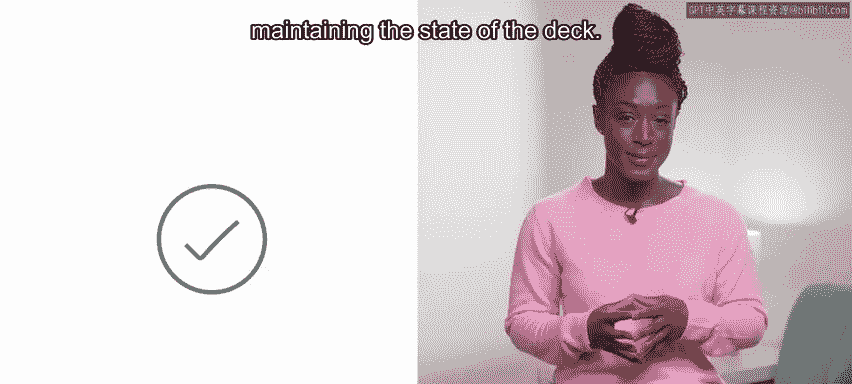

# Meta《数据库工程师（Python／数据库客户端／高阶数据建模／毕业项目／面试）｜Meta Database Engineer》中英字幕 - P139：12_栈和队列.zh_en - GPT中英字幕课程资源 - BV1pZ421a749

So what is the difference between a stack and a queue and what does it mean to use one of these data structures over another？

 Well， in this video， you will learn about stacks and cues， the difference between the two。

 and why you might choose to use one over another， depending on the requirements of the solution。

Stacks and queues are abstract data structures that have many different implementations。

 depending on the programming language。The unique principles that are common to both are how elements are added and removed。

While lists and arrays allow for random access， stacks and queuees employ sequential access。

This limited approach to holding data can be very useful when you want to control how the data is accessed。

 Let's start by exploring stacks in a little more detail。

 Stas are linear data structures with strict ways of adding and removing items， as the name suggests。

 a stack is a collection of elements that are stacked on top of one another。

What this means is that it is impossible to pull items from the middle。😊，Instead。

 a stack works with a strict first in， last out or phlo basis。This can also be phrased as last in。

 first out or leto。It's a simple， yet powerful concept that informs you that items can only be retrieved from the top of the stack。

 which determines the order in which you can retrieve them。

An example of this principle in action is hitting control Z in a URL。

 Word document or any coding environment。Controls it and does the very last action。

 hittingtting it again will undo the previous action and so forth。To extend the analogy。

 control Y will redo the action or push it by adding it back to the stack。

 Stas tend to have very few methods。 Push， P is empty， is full and peak。

The functions of these methods correlate with their names。 Push will add an item to the stack。

 and pop will remove it。Is empty， checks that the stack contains nothing and is full is a boolean that will return true if there is no more room in the stack。

 You might have heard of the popular computer question and answer platform。

 named after this very issue， namely stack overflow。

So popping an item takes it from the top of the stack and calling pop again will return the next item in the stack。

😊，Pop can be called until there is nothing left in the stack。Push。

 then we' place an item on the top of the stack。It is worth noting that by calling pop or push。

 you are changing the stack。You have now learned about all the methods except peak。

 So what does that entail。To have a look at the contents， one would call Peak。

 which allows you to view the top item without removing it from the stack。

So calling it will not change the state of the structure， unlike pop or push。

 which permanently alters the stack。Some implementations will include a search feature for looking through the stack。

 though this won't always be the case。 Now， let's explore an example。

Imagine that an application generated a deck of cards。 You could create a stack of 52 playing cards。

 and each time a card is dealt， it is removed from the top of the stack just as in a real deck。

Using a stack in this way would simplify the code required for maintaining the state of the deck。

 Now， let's explore cues。 A queue is very similar to a stack in that it tends to have the same methods。

 It can create， insert， remove and check the state of the queue。 Unlike a stack。

 a queue works on a first in， first out or fifo basis。 Again。

 the name is a good indicator of how the structure works As an example。

 imagine you have a line of people waiting to get a burger at a fast food restaurant。

 The first person to enter the queue gets served。 And each subsequent customer stands behind the one in front and is processed in turn。

As with the stack， a queue will pop the selected item from the structure。

 though different languages have different implementations for this。

The element that is removed from the queue is the one at the bottom。 In other words。

 the least recently added item or the first to join the queue。Using a real world I T example。

 a server balancing system usually uses a queue to retrieve tasks。

 The structure would hold each task in order of insertion。

 and when a server becomes available to process the task。

 the first task entered into the queue would be removed and passed to that server。

In this video you have learned about stacks and cues and the differences between them these are very useful tools to have in your programming toolkit and knowing them will be an advantage when dealing with problems requiring a structured way of accessing and inserting data。

😊。