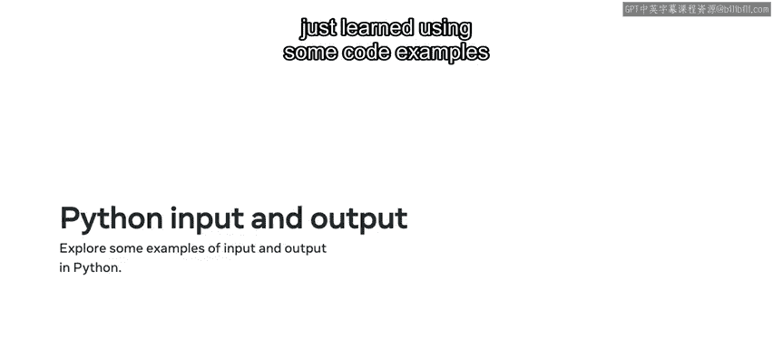
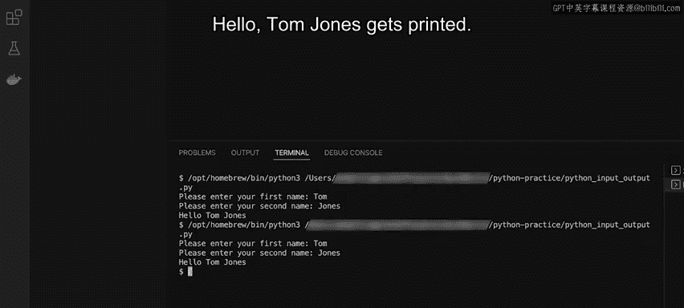

# Python编程基础：P13：用户输入与控制台输出

在本节课中，我们将要学习Python中两个核心功能：如何从用户那里获取输入，以及如何将数据输出到控制台。掌握输入和输出是编写交互式程序的基础。

## 概述：输入与输出

与其他编程语言一样，Python专注于从用户或其他服务获取输入并提供输出。Python提供了许多辅助函数，使得执行这两项操作变得非常容易。

你可能还记得，我们使用 `print` 函数来输出变量和其他值。在本节中，你将更深入地了解 `print` 函数，并学习如何使用另一个新函数——`input`。

## 输入函数：`input`

`input` 函数旨在从输入源获取数据，它可以有多种使用方式。例如，其最基本的用途之一是获取用户在键盘上键入的数据，然后可以将此输入打印到屏幕上。

在许多情况下，你需要直接从用户那里获取输入。例如，当你询问用户的电子邮件地址时，假设你想使用 `input` 函数提示用户输入他们的电子邮件地址，然后将该输入保存到一个名为 `email` 的变量中。

```python
email = input("请输入您的邮箱地址：")
```

如果你运行这段代码，用户将看到一个提示，要求输入邮箱。然后，`email` 变量将包含该邮箱地址。



## 输出函数：`print`

现在，让我们切换回用于Python输出的 `print` 函数。它可以用于打印所有不同类型的数据，并允许更复杂的格式化。

`print` 函数本身接受任意数量的参数。例如，可以使用逗号分隔来按顺序打印数字，使用算术运算来打印方程式的输出，以及使用字符串连接来将两个字符串连接在一起。

Python的 `print` 函数还有一些可以作为附加参数传递的保留关键字。这些包括：
*   `objects`：即要打印到屏幕上的值。
*   `sep`：定义被打印对象之间的分隔方式。
*   `end`：定义在末尾打印什么。
*   `file`：指定值打印到哪里，默认是标准输出（`sys.stdout`）。
*   `flush`：一个布尔表达式，用于刷新缓冲区，本质上是将数据从临时存储移动到计算机的永久内存存储。

例如，假设你可以向 `print` 函数传递三个参数：字符串 `"Hello"`、另一个字符串 `"World"`，以及内置参数 `sep`，其值被设置为包含逗号和空格的字符串 `", "`。这将用作 `"Hello"` 和 `"World"` 字符串之间的分隔符，输出结果是 `Hello, World`。

在编程时，你经常需要知道变量的值并将其输出到屏幕上。Python允许在 `print` 语句内部直接进行格式化。你也可以通过在花括号内指定数字来控制顺序。例如，如果你打印两次相同的语句，但交换了数字，输出将会不同。

## 实践应用：代码示例

上一节我们介绍了输入和输出的基本概念，本节中我们来看看如何通过具体的代码示例来应用这些知识。

我将演示如何在Python中使用输入和输出。首先从演示 `input` 函数开始。

**1. 基本输入**
我首先输入 `input()`，然后点击运行命令。你会注意到它运行了输入函数，并为我提供了一个可以实际输入内容的控制台。我输入 `hello` 并按回车。因为没有收集数据，所以什么也没发生，我只是触发了输入函数，默认情况下它会打开命令行或控制台并允许我输入数据。

**2. 带提示的输入**
我还可以向 `input` 函数添加提示。例如，我可以向用户提问，比如“请输入一个数字”。我在 `input` 后面的括号内键入“请输入一个数字”。清除控制台后再次点击运行。现在输出会要求我输入一个数字。我输入 `5` 并按回车。同样，从输出角度看没有任何显示，因为我还没有对输入值做任何处理，只是演示了 `input` 函数的工作原理。

**3. 保存输入值**
如果我想获取输入的值，需要将其赋值给一个变量。所以我输入 `num = input("请输入一个数字：")`。再次清除控制台并点击运行按钮。它在控制台中要求我输入一个数字，这次我输入数字 `6`。现在，`num` 变量将包含数字 `6`。但为了看到它，我必须将该变量输出到屏幕。我可以使用另一个叫做 `print` 的函数来实现。

**4. 输出变量**
在这种情况下，我通过在输入后键入 `print(num)` 来打印这个数字。再次清除屏幕并点击运行。这次当被要求输入数字时，我输入了数字 `7`。按回车后，你会注意到输出打印了 `7`。

**5. 多个输入**
我想展示你可以收集多个输入，因为输入是按顺序工作的。所以我将这个变量称为 `num1`，并在下一行输入另一个名为 `num2` 的变量。这个变量的输入提示是“请输入第二个数字”，而我将第一个变量的输入提示改为“请输入第一个数字”，以使指令更清晰。我打印出 `num1` 和 `num2` 的值。`print` 语句接受这两个变量，因为它们用逗号分隔，并且会按顺序打印出来。再次清除控制台并点击运行。我输入 `4` 作为第一个数字，按回车，然后输入 `5` 作为第二个数字，再次按回车。你会注意到打印出了 `4` 和 `5`。

**6. 在打印中进行算术运算**
你也可以在 `print` 语句中进行算术运算。换句话说，你可以进行加法、减法、标准乘法和除法。所以，在 `print` 语句中不使用逗号，而是输入 `num1 + num2`。再次清除屏幕并点击运行。我再次输入数字 `5` 和 `4`，然后得到 `54`。现在，这并不是我原本想做的，原因是两个变量都是字符串。这回到了你之前学过的关于数据类型的知识。如果我想进行算术计算，首先需要将每个变量转换为整数。

**7. 类型转换**
所以我可以在 `num1` 和 `num2` 上使用 `int()` 函数。再次点击运行按钮，输入相同的两个数字 `5` 和 `4`，但现在我得到的结果是 `9`。如果我想查看输入的类型，可以使用 `type` 函数检查数据类型。为此，我输入 `print(type(num1))`。让我清除屏幕。点击运行并在控制台中再次输入数字 `5` 和 `4`，它显示类型是 `str`（字符串）而不是 `int`（整数），而整数才是我真正想进行算术运算的类型。所以请注意，当你使用 `input` 时，得到的是一个字符串。你很可能需要使用显式的数据类型转换将其转换为所需的数据类型。

**8. 字符串连接**
`print` 语句也可以用于字符串连接。所以，我将 `num1` 改为 `str1`，对 `num2` 也做同样的操作，改为 `str2`。然后我将输入提示修改为“请输入您的名字”对应 `str1`，以及“请输入您的姓氏”对应 `str2`。之后，我打印出 `"Hello "`，然后使用连接，以便用户可以用他们的名字和姓氏来问候。现在我想运行这个程序，快速清除终端，然后点击运行。在控制台中，我为名字输入 `Tom`，为姓氏输入 `Jones`。结果是输出了 `Hello Tom Jones`，所以连接也可以与 `print` 语句一起使用。

**9. 字符串格式化**
最后，你还可以改变分配变量的方式，不必使用连接，可以直接使用字符串替换。为此，我将使用Python中的一个叫做 `format` 的函数。根据括号的顺序，你可以传入想要替换的变量，在这个例子中是 `str1` 和 `str2`。再次点击运行，我输入用户名 `Tom Jones`，然后打印出 `Hello Tom Jones`。

## 总结



本节课中我们一起学习了Python中的输入和输出功能。我们深入探讨了如何使用 `input` 函数从用户那里获取数据，以及如何使用 `print` 函数以多种方式（包括基本打印、变量输出、算术运算、字符串连接和格式化）将数据输出到控制台。记住，`input` 函数默认返回字符串类型，因此在需要进行数值计算时，务必进行类型转换。掌握这些基础是构建更复杂、交互性更强的Python程序的关键一步。