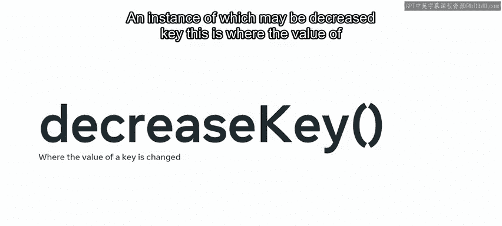
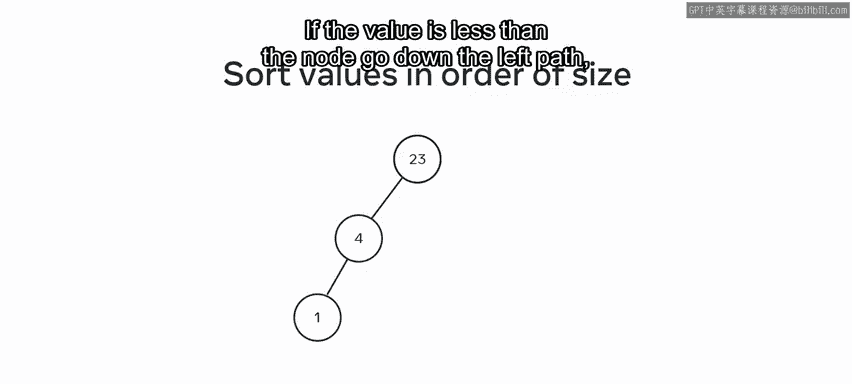
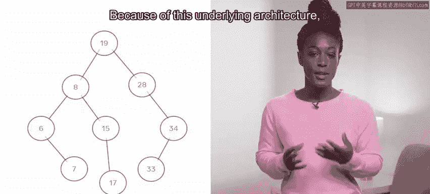
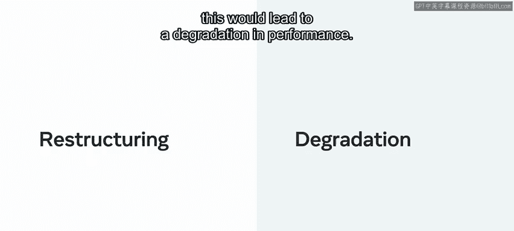

# 数据库工程师：15：堆数据结构详解 📚

在本节课中，我们将要学习一种名为“堆”的特殊数据结构。堆结合了树和队列的某些特性，是一种用于高效组织和处理优先级元素的重要工具。我们将探讨堆的结构、核心操作、工作原理及其实际应用场景。

---

## 堆的基本概念 🌳

堆是一种模仿树形结构的专用数据结构，但其行为方式与队列相似，关键区别在于堆为元素赋予了优先级。堆中的每个元素都有一个键值，优先级可以基于最小键值或最大键值来设定。

*   **最小堆**：优先级赋予键值最小的元素。
*   **最大堆**：优先级赋予键值最大的元素。

堆最初是为了高效存储和搜索数据而引入的，但后来人们发现它在许多操作中都非常有用。

---

## 堆的核心操作 ⚙️

堆支持一组精选的核心操作。这些方法是构成堆的基础元素，不同编程语言的实现可能会添加额外的方法。

以下是堆的核心方法：
*   **插入**：向堆中添加一个新元素。
*   **查找最小值**：在最小堆中，返回优先级最高的元素（即最小键值）。
*   **删除最小值**：在最小堆中，移除并返回优先级最高的元素。

> **注意**：本节的讨论围绕最小堆展开，但所有内容反转后同样适用于最大堆。两者的唯一区别在于优先级设置的位置。

一个可能被添加的额外方法是 **`decrease_key`**，即更改某个键的值。这在现实场景中元素的优先级发生变化时非常有用。

---

## 堆的底层结构与实现 🏗️

在讨论树时，我们提到二叉树会根据值的大小顺序来查找：如果值小于节点，则沿左路径向下；如果值大于节点，则沿右路径向下。

基于这种底层架构，堆通常使用二叉树来构建。另一种方法是让数组模拟二叉树的行为。

在最小堆中，最小值被放置在根节点，后续值根据其键值大小被放置在层次结构中的相应位置。这意味着从堆中检索最小值的时间复杂度是 **O(1)**，因为它始终存储在根节点。

与栈不同，检索一个值并不会将其从树中移出。如果需要移除元素，可以调用 `delete_min` 方法。

---

## 堆的设计哲学与限制 🚫

通常，堆不支持删除优先级元素之外的其他项目。这是因为堆是为特定目的而构建的：以最短时间识别并返回最重要的项目，然后让下一个重要项目进入队列。

在树中删除非优先级项目需要重组树结构，这会导致性能下降。如果你需要一种支持此类操作的数据结构，可能需要考虑堆之外的其他结构。

---

## 堆的插入过程 🔄

向最小堆中插入元素通过“上浮”过程完成。

以下是插入步骤：
1.  新元素被插入到堆的末尾（即树的最底层最右边的位置）。
2.  将该元素与其父节点进行比较。
3.  如果新元素的值小于其父节点，则交换它们的位置。
4.  重复步骤2和3，直到新元素的值不小于其父节点，或者它到达了根节点。

堆的插入操作可以在 **O(log N)** 的时间内完成。

---

## 堆的实际应用场景 💡

了解了堆的底层机制后，你现在可能对如何应用这种数据结构有了一些想法。考虑到其固有结构能从一组元素中优先处理特定值，其自然应用领域就是**调度**。

以下是堆的一些典型应用场景：
*   **CPU进程调度**：根据优先级执行任务。
*   **网络路由或数据包处理**：优先处理高优先级的数据包。
*   **面试日程安排**：用于优先安排特定任务，例如使用候选人处于面试流程的阶段或职位在组织内的优先级作为键值。

拥有一个能基于重要性自动应用调度流程的系统，可以极大地节省时间。

---

## 总结 📝

本节课中，我们一起深入学习了堆数据结构。你了解了堆如何用于将元素从最不重要到最重要进行组织，也看到了通过限制功能，反而可以提高处理效率。

堆在需要快速访问最高或最低优先级元素的场景中表现出色。与选择任何数据结构一样，为正确的工作找到合适的工具至关重要。堆就是处理优先级队列和调度问题的利器。