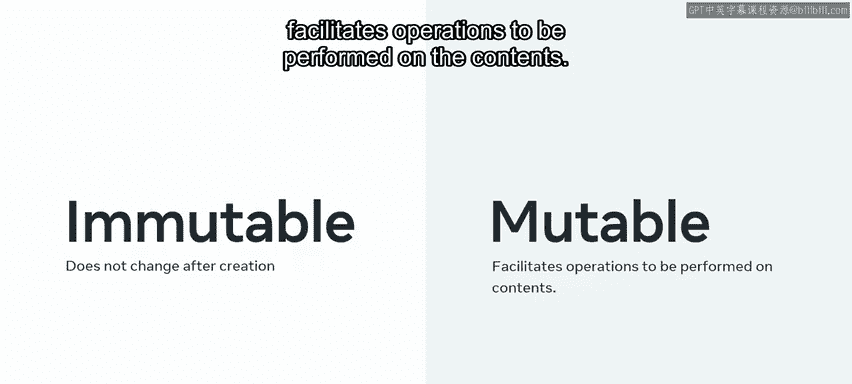
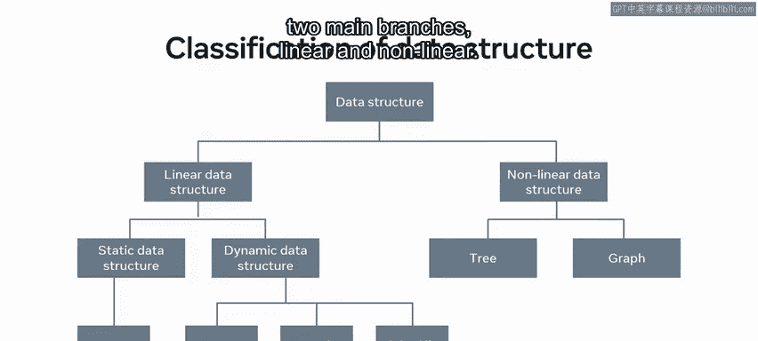
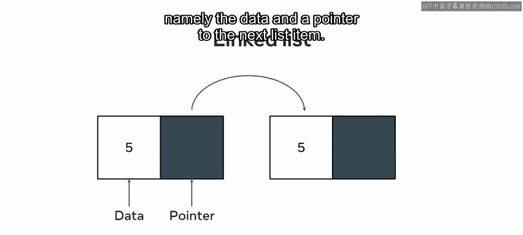
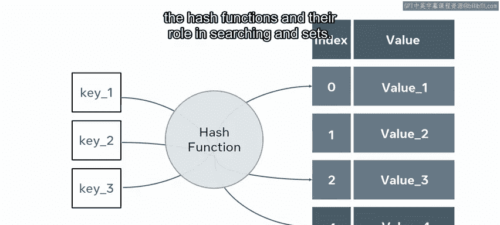
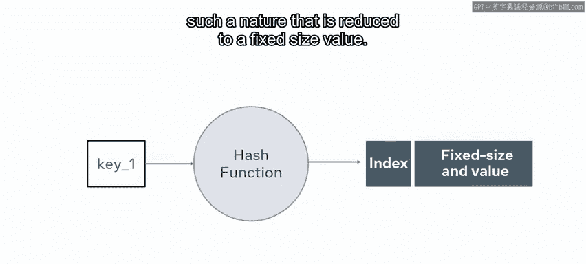
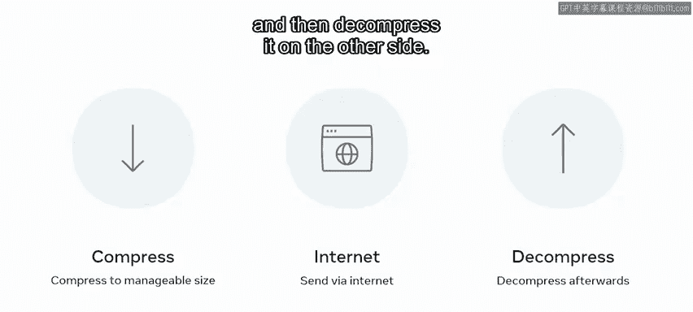
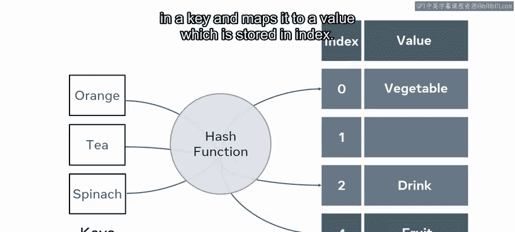

# Meta《数据库工程师（Python／数据库客户端／高阶数据建模／毕业项目／面试）｜Meta Database Engineer》中英字幕 - P144：17_模块小结 数据结构介绍.zh_en - GPT中英字幕课程资源 - BV1pZ421a749

Well done。 You've reached the end of the introduction to data structures module。

 Let's take a few moments to review what you learned during this module。

 You started the module with a lesson on basic data structures。

 This range from basic data structures like strings。

 Booles or arrays to more advanced data structures like collections， graphs and heaps。

 understanding the data you are working with and the most appropriate structure to use can be very beneficial。

You learned about a simple， immutable structure that does not change after creation and mutable structure that facilitates operations to be performed on the contents。

You then took a deep dive into all the types of data structures to refresh your memory。

 Here is a universal classification of data structures that categorizes the different types of structure into two main branches。

 linear and linear。😊。

Examples of linear structures are arrays， cues， stacks and lists。

 and it infers that each element is attached to the element that precedes it。

You learned about the structures in detail and should now be able to describe each of them。

You then moved on to focus on nonlinear data structures。 In contrast to linear structures。

 there are nonlinear instances such as trees or graphs。

 These structures do not allow you to traverse the data in one smooth motion。 Instead。

 you can investigate certain paths。 You then moved on to the next lesson where you are introduced to lists and sets。

You learned that as with arrays， it is common to find lists that are declared as either a string。

 an integer or float in some programming languages， you can have lists with mixed element types。

 You also learned that some languages require that you initially determine how big a structure will be。

 While others allow for dynamically growing structures。

That was followed by a section on linked lists and how they work。

 Remember that a linked list contains two pieces of information。

 namely the data and a pointer to the next list item。

You then learned about sets and how they work。 A set is very similar to a list。 However。

 a set will store its elements in an unordered way。

Following sets， you were introduced to the hash functions and their role in searching in sets。

 Se are exceptionally fast to search。

You then moved on to the next video on stacks and cues in the same lesson。To refresh your memory。

 stacks and cues are abstract data structures that have many different implementations。

 depending on the programming language。😊，The unique principles that are common to both are how elements are added and removed。

You learned that stacks and cues employ sequential access and use the empty stack。

 push and pop methods to move and or add and remove items。

 you also learned about the Flo first in last out and FiO first in first out principles。

When you visited queuees， you learned that a queue is very similar to a stack in that it tends to have the same methods。

 It can create， insert， remove and check the state of the queue。 Unlike a stack。

 a queue works on a first in， first out or fiO basis。 Again。

 the name is a good indicator of how the structure works。

The last video in this lesson focused on trees， trees are a powerful data structure that gives you great flexibility in adding and searching values。

 the inherent structure of a tree can allow you to understand a lot about the relations between the data stored which can save a lot of time and code when extracting information from the data。

😊。

You learned about tree structures and how data moves in a tree。 In the next lesson。

 you were introduced to advanced data structures。 First， you learned about what a hash table is。

 its structure and inherent features and how it works。

 You also explored some of the advantages of using hash tables and discovered what is meant by collisions in hashing。

 Let's quickly revisit what this entailed。You were introduced to the hash function and learned that the key is taken and the hashing function is applied to it in such a nature that is reduced to a fixed size value。

😊。

You learned about compression with an example from our field of experience。😊。

When you want to send information over the internet。

 you might first compress the size of it to a manageable number of bytes， send it over the internet。

 and then decompress it on the other side。😊。

This was followed by an explanation of how hash tables offer an alternative approach to storing and searching data through use of an index。

😊，To achieve this， you must implement an algorithm that takes in a key and maps it to a value which is stored in an index。

The next video in this lesson focused on the structure and features of heaps。

 you also discovered how heaps can be used to organize elements from least to most important and how by limiting the functionality of heaps。

 productivity can be increased。😊，You learned that heaps could place priority on the lowest valued key and are then called min heaps and ones that place the priority on the maximum values are called max heaps。

😊，A heap has a few select core operations that it can perform， namely the insert。

 find and delete of items。😊，Following this， you learned that deleting items in the tree would require restructuring the tree。

 and this would lead to a degradation in performance。😊，To summarize in the video about heaps。

 you have gained a greater understanding of heaps and how they can be used to organize elements from least to most important。

 You have been shown that by limiting functionality， productivity can be increased。😊。

As with selecting any data structure， it is important to find the right tool for the right job。

Finally， you focused on graphs and set the scene as follows。😊。

When considering a given problem in computer science。

 it is always important to consider what executions might be required to solve your problem and through this reflection choose an appropriate data structure to hold your data。

😊，Consider that you might work for a large internet company that wants to store a directory of locations and their connectedness to one another。

 An illustration of cities plotted in relation to one another was used to explain all the concepts such as a weighted graph and undirected graph。

 and that in contrast to a directed graph an undirected graph has no order of precedence。

Following that， you learn that a connection in a directed graph is considered weakly connected if the edge is only one way。

 However， if there are two connections going either way between two nodes。

 it is said to be strongly connected。

In this video， you learned about the key concepts and topics covered throughout this module。

 You have done some quizzes on all the topics mentioned。

 You are getting more equipped for your future。 Good luck with the next module。😊。

