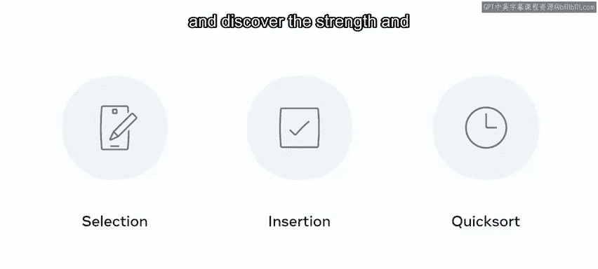
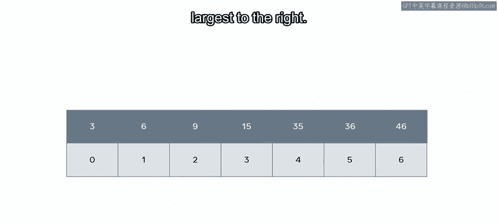
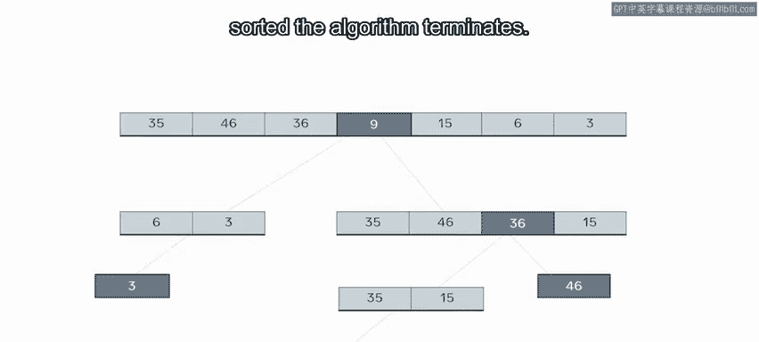
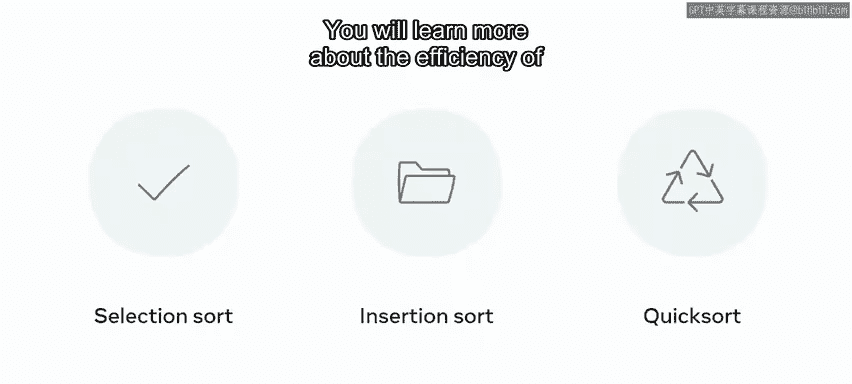

# 数据库工程师：P145：排序算法 📊

在本节课中，我们将学习排序算法。排序是数据处理中的一项基础且重要的任务。我们将探讨几种常见的排序方法，包括选择排序、插入排序和快速排序，并了解它们的基本原理、实现步骤以及各自的优缺点。

---

## 排序的必要性 🔍

对一组数据进行排序，听起来可能很简单。然而，深入细节后，你会发现它可能出人意料地具有挑战性。

为了解决这个挑战，人们开发了多种算法，也设计了一些数据结构，例如**二叉树**和**堆**。这些数据结构的设计目标之一，就是为了让数据能以一种有序的方式存储。

使用已排序的数据，或者具备对自有数据进行排序的能力，可以显著节省时间。因此，一个能够被排序的元素数据集是基本前提。

这种顺序可以是按字母顺序、数字顺序、时间顺序、形状大小或颜色色调。具体使用哪种度量标准并不重要，重要的是它们能够按照**升序**或**降序**进行排列。

另一个需要考虑的因素是，排序是通过**置换**（即重新排列原列表）完成的，还是通过**创建副本**（同时保留原列表）完成的。

---

## 选择排序 🤔

选择排序是一种早期的排序方法。它模仿了人类处理这个问题的方式，其基本原理非常直接。

以下是选择排序的步骤：
1.  遍历列表，找出最小的元素。
2.  将这个最小元素与列表的第一个元素交换位置，使最小元素位于顶部。
3.  此时，原顶部位置的元素被交换到了列表中空出的位置。
4.  对列表中的每一个元素重复此过程，直到列表按从小到大排序完毕。

让我们通过一个例子来探索这个过程。

在图中，索引位置0的元素是35。在选择排序中，会将索引0的元素与数组中的每个元素进行比较，直到找到最小值。

同样地，下一个位置的元素46会与每个元素比较，在这个例子中，它与6交换。接下来是索引2的元素36。你会发现索引3的元素9被认为更小，但必须搜索整个数组才能确认。

这个过程持续进行，直到每个元素都按大小排序，最小的在左边，最大的在右边。

---

## 插入排序 📥

另一种直接的排序方法是插入排序。与遍历所有元素不同，这种方法从检查列表中的前两个元素开始。

以下是插入排序的步骤：
1.  比较列表中的前两个元素，将较小的那个移到前面。
2.  对每一个后续元素，将其与它左边的元素进行比较。
3.  如果发现它更小，就将其向左交换位置。
4.  重复此过程，直到元素到达正确位置或到达列表开头。

让我们看一个例子。

在屏幕上，你会注意到一个数字数组。第一个元素35左边没有更大的元素，所以它保持原位。然后元素46被比较，也留在原地。

接下来是元素36，它与位置1的元素（46）比较，发现更小，于是它们交换。再与位置0的元素比较，显示不需要进一步交换。

在第3步，你会看到元素9。它与46比较并交换到位置2。它进一步与位置0和1的元素比较，并再次交换。

接下来，位置4的元素与位置3的元素比较并交换。它进一步与位置2和1的元素交换。它也与位置0比较，但由于更大，所以不再移动。

这个过程持续进行，从右向左移动，直到整个数组排序完毕。

---

## 快速排序 ⚡

上一节我们介绍了两种基于简单范式的直接排序方法。快速排序则是一种更复杂、实现难度更高，但效率也高得多的方法。

快速排序基于**枢轴**的原则运作。算法选择数组中的一个元素作为枢轴。

以下是快速排序的步骤：
1.  选择数组中的一个元素作为**枢轴**。
2.  将所有大于这个值的元素移到枢轴的右边。
3.  将所有小于这个值的元素移到枢轴的左边。
4.  对枢轴左右两边的子数组，递归地重复此过程，直到所有项都排序完毕。

让我们通过一个例子来探索这个过程。

这里，元素9被选为快速排序的枢轴点。所有小于9的项被交换到左边，所有大于9的项被交换到右边。因此，第一次分割后，较小的元素（6和3）被移到了左边。

对结果数组再次应用相同的过程，当发现3是唯一未被分割的元素时，递归终止。

现在，取大于原始选定枢轴的值，你选择一个新的枢轴。在这个例子中，选择了36，并执行进一步的元素交换。

最后，剩余的未排序索引位置根据新的枢轴进行交换。一旦所有元素排序完毕，算法终止。

---

## 算法选择与实践 🛠️

除了上述方法，还有许多其他的排序方法，有些甚至融合了现有方法的优点形成混合算法。

在实践中，你可能不需要自己编写实现，因为每种编程语言都有优秀的现成实现。本节的目标是展示它们底层的工作原理，以便你在面对特定问题时能选择最合适的一个。

与数据结构一样，没有一种排序算法能在所有场景下都提供最佳结果。每种方法都有其权衡，在某些环境下比在其他环境下更有效。你很快将在关于大O表示法的内容中，更深入地了解这些方法的效率。

---

## 总结 📝

本节课中，我们一起探索了排序算法以及可用的不同排序方法。你学习了实现选择排序、插入排序和快速排序所需的步骤，并发现了每种排序方法的优点和弱点。理解这些基础算法的工作原理，将帮助你在未来的数据库工程和数据建模任务中做出更明智的技术决策。