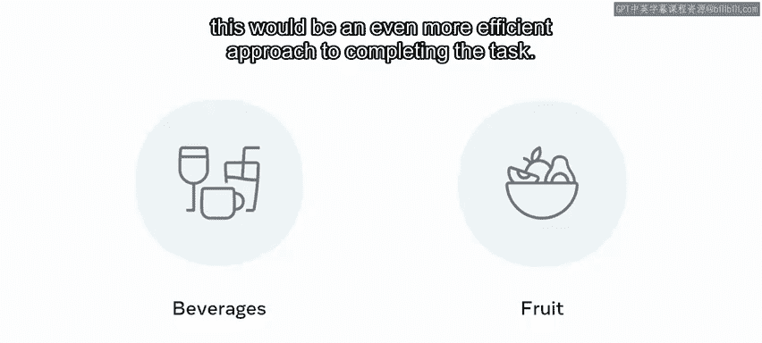
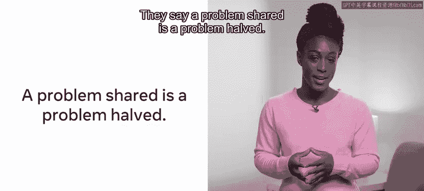
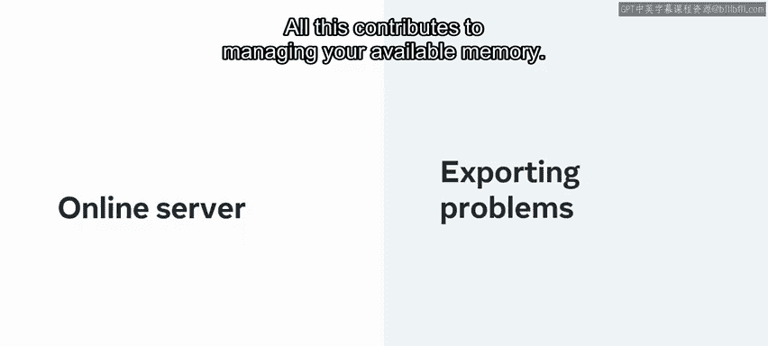

# 数据库工程师：P147：分治法 🧩

在本节课中，我们将要学习分治法范式。分治法为解决特定问题提供了一个有用的思考框架。它包含了本模块中讨论的两个核心原则，即**递归**和**将大问题分解为小问题**。我们将了解分治法的运作步骤、其优势，并通过归并排序等实例来加深理解。

## 分治法范式简介

分治法范式为解决计算问题提供了一个清晰的框架。上一节我们介绍了递归思想，本节中我们来看看如何将分治法作为解决问题的系统性方法。

该范式主要包含两个必要步骤和一个可选步骤。

以下是分治法的三个核心步骤：

1.  **分解**：将原始输入问题分割成若干个更小的、相互独立的子问题。
2.  **解决**：递归地解决每一个子问题。如果子问题足够小，则直接求解。
3.  **合并**：将各个子问题的解合并起来，形成原问题的解。此步骤在某些问题中可能不需要。

用伪代码可以描述为：
```python
def divide_and_conquer(problem):
    if problem is small enough:          # 基线条件
        return solve_directly(problem)
    else:
        subproblems = divide(problem)    # 分解步骤
        solutions = []
        for sub in subproblems:
            solutions.append(divide_and_conquer(sub)) # 递归解决
        return combine(solutions)        # 合并步骤
```

## 实例解析：归并排序

为了更好地理解分治法如何应用，让我们以排序问题为例。之前我们讨论过多种排序方法，现在介绍一种基于分治思想的排序算法——归并排序。

归并排序是一种对数组进行排序的复杂方法。它首先将数组**一分为二**，然后对这两个子数组再次进行分割，此过程不断递归进行，直到每个子数组只包含一个元素。随后，过程开始反向进行，将已排序的小数组合并回它们被分割前的部分，最终得到一个完全有序的数组。

这个解决方案基于一个核心思想：**通过将大问题分解为小问题，可以更轻松地完成整体任务**。

## 现实世界类比



为了更直观地理解分治法如何应用于归并排序，让我们探讨一个现实世界的例子。



假设你和三位室友决定一起去超市购物。在列出一个长长的购物清单后，你们一同前往超市。

*   **低效方法**：你们四个人一起在超市里走动，共同寻找清单上的每一项物品。
*   **分治法（初级）**：将购物清单**分解**成四份，每人负责一份。这能减少整体购物时间，尽管可能导致不同人负责的区域有重叠。
*   **分治法（优化）**：首先将清单**排序**，使所有同类物品（如饮料、水果、肉类）归类在一起。然后根据超市的区域划分，**分配**每位成员负责一个特定区域（如一人负责生鲜区，一人负责日用百货区）。最后，大家分别完成采购后，在收银台**合并**所有商品。这是一种更高效的完成任务的方法。

俗话说“问题分享，负担减半”。那么在计算机上这是如何运作的呢？

## 分治法的优势

分治法为计算机科学带来了两大直接优势：**并行化**和**内存管理**。

*   **并行化**：指的是让不同的线程或计算机同时处理同一问题的不同部分，以更快地完成任务。采用分治解决方案的一个好处是，在编码时可以利用并行处理。例如，在归并排序中，每个子数组可以被发送到不同的处理器核心或服务器上进行排序。
*   **内存管理**：有时需要处理的数据集过于庞大，无法一次性装入内存。分治法允许将数据**分解**成适合内存大小的“块”进行处理，然后再将结果**合并**。此外，在云计算架构下，可以将部分计算任务卸载到云端服务器，以管理本地可用内存。



## 总结

本节课中，我们一起学习了分治法范式。我们通过归并排序的例子，了解了分治法如何为解决复杂问题提供框架。我们学习了其包含的必要步骤（分解、解决）和可选步骤（合并），并探讨了这种范式为计算机带来的并行化和内存管理两大优势。掌握分治法，对于设计和理解高效算法至关重要。