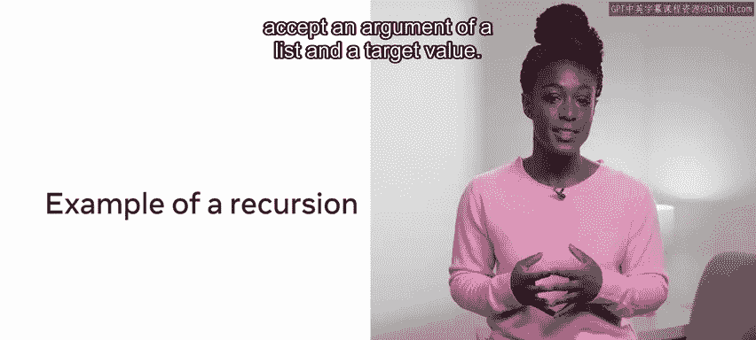

# 数据库工程师：P148：递归

## 概述

在本节课中，我们将要学习递归的概念及其实现方法。递归是编程中一种重要的技术，它允许函数调用自身来解决问题。我们将探讨递归的三个核心要求，并通过具体示例来理解其工作原理和应用场景。

---

## 从循环到递归


在之前的视频中，你学习了分治范式。本节中，我们来看看递归以及如何实现递归解决方案的要求。

任何编程语言的基本能力之一就是执行循环。循环使我们能够重复执行操作，直到获得期望的输出。与人类不同，计算机永远不会厌倦重复执行相同的单调任务。


除了循环之外，解决问题的另一种方法是递归。让函数调用自身的做法被称为递归，这也是本视频的重点。


递归是指一个函数反复调用自身来处理一个更小规模的问题实例，直到满足某个退出条件。

---

## 递归的三个要求

那么实现递归需要什么？实现递归解决方案有三个要求，即：基本情况、递减结构和递归调用。

让我们看一个与二进制相关的例子，以便更好地说明这三个要求。

考虑一个挑战，你的任务是计算一个数的指数。回想一下，计算一个数的指数是为了确定从它可以推导出多少种可能的排列。这在演示二进制如何表示一系列字符时讨论过。

以下是实现递归的三个核心组件：

1.  **基本情况**：确保函数不会无限调用自身，并最终结束。
2.  **递减结构**：每次递归调用时，问题规模都应减小。
3.  **递归调用**：函数在其定义内部调用自身。

让我们通过一个计算指数的函数来具体看看：

```python
def exponent(x, n):
    if n == 0:          # 基本情况
        return 1
    else:               # 递归情况
        return x * exponent(x, n-1)  # 递归调用，n-1是递减结构
```

*   **第1行**定义了一个接受两个参数 `x` 和 `n` 的函数。
*   **基本情况**是 `if n == 0`。在这种情况下，程序将终止并返回1（任何数的0次方都是1）。
*   **第4行**是条件语句的第二部分。如果尚未达到终止点，则使用一个缩减后的结构再次调用该函数。
*   在这个例子中，目标是将 `x` 乘以 `n` 次，以找出二进制数可能存在的总状态数。

减少输入值与建立基本情况同样重要。这样，函数最终会达到基本情况并停止调用自身。

递归函数的第三个组成部分是包含对自身的调用。这发生在第5行，`exponent` 函数接受了递减后的结构（`n-1`）。

之所以说结构是递减的，是因为其规模在每次调用中都减小了。每次调用函数时，都会在调用栈上创建一个新的实例。

用 `x=2` 和 `n=3` 调用上述函数将导致创建三个实例并放置在调用栈上。

这会增加计算成本，因为调用函数需要资源。然而，每个结果的计算都将保留在调用栈上。这在计算层次性问题或可以从了解哪些步骤导致特定结果（如图遍历）中受益的问题时非常有用。


---

## 递归的应用示例



让我们探索一个递归的使用示例。考虑关于二分查找的视频。

一个二分查找函数将接受一个列表和一个目标值作为参数。


首先，检查列表的中点元素，以确定要检查列表的哪一半。重复此过程，直到找到目标元素或确定其不存在。

你可能会考虑通过循环或递归来解决这个问题。递归的输入将是一个列表和一个搜索元素，递归函数将调用自身直到达到目标端点。

---

## 为何使用递归？

那么，既然简单的循环就能做到，为什么还要使用递归呢？有些问题非常适合递归调用。

考虑计算给定数字的斐波那契数。斐波那契数列是一个数字序列，其中前两个数字是0和1，之后的每个数字都是集合中前两个数字的和。

计算过程涉及传入一个数字，计算结果，更改数字，然后用一个新的整数输入再次调用函数。

以这种方式编写代码意味着你可以简单地用不同的整数调用该函数，它将返回所需步骤的分解。可读性是递归的一大优点。有时，当一个问题需要多次检查时，循环可能很快变得笨拙。

递归解决方案减少了解决问题所需的代码量，并且可能更易于阅读和理解。

最后，人们会采用递归方法作为分治解决方案的一部分。在这里，问题被分解成更小的步骤并重复执行，以找到最优解。


---

## 总结

本节课中，我们一起学习了递归。你已经了解到，虽然递归可能会给问题增加一些计算开销，但它也能产生优雅、易于阅读的代码。此外，递归体现了分治解决方案的精髓，即将问题分解为其最小的组成部分并解决它们。