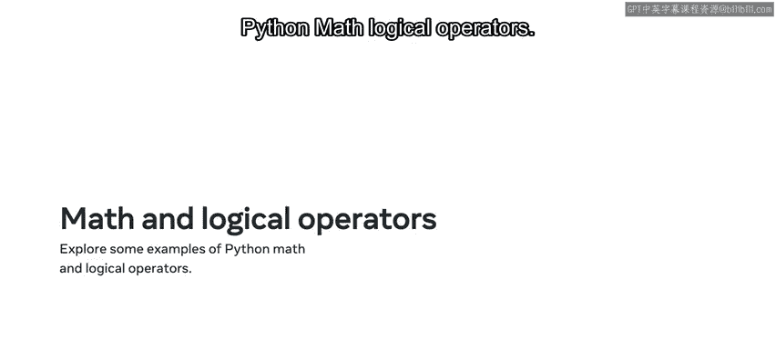
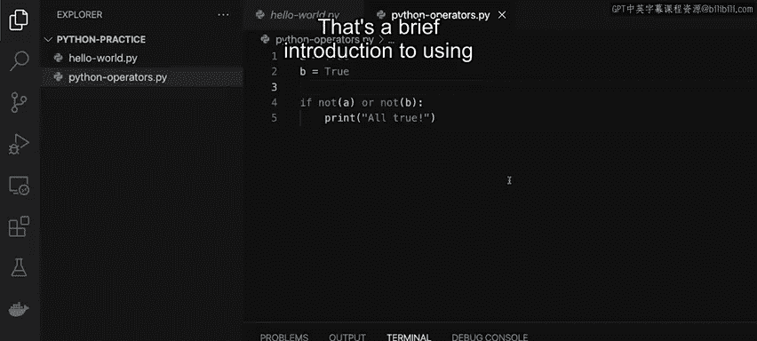

# Python编程基础：P14：数学与逻辑运算符 🧮

在本节课中，我们将要学习Python中的运算符。运算符是告诉Python执行特定操作的符号，就像现实生活中的路标一样。它们可以帮助我们进行数学计算、逻辑判断，从而控制程序的流程。理解运算符是编写有效Python代码的基础。

## 什么是运算符？

运算符是告诉Python执行特定操作的符号。你可以把它们想象成现实生活中的路标。例如，假设你正在一条危险的路上行驶，你看到一个警示牌要求减速，然后遇到一个停车标志，最后是一个指示你右转的标志。你可能没有意识到自己正在一条危险的路上，但这些符号通过指示你执行特定操作来保证你的安全。同样地，当Python在代码中遇到你放置的运算符时，它也会执行那个特定的操作。这些操作可以是数学运算、逻辑运算和比较运算。

## 数学运算符

上一节我们介绍了运算符的基本概念，本节中我们来看看数学运算符。数学运算符用于简单和复杂的计算，本质上与标准计算器上的功能相同。

以下是Python中常用的数学运算符及其用法：

*   **加法运算符 (`+`)**: 加号是相加数字时必须使用的符号。例如：`2 + 3`。
*   **减法运算符 (`-`)**: 使用减号来相减数字。例如：`3 - 2`。
*   **除法运算符 (`/`)**: 用于除法的符号是正斜杠。除法是一个数除以另一个数的运算。例如：`35 / 5`。
*   **乘法运算符 (`*`)**: 用于乘法的符号是星号或星键。用它来使数字相乘。例如：`7 * 4`。

## 逻辑运算符

了解了基本的数学运算后，我们进入逻辑判断的领域。逻辑运算符在Python中用于条件语句，以确定结果为真（True）或假（False）。

以下是Python中主要的逻辑运算符：

*   **与运算符 (`and`)**: 此运算符检查所有条件是否都为真。例如：`a > 5 and a < 10`。
*   **或运算符 (`or`)**: 此运算符检查至少有一个条件为真。例如：`a > 5 or b > 10`。
*   **非运算符 (`not`)**: 此运算符在结果为真时返回假值。例如：`not (a > 5)`。

运算符通常与条件语句结合使用，以控制满足特定条件的程序流程。例如，假设一家餐厅根据以下两个条件提供折扣：客户是否是忠诚计划成员，以及消费是否超过100美元。为了确定这一点，你可以使用逻辑运算符编写代码来检查客户是否在忠诚计划中以及他们是否消费超过100美元。你将在后续课程中了解更多关于条件语句的内容。

## 实践演示

现在，让我演示如何在Python中使用数学和逻辑运算符。

### 数学运算符示例

数学运算符基本上提供了与标准计算器相同的功能，因此你可以执行加法、减法、除法和乘法等操作。

我从一个简单的加法示例开始。我使用`print`语句，以便输出显示在我的控制台中。我输入`print`，然后在括号内加上`2 + 2`，我期望返回的值是`4`。当我运行此语句时，终端中显示的值是`4`。

对于减法，我将加号改为减号。我点击运行按钮，显示的值是`0`。如果我计算`2 - 2`，答案是`0`。

对于除法，我将减号改为正斜杠。我在括号内输入`35 / 5`。我点击运行按钮，结果是值`7.0`。请注意，返回的值是浮点数（float）而不是整数（integer）。

现在让我们介绍乘法。我将正斜杠改为代表乘法的星号。我输入`25 * 5`。我点击运行按钮，得到返回值`175`。

### 逻辑运算符示例

以上是对数学运算符的简短介绍，接下来你将探索逻辑运算符。逻辑运算符用于控制应用程序的流程，逻辑运算符是`and`、`or`和`not`。让我们介绍每种的不同组合。

在这个例子中，我声明两个变量：`A = True` 和 `B = True`。基于这些变量，我使用一个`if`语句。我输入 `if A and B:`，在下一行我输入 `print`，并在括号和双引号内输入 `"all true"`。你很快就会学到`if`语句。但现在，只需知道只有当`A`和`B`都为真时，才会执行此`print`语句。终端中显示了`"all true"`的打印语句。

如果我将`B`的值改为`False`并再次运行该语句，则不会打印任何内容。原因是`and`语句作为一个条件，需要`A`和`B`都为真，它才会打印出该语句。

现在让我们介绍`or`运算符。所以我把`and`改成`or`，然后点击运行按钮。`"all true"`值再次被打印出来，原因是对于`or`运算符，如果`A`或`B`中有一个为真，`if`语句就为真。

如果我将两个变量的值都设置为`False`并点击运行按钮，则不会打印任何内容。这是因为`A`为假且`B`为假，所以`if`语句中的条件未得到满足。

在最后一个例子中，我将演示`not`运算符。我将保留`or`运算符，然后输入 `if (not A) or (not B):`。我点击运行按钮，返回的值是`"all true"`。它的作用是寻找`A`的否定，所以`not A`（不是假）就是真，以及`B`的否定，结果也是真。`or`条件检查其中任何一个是否为真。

现在我将`A`和`B`都改为`True`。我点击运行，没有打印任何内容。原因是它再次检查`if not A`，本质上是如果`A`不为真。在这种情况下，`A`为真，其否定为假，所以它不会满足那个条件。或者`not B`也导致假，同样不满足那个条件，因为两者都是真的否定。这仍然不会打印出任何值，因为同样，没有任何条件得到满足。

这就是在Python中使用数学和逻辑运算符的简要介绍，恭喜你。

## 总结

本节课中我们一起学习了Python中的数学和逻辑运算符。数学运算符（`+`, `-`, `/`, `*`）用于执行基础算术运算。逻辑运算符（`and`, `or`, `not`）则用于组合条件，进行布尔逻辑判断，是控制程序流程的关键。掌握这些运算符是编写更复杂Python程序的第一步。如果你想了解更多关于Python中数学运算符的信息，本课末尾有额外的阅读材料。