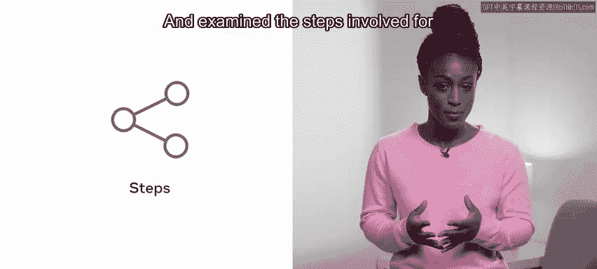
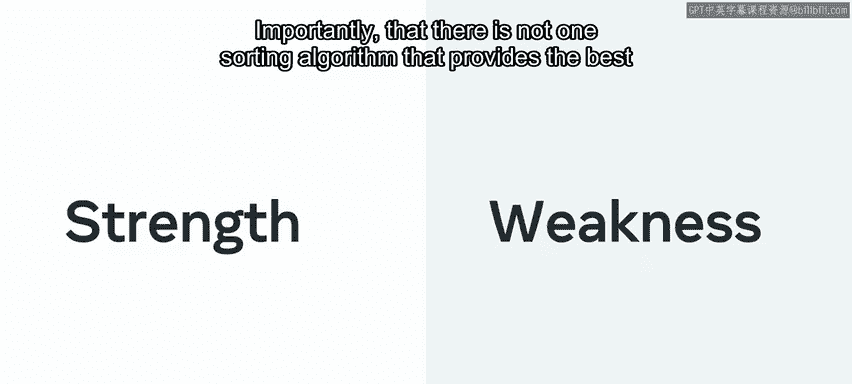
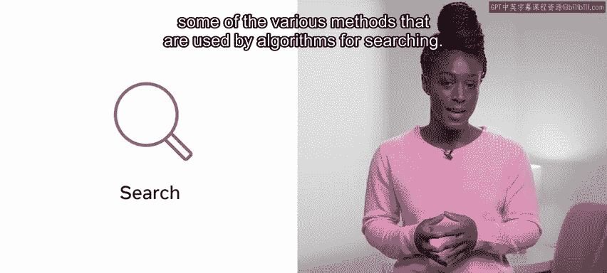
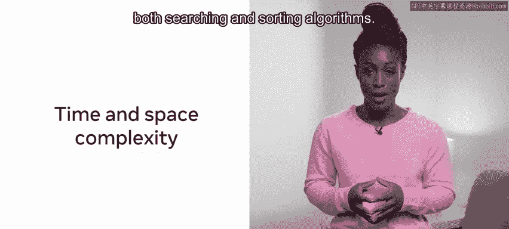
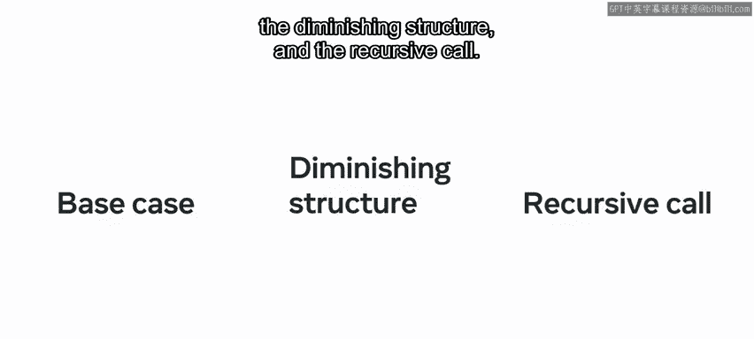
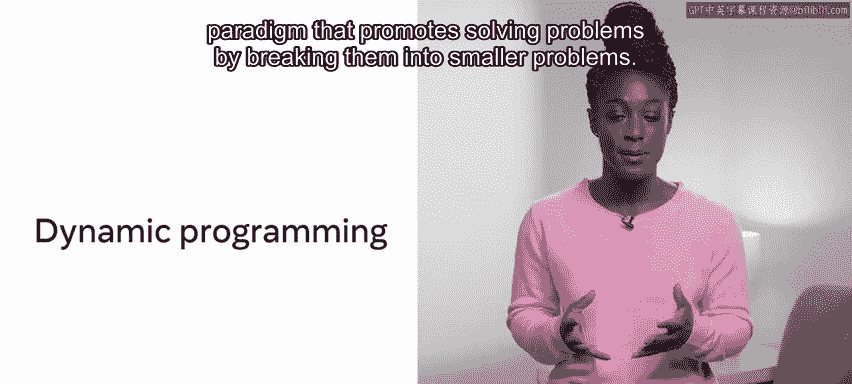
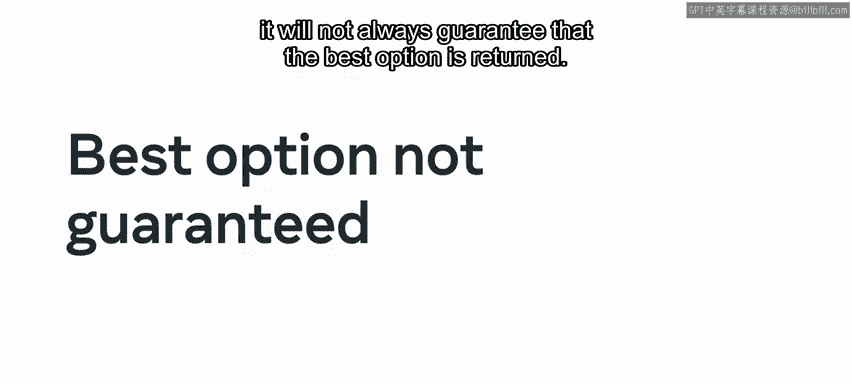

# Meta《数据库工程师（Python／数据库客户端／高阶数据建模／毕业项目／面试）｜Meta Database Engineer》中英字幕 - P151：24_模块小结 算法介绍.zh_en - GPT中英字幕课程资源 - BV1pZ421a749

Well done， you've reached the end of the Work with algorithmgoris module。

Let's take a few moments to review what you learned during this module。

He began the module with a lesson on sorting and searching。First。

 you learned about why sorting is important and explored the three main methods for sorting。

 selection， insertion and Quick sort。😊。

And examined the steps involved for each method that these algorithms use to sort data。

And explored the strengths and weaknesses of the three sorting approaches when choosing an algorithm to use for a given solution。

 importantly， that there is not one sorting algorithm that provides the best results in every given scenario。

Next， you learned about searching algorithms， which are a fundamental concept in computer science and some of the various methods that are used by algorithms for searching。

You explored two core approaches to searching Linear and binary。

 Linear searches progress through every item in a given data structure until a specific item is found。

 whereas binary searches half the search space at each iteration。

He also learned the steps involved in implementing both approaches and some of the advantages they offer。

You also took a deep dive into time and space complexity for both searching and sorting algorithms。

You then moved on to the next lesson where you were introduced to working with algorithms。

 Here you learned about different approaches to working with algorithms。 First。

 you explored the divide and conquer paradigm。 In the divide step。

 the input is split into smaller segments and processed individually。In the con step。

 every task associated with a given segment is solved。😊。

And the optional last step combining is combining all the solved segments。

 And you discovered how the divide and conquer technique offers an effective framework for problem solving and the various benefits that it provides。

Next， you explored another important algorithmic approach。 recursion。

 recursion is when a function calls itself with a smaller instance of a problem repeatedly until some exit condition is met。

😊，And you learned that there are three requirements for implementing a recursive solution。

 namely the base case， the diminishing structure and the recursive call。

You were then introduced to dynamic programming， which is a programming paradigm that promotes solving problems by breaking them into smaller problems。

You explored the concept of memorization， the technique of solving sub problems and storing them to save time on a potential future search。

And to examine the process involved to compute a dynamic programming solution，Essential。

 this can be outlined as first， determining the objective function。

That is the description of what the optimum outcome is to be。 Next。

 breaking the problem into smaller steps and then deciding which dynamic programming approach you would like to apply to achieve your desired outcome。

Finally， you learned about greedy algorithms in comparison to the dynamic programming approach。

 a greedy approach would look at the list of solutions and implement a local optimization。😊。

Usually the current most rewarding option is chosen。

You've explored how a greedy algorithm approach could be implemented to reach a solution。

And that there is a trade off when choosing a greedy approach over a dynamic one。

 While the overhead for a greedy algorithm is low and coding a solution is quite straightforward。

 it will not always guarantee that the best option is returned。

With all the knowledge you have acquired， all that is left is to complete the final quiz for this module before moving on to the final module where you will complete the graded assessment。

😊，And then you've really made it。 You're so close。 Good luck and enjoy the rest of your journey。😊。

