# 数据库工程师（Python／数据库客户端／高阶数据建模／毕业项目／面试）：P152：课程回顾

在本节课中，我们将对课程所涵盖的一系列核心概念与技能进行回顾总结，为你准备编程面试提供清晰的脉络。

## 概述

本课程旨在帮助你为编程面试做好准备。我们学习了从面试技巧、计算机科学基础，到数据结构和算法的广泛内容。接下来，我们将分模块回顾这些关键知识点。

## 模块一：编程面试准备

上一节我们介绍了课程的整体目标，本节中我们来看看第一个模块，它专注于编程面试本身。

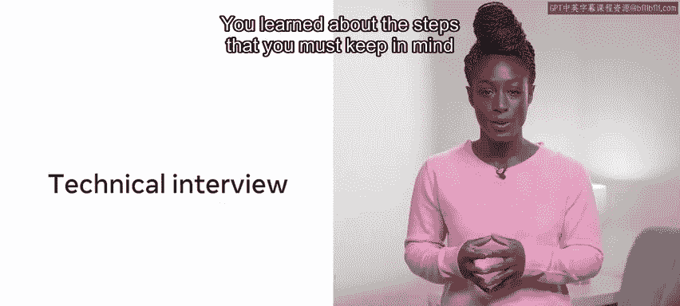

你首先了解了什么是编程面试、其可能包含的形式以及你可能遇到的不同面试类型。

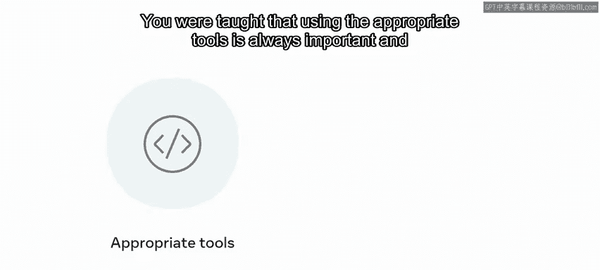

第一课聚焦于技术性编程面试，其主要目的是确认你是否具备承担岗位职责的技术能力。

你学习了在这种面试进行时必须牢记的步骤。

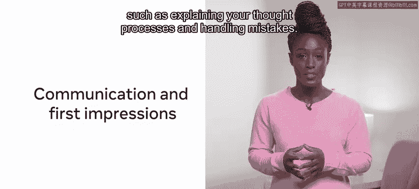

课程强调，使用合适的工具始终很重要，并且你必须将时间限制牢记在心。

你还探索了如何为编程面试做准备，以及第一印象的重要性，包括关注沟通技巧，例如解释你的思维过程和处理错误。

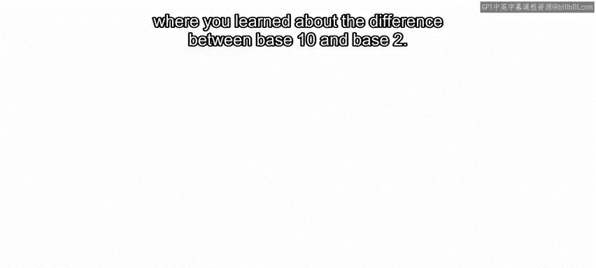

你学习了STAR方法，以及如何在与面试官沟通时利用它来获益。

你也学习了如何使用伪代码来演示你如何得出解决方案。

以下是关于实际解决方案设计的一些重要技巧，以及如何测试你的解决方案。

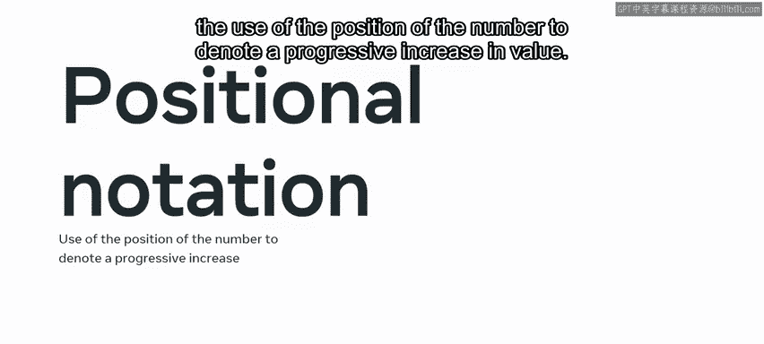

## 模块二：计算机科学基础

在下一课中，你开始接触计算机科学，首先是对二进制系统的概述，你学习了十进制（B10）和二进制（B2）之间的区别。

接着你发现了位置记数法，即利用数字的位置来表示数值的递增。

然后你继续探索了计算机内存的关键组件及其工作原理。

你现在应该知道为了更好地理解内存的各个层次，并且应该能够描述它们之间的差异。

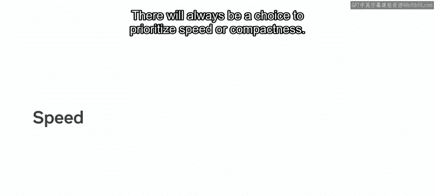

你学习了传输速率，即计算机将内存传输到缓存进行处理的速度。

接着你转向了时间复杂度，学习了如何通过完成任务所需的时间来评估时间效率或衡量性能。

你发现了大O表示法，这是一种用于确定算法效率的度量标准。

你探索了空间复杂度，这本质上是计算结果所需的空间。

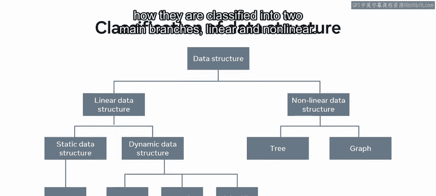

并且关于空间复杂度的决策不仅基于算法的速度，还基于给定解决方案将使用多少内存容量。

在速度和紧凑性之间总是需要做出权衡选择。

## 模块三：数据结构

在第二个模块中，你学习了数据结构。这涵盖了从字符串、布尔值或数组等基本数据结构，到集合、图和堆等更高级的数据结构，以及每种数据结构带来的特定优势和限制。

你探索了所有类型的数据结构，以及它们如何被分类为两个主要分支：线性和非线性。

接下来，你被介绍了栈和队列，这两种抽象数据结构在元素的添加和移除方式上都有特定的特性。

当你学习队列时，你了解到队列与栈非常相似，它们往往具有相同的方法：创建、插入、移除和检查队列状态。与栈不同，队列基于**先进先出（FIFO）**的原则工作。

最后，你发现树是一种强大的数据结构，它在添加和搜索值方面提供了极大的灵活性。

在此之后，你继续研究了一些高级数据结构，即哈希表、堆和图。

接着，你探索了堆。你发现了堆如何用于将元素从最不重要到最重要进行组织，以及通过限制堆的功能，如何提高生产力。

最后，你研究了图。这种结构图示了一个由节点（表示目的地）和边（显示每个节点如何与另一个节点相关联）组成的图。节点之间存在值，意味着这是一个**加权图**。没有箭头存在，意味着这是一个**无向图**，与有向图形成对比。无向图没有优先顺序。

你了解到，在有向图中，如果边是单向的，则连接被认为是弱连接的。然而，如果两个节点之间存在双向连接，则称其为强连接。

## 模块四：算法

在第三个模块中，你初步了解了算法，包括可用的算法类型，以及如何最好地使用它们来排序和搜索你的数据。

你首先探索了排序算法，以及使用已排序数据或能够对自有数据进行排序如何能显著节省时间。

你发现了排序的重要性，并探索了三种主要的排序方法：选择排序、插入排序和快速排序。

接下来，你继续发现了搜索算法，以及每种类型如何为解决问题提供自己的框架。

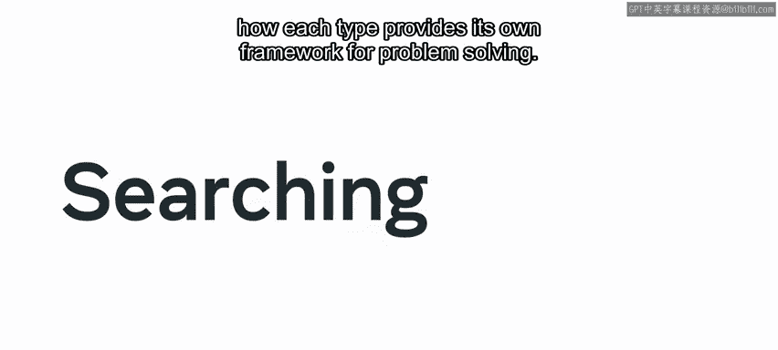

你探索了两种核心的搜索方法：线性和二分。

*   **线性搜索**：遍历给定数据结构中的每一项，直到找到特定项。
*   **二分搜索**：在每次迭代中将搜索空间减半。

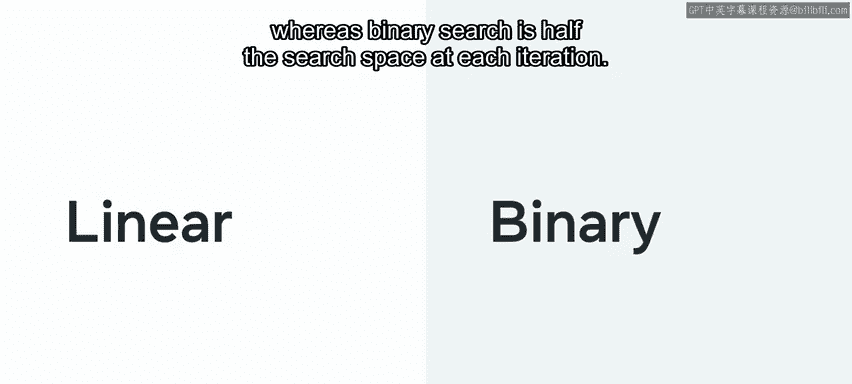

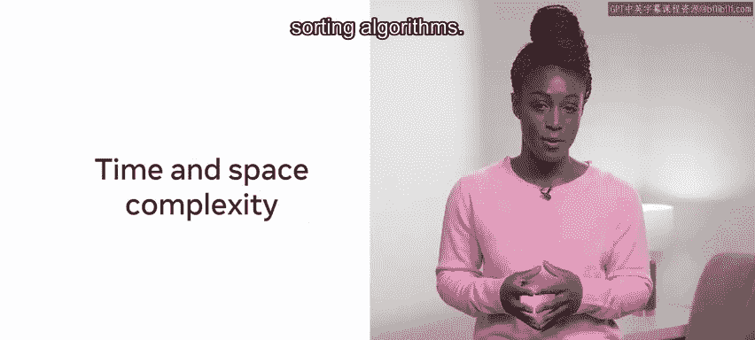

你还深入了解了搜索和排序算法中的时间和空间复杂度。

然后你进入最后一课，该课介绍了如何使用算法。

在这里，你学习了处理算法的不同方法。

首先，你探索了**分治范式**。你了解到，在“分”的步骤中，输入被分割成更小的段并单独处理。在“治”的步骤中，解决与给定段相关的每个任务。可选的最后一步“合”是组合所有已解决的段。

接下来，你探索了另一个重要的算法方法：**递归**。

递归是指一个函数用问题的较小实例反复调用自身，直到满足某个退出条件。

你了解到实现递归解决方案有三个要求：**基本情况**、**递减结构**和**递归调用**。

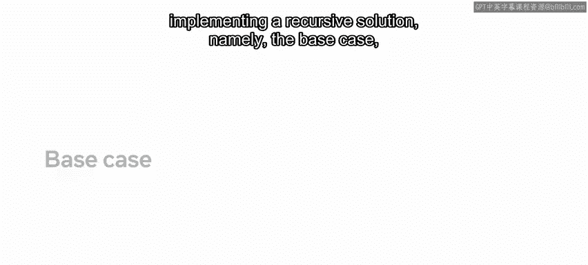

接着你被介绍了**动态规划**，这是一种通过将问题分解为更小问题来促进解决问题的编程范式。

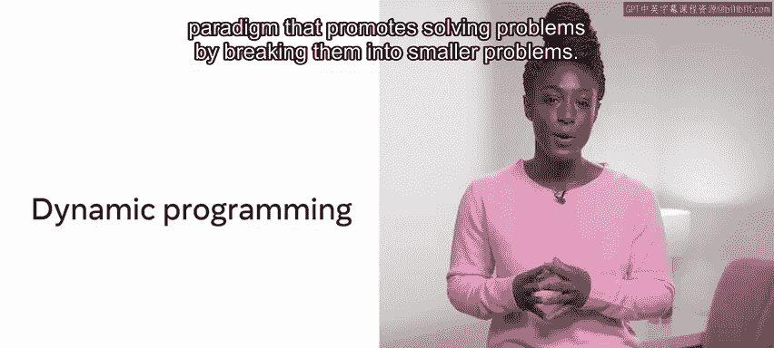

你检查了计算动态规划解决方案所涉及的过程。

本质上，这可以概括为：首先，确定**目标函数**，即描述什么是最佳结果。接着，将问题分解为更小的步骤，然后决定你希望应用哪种方法来实现期望的结果。

最后，你学习了**贪心算法**，并与动态规划方法进行了比较。

贪心方法会查看解决方案列表并实施局部优化。通常，会选择当前回报最高的选项。

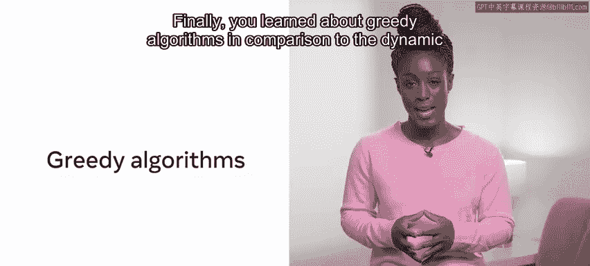

你看到了一个示例，说明如何实现贪心算法方法来达成解决方案。

虽然贪心算法的开销较低，并且编码解决方案相当直接，但它并不总是保证返回最佳选项。因此，在选择贪心方法而非动态方法时存在权衡。

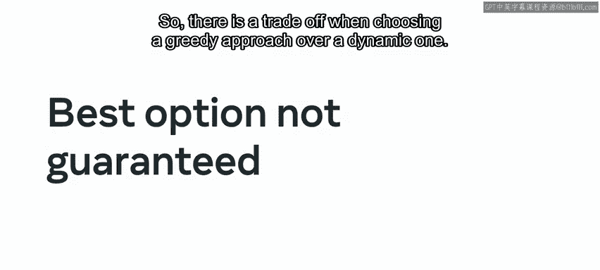

## 总结

在本节课中，我们一起回顾了贯穿本课程的许多重要概念和方法。这是一个真正的成就，它也应该为你可能参加的任何潜在编程面试做好准备。

你剩下要做的就是在结束课程之前完成最终的课程测验。祝你好运。