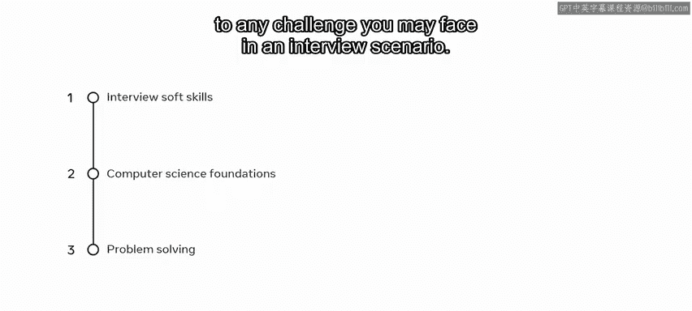
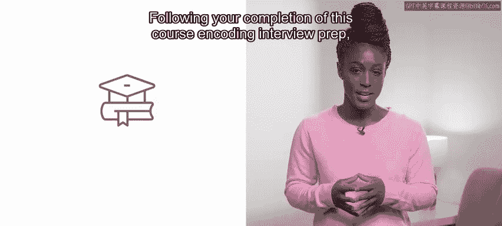
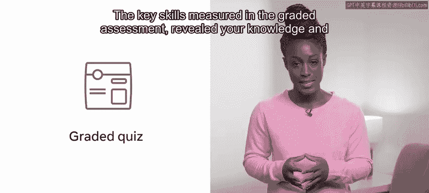
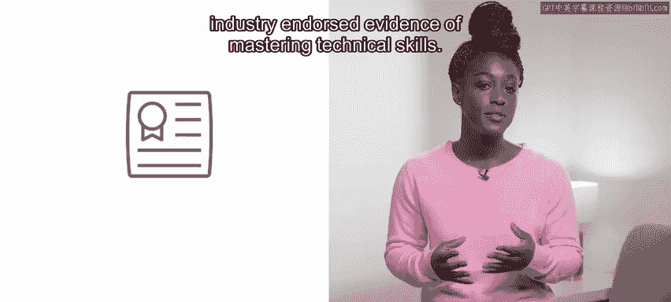

# 数据库工程师：P153：26_课程总结

在本节课中，我们将对编码面试准备课程进行总结，回顾所学知识，并展望未来的学习与发展路径。

你已经完成了这门编码面试准备课程。你付出了巨大的努力，并在此过程中积累了丰富的知识。你在开发者的旅程中取得了巨大的进步。

现在，你应该理解编码面试独特且具有挑战性的方面。具体来说，你应该为面试做好充分准备，掌握一些有助于你在面试中表现出色的软技能。你还掌握了计算机科学的基础知识，以及一些可以应用于任何面试挑战的问题解决方法。

## 🎯 课程核心收获

上一节我们回顾了学习历程，本节中我们来看看完成本课程后你应具备的核心能力。

完成本课程后，你现在应该能够：
*   为整个面试流程做好准备。
*   提供成功的面试策略与技巧。
*   坦然讨论面试过程中的情绪因素。

## 🔑 关键技能评估

以下是课程评估中衡量的关键技能，它们揭示了你的知识与理解水平：

*   **数据结构**：在编码面试情境下理解与应用数据结构。
*   **算法**：掌握算法的概念与使用方法。
*   **算法可视化**：学会将算法过程可视化以辅助理解。
*   **模式组合**：能够结合新学的和已掌握的编码模式来解决问题。

## 🚀 继续你的旅程

恭喜你，你已经成功完成了本专业的所有课程。在此阶段，你可以考虑注册其他课程、专业或证书路径。

证书是全球公认且受行业认可的、掌握技术技能的证明。无论你是刚起步的技术专业人士、学生还是商业用户，你所完成的课程以及作品集中的一系列实践项目，都将证明你作为开发者的知识与能力。这些证书可以向潜在雇主展示你的技能。它不仅向雇主表明你具有自我驱动力和创新精神，也充分体现了你个人的特质以及新获得的知识。

到目前为止，你做得非常出色，应该为自己的进步感到自豪。你迄今为止获得的经验将向潜在雇主证明，你积极主动、能力出众，并且不畏惧学习新事物。

再次祝贺你完成本课程，并祝你在接下来的学习旅程中一切顺利。

## 📝 总结

本节课中我们一起学习了课程的核心总结。我们回顾了你在编码面试准备方面取得的成就，明确了完成课程后应掌握的关键技能，并探讨了如何利用这些成果继续你的职业发展与学习之路。请带着这份知识与自信，迎接未来的挑战。