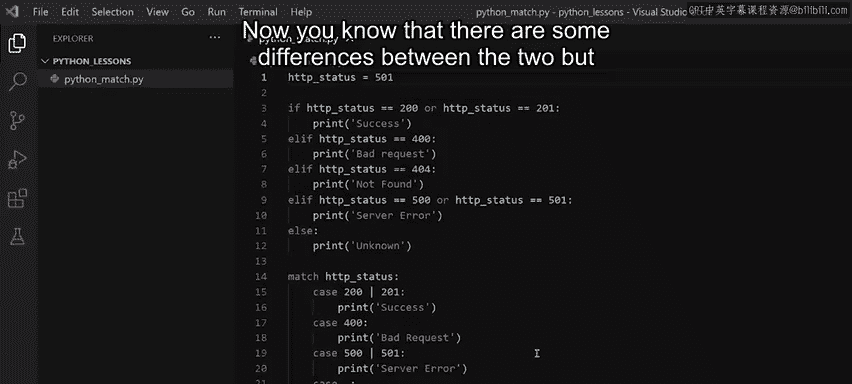

# Meta《数据库工程师（Python／数据库客户端／高阶数据建模／毕业项目／面试）｜Meta Database Engineer》中英字幕 - P16：15_switch语句.zh_en - GPT中英字幕课程资源 - BV1pZ421a749

You may recall how to use the if， else and else if statements to test a variable against a few conditions。

But on some occasions， you will have to test a variable against many conditions。😊，To deal with this。

 you can use something called a match case statement。😡，In this video。

 you'll learn how to use a match statement as an alternative to an if statement。😊。

Now let's consider an example to compare the match statements to the if statement。

Say you want to write code to print HTTP error messages according to error codes。

To do this with the if statement， you would have to write the if condition。

 all the alternative if else condition and finally an else condition conditional statements like if。

 L if and else work well over a small number of conditions， but over a large number of conditions。

 your code can get large complex and messy。😊，Fortunately。

 there is a cleaner way to achieve the same result using the match statement。

 the match statement in Python was introduced in version 3。10。😊，Using the match statement。

 you can achieve cleaner， more readable code that allows all the same functionality as the if control statement。

😡，When using match statements， there are a few things to remember。

You can combine several conditions by using the or operator in the conditional statement。

The default is essentially the final outcome if nothing is found in the case checks。

It's the equivalent to the else in the if blocks let me demonstrate this example now using BS code。

Okay， so I've written a simple if statement that checks for an HTTP status code。

If the value of the variable HTTP status matches one of the conditions。

 it will print out the equivalent message。😊，I'm now going to add a match statement below the if statement。

For a clear comparison， I will test the same variable against the same values。

I type match and then the variable， HTTP status and a colon。😡。

On the next line I type case which is the equivalent of the word if and the value of 200 on another line I repeat the action used the if statement for 200。

 which is to print the word success。So in other words。

 the variable is matched against the value of 200 and the if values are equal。

 it will print out the word success。😊，Notice that the value of HTTP status is indeed 200 at the moment。

So let's run the code to test how the if and match statements are processed in the terminal the word success is printed twice because the value of HTTP status is matched twice in my code run once for the if statement and once for the match statement。

Now let's change the value of HTTP status to 201 and run the code again。In this case。

 success is only printed once， why do you think that happens？😊。

Because there is an all condition for the value of 201 in the if statement。

 but none in the match statement。😊，To do the equivalent in the match statement。

 you use the or operator， so I place my cursor in between 200 and the colon and add an all character and the value of 201。

I clean my screen by using CLS and then click on Run again。😡，Now success is printed twice again。

So in the match statement， the pipe command is shorthand for if。😡，Or。

The great thing is that you can add many case statements in a match statement。😊。

But what if none of the values match the variables's value？😊。

Now let's change the value of HTTP status to the value of say， 550 and explore what happens。

I click on run and this time the word unknown is printed。You may be wondering why that is。😡。

Because the L statement is like a catch all。😡，If the value does not match anything within the if or the L if statements。

 the default will be the L statement， which in this case has a print function for the word unknown。😡。

Well， the match statement also has a default class and you add it by typing the word case underscore colon and on the next line print unknown。

Let's run the code again。Great， the output is unknown， unknown。

 which means that the default statement in both the if as well as the match statement was actioned。

My match statement is coming along well， but it still needs a few tweaks to make it act exactly like the given if statement To do that I'll add a few more case statements that will test for the same values as the L if statements。

😊，I type case 400 colon and then I add a print command with the words badd request。

I add another case and the value of 500， and I also need to test for 501。

 like in the LF statement above。So once again， I add an all character and type 501 colon。😊。

On the next line， I add the error message that I want to print， which is server error。

The match saves a bit of space by combining the or statement。

 so you don't have to do a comparison against a variable each time like in the if statement。😡。

Let's change the value of HTTP status one more time to 501。

I just clear the screen again and click on Run and server error is printed for both statements。

Now you know that there are some differences between the two。

But the match statement does exactly the same as the if statement。😡，In summary。

 the match statement compares a value to several different conditions until one of these conditions is met。

😊。

So you now know how to use the match statement as an alternative to the if statement to test the variable against many possible values。

The match statement is relatively new to Python， prior to version 3。

10 developers had to get creative and code to their own solutions。😊。

You'll learn more about those alternative methods later in this lesson。

