# Meta《数据库工程师（Python／数据库客户端／高阶数据建模／毕业项目／面试）｜Meta Database Engineer》中英字幕 - P19：18_模块小结 Python入门.zh_en - GPT中英字幕课程资源 - BV1pZ421a749

Congratulations on reaching the end of control flows and conditionals and the end of the module on getting started with Python。

Let's recap what you've learned。So now you know how to explain the history of programming and how it works in a general sense。

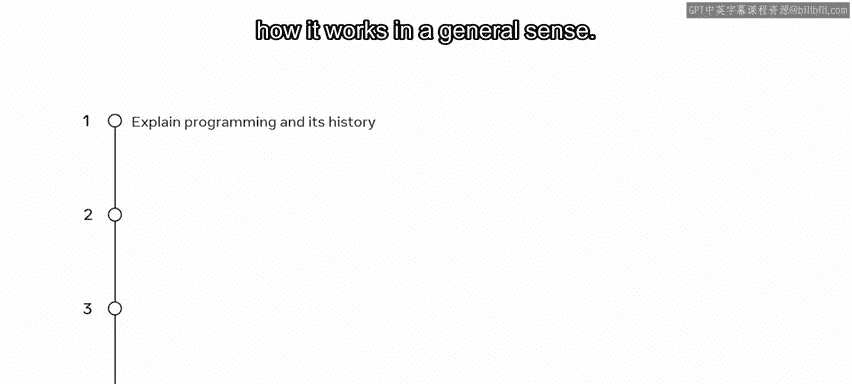

Describe the benefits of Python and where it's used。

Evaluate if your system is set up correctly for Python development。

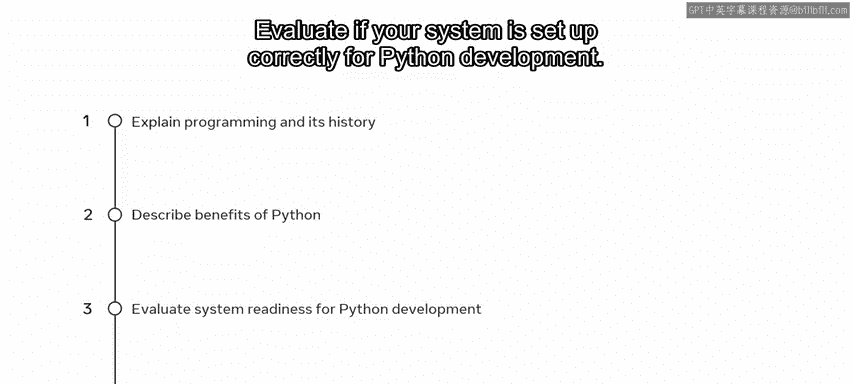

Identify the differences of running code from the command line via the IDE。

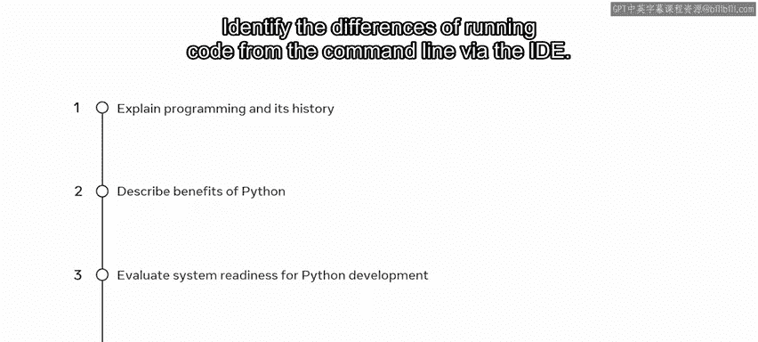

Explain the importance of syntax in space in Python。😡。

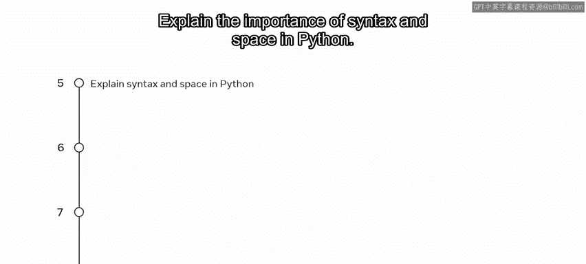

Describe what variables are and how they are used。😡。

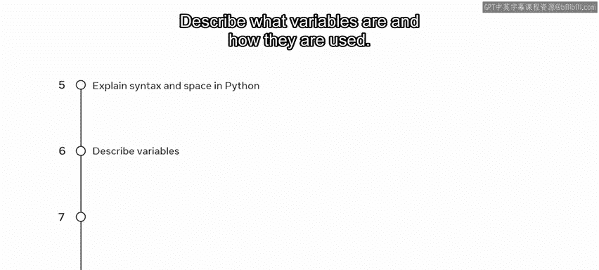

Identify data types in Python。Explain how to declare and use strings。

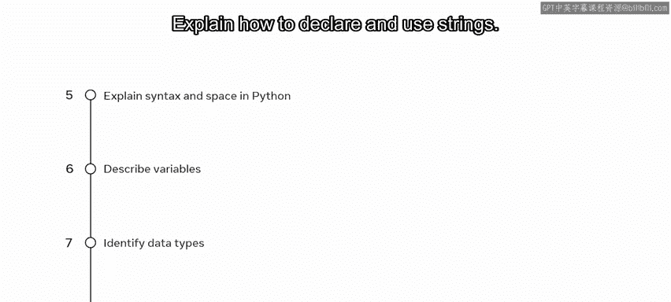

Describe the two types of casting and how to apply them。

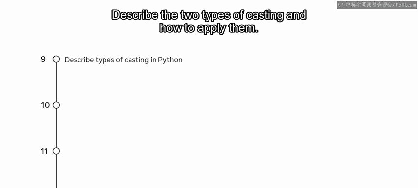

Describe the basics of user inputs and console outputs。😡。

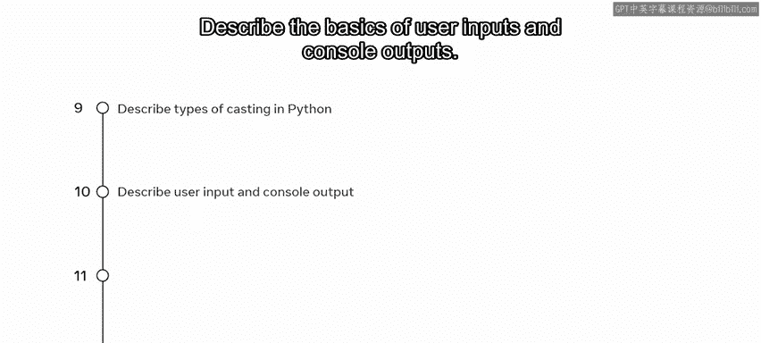

Recognize math and logical operators in Python。😡。

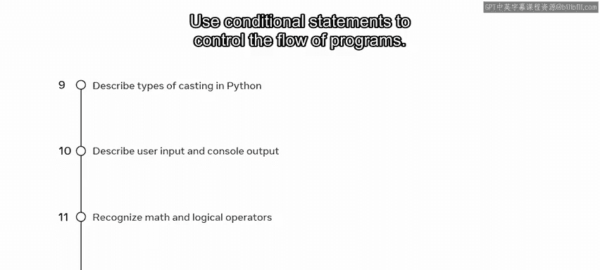

Use conditional statements to control the flow of programs。

Use match case statements as an alternative to if statements。

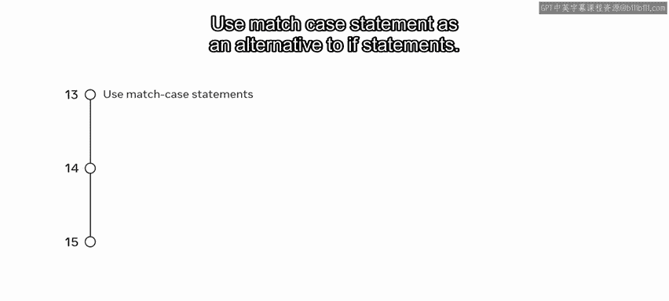

Explain looping constructs and how to use them。

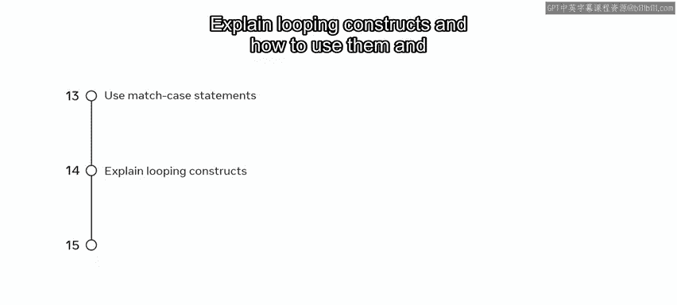

And explain nested loops and how they work。You've learned a lot about the structure and rules that guide Python and now you're ready to create programs。

 great work， see you next time。