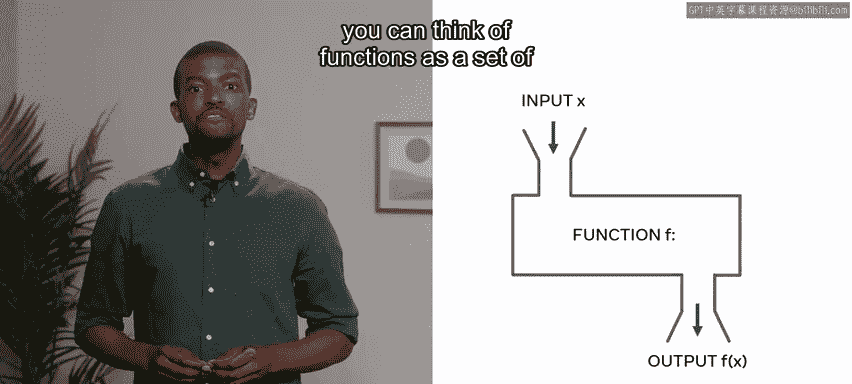
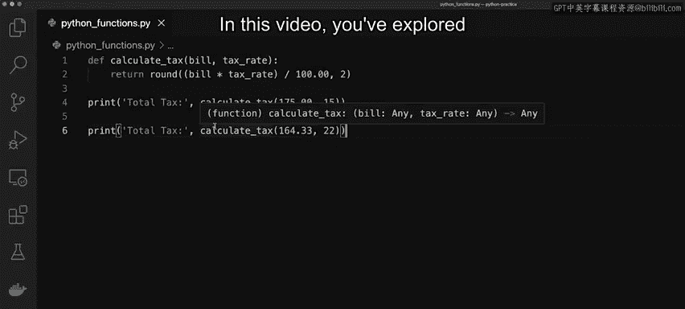

# 数据库工程师（Python／数据库客户端／高阶数据建模／毕业项目／面试）：P20：函数



在本节课中，我们将要学习Python中的函数。函数是编程中的核心概念，它允许我们将代码组织成可重用的模块，从而提高代码的效率和可读性。

## 🧩 什么是函数？

在最基本的层面上，函数可以被视为一组指令，它接收输入并返回输出。

例如，`print`函数的主要任务是打印一个值。这个值通常被打印到屏幕上，并作为参数传递给`print`函数。在我们这里的例子中，字符串“hello world”就是传递给`print`函数的值。

在本视频结束时，你将能够：
*   在Python中声明一个函数。
*   向函数传递数据。
*   从函数返回数据。

## 🔧 如何声明函数？

上一节我们介绍了函数的基本概念，本节中我们来看看如何声明一个函数。

一个Python函数是一个模块化的代码块，可以被重复使用。在本课程中，你已经使用过一些Python函数，例如`print`和`input`。两者都是函数，并且各自都有要完成的特定任务或动作。`input`函数会接受参数，但也会接受来自用户的输入。


函数使用`def`关键字声明，后跟函数名和要完成的任务。可选参数也可以在函数名后的一对圆括号内添加。

以下是创建一个将两个值相加的函数的示例：
```python
def sum(x, y):
    return x + y
```
*   键入`def`关键字。
*   后跟函数名`sum`。
*   然后输入`x`和`y`作为参数。
*   最后输入`return x + y`作为要完成的任务。

## 💡 函数实战演示

现在我将对函数进行一个实际演示，展示如何声明它们、如何使用它们，以及它们如何通过将代码放入可重用的结构中来简化你的代码。

让我们从一个简短的例子开始，解释如何根据账单的总价值为客户计算税额。

我将从声明两个变量开始。我键入第一个名为`bill`的变量，并为其分配数字175.00。我知道这将是一种称为浮点数的数据类型，因为我使用了小数点，这是货币的惯例。

第二个变量是税率，这是应适用于账单的百分比税率。所以我输入15。

然后我想做的是计算账单本身的税额。我将其添加到另一个名为`total_tax`的变量中。然后进行计算，即`bill`乘以`tax_rate`，然后除以100以获得美元金额。为了输出这个值，我打印`total_tax`并传递`total_tax`变量，然后运行程序。

总税额是26.25，这是175的15%。在现实世界中，每个客户的账单价值都不同，税率也可能变化。每次更新每个变量是低效的。为了克服这个问题，我将创建一个可重用的函数。

要开始创建函数，我使用`def`命令。然后我会给它一个与其执行任务相关的名称，所以在这种情况下，它将是`calculate_tax`。使用函数，你可以传入参数，其目的是使其更具动态性。

因此，考虑我需要接收的参数，我将接收一个`bill`（账单本身的总价值），以及一个`tax_rate`（税率）。然后像之前一样，我将通过取`bill`，乘以`tax_rate`，然后除以100来计算总税额。

好的，然后我执行`return (bill * tax_rate) / 100`。

现在我可以删除之前为变量和计算所做的声明。对于函数，如果你按原样运行当前代码，它将不会返回任何内容，因为函数只有在实际被调用时才会运行。

我来演示一下。如果我执行一个`print`，我可以调用`calculate_tax`，然后像之前一样传递参数，175是总账单，税率将是15。

我还会放入一个`total_tax`，然后点击运行，总税率是26.25。

如果我想改变税率，我可以重用同一个函数。我将再次调用函数`calculate_tax`，给它一个不同的账单值，比如164.33。这次我将税率改为22%。清空屏幕，然后点击运行，我的第二项总税额是36.1526。

为了让输出更整洁、视觉上更吸引人，我将放入一个`round`函数，它允许控制我想要返回的小数位数。在这种情况下，我将设置为两位，然后重新运行代码。这样就整洁多了，结果是36.15。

函数的一个优点是，你可以一次性更新它，任何调用该函数的代码部分都会获得这些更改。



## 📝 总结

本节课中我们一起学习了Python中的基本函数，包括如何声明函数，以及如何向函数传递数据和从函数返回数据。函数是构建模块化、可维护代码的基石，掌握它们对任何程序员都至关重要。