# Python基础：P22：列表 🗂️

在本节课中，我们将要学习Python中一个非常重要的数据结构——列表。列表是存储和管理数据序列的强大工具，我们将了解它的基本概念、创建方法以及如何对列表进行增删改查等操作。

## 列表的基本概念

列表是一个包含一个或多个相同或不同数据类型的元素序列。在Python中，列表本质上是一个可以容纳任何数据类型的动态数组。

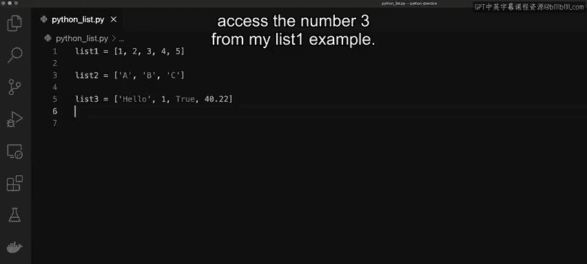

## 创建与访问列表

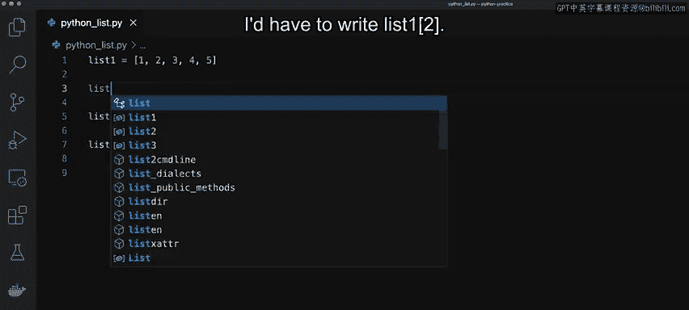

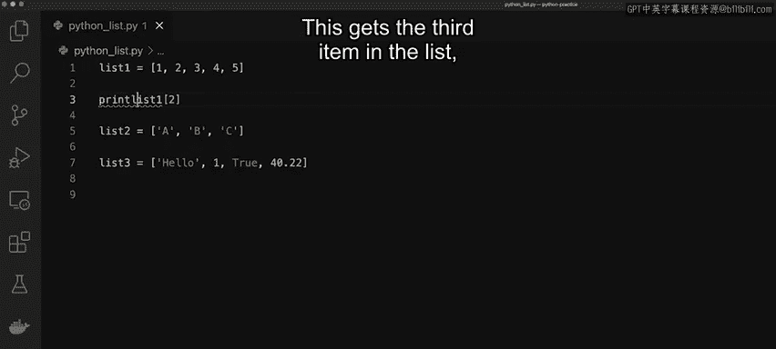

上一节我们介绍了列表的基本概念，本节中我们来看看如何创建列表并访问其中的元素。

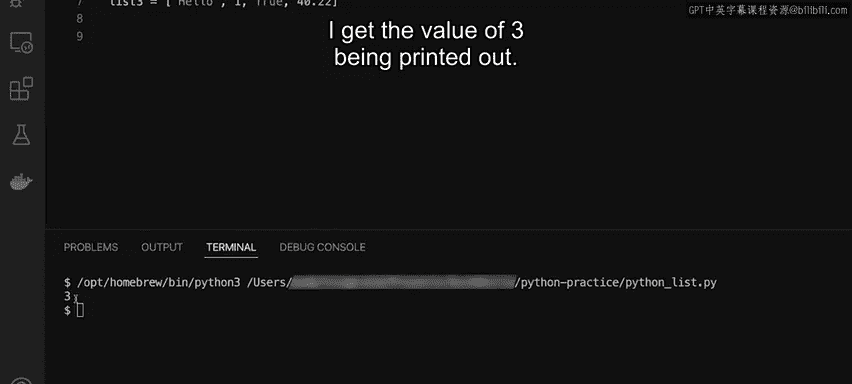

以下是声明列表的几种方式：
*   `list1 = [1, 2, 3, 4, 5]`：创建一个包含整数的列表。
*   `list2 = [“A”, “B”, “C”]`：创建一个包含字符串的列表。
*   `list3 = [“string”, 100, True, 3.14]`：创建一个包含多种数据类型的列表。列表可以存储任何数据类型，存储方式相同。

需要记住的是，列表是基于索引的。索引从0开始计数。

例如，要访问`list1`中的数字`3`，因为索引从0开始，所以数字`3`的索引是2。访问它的代码如下：
```python
list1[2]
```
执行`print(list1[2])`会输出值`3`。

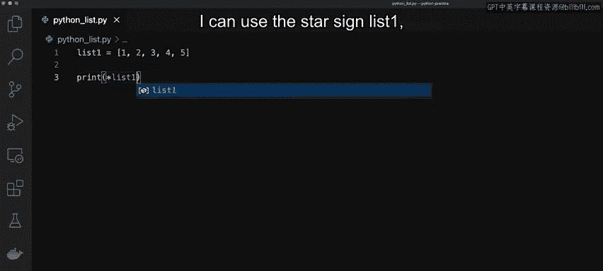

列表还支持嵌套，即一个列表中可以包含另一个列表。例如：
```python
list4 = [1, [2, 3, 4], 5, 6]
```
任何数据类型都可以存储在列表中，包括列表本身。

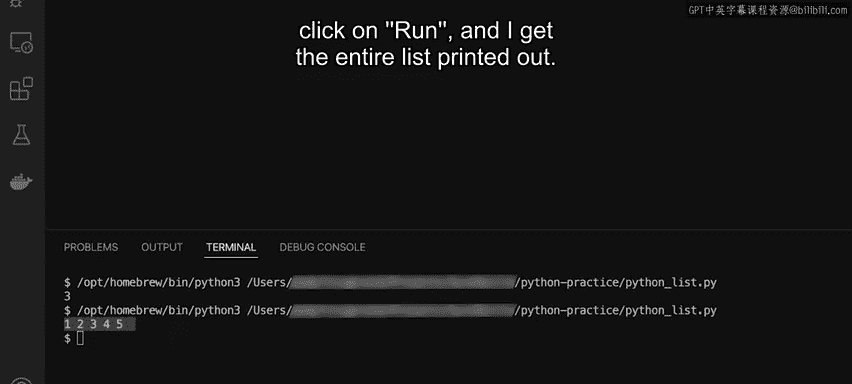

## 向列表添加元素

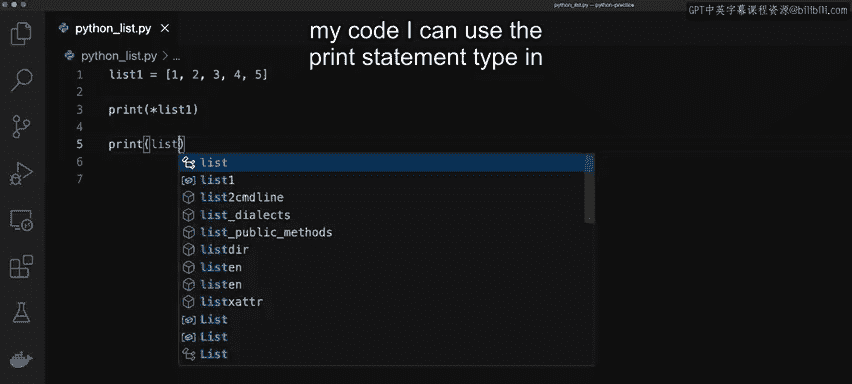

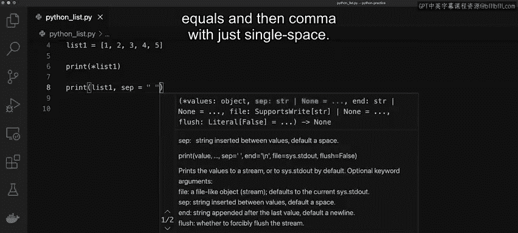

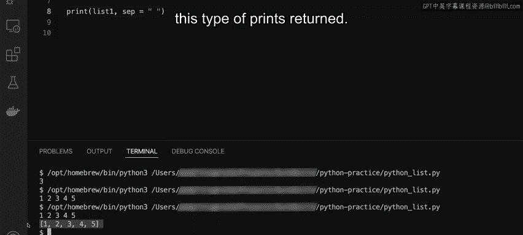

了解了如何创建和访问列表后，我们来看看如何向列表中添加新元素。Python提供了几种方法来实现。

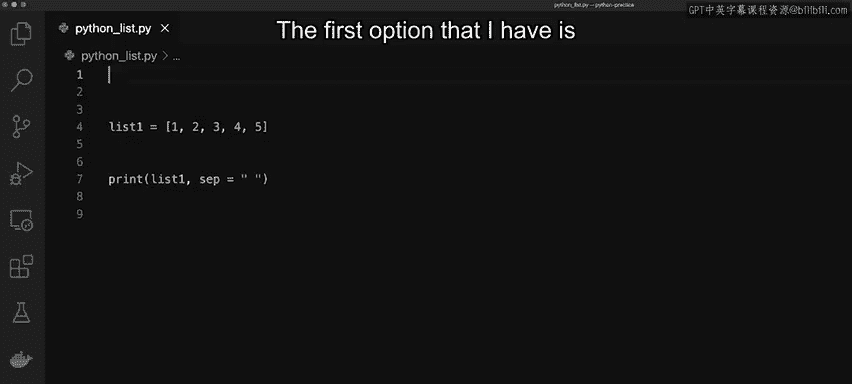

以下是向列表添加元素的几种方法：

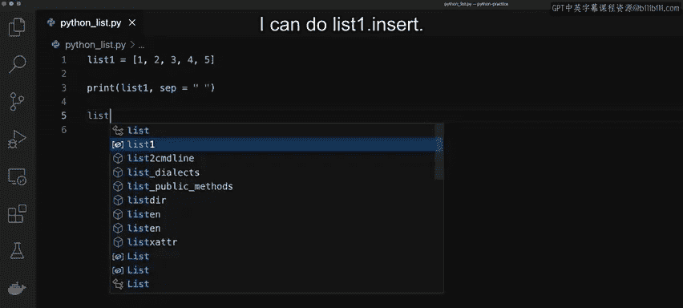

**1. 使用 `insert()` 函数**
`insert()`函数需要指定插入位置的索引和要插入的值。例如，在列表末尾插入数字`6`：
```python
list1.insert(len(list1), 6)
```
这里`len(list1)`用于获取列表的当前长度，从而确定末尾的索引位置。

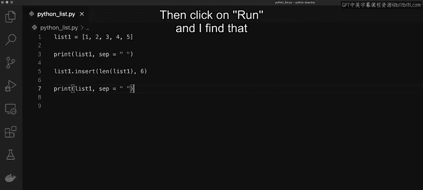

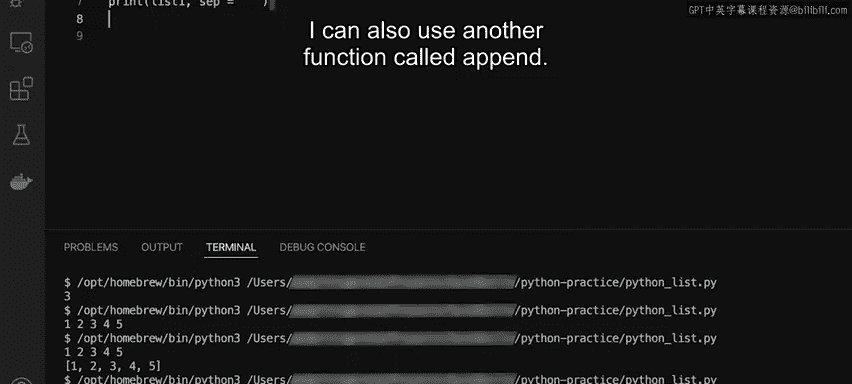

**2. 使用 `append()` 函数**
`append()`函数更简单，它直接将元素添加到列表末尾，无需指定索引。
```python
list1.append(6)
```

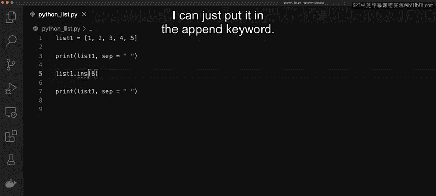

**3. 使用 `extend()` 函数**
`extend()`函数用于将一个列表中的所有元素添加到另一个列表的末尾。它可以一次性添加多个元素。
```python
list1.extend([6, 7, 8, 9])
```

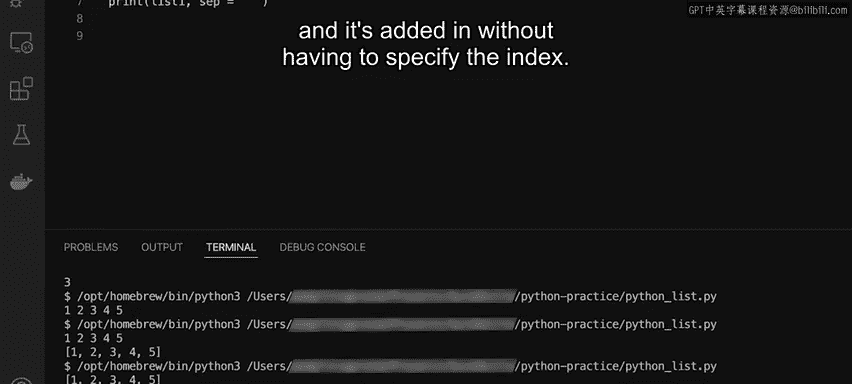

## 从列表中移除元素

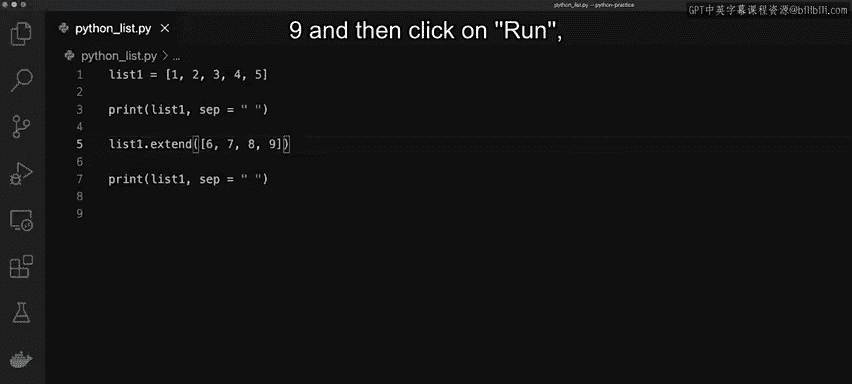

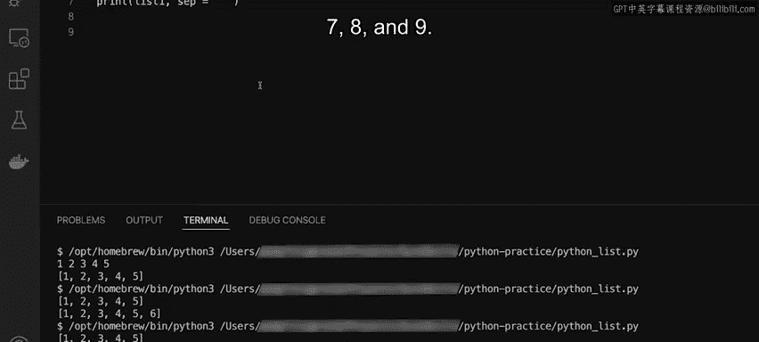

学会了添加元素，自然也需要知道如何移除元素。Python同样提供了多种从列表中删除元素的方式。

以下是从列表中移除元素的几种方法：

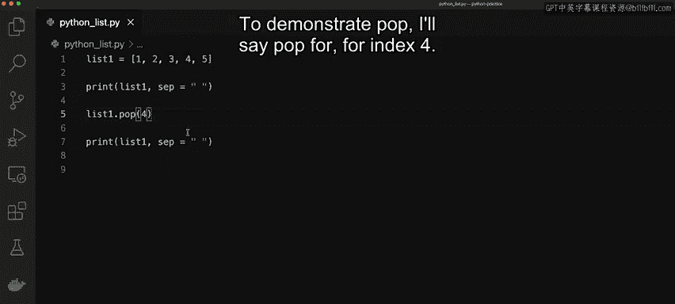

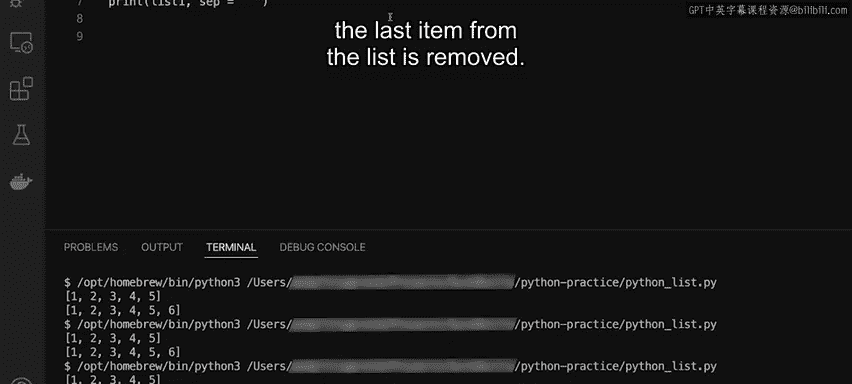

**1. 使用 `pop()` 函数**
`pop()`函数通过索引移除并返回一个元素。如果不指定索引，默认移除最后一个元素。
```python
list1.pop(4)  # 移除索引为4（即第5个）的元素
```

**2. 使用 `del` 关键字**
`del`关键字直接根据索引删除列表中的元素，但不返回该元素的值。
```python
del list1[2]  # 删除索引为2（即第3个）的元素
```

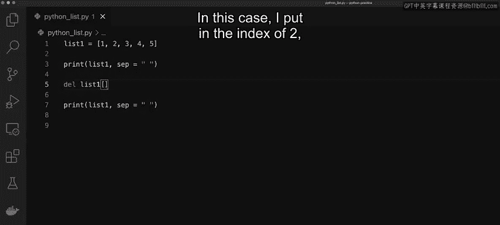

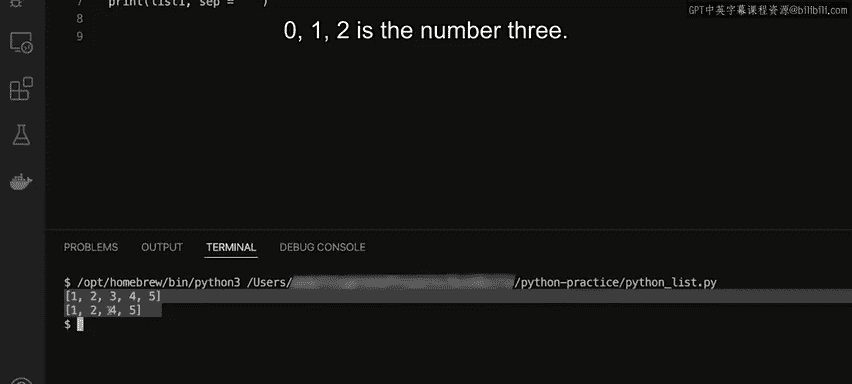

## 遍历列表

列表的一个主要用途是存储大量数据并对其进行处理。遍历列表是访问其中每个元素的基本操作。

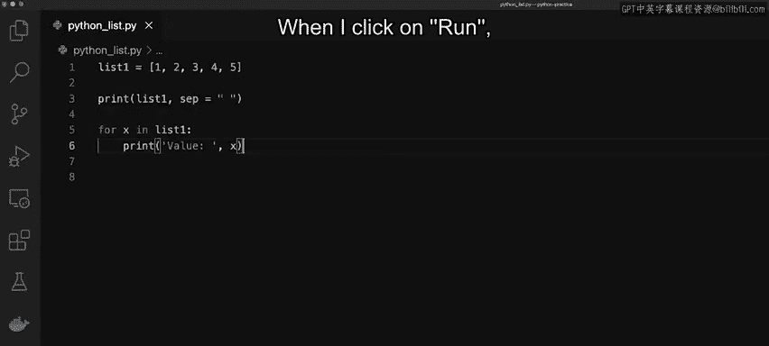

我们可以使用简单的`for`循环来遍历列表。以下是遍历`list1`并打印每个元素的示例：
```python
for x in list1:
    print(x)
```
执行这段代码会依次打印出列表中的所有值。

---

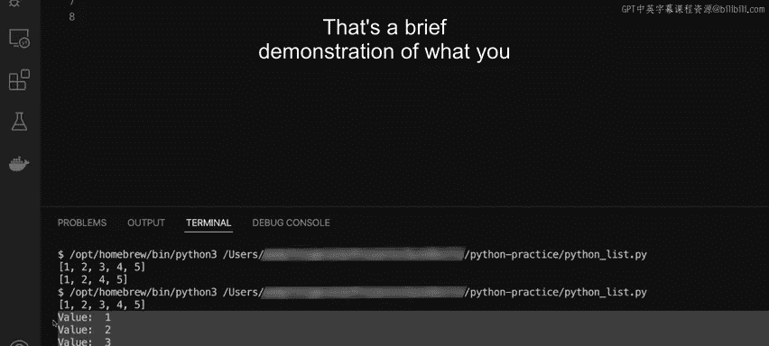

本节课中我们一起学习了Python列表的核心知识。你了解了Python中的列表如何作为动态数组工作，探索了列表的创建和索引访问，并学习了如何使用列表的内置函数来访问、修改、添加和移除列表中的元素。列表是Python编程中最基础且最常用的数据结构之一，熟练掌握它对后续学习至关重要。