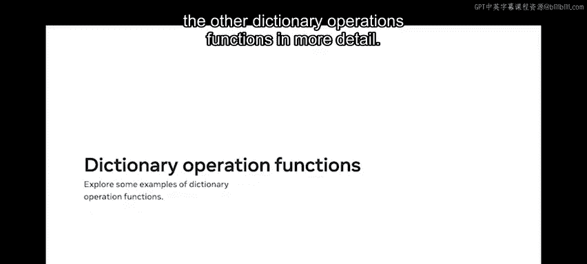
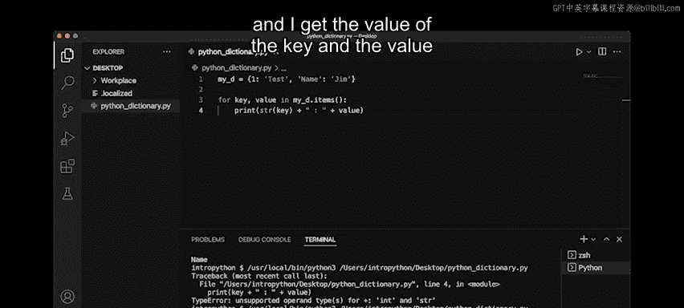

# Python 数据库工程师：P25：字典

## 概述
在本节课中，我们将要学习 Python 中的字典。字典是一种高效的数据结构，它允许我们通过键来存储和访问值，而不是像列表那样通过索引位置。我们将探讨字典的基本概念、操作方法以及它与列表相比的性能优势。

## 什么是字典？
Python 中的字典在很多方面类似于一本真实的字典。在一本普通字典中，要查找一个单词，你需要通过首字母查找，然后利用字母顺序系统找到它的位置。

同样地，Python 字典经过优化，可以快速检索值。你可能还记得 Python 列表在访问一系列值时非常有用。字典则基于键来访问值，而不是索引位置，因此在操作上更快、更灵活。

## 字典的核心概念：键值对
在 Python 字典中，一个键被分配给一个特定的值。这被称为**键值对**。这种方法的优点是它比使用传统列表快得多。

要在一个列表中查找一个项目，你需要不断检查列表直到找到该项目。但在 Python 字典中，你可以通过使用其键直接找到你需要的项目。

字典也是可变的，这意味着值可以被更改或更新。例如，你可以声明数字 1 作为键，“咖啡”作为项目，然后将其更改为任何其他数字或饮料项目。

## 如何访问字典中的项目？
要访问或定位 Python 字典中你需要的项目，需要使用键。

为了演示这一点，我将访问 Python 字典中的“咖啡”项目。首先，我声明我的字典名称为 `sample_dictionary`，然后在等号后面用一对花括号写一系列键值对。

我还确保用逗号分隔每个配对。然后我输入 `print` 函数，后面跟上我的字典名称。我需要访问键为 1 的“咖啡”项目，所以我在方括号中插入数字 1。

我运行 `print` 函数，它返回“咖啡”作为结果，正如我所期望的。

## 更新字典
我也可以通过用一个项目替换另一个项目来更新字典。我只需要使用键来引用它，同时使用赋值运算符 `=` 来分配新值。

例如，我可以将字典中的 `item2` 从“茶”更改为“薄荷茶”。我只需写一行以字典名称开头的新代码，后面跟上我想在方括号中更改的键。

然后我添加一个等号运算符，后面跟上新项目的名称。

这段代码的意思是：将 `sample_dictionary` 中的 `item2` 更改为“薄荷茶”。当我运行这个函数时，它改变了该项目。

## 从字典中删除项目
要从字典中删除一个项目，我写一行带有 `del` 函数的代码，后面跟上我的字典名称。

然后我在方括号中添加要删除的项目的键。在这个例子中，我想删除项目三“果汁”。

当我运行这个删除函数时，它将从我的字典中移除“果汁”值。

## 迭代字典的方法
最后，我还可以使用三种不同的方法来迭代字典：标准的迭代方法、`.items()` 函数或 `.values()` 函数。

让我们更详细地探讨这些迭代方法和其他字典操作函数。

## 创建和操作字典
要创建我的字典，我将首先声明一个名为 `my_d` 的简单变量，然后使用赋值运算符和花括号。

它可以与集合相同，但默认情况下，它被归类为空字典。我可以通过使用 `print` 语句、`type` 函数，然后传入 `my_d` 变量来打印它。

类实际上返回为字典类型，所以接下来我将在字典中添加一些值，我需要分两部分进行。

字典包含所谓的键和值。键可以是数字，也可以是字符串，但为了表示赋值，我使用冒号，然后放入我想要的任何值。在这种情况下，我将放入一个简单的字符串值“test”。

为了表示我可以更改或拥有不同的键、字符串、整数等，我放入一个字符串键“name”，然后值是“Jim”。

我使用 `print` 函数打印出我的字典。现在我有了一个基本的字典设置，键为 1 和 “name”，值分别为 “test” 和 “Jim”。

## 访问字典中的键
要访问字典中的键，我只需要使用方括号，然后传入键值。所以在这个数字 1 的情况下，我将传入数字 1。

对于字符串值，我只需要传入实际的字符串值本身，即 “name”。点击运行，我得到 “test” 和 “Jim”，它们是每个对应键的值。

## 添加或更新键
如果我想在字典中添加一个新键或更新它，我可以简单地执行 `my_d`，然后添加一个新的赋值，例如 `2: "test2"`。点击运行，该键随后被添加到当前字典中。

要更新一个键，我必须调用我想要的值。我将更新第一个键，即数字 1，将其值从 “test” 改为 “not a test”。

点击运行，它在屏幕上更新了。

## 关于字典的注意事项
关于字典需要注意的另一件事是，如果我尝试放入一个重复的键，它不允许这样做。所以如果我放入一个数字 1 和 “not a test”，点击运行，该键实际上会被最新的一个覆盖。

因此，数字 1 只出现一次输出，它不允许打印出两个键，因为它不允许设置重复的值。

## 从字典中删除键
如果我想从字典中删除一个键，我使用 `del` 操作符。现在我输入 `my_d`，然后指定我想删除的键，在这个例子中是数字 1，它随后从字典中移除。

## 迭代字典
对于字典，我也可以迭代。例如，我可以使用 `for x in my_dictionary`，然后打印出 `x` 的值。点击运行，我得到 1。

这只打印出键。在很多情况下，我可能需要访问两者。为此，我使用一个名为 `.items()` 的方法。

这样，我就可以访问键和值的赋值。所以我在这里打印，`key + value`。我将使用一些连接来打印出键和值。

点击运行，我必须注意，因为我正在使用整数和字符串，所以我用 `str()` 包装它，再次点击运行，我得到字典中每个项目的键和值。

## 总结
本节课中，我们一起学习了 Python 字典的目的和功能，以及它们在性能方面的优势。你现在应该理解字典如何通过键值对高效地存储和访问数据，以及如何执行创建、访问、更新、删除和迭代等基本操作。