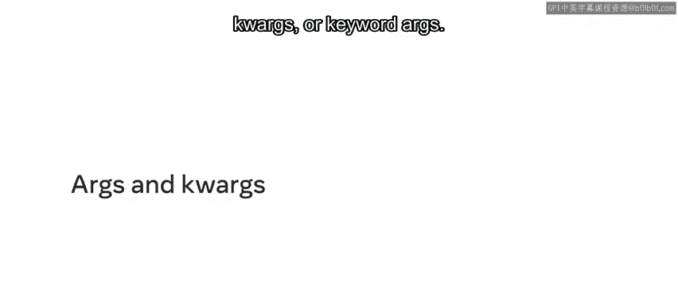
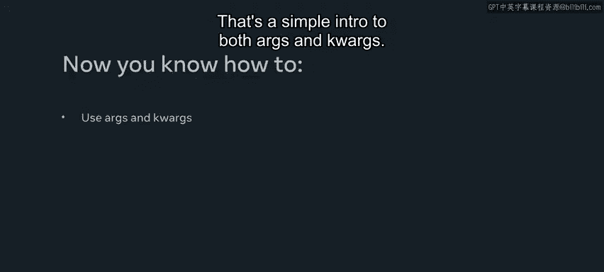

# Meta《数据库工程师（Python／数据库客户端／高阶数据建模／毕业项目／面试）｜Meta Database Engineer》中英字幕 - P26：25_kwargs.zh_en - GPT中英字幕课程资源 - BV1pZ421a749

In this video， you'll explore As and also quarks or keyword args。

Using these has the advantage that you could pass in any amount of non keyword variables and keyword arguments。

To start with the short example， I'll define a sum of function that accepts two parameters， A and B。

 and then return back the addition A+ B。If I do a print statement。

 call the function sum of with the two values 4 and 5， I should get back the value of9， which I do。

That all works fine， but let's say I want to add in another value，6， for example。

If I click on Runun again， I get back an error and it tells me that the sum of function takes two positional arguments。

 but three were given。If I want a way around this， this is where args are useful to define ags。

 I use the star symbol and I call it as for naming purposes。Instead of passing in just two arguments。

 As will allow n arguments to come through any number of arguments。

When dealing with more than one argument， there may be many to iterate through to calculate the total sum。

 I'll have a variable called sum， assign it to0， then I'll create a simple four loop。

 and then I'll loop through the argument parameters that's been passed in。

Then I'm going to add all the values that come in as part of as。

 which is assigned to the x variable using the plus equals and then finally return the value of sum。

So again， if I run the statement， I get back the value of 15。As I mentioned。

 you could pass in any number of arguments and the total sum should be returned for each。

In this case， it's 30 with the number of arguments that have been passed through。

That's a simple intro to Args， so now I'll demonstrate quags。

Let's clear the terminal and switch to my quags file。I'll copy the code from the AGs file to start。

Let's say， for example， you wanted to calculate a total bill for a restaurant。

A user got a cup of coffee that was 299， then they also got a cake that was 455 and also a juice for 299。

The first thing I could do is change the for loop。Let's change the argument to quarkgs by adding another star and then update the variable in the for loop。

Next， I get the key in the value， and then I extend the quags with the items function。

 and then I can simply change the sum to add all the items that are passed through on the value because adding the key makes no sense。

 it's just the string and it won't give you the actual value you intend to get。When I run this。

 I get back a value of 10。53 with a bunch of extra zeros。

Now I can change the decimal place for the final return statement by using the round function。

 and I limit it to two decimal places。When I click and run again。

 I get back a total of 1053 to summarize， with AGs。

 you could pass in any amount of non keyword variables。With the quarkgs。

 you can pass in any amount of keyword arguments。That's a simple intro to both As and quags。

