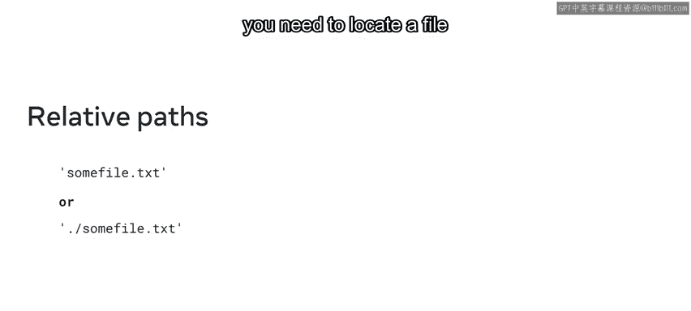
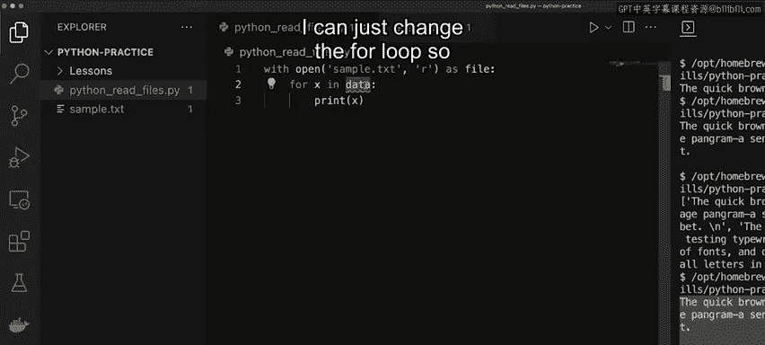

# Python文件操作：P31：读取文件 📖

在本节课中，我们将学习如何在Python中读取文件的内容。掌握读取文件是处理存储数据的基础，Python提供了多种内置函数来简化这一过程。

## 概述

我们将探索三种主要的文件读取方法：`read()`、`readline()`和`readlines()`。理解这些方法的区别以及如何在不同场景下使用它们，是有效处理文件数据的关键。

## 三种文件读取方法

Python提供了几种灵活的方式来读取文件内容，每种方法适用于不同的需求。

### 1. `read()` 方法

`read()`方法将文件的**全部内容**作为一个字符串返回。这个字符串包含文件中的所有字符。

您也可以向`read()`方法传递一个整数参数，以指定仅返回文件中前N个字符。其基本语法如下：

```python
file.read([size])
```

### 2. `readline()` 方法

上一节我们介绍了如何读取整个文件，本节中我们来看看如何逐行读取。`readline()`函数每次调用只返回**一行**文本作为字符串。

例如，如果一个文件有两行文本：“这是第一行”和“这是第二行”，那么第一次调用`readline()`将返回“这是第一行”。

`readline()`函数同样可以接受一个整数参数，用于返回该行上指定数量的字符。例如，`readline(10)`将返回该行的前10个字符。

### 3. `readlines()` 方法

除了逐行读取，我们还可以一次性获取所有行。`readlines()`方法会读取文件的全部内容，并将其作为一个**有序列表**返回，列表中的每个元素对应文件中的一行。

这允许您遍历整个列表，或者根据特定条件挑选出某些行。例如，对于一个包含四行文本的文件，`readlines()`会返回一个包含这四个字符串的列表。

## 文件路径：绝对路径与相对路径

文件存储在目录中，并通过路径来定位。从同一目录读取文件很简单，只需要文件名即可。然而，当处理不同位置的文件时，理解绝对路径和相对路径的区别至关重要。

以下是两种路径类型的关键区别：

*   **绝对路径**：包含一个前导斜杠（在Unix/Linux/macOS中）或驱动器标签（在Windows中）。绝对文件路径包含了定位文件所需的全部信息，无论您当前是否在该文件所在的目录中。
*   **相对路径**：通常不包含对根目录的引用，而是相对于当前调用文件所在的目录。相对文件路径只包含在当前工作目录中定位文件所需的信息。

## 实战演示



现在，我将演示如何在Python中实际使用这些方法来读取文件。我将使用一个简单的示例文本文件（`sample.txt`），其内容如下：
```
The quick brown fox jumps over the lazy dog.
This is a second line of text.
```

我将使用`with open()`语句安全地打开文件。

### 演示1：使用 `read()` 读取全部内容

首先，我们尝试打印文件的全部内容。

```python
with open(‘sample.txt‘, ‘r‘) as file:
    print(file.read())
```
运行此代码会将文件的全部内容原样打印出来。

### 演示2：使用 `read(N)` 读取指定字符数

接下来，我们看看如何只打印文件的一部分。例如，如果我们只想打印“The quick brown fox jumps over the lazy dog.”这句话，它恰好是44个字符。

我们可以向`read()`函数传递参数`44`，指示函数只读入前44个字符。

```python
with open(‘sample.txt‘, ‘r‘) as file:
    print(file.read(44))
```
运行此代码将只打印出第一行。其原理是从索引0开始，44是需要打印出的最后一个字符的索引。

### 演示3：使用 `readline()` 读取单行

有时我们只需要处理一行。`readline()`方法会读取文件中的第一行。

```python
with open(‘sample.txt‘, ‘r‘) as file:
    print(file.readline())
```
运行此代码将只打印该文件中的第一行文本。

### 演示4：使用 `readlines()` 获取行列表

`readlines()`方法将返回一个包含所有行的列表。

```python
with open(‘sample.txt‘, ‘r‘) as file:
    print(file.readlines())
```
运行此代码，您会注意到文件中的文本现在被包裹在方括号`[]`中，表明它是一个列表。

### 演示5：遍历 `readlines()` 返回的列表

因为`readlines()`返回一个列表，我们可以将其赋值给一个变量并进行遍历。

```python
with open(‘sample.txt‘, ‘r‘) as file:
    data = file.readlines()
    for x in data:
        print(x)
```
运行此代码，列表项将逐行打印出来。

一个需要注意的地方是，当使用`with open() as file:`时，文件对象本身也是可迭代的。因此，我们可以直接遍历`file`变量，效果与遍历`readlines()`的结果相同。

```python
with open(‘sample.txt‘, ‘r‘) as file:
    for line in file:
        print(line)
```



## 总结

本节课中，我们一起学习了在Python中读取文件的核心方法。您现在应该能够：
*   描述如何使用`read()`、`readline()`和`readlines()`函数读取文件。
*   区分绝对路径和相对路径的概念。
*   在代码中演示如何输出文件的不同格式（完整内容、指定字符数、单行或行列表）。
*   理解并安全地使用`with open()`语句来处理文件。

这些方法是Python文件操作的基础，熟练掌握它们将为处理更复杂的数据任务打下坚实的基础。