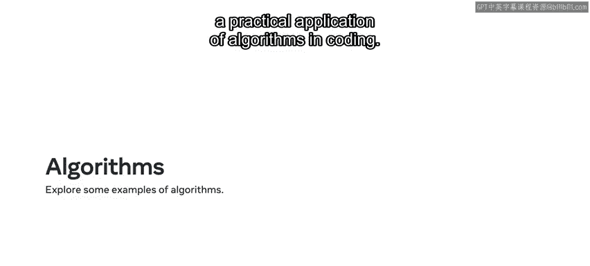
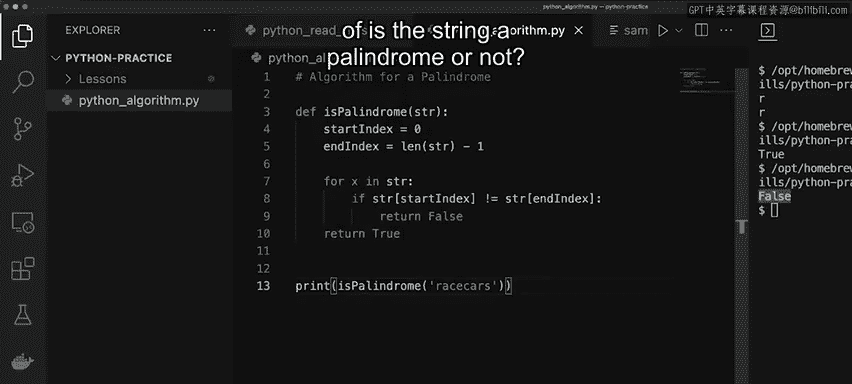

# Meta《数据库工程师（Python／数据库客户端／高阶数据建模／毕业项目／面试）｜Meta Database Engineer》中英字幕 - P34：33_算法.zh_en - GPT中英字幕课程资源 - BV1pZ421a749

In this video you'll learn about algorithms， an algorithm is a series of steps to complete a given task or solve a problem on a day to day basis you use algorithms all the time to complete tasks。

😊，One such example is following a recipe to make an egg omomelet。First。

 you have the list of ingredients to use in your omeellets， this can be called your input。

Next is the method or the instructions to follow step by step to create your dish。Finally。

 you complete the omelette， your output。The steps to make the mellet are the same every time。

An algorithm and programming works in a similar way。😊，In programming。

 algorithms are used to solve a multitude of problems that range from simple to very complex。

The key to understanding in creating an algorithm is to break the problem into smaller parts。

 just like the egg omomelet recipe， that way you build up the steps to complete the algorithm that will resolve the overall problem。

Now let's explore a practical application of algorithms encoding。😡。

I'm going to demonstrate a particular algorithm that checks if a word is a palindrome a palindrome is a word that can be spelled the same both backwards and forwards。

 for example the word race car is a palindrome because I can spell it forward as RA C E C AR and backwards it's still the same RA C E C AR。

To be able to check if a word is a palindrome， I need to use an algorithm。As mentioned earlier。

 an algorithm is a series of steps to solve a problem。😊，Let me break down the problem。

I know the string in my example， race car has an index。

 and I need to check if the index at the front of the string is equal to the index at the end of the string。

In this way， I can compare the two values of the indexes。

So I print STR0 because that's the first index， and I also print STR6 because that's the last index。

I can just count this up to double check。😡，Zero， one， two， three， four， five and six。

 and then I click on run。The output is the two values I need to compare。

 both of which are the letter R at the beginning and at the end of race car。

Now I'm going to break down our problem into smaller steps。

First I need to check if the value of index0 is equal to the value of the last index 6。

 which in this case is R， then I need to check that the next or second character which is index 1。

 is equal to the second last character which is index5。Finally。

 I need to check if character two is equal to character 4。😊。

What I need to do is to check if these conditions are true or false。

So let's check how I can write this out in some code。😊。

I begin by creating a functionDe is palindrome， and I know that it will accept a single parameter called string which I've entered。

Now I want to get the starting index as well as the end index。

I put the start index into a variable that equals zero。

Every string will always start at the index zero， and then the end index is going to be the length of the string。

So I enter end index equals L function， STR and then minus1 This is because a string always starts at zero and I have to think about the last index。

😊，Next， what I want to do is iterate through the string itself and compare the starting index with the end index characters to validate that they are the same。

To do this， I create a for loop by typing4 x in STR and I'll make the comparison within the for loop。

I can check if the first index is equal to the last index。

 and since the two characters R and R are the same， it'll continue to be true。

But it would be quicker for me to check if it's false because then I'll know straight away if it's not a palindrome。

So I do an if statement and I use the string being passed in as a parameter。

Then I use the start index to get the character， and then I check if it's not equal to the string within the end index。

If this condition is met， it will return false which confirms that it's not a palindrome。

 but if the condition is never met outside the for loop， then it returns true。

 which confirms that it's a palindrome。I've done all the checks across the starting index and the end index and it returns back to the condition of true to confirm that it's a palindrome。

Now I'm going to test the algorithm to verify that it works。I use a print statement。

 I call the is palindrome function and I pass in race car because I know that it's a palindrome I click on run and it returns the value of true if I change race car to race cars and I run it again the condition of false is returned。

This is an example of creating an algorithm in code to solve a problem。

It has a series of steps that have to be followed to resolve the problem in code to give back the condition of is the string a palindrome or not？

Now you know how useful algorithms can be as a step by step way to solve a problem with coding。

An algorithm can be used to solve problems whether small complex。

Once the steps of an algorithm are created， they will then execute the same way each time the algorithm is used。

