# Meta《数据库工程师（Python／数据库客户端／高阶数据建模／毕业项目／面试）｜Meta Database Engineer》中英字幕 - P35：34_算法复杂度.zh_en - GPT中英字幕课程资源 - BV1pZ421a749

As a developer， your main task will be to write code to suit business needs。😡。

That code will have to go through what's called refactoring this means that you rewrite or rework the code to make it easier to manage or to run more efficiently。

Refactoracting is a standard part of the software development cycle， making code easy to manage。

 maybe straightforward， but what about making it faster or making it perform better？😊。

To determine how to make code faster or perform better， you must be able to measure it。

Code is measured by time and space。Time is measured by how long it takes and space is about how much memory it uses。

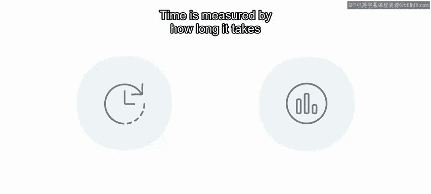

Big O notation has different complexities or categories ranging from horrible to excellent。😡。

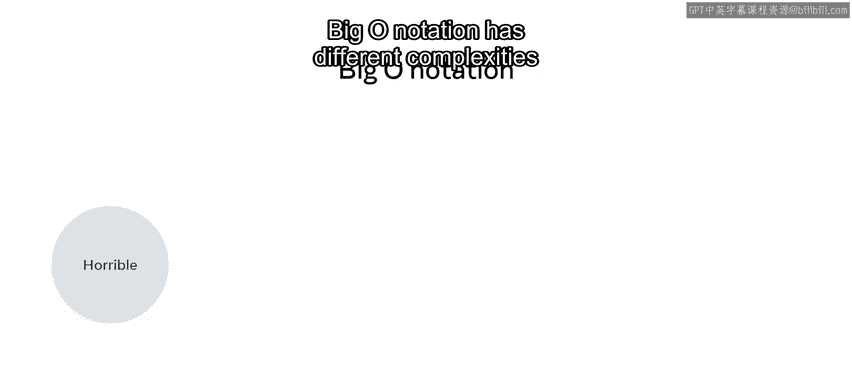

And it's used to measure an algorithm's efficiency in terms of time and space。

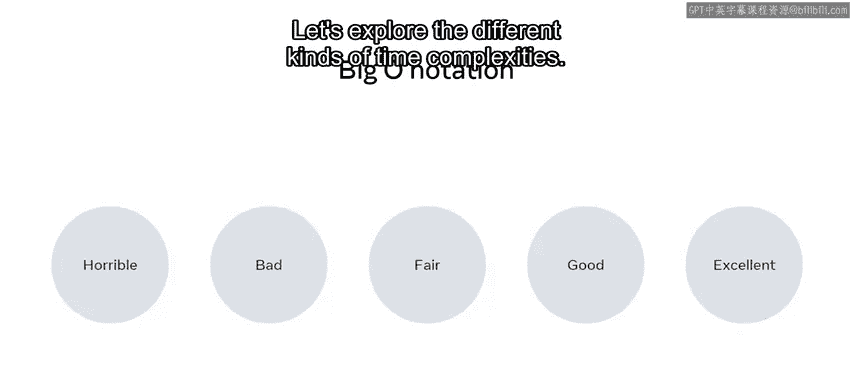

Let's explore the different kinds of time complexities。First constant time。

 this is an algorithm that will always run under the same time and space regardless of the size。

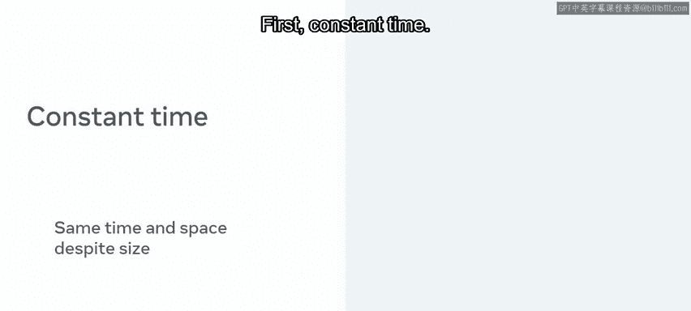

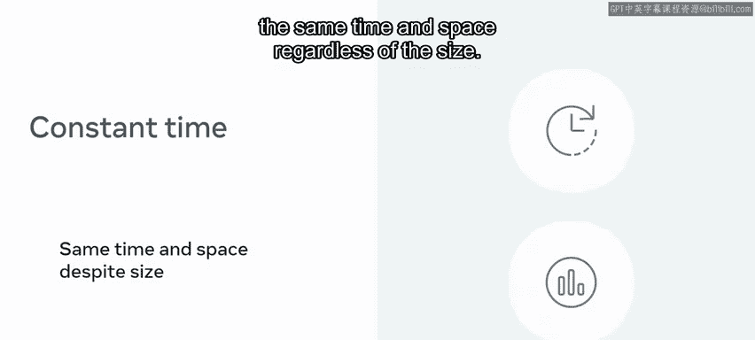

Take addiction， for example。To get the value of an item， you need to have the key。

 the key is a direct pointer to the value and does not require any iterations to find it。😊。

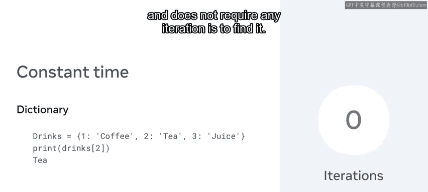

It's considered constant。Second is a linear time algorithm。

 this will grow depending on the size of the input， for example。

 if I have an array of numbers with a range of 100 it will run very fast。

 but if it's increased to a million it will take a lot longer to complete。😊。

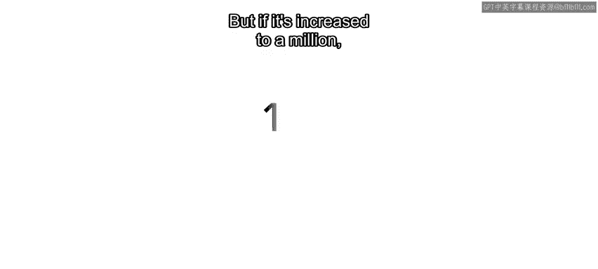

The size in this case affects the running time of the code。

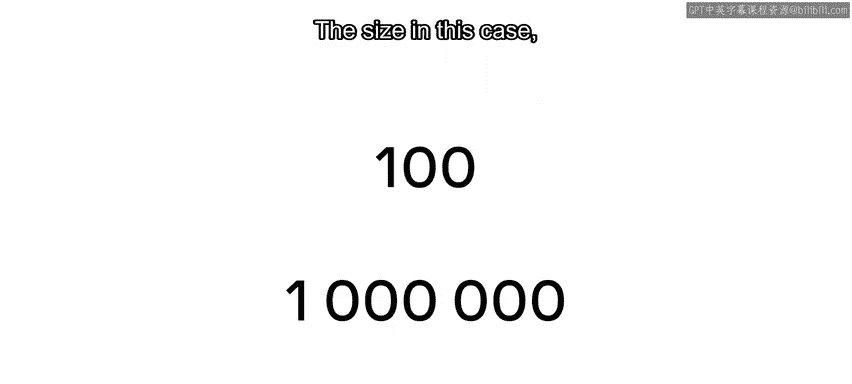

Third， a logarithmic time algorithm refers to the running time of the input against the number of operations。

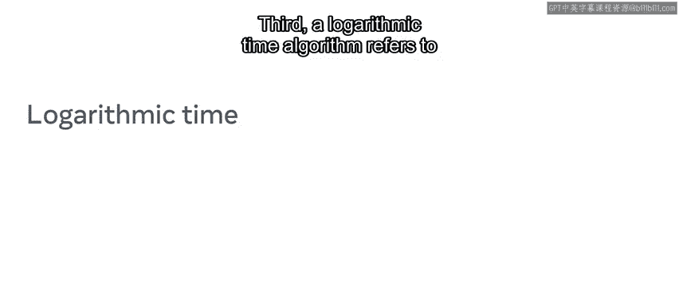

I can take a linear approach to try to find a number out of 100。

Let's say the number is 97 in a linear equation， it will take 96 iterations before it's found。

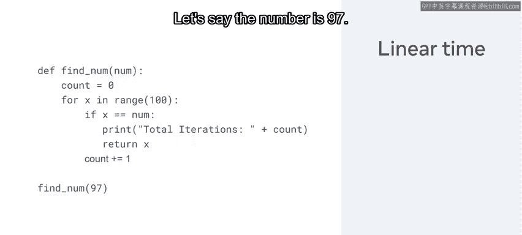

This is because its iterate through each item one by one until it finds the target value。😊。

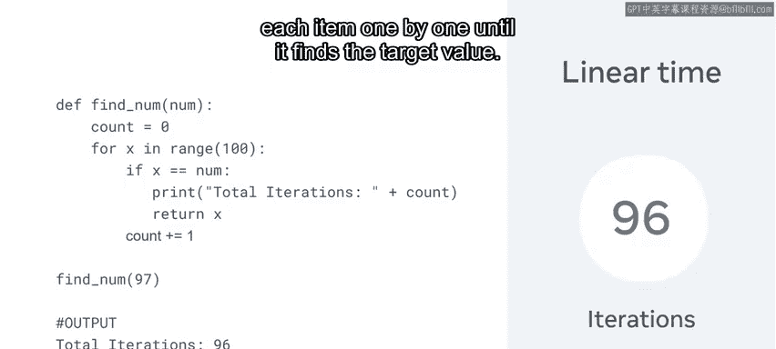

Using a binary search， I can drastically cut down the iterations and find it under seven iterations。

😊。

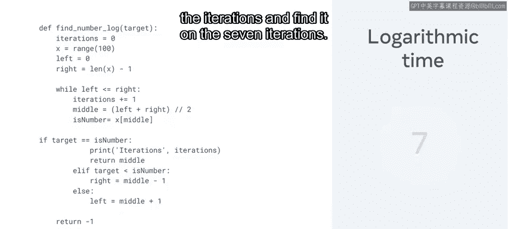

This is measured by logarithmic time。😡。

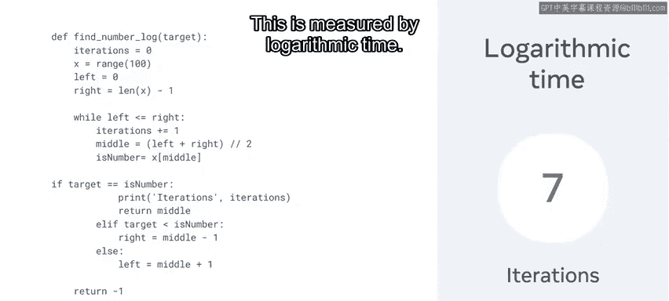

The binary search works by splitting the list into two parts each time to check if the target is less than or greater than one。

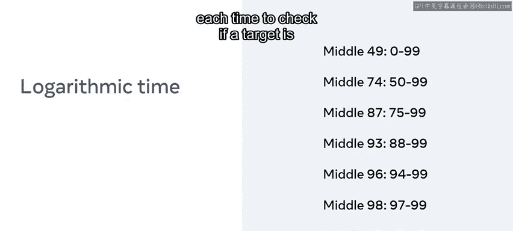

Fourth， quadratic time refers to a linear operation of each value of the input data squared。

This is often a nested list as in this for loop。This for loop is considered quadratic time as the outer loop will need to iterate in a linear way 10 times。

😊。

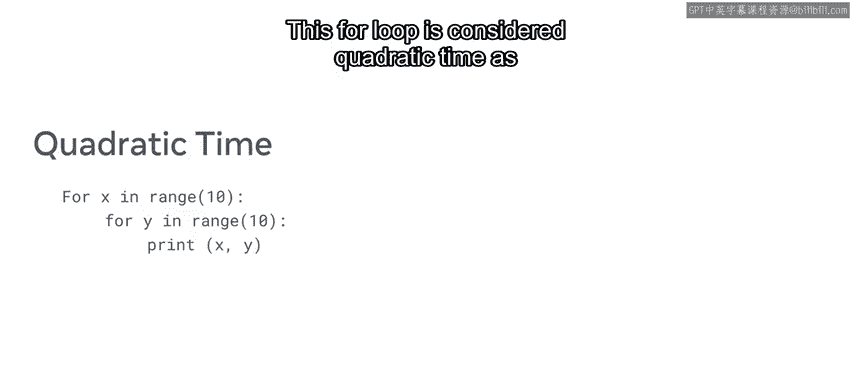

But it also has to iterate the inner loop the same 10 times for each single outer loop。

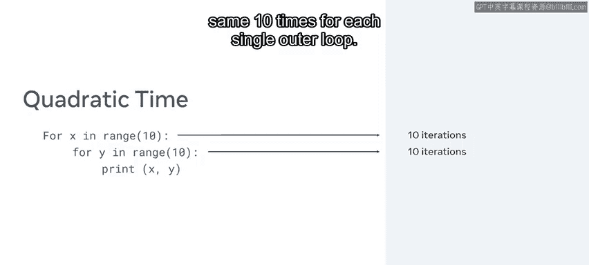

This means its total iterations are 10 times 10， which is 100。

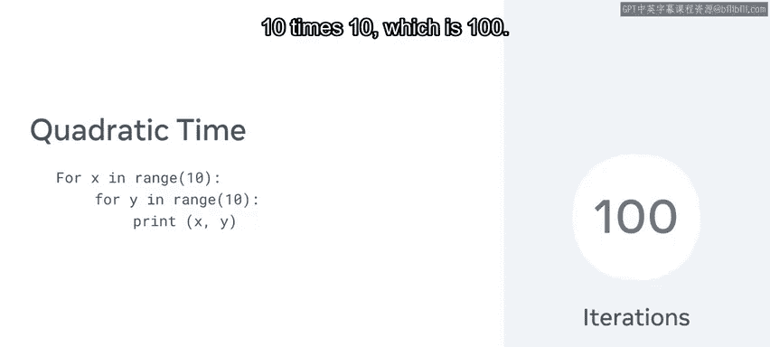

Fth and last is exponential time， which is an algorithm that doubles with each iteration。😡。

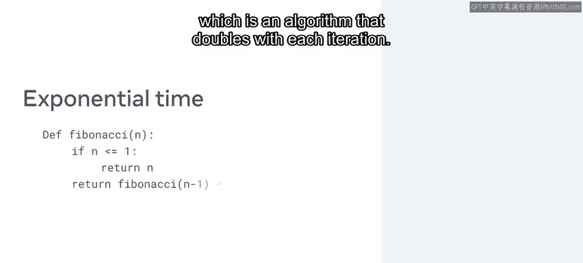

The Fibonacci sequence is a prime example of this。

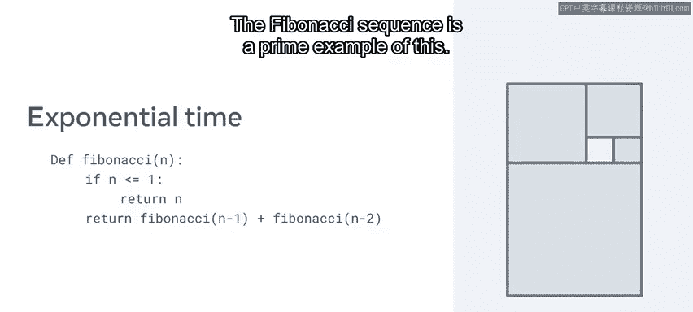

Refactoracturing code can be a big task， but understanding algorithmic complexity and how it's calculated makes it easier to optimize code。

😡，Now that you know about constant linear logarithmic， quadratic and exponential time。

 you are one step closer to your goal of being a developer。😊。

