# Meta《数据库工程师（Python／数据库客户端／高阶数据建模／毕业项目／面试）｜Meta Database Engineer》中英字幕 - P36：35_什么是函数式编程.zh_en - GPT中英字幕课程资源 - BV1pZ421a749

Perhaps you've heard of functional programming， it uses a different paradigm than other models such as object oriented。

It's particularly adept at processing large amounts of data at high speeds。

This video will get you started with what functional programming is。😊，Later in the lesson。

 you'll explore topics such as pure functions， recursion， reversing a string。

 and useful Python functions such as map and filter。😊。

Let's start by exploring the role of a function functions take some input， process it。

 and then produce some output There are two types of functions， traditional and pure。

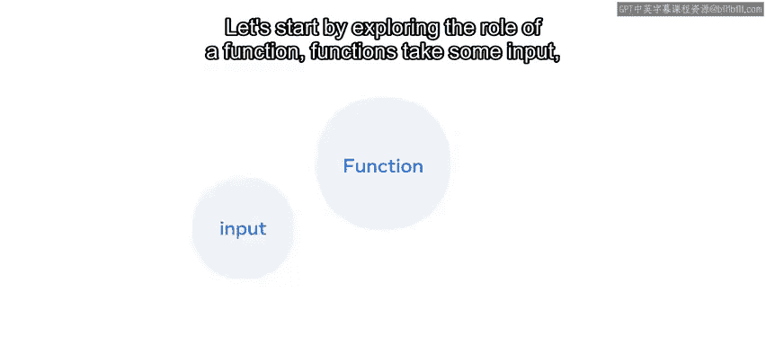

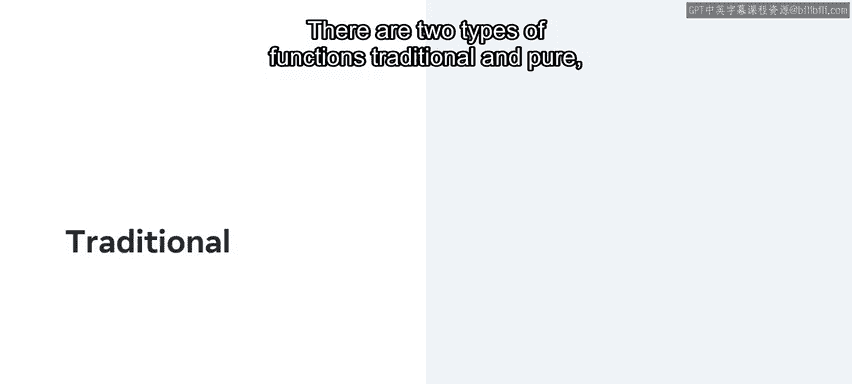

Pure functions will always do the same thing and return the same result。

 no matter how many times they are called， there are several differences between traditional and pure。

 so let's list them。

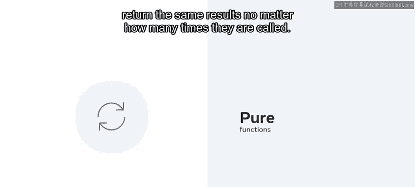

Traditional functions can access and modify variables on the global state， but pure functions cannot。

Both traditional functions and pure functions can access variables in the local state。

Traditional functions can change as whereas pure functions cannot。And lastly。

 the outputs of traditional functions does not depend on input， however。

 the outputs of pure functions does depend on input。

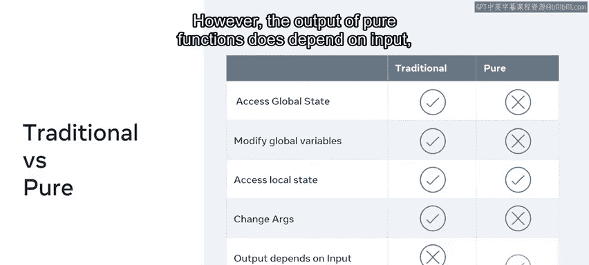

Functional programming， in essence， is a programming paradigm that utilizes functions for clean。

 consistent and maintainable code。

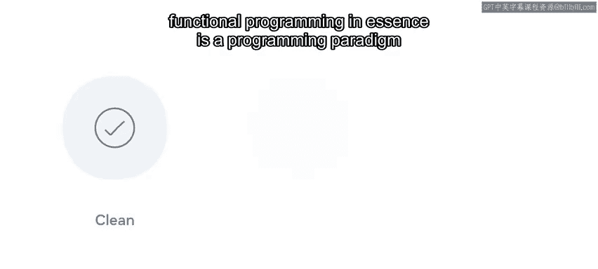

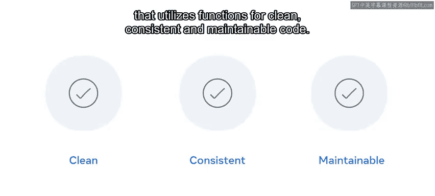

Compared to object orientated programming， which we'll learn about later。

 functional programming differs by design。

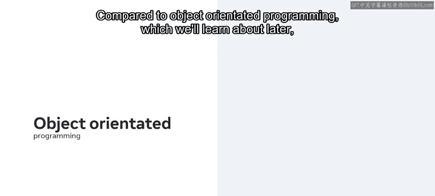

Functional programming does not change the data outside the scope of the function。

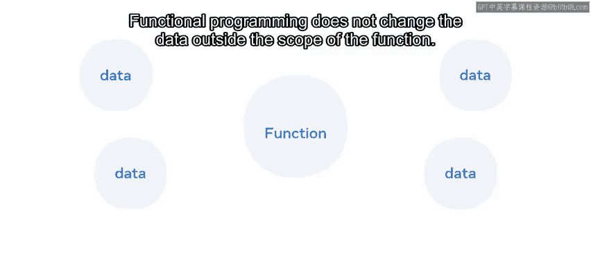

This simply means that the function should avoid modifying the input data or arguments being passed instead it should only return the completed result of the intended function being called。

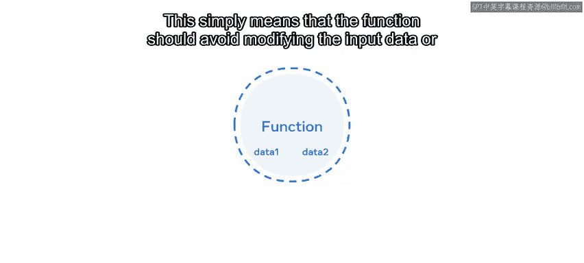

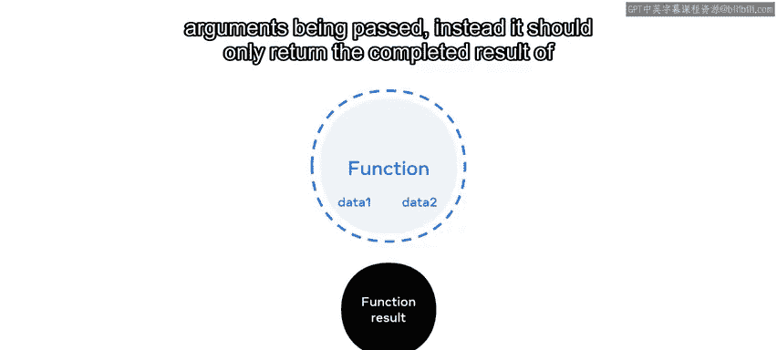

Functions are considered standalone or independent。

 and this aids the clean and elegant nature of the code。

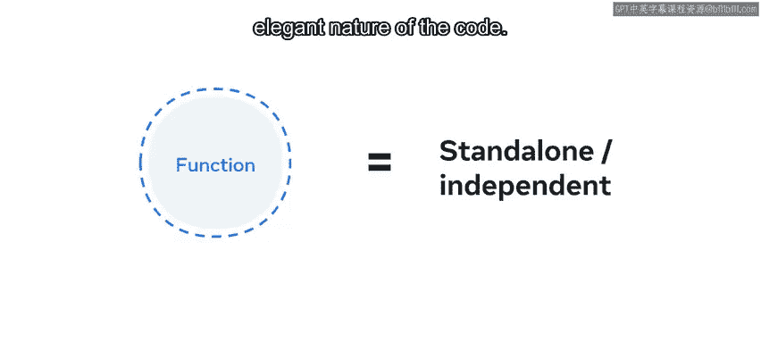

In fact， many of the strongly typed object oriented languages have incorporated functional programming into their structure。

In order to support functional programming， the language itself needs to allow function to be passed as an argument and also return a function to its caller。

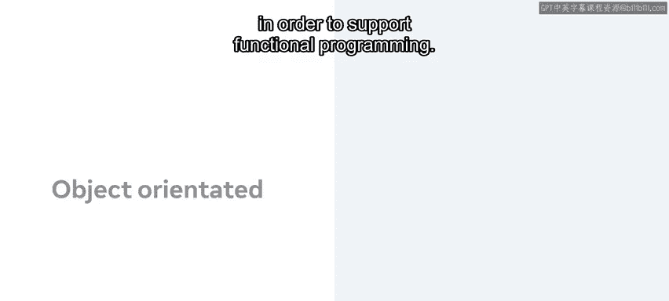

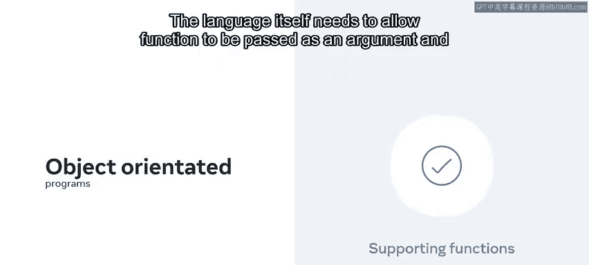

In Python， functions are what is known as first class citizens。

 which essentially means they have the same level of strings and numbers。

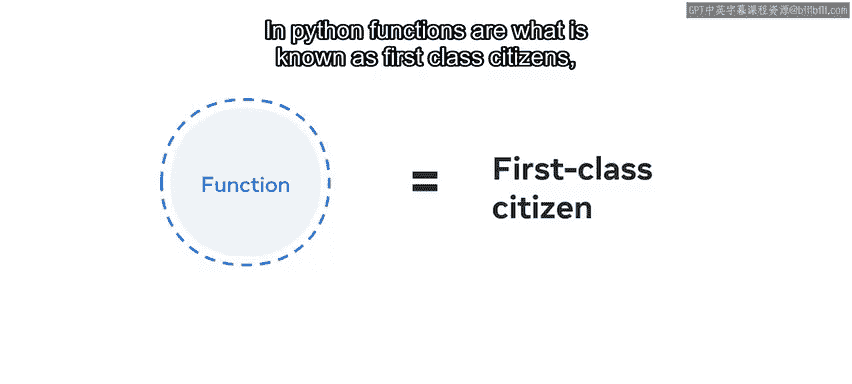

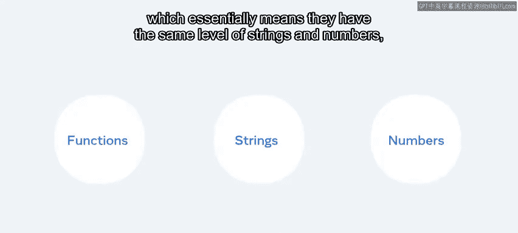

They can be assigned to a variable passed as an argument or returned to its caller。

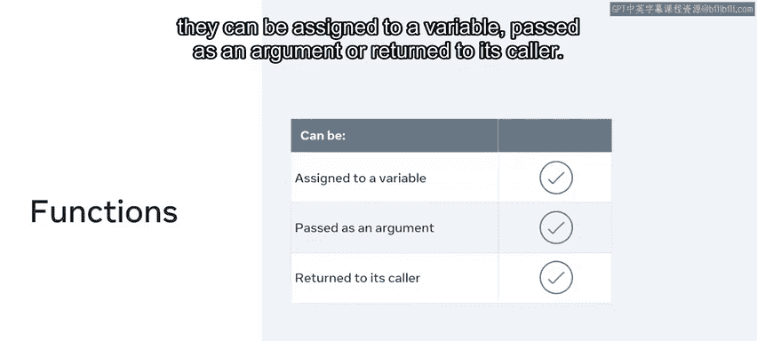

Let's explore a few examples of functions available in Python。Take， for instance。

 the sorted function。The sorted function accepts a list of items and then returns that list in a sorted order。

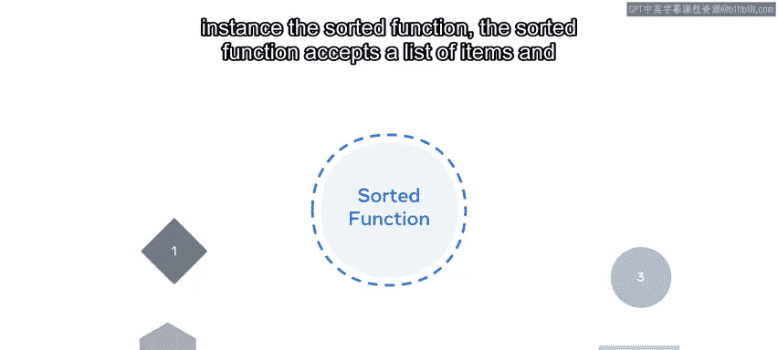

You can use a sorted function to list items in alphabetical order。

By passing a list of coffees to the sorted function， the return sorts the list in alphabetical order。

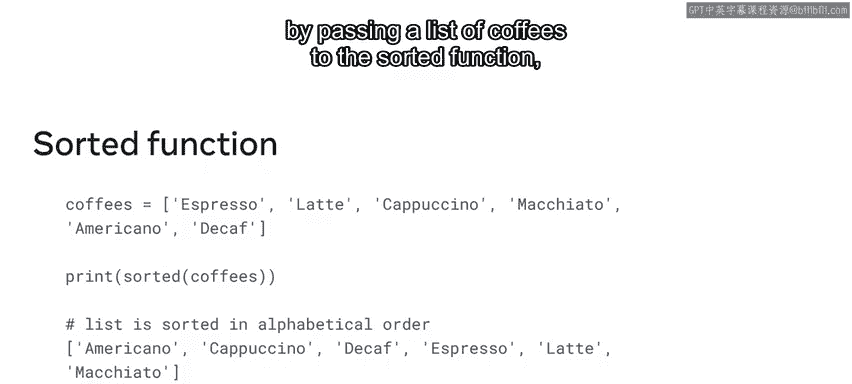

The great thing about functional programming is that the logic behind certain tasks is already built in for you。

Functions are reusable and thus save a lot of development time。😊。

But did you know that you can also create your own function specific to your own requirements？

Let's look at a simple example。Imagine you want to spell the names of the coffees backwards。

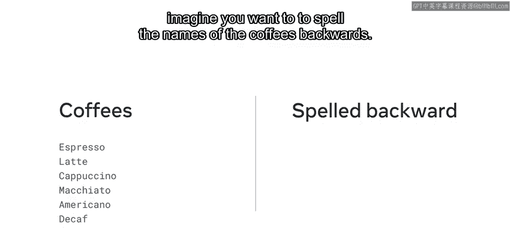

This might not be entirely useful， but it's a good showcase of functional。

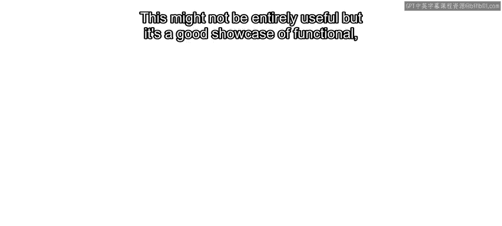

You can create your own simple reverse function to do this。Define the function。

 let's call it reverseverse and assign the variable STR to it。

Now return the value of STL with a slice function。You'll learn more about the slice function later in the lesson。

Then assign a variable to get the result of the map function。😊。

The map function accepts as its first argument， the reverse function， and then the iterable coffees。

It will then automatically handle the iterations to go through each coffee and apply the reverse function to it。

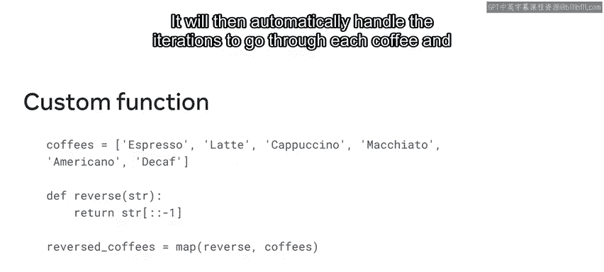

In this video， you have learned what functional programming is and you were introduced to examples of built in functions in Python。

