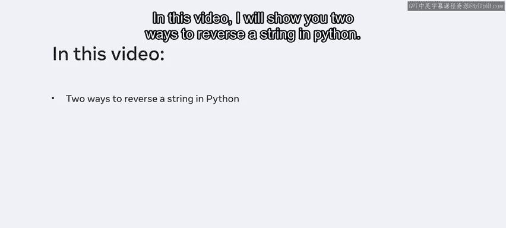
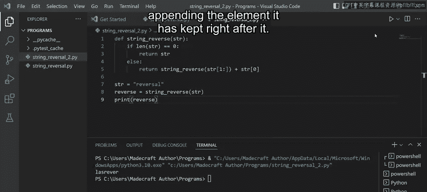
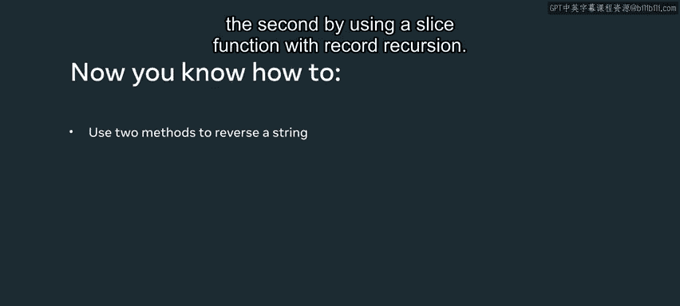

# Python字符串操作：P39：字符串反转教程 🔄

在本节课中，我们将学习如何在Python中反转一个字符串。这是测试Python开发者解决问题能力的基本方法之一。掌握此技能在生产环境中非常有用。一些编程语言内置了反转字符串的函数，但Python没有。幸运的是，得益于Python语言的灵活性，我们有多种方法可以实现这个功能。本视频将向你展示两种在Python中反转字符串的方法。



## 方法一：使用切片函数

上一节我们介绍了课程目标，本节中我们来看看第一种方法——使用切片函数。

切片函数的格式或语法是：以字符串名称开头，后跟一个左方括号，然后是起始参数、冒号、结束参数、另一个冒号，接着是步长参数，最后是一个右方括号。这被称为扩展切片语法。起始和结束参数是函数操作字符串的索引范围。步长参数是函数遍历给定字符串时的跳跃或步进值。

以下是使用切片函数反转字符串的步骤：

1.  首先，我创建一个名为 `string_reversal.py` 的文件。
2.  定义一个字符串变量。我将这个字符串命名为 `trial`，并为其赋值单词 “reversal”。
3.  为了操作这个字符串，我创建一个新的字符串变量 `new_trial`。
4.  使用切片函数为 `new_trial` 赋值。语法是 `trial[::]`。为了指示Python使用整个字符串，我将起始和结束参数留空，只输入两个冒号。然后将步长参数的值设为 `-1`。
5.  步长参数的负值表示字符串需要从右向左遍历，每次移动一个索引位置，而不是传统的从左开始的方法。
6.  最后，我打印操作后的字符串以测试它是否有效。

**核心代码示例：**
```python
trial = "reversal"
new_trial = trial[::-1]
print(new_trial)
```
运行代码后，终端成功显示了反转后的字符串。

**总结：** 整个字符串从右向左遍历，每次一个索引位置。这个新的切片对象随后被复制到另一个字符串，该字符串经过重新排列后被打印出来。需要注意的是，你可以使用切片函数来操作同一个变量。本例中为了清晰起见，我使用了第二个变量。切片函数是反转字符串最简单的方法。

## 方法二：使用递归和切片

在学习了简单的切片方法后，本节中我们将探讨另一种结合递归来反转字符串的方法。

这次，我创建一个新文件并保存为 `string_reversal_2.py`。接下来，我定义一个函数并向其传递一个字符串变量 `str`。这个函数将充当一个条件 `if` 语句。`else` 语句将递归调用切片函数，但每次调用时都会传入一个修改过的字符串。

以下是使用递归反转字符串的步骤：

1.  定义一个函数 `string_reverse(str)`。
2.  在函数内部，使用 `if` 语句检查字符串长度是否为0。如果是，则返回该字符串。
3.  在 `else` 语句中，递归调用 `string_reverse` 函数，但传入的字符串是 `str[1:]`（即从第二个字符开始到结尾的子串），然后将第一个字符 `str[0]` 附加在后面。
4.  在函数外部，给 `str` 变量赋值为 “reversal”。
5.  创建第二个变量 `reversed_str` 来存储函数返回的字符串值。
6.  最后，添加一个打印语句来输出 `reversed_str` 变量。

**核心代码示例：**
```python
def string_reverse(str):
    if len(str) == 0:
        return str
    else:
        return string_reverse(str[1:]) + str[0]

str = "reversal"
reversed_str = string_reverse(str)
print(reversed_str)
```
运行代码，字符串在终端中以相反的顺序成功显示。

**原理：** 该函数通过每次递归传递一个不同的字符串并附加它保留的元素（第一个字符）来调用自身。



## 课程总结 🎯



本节课中，我们一起学习了两种在Python中反转字符串的不同方法：第一种是仅使用切片函数，第二种是结合使用切片函数和递归。这两种方法都充分利用了Python的灵活性，是解决此常见编程问题的有效途径。