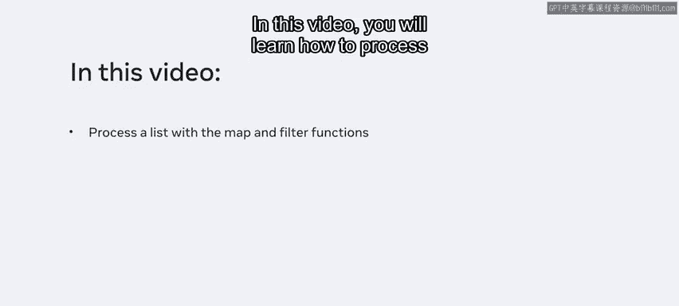
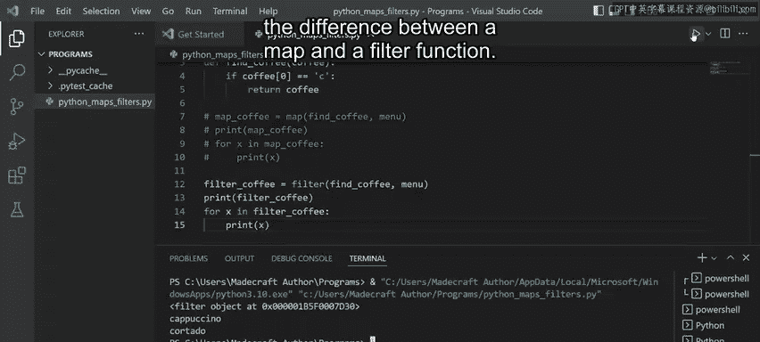
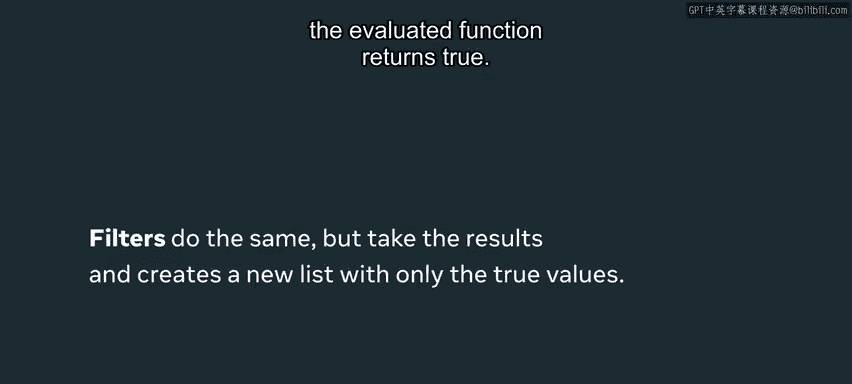
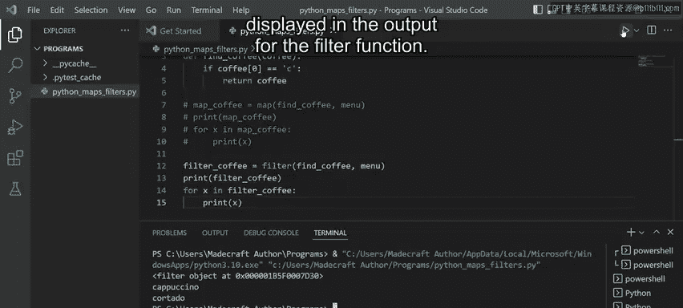
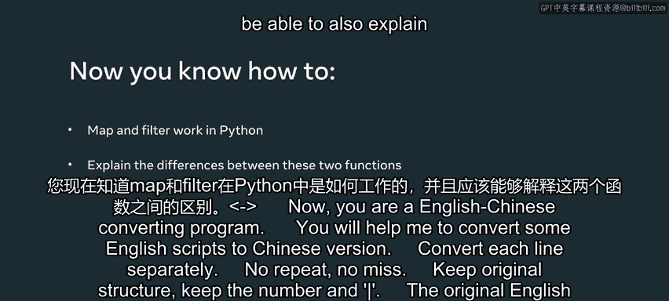

# Python数据处理：P40：map与filter函数详解 🧮

在本节课中，我们将学习如何使用Python中的`map`和`filter`函数来处理列表数据。这两个函数是函数式编程中的重要工具，能够帮助我们以简洁、高效的方式对列表元素进行转换和筛选。

假设我们想基于一个现有列表生成一个新列表。通常的做法是对现有列表中的每个元素应用某种操作，然后使用这些操作的输出结果来生成新列表。在Python中，有多种方法可以实现此目的。本节视频将重点介绍如何使用`map`和`filter`函数来处理列表。

## 准备工作与目标设定 ☕

我的文件中有一个名为`menu`的列表，其中包含了各种咖啡的名称。我的目标是筛选这个列表，找出特定的咖啡。例如，我想打印出所有以字母“C”开头的咖啡。

我将通过创建一个函数来实现这个目标，该函数将接收列表中的元素并与字母“C”进行比较。然后，我将演示如何先使用`map`函数，再使用`filter`函数来获取输出结果。

在开始之前，让我先介绍一下`map`函数的基本格式。请注意，`filter`函数的格式与之相同。

要创建一个`map`，需要键入`map`并定义其参数。`map`函数接受两个参数：
*   第一个参数是一个实际的函数。在本例中，它将是我用来根据条件匹配值的函数。
*   第二个参数是将要传递给该函数的可迭代对象。在本例中，就是我`menu`列表中的咖啡。

## 创建条件函数 🔧

现在，让我们创建带有条件的函数。

我键入`def`和函数名`find_coffee`。然后在括号内添加一个参数`coffee`，并在右括号后加上冒号。我添加的`coffee`参数将代表列表中的每一项。

接下来，我需要检查列表中每一项的首字母是否与字母“C”匹配。为此，我将创建一个`if`语句：键入`if coffee[0] == "C":`。这表示如果`coffee`变量的第一个字母等于“C”，则执行后续操作。

我按下回车，在下一行键入`return coffee`。如果`if`语句为真，则返回该咖啡名称。

## 使用map函数处理列表 📝

为了使用`map`函数，我将把它赋值给一个名为`map_coffee`的变量。

我键入`map_coffee = map(`。现在可以传入`map`函数的参数了。记住，第一个参数是函数本身。我输入函数名`find_coffee`。**需要注意的是，我并不是在调用这个函数，而是像传递参数一样传递它。** 在`find_coffee`后添加一个逗号，然后传入第二个参数，即可迭代对象`menu`。

最后，我想打印出`map_coffee`的值，以便在终端中查看结果。我点击运行，在终端中，我收到了一个`map`对象作为输出。

下一步是遍历这个`map`对象。我键入`for x in map_coffee: print(x)`。

我再次点击运行，现在得到了`map`的输出。在终端中，除了“cappuccino”和“Cortado”之外，还出现了许多值为`None`的输出。这是因为只有“cappuccino”和“Cortado”是函数中匹配字母“C”的两项。

`map`函数的一大优点是，我不需要专门创建一个`for`循环来遍历列表。`map`函数将函数作为参数，并将`menu`列表的值逐一传递给该函数。这为我处理了迭代过程，使其非常有用。

## 使用filter函数处理列表 🎯

接下来，我将演示如何使用`filter`函数获取输出。首先，我将注释掉与`map`函数相关的代码部分，并清空终端。

`filter`函数的工作方式与`map`函数非常相似。

我声明一个名为`filter_coffee`的变量，并将`filter`函数赋值给它。同样，我添加两个参数：`find_coffee`函数和`menu`列表。

然后我打印变量`filter_coffee`。点击运行后，我收到了一个`filter`对象作为输出。

现在，我将像遍历`map`对象一样遍历这个`filter`对象。我键入`for x in filter_coffee: print(x)`。清空终端后点击运行。

这次，只返回了“cappuccino”和“Cortado”。这是为什么呢？

## map与filter的核心区别 🤔

让我解释一下`map`函数和`filter`函数之间的区别。

`map`函数会获取列表中的所有对象，并允许你对每个对象应用一个函数。它返回一个包含所有函数返回值的新可迭代对象。如果函数对某些元素返回`None`，这些`None`也会被包含在结果中。

`filter`函数同样会接收列表中的所有对象，并通过一个函数运行它们。但**它创建一个新的列表，并且只返回那些使评估函数返回`True`的值**。这就是为什么在`filter`函数的输出中没有显示任何`None`值。

## 总结 📚

本节课中，我们一起学习了`map`和`filter`在Python中如何工作。你现在应该能够使用这两个函数来处理列表数据，并且能够解释它们之间的核心区别。

简单来说：
*   **`map(function, iterable)`**：将函数应用于可迭代对象的**每一个元素**，并返回所有结果。
*   **`filter(function, iterable)`**：根据函数的真假条件（返回`True`或`False`）**筛选**可迭代对象中的元素，只保留使函数返回`True`的元素。

掌握这两个函数能让你的代码更加简洁和高效。