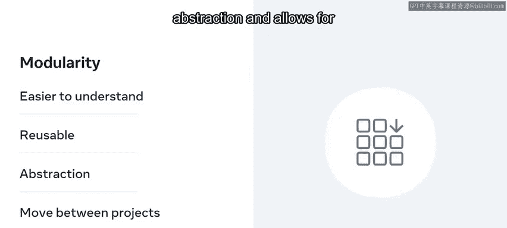
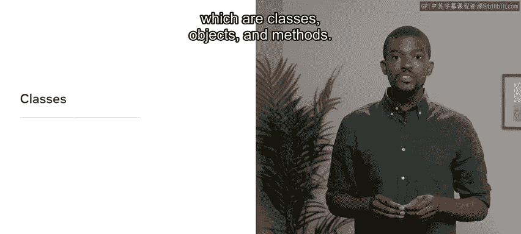
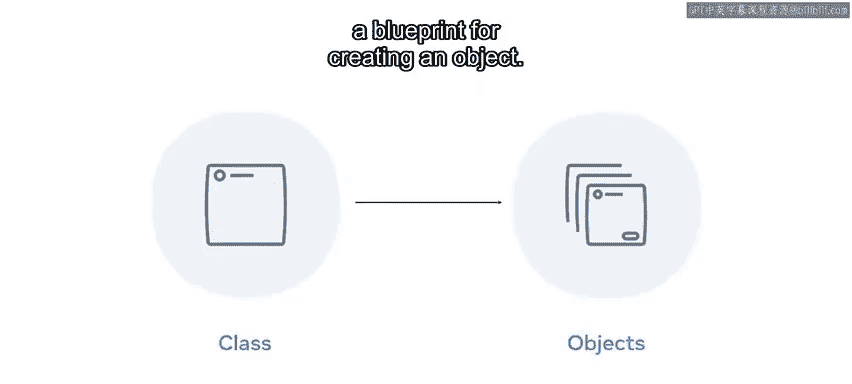
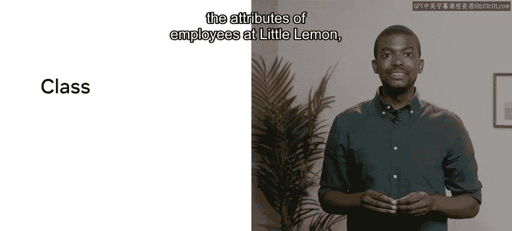
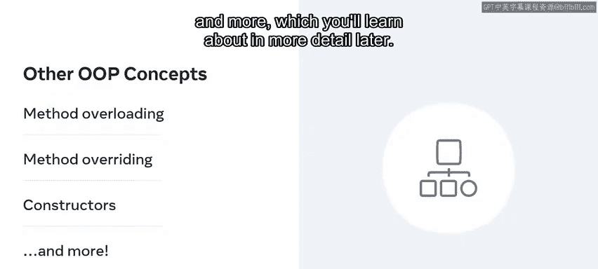

# 数据库工程师：P41：面向对象编程简介 🐍

在本节课中，我们将要学习面向对象编程的基本概念。这是一种广泛使用的编程范式，它通过将数据和操作数据的方法组织成“对象”，来帮助程序员更高效、更清晰地构建复杂程序。

编程语言基于特定的模型构建，以确保代码行为可预测。Python主要遵循一种被称为面向对象范式或模型的编程方式。

正如你将很快发现的，面向对象编程（OOP）严重依赖于**简单性**和**可重用性**来提升工作流程。在本视频结束时，你将熟悉面向对象编程范式，并且能够识别定义面向对象编程的四个主要概念。

---

## 什么是编程范式？🤔

编程范式是一种用于降低代码复杂性和确定执行流程的策略。

存在多种不同的范式，例如声明式、过程式、面向对象、函数式、逻辑式、事件驱动式、流驱动式等等。这些范式并非互斥的，因此程序员和编程语言可以选择采用多种范式。

例如，Python主要是面向对象的，但它也支持过程式和函数式编程。

简单来说，范式可以被定义为一种编写程序的风格。OOP是当今使用最广泛的范式之一，这得益于采用它的语言（如Java、Python、C++等）日益流行。但OOP能够将现实世界问题转化为代码的能力，可以说是其成功的最大因素。



OOP具有高度的模块化，这使得代码更易于理解、可重用、增加了抽象层次，并允许代码块在项目之间移动。



---

## OOP的核心组件：类、对象与方法 🧱

为了帮助你更好地理解OOP，我首先澄清一些其关键组件：**类**、**对象**和**方法**。

### 类





类是一个包含**属性**和**行为**的逻辑代码块。在Python中，类使用 `class` 关键字定义。属性可以是变量，行为可以是其内部的函数。

你可以从这些类中创建实例，这些实例被称为**对象**。换句话说，类为创建对象提供了一个蓝图。

更实际地说，假设你想记录Little Le公司员工的属性，例如他们的职位和雇佣状态。你可以创建一个名为 `Employee` 的类，并方便地将这些属性捆绑在一个地方。

```python
class Employee:
    pass  # 类的定义
```

### 对象

如前所述，对象是类的一个实例，你可以创建任意数量的对象。对象的状态由其属性和行为构成，每个对象都有一个唯一的ID以区别于其他实例。类的属性和行为定义了对象的状态。

例如，你可以通过调用 `Employee` 类来创建对象 `emp1`。调用后，你可以将职位和雇佣状态属性分别定义为“轮班主管”和“全职”。在代码中，这将写为：

```python
emp1 = Employee("Shift Lead", "FT")  # 实例化，即创建类的实例
```

### 方法

方法是定义在类内部的函数，它决定了对象实例的行为。假设你希望员工对象输出一个说明其职位的字符串。你首先需要在 `Employee` 类中声明一个名为 `intro` 的函数，然后在对象上调用它以获得输出。

```python
class Employee:
    def __init__(self, position, status):
        self.position = position
        self.status = status

    def intro(self):
        return f"My position is {self.position}."
```

---

## OOP的四大支柱 🏛️

现在你了解了类、对象和方法，让我们来探讨OOP所依赖的核心概念。

以下是支撑OOP的四个关键概念：

1.  **继承**
    继承是通过从现有类派生来创建新类。原始类称为**父类**或**超类**，而任何派生类被称为**子类**。这允许代码重用和层次结构的建立。

2.  **多态**
    多态是一个意为“具有多种形式”的词汇。在Python的上下文中，多态意味着**单个函数可以根据调用它的对象不同而表现出不同的行为**。

    例如，内置的 `+` 运算符对于不同的数据类型工作方式不同。对于整数数据类型，`+` 执行加法运算，如 `3 + 5 = 8`。另一方面，对于字符串数据类型，内置的 `+` 运算符执行连接操作，即将两个字符串组合在一起。这种修改功能的能力被称为多态。

3.  **封装**
    广义上讲，这意味着Python可以通过将方法和变量包装在单个作用域单元（例如类）内，来限制对它们的直接访问。封装有助于防止不必要的修改，从而有效减少错误和意外输出的发生。

4.  **抽象**
    抽象指的是隐藏实现细节以使数据更安全、更可靠的能力。需要注意的是，Python不直接支持抽象，而是使用继承来实现它。这将在以后更详细地探讨。

OOP中还有其他一些重要概念，如方法重载、方法重写、构造函数等，这些将在以后更详细地学习。



---

本节课中我们一起学习了面向对象编程范式及其四大核心概念：**继承**、**多态**、**封装**和**抽象**。理解这些概念是掌握Python等面向对象语言的关键第一步。下次见！