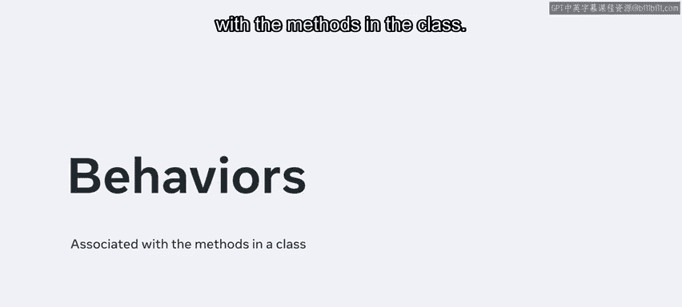
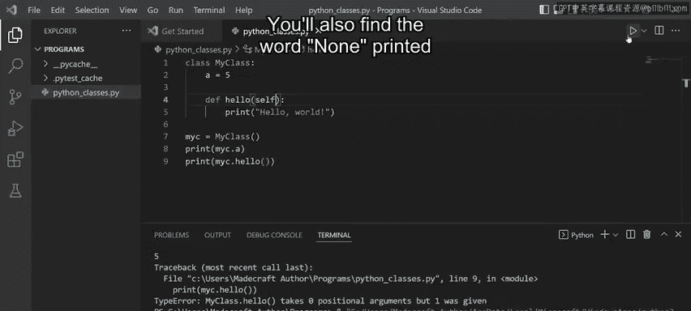
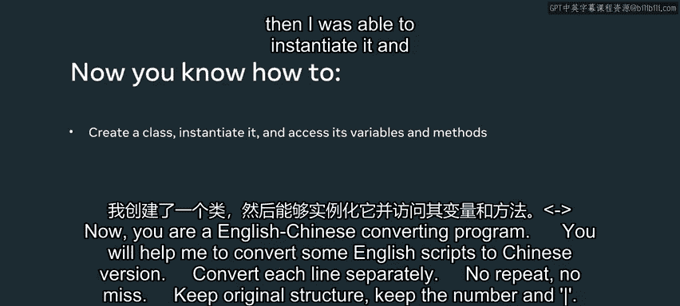

# Python 数据库工程师课程：P42：Python 类和实例 🐍

在本节课中，我们将要学习 Python 中一个核心概念：类。类能够将数据和功能组合在一起，这在编程中是一个非常实用的特性。通过本节课的学习，你将能够解释 Python 中的类、实例和对象是什么，并能够创建类、实例化它以及访问其变量和方法。

---

## 什么是类、实例和对象？ 🤔

你可能也听说过类可以从**属性**和**行为**的角度来讨论。一般来说，属性指的是类中声明的变量，而行为则与类中的方法相关联。

一个类会创建一个新的对象类型，你可以从这个类型创建出实例。需要记住的一个重要概念是：**Python 中的一切都是对象，或者派生自 `object` 类**。

为了演示这一切是如何运作的，我们将在 VS Code 中创建一个新文件，并编写一个类，然后从中派生出对象。

---

## 创建你的第一个类 🏗️

首先，我输入关键字 `class`，后跟类名 `MyClass` 和一个冒号。为了让 Python 不报错，我还需要多做一步。



```python
class MyClass:
```

那就是在下一行输入 `pass` 关键字。`pass` 关键字扮演着占位符的角色，表示此处不需要执行任何操作。实际上，这告诉 Python 我暂时还不会对这个类做任何事情。

接下来，让我们为这个类创建一个对象。我创建一个名为 `my_class` 的变量，然后通过输入 `= MyClass()` 将类赋值给它。

```python
my_class = MyClass()
```

如果我运行这段代码，输出显示它已执行且没有错误。然而，为了确认它按预期工作，让我们在类中添加一个 `print` 语句。

```python
class MyClass:
    print("Hello")
```

当我再次运行代码时，单词 “Hello” 出现在输出中。在继续之前，让我先清空终端。

---

## 理解实例化过程 🔄

你可能注意到我使用了相同的名字来命名类和它的对象，但实际上对象名可以是任何名称。例如，如果我将对象名改为 `my_instance` 并再次运行代码，它的执行效果将与之前相同。

```python
my_instance = MyClass()
```

我输入的所有内容都是 Python 中**实例化过程**的一部分，这个过程包含三个关键步骤：
1.  **类定义**：使用 `class` 关键字定义类。
2.  **创建新实例**：通过 `ClassName()` 创建类的一个新实例。
3.  **初始化新实例**：通常通过 `__init__` 方法完成（本节课未涉及）。

由于 Python 中的一切都是对象，遵循命名约定可以让后续工作不那么混乱。在这个例子中，我有 `MyClass` 作为类对象，`my_instance` 作为实例对象。还有第三种对象叫做**方法对象**，你可以在需要时用它来调用方法。

---

## 类的两种主要操作 📝

类主要执行两种操作：**属性引用**和**实例化**。我已经写了一个后者的例子，所以这次让我们尝试构建一个属性引用。

首先，我为类对象创建一个变量 `a`，并为其赋值 `5`。

```python
class MyClass:
    a = 5
```

要打印这个变量，我首先需要引用类。因此，在实例对象下方，我输入 `print(MyClass.a)`。

```python
print(MyClass.a)  # 输出: 5
```

当我运行代码时，它在输出中返回 `5`。为了确认类引用是必要的，我从 `print` 语句中删除 `MyClass` 并再次运行代码，Python 会抛出一个错误。所以我会修正代码，把 `MyClass` 加回去。

在继续之前，让我快速清空终端。现在你知道引用类对象会发生什么，但如果引用实例对象呢？让我们通过为 `my_instance.a` 输入一个 `print` 语句来找出答案，然后运行它。

```python
print(my_instance.a)  # 输出: 5
```

在输出中我得到了 `5`，这表明属性引用对实例对象仍然有效。

---

## 在类中创建方法 ⚙️

最后，让我们通过在这个类中创建一个方法来结束本节课。我将使用 `def` 关键字，后跟 `hello`、一对括号和一个冒号。

```python
class MyClass:
    a = 5

    def hello(self):
        print("Hello world")
```

在下一行，我为字符串 `"Hello world"` 输入一个 `print` 语句。为了避免混淆，我也会删除第一个 `print` 语句。为了调用这个方法，我在文档末尾为 `my_instance.hello()` 添加一个新的 `print` 语句，它使用了实例对象。

```python
my_instance.hello()
```

这应该能正常工作，就像我通过实例对象成功调用变量一样，对吧？运行代码会导致一个错误。所以方法并不那么简单。幸运的是，我可以通过在类中定义的方法括号内添加关键字 `self` 来解决这个问题。

```python
def hello(self):
    print("Hello world")
```

再次运行代码会在输出中产生单词 “Hello world”。你还会发现下面打印了单词 `None`，因为给定的函数没有返回值。

---

## 总结 📚





本节课中我们一起学习了 Python 中的类、实例和对象。我们创建了一个类，然后能够实例化它并访问其变量和方法。这是一个关于如何将数据（属性）和功能（方法）捆绑在一起的强大概念的简要演示。理解这些基础是进行更高级的面向对象编程和数据库建模的关键。