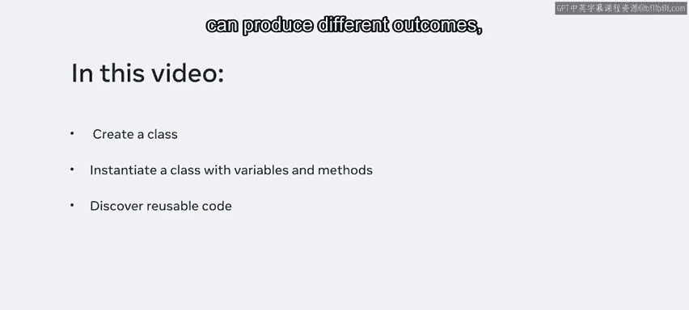
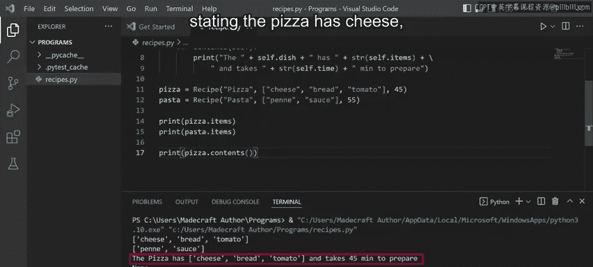
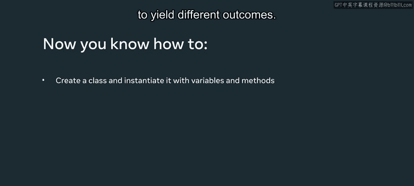

# Python面向对象编程：P43：实例化自定义对象

在本节课中，我们将要学习Python中代码复用的核心概念，即如何通过创建类和实例化对象来重用代码。你将学会定义一个类，为其添加属性和方法，并创建多个独立的实例。我们将看到，即使不同的实例调用相同的方法和属性，它们也可以产生不同的结果，这正是代码复用的体现。

## 代码复用与面向对象

代码复用是指利用现有代码构建新软件的过程。它是编程的核心概念之一。通过创建类，我们可以定义一种数据结构和与之相关的行为（方法）。之后，我们可以基于这个类创建多个实例（对象），每个实例都拥有独立的属性状态，但共享相同的方法定义。



上一节我们介绍了代码复用的概念，本节中我们来看看如何在Python中通过创建类和实例化对象来实现它。

## 创建Recipe类

首先，创建一个名为 `recipe.py` 的新文件，并在其中定义一个名为 `Recipe` 的类。

```python
class Recipe:
    pass
```

在深入之前，我们先了解Python中的两个特殊方法。

### 特殊方法：`__new__` 和 `__init__`

以下是关于这两个方法的说明：

*   **`__new__` 方法**：负责创建并返回一个新的空对象。其基本结构如下：
    ```python
    def __new__(cls):
        # cls 是一个约定，代表类本身，用于创建新对象
        return super().__new__(cls)
    ```
*   **`__init__` 方法**：在其他一些编程语言中被称为“构造函数”。它接收由 `__new__` 方法创建的对象以及其他参数，用于初始化这个新创建的对象。其基本结构如下：
    ```python
    def __init__(self, arg1, arg2):
        # self 是一个约定，代表实例对象本身，用于引用实例的属性和方法
        self.attribute1 = arg1
        self.attribute2 = arg2
    ```

> **注意**：`cls` 和 `self` 不是Python关键字，而是广泛遵循的命名约定。`cls` 作为类的占位符，`self` 作为实例对象的占位符。

现在，让我们删除示例方法，编写一个实用的 `__init__` 方法来初始化对象的状态。

## 定义类的属性和方法

设想一个现实场景：一位餐厅厨师需要管理他使用的食谱信息。我们将创建一个 `Recipe` 类来帮助他。

我们将为食谱定义三个属性：菜名 (`dish`)、配料 (`items`) 和准备时间 (`time`)。以下是初始化这些属性的代码：

```python
class Recipe:
    def __init__(self, dish, items, time):
        self.dish = dish
        self.items = items
        self.time = time
```

接下来，我们添加一个名为 `contents` 的方法，用于将食谱信息格式化为字符串并打印出来。

```python
    def contents(self):
        print("The " + self.dish + " has " + str(self.items) +
              " and takes " + str(self.time) + " minutes to prepare.")
```

> **代码说明**：在拼接字符串时，我们使用 `str()` 函数将 `self.items`（一个列表）和 `self.time`（一个整数）转换为字符串。使用反斜杠 `\` 可以将一行长代码换行书写，以提高可读性。

现在，我们的类已经设置好了，接下来用它来创建具体的食谱实例。

## 实例化对象并访问其成员

我们可以基于 `Recipe` 类创建不同的食谱对象。每个对象在创建时传入不同的参数，从而拥有独立的状态。

以下是创建两个实例的代码：

```python
# 创建披萨食谱实例
pizza = Recipe("Pizza", ["cheese", "bread", "tomato"], 45)

# 创建意大利面食谱实例
pasta = Recipe("Pasta", ["penne", "sauce"], 55)
```

创建实例后，我们可以访问每个实例的属性和方法。尽管它们调用的是类中定义的同一个属性名 `items` 和同一个方法 `contents`，但结果却因实例状态的不同而不同。

让我们通过打印来验证这一点：

```python
# 访问实例属性
print(pizza.items)  # 输出: ['cheese', 'bread', 'tomato']
print(pasta.items)  # 输出: ['penne', 'sauce']

# 调用实例方法
pizza.contents()  # 输出: The Pizza has ['cheese', 'bread', 'tomato'] and takes 45 minutes to prepare.
pasta.contents()  # 输出: The Pasta has ['penne', 'sauce'] and takes 55 minutes to prepare.
```



运行上述代码，你将看到两个实例输出了各自不同的信息。这清晰地展示了代码复用：我们只编写了一次 `Recipe` 类和 `contents` 方法，但却能用于生成无数个具有不同数据的食谱对象。

## 总结



本节课中我们一起学习了Python面向对象编程的基础。我们首先了解了代码复用的概念，然后逐步创建了一个 `Recipe` 类，定义了其初始化方法 `__init__` 和一个自定义方法 `contents`。接着，我们实例化了两个对象 `pizza` 和 `pasta`，并演示了如何访问它们的属性以及调用它们的方法。最关键的是，我们看到了相同的代码（类定义）如何根据不同的实例数据产生不同的输出，这正是面向对象编程中封装和复用的强大之处。